# SPEC-ADK-LIVEPATH-DEFENSE-001 Implementation Plan

## Tasks

- [x] T1: Gap 1 — fence `buildRebuttalPrompt` and `buildJudgmentPrompt` in
  `pkg/orchestra/debate.go`. Keep the existing ICE-stripping/capping behavior first, then
  compute a per-assembly sentinel with the exact `cappedOutputs` bytes that will be placed
  inside the fence. Emit the untrusted-data SECURITY NOTE (reuse the wording from
  `templates/shared/orchestra-debater-r2.md.tmpl`) and wrap each participant output between
  `<sentinel>-BEGIN` and `<sentinel>-END`. Keep the anonymized `Participant %c` aliases.
  To respect the 300-line source limit, extract the fence formatting into
  `debate_sentinel.go` (or a small helper) rather than inflating `debate.go`.
- [x] T2: Gap 1 — add `[NEW] pkg/orchestra/debate_fence_test.go` with the injection oracle
  (forged marker/header stays inside the fence) and the parity oracle (interactive builder
  output carries the same SECURITY NOTE + BEGIN/END contract as the subprocess templates).
- [x] T3: Gap 2 — add shared-lock retry/backoff to `pkg/worker/parallel/worktree.go`
  `Create`. Introduce an injectable command-runner seam (a function field defaulting to
  `exec.Command`) and a `[NEW] pkg/worker/parallel/worktree_retry.go` holding a single
  `retryOnLock` loop plus `isLockError`. Validate task IDs with `[NEW]
  pkg/worker/taskid` before branch/path construction. Backoff base and clock are
  injectable so tests run fast.
- [x] T4: Gap 2 — remove the dead retry duplicate while preserving the
  `pkg/pipeline.WorktreeManager` public API. Delete only the unreachable retry/backoff
  helper and lock classifier from `pkg/pipeline/worktree.go`; keep
  `NewWorktreeManager`, `Create`, `Remove`, and `ActiveCount` source-compatible, keep the
  existing public API regression tests, and update only tests that referenced the deleted
  private retry helper. Do not import `pkg/worker/parallel` from `pkg/pipeline`.
- [x] T5: Gap 2 — add `[NEW] pkg/worker/parallel/worktree_retry_test.go`: a simulated
  `refs.lock` error on attempt one then success on attempt two (assert two attempts and a
  nil error), a persistent lock error (assert four attempts total: one initial attempt plus
  three retries, with delay sequence `base`, `base*2`, `base*4`), a non-lock error (assert
  one attempt), and an explicit implementation-count assertion for the single retry loop
  and classifier.
- [x] T6: Gap 3 — add `[NEW] pkg/experiment/loop.go`: a `Loop` type built from
  `experiment.Config` that owns the iterate loop. It reuses `Recorder`,
  `NewCircuitBreaker(cfg.CircuitBreakerN)`, and `Config.MaxIterations` /
  `Config.ExperimentTimeout`. `Loop.Run(ctx, step StepFunc)` invokes the step per
  iteration, records the result, updates the breaker, and hard-stops on max-iterations,
  circuit-breaker trip, timeout, or context cancellation, returning an
  `ExperimentSummary` and a typed stop reason.
- [x] T7: Gap 3 — wire the live entrypoint: add `auto experiment run` to
  `internal/cli/experiment.go` that builds `Config` via the existing `buildConfig` and
  drives `Loop.Run` with a metric-backed step, so the hard stop is enforced in process.
  The command prints a stable summary line or JSON object containing `stop_reason` and
  `total_iterations`; metric command validation also rejects `&` so a loop run cannot
  detach background metric work.
- [x] T8: Gap 3 — add `[NEW] pkg/experiment/loop_test.go`: max-iterations stop oracle,
  circuit-breaker stop oracle (including counter reset on improvement), and
  timeout/cancellation stop oracles, all using a deterministic fake `StepFunc`.
- [x] T9: Cross-cutting — regression guard. Run focused `go test` for
  `./pkg/orchestra/... ./pkg/worker/... ./pkg/pipeline/... ./pkg/experiment/...
  ./internal/cli/...`; confirm the subprocess fence tests and existing worktree/experiment
  API tests still pass, including `pkg/pipeline.NewWorktreeManager/Create/Remove/ActiveCount`
  regression tests, proving REQ-LPD-12 brownfield preservation.

## Implementation Strategy

Reuse-first, minimal new surface. Every gap already has the defensive primitive built and
tested; the work is connecting each primitive to the executing path and removing one dead
duplicate.

- **Gap 1** changes only prompt assembly. The two builders in `debate.go` are the single
  source reached by all interactive/process call sites (`runDebate`, `executeRound`,
  `runJudgeRound`), so fencing them once closes every interactive path. No template or
  subprocess change is needed; the subprocess path already fences.
- **Gap 2** adds retry to the one wired manager and collapses two retry copies into one
  without deleting the older `pkg/pipeline.WorktreeManager` public API. The command-runner
  seam is the minimum abstraction that makes lock contention testable without real
  concurrent git processes.
- **Gap 3** introduces the smallest control-flow seam — a `Loop` with a `StepFunc` — that
  can own iteration state and enforce the caps deterministically, plus a thin CLI
  entrypoint so the runner is genuinely on a live path (not new dead code).

Change scope is bounded: 3 packages plus one CLI file, well under the sibling-split
thresholds. See `research.md` `## Minimality Decision Matrix` for the reuse ladder.

## Visual Planning Brief

Command/data-flow of where each defense attaches to the live path (BEFORE vs AFTER):

```mermaid
flowchart TD
  subgraph G1[Gap 1: debate prompt assembly]
    P[participant outputs] --> SEL{path select: paneCapable}
    SEL -->|subprocess pipeline.go| SUB[templates fence + SECURITY NOTE - already wired]
    SEL -->|interactive debate.go| BLD[buildRebuttalPrompt / buildJudgmentPrompt]
    BLD -.BEFORE.-> RAW[raw '## Participant' paste - UNFENCED]
    BLD ==AFTER==> FEN[newDebateSentinel + BEGIN/END + SECURITY NOTE]
  end

  subgraph G2[Gap 2: worktree create]
    WS[worktree_safety.go assignTaskWorktree] --> WC[parallel.WorktreeManager.Create]
    WC -.BEFORE.-> ONCE[single git worktree add - fails on lock]
    WC ==AFTER==> RETRY[retryOnLock: 3s,6s,12s backoff on isLockError]
    DEAD[pipeline.WorktreeManager retry - test-only] -.remove private retry only; keep public API.-> RETRY
  end

  subgraph G3[Gap 3: experiment iteration]
    CLI[auto experiment run - NEW live entrypoint] --> OBS[output: stop_reason + total_iterations]
    OBS --> LOOP[Loop.Run - NEW]
    LOOP --> STEP[StepFunc: metric + record]
    LOOP --> STOP{hard stop}
    STOP -->|iteration > MaxIterations| S1[stop: max-iterations]
    STOP -->|breaker.IsTripped| S2[stop: circuit-breaker]
    STOP -->|ctx/timeout| S3[stop: cancelled/timeout]
  end
```

## Feature Completion Scope

- The Primary SPEC closes the entire Outcome Lock ("live-path defense wiring") across all
  three gaps. No slice is deferred to a sibling SPEC.
- Approved sibling dependencies: none. See `research.md` `## Sibling SPEC Decision`.
- Completion Debt: none. The two audit items intentionally excluded (checkpoint atomicity;
  SSoT/policy-duplication drift) are separate future candidates recorded only in
  `research.md` `## Evolution Ideas`; they do not block sync completion of this SPEC.
- Implementation reconciliation: `pkg/worker/taskid` and
  `internal/cli/experiment_run_test.go` were added during implementation to make the wired
  worktree path reject unsafe task IDs and to lock the live CLI output contract. These
  remain inside the existing Outcome Lock and do not create a sibling scope.
- File-size watch: `pkg/orchestra/debate.go` is near the 300-line limit; T1 must extract
  the fence helper to stay under it.
