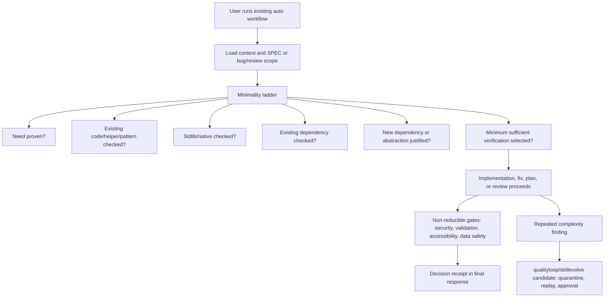

# SPEC-ADK-MINIMALITY-DISCIPLINE-001 Plan: Default Minimality Discipline For Autopus Workflows

**Status**: completed
**Created**: 2026-06-27
**Target module**: `autopus-adk/`

## Implementation Strategy

Implement the discipline as source-owned workflow guidance plus focused safety/routing tests. The first implementation slice should update canonical content and generated-template sources, then add template/content parity tests and qualityloop/skillevolve classification coverage. Generated root workspace surfaces are updated only through normal ADK generation/update flows after source changes land.

The design is intentionally prompt/workflow-first. It does not add a new mode flag or external dependency. Any code changes in `pkg/qualityloop` or `pkg/skillevolve` are limited to classification and candidate-routing contracts for repeated complexity findings.

## Feature Completion Scope

This single SPEC closes the requested outcome:

- `@auto plan` writes a Minimality Decision Matrix.
- `@auto go` and `agent-pipeline` inject the minimality ladder before implementation.
- `@auto fix` requires caller/shared root-cause inspection before symptom patching.
- `@auto review` separates correctness/security findings from complexity findings.
- final responses expose decision receipts, not a mode name.
- repeated complexity findings feed qualityloop/skillevolve candidates without auto-apply.
- security, validation, accessibility, data-loss, and generated-surface hygiene gates remain authoritative.

## File Impact Analysis

| Path | Action | Purpose |
| --- | --- | --- |
| `content/skills/agent-pipeline.md` | Modify | Add stable minimality ladder, executor/planner instructions, receipt handoff, and non-reducible gate language. |
| `templates/codex/skills/agent-pipeline.md.tmpl` | Modify | Keep Codex generated pipeline skill aligned. |
| `templates/gemini/skills/agent-pipeline/SKILL.md.tmpl` | Modify | Keep Gemini generated pipeline skill aligned. |
| `templates/codex/skills/auto-plan.md.tmpl` | Modify | Require `## Minimality Decision Matrix` and new dependency/abstraction justification. |
| `templates/codex/prompts/auto-plan.md.tmpl` | Modify | Mirror plan prompt minimality matrix and receipt handoff. |
| `templates/gemini/skills/auto-plan/SKILL.md.tmpl` | Modify | Keep Gemini plan skill parity for matrix and dependency/abstraction justification. |
| `content/agents/spec-writer.md` | Modify | Ensure the actual SPEC writer agent emits Minimality Decision Matrix and verification selection. |
| `templates/codex/agents/spec-writer.toml.tmpl` | Modify | Keep Codex spec-writer agent template aligned. |
| `templates/gemini/agents/spec-writer.md.tmpl` | Modify | Keep Gemini spec-writer agent template aligned. |
| `templates/codex/skills/auto-go.md.tmpl` | Modify | Inject minimality ladder before implementation and final receipt expectations. |
| `templates/codex/prompts/auto-go.md.tmpl` | Modify | Mirror concise go prompt contract. |
| `templates/gemini/skills/auto-go/SKILL.md.tmpl` | Modify | Keep Gemini go skill parity for ladder and receipt guidance. |
| `templates/codex/skills/auto-fix.md.tmpl` | Modify | Add caller/shared root-cause path rule. |
| `templates/codex/prompts/auto-fix.md.tmpl` | Modify | Mirror concise fix prompt contract. |
| `templates/gemini/skills/auto-fix/SKILL.md.tmpl` | Modify | Keep Gemini fix skill parity for caller/shared root-cause rule. |
| `templates/codex/skills/auto-review.md.tmpl` | Modify | Separate correctness/security and complexity findings. |
| `templates/codex/prompts/auto-review.md.tmpl` | Modify | Mirror concise review prompt contract. |
| `templates/gemini/skills/auto-review/SKILL.md.tmpl` | Modify | Keep Gemini review skill parity for separated finding sections. |
| `content/agents/debugger.md` | Modify | Teach debugger to check callers/shared root-cause path before patching symptom. |
| `templates/codex/agents/debugger.toml.tmpl` | Modify | Keep Codex debugger agent template aligned. |
| `templates/gemini/agents/debugger.md.tmpl` | Modify | Keep Gemini debugger agent template aligned. |
| `content/agents/reviewer.md` | Modify | Teach reviewer output to separate correctness/security and complexity findings. |
| `templates/codex/agents/reviewer.toml.tmpl` | Modify | Keep Codex reviewer agent template aligned. |
| `templates/gemini/agents/reviewer.md.tmpl` | Modify | Keep Gemini reviewer agent template aligned. |
| `content/skills/debugging.md` | Modify | Add root-cause caller/shared path checklist. |
| `templates/codex/skills/debugging.md.tmpl` | Modify | Keep Codex debugging skill template aligned. |
| `templates/gemini/skills/debugging/SKILL.md.tmpl` | Modify | Keep Gemini debugging skill template aligned. |
| `content/skills/review.md` | Modify | Add complexity tags and non-reducible safety rule. |
| `templates/codex/skills/review.md.tmpl` | Modify | Keep Codex review skill template aligned. |
| `templates/gemini/skills/review/SKILL.md.tmpl` | Modify | Keep Gemini review skill template aligned. |
| `templates/claude/commands/auto-router.md.tmpl` | Modify | Keep `/auto plan/go/fix/review` routed contract aligned for Claude surface. |
| `templates/gemini/commands/auto-router.md.tmpl` | Modify | Keep `/auto plan/go/fix/review` routed contract aligned for Gemini surface. |
| `templates/shared/orchestra-reviewer.md.tmpl` | Modify | Add complexity section for SPEC/code reviews while preserving correctness/security verdict authority. |
| `pkg/adapter/codex/codex_skill_template_mappings.go` | Verify | Ensure rendered `.codex/skills/auto-*.md` outputs carry the per-surface minimality contracts from source templates. |
| `pkg/adapter/codex/codex_prompts.go` | Verify | Ensure rendered `.codex/prompts/auto-*.md` outputs carry the per-surface minimality contracts from source templates. |
| `pkg/adapter/codex/codex_extended_skills.go` | Verify | Ensure extended Codex skills rendered from embedded content pass through minimality-aware normalization. |
| `pkg/adapter/codex/codex_extended_skill_rewrites.go` | Modify | Keep hardcoded Codex extended-skill rewrites aligned when the generated source is not a plain template. |
| `pkg/adapter/codex/codex_extended_skill_rewrites_pipeline_completion.go` | Modify | Add the minimality ladder and receipt handoff to the hardcoded Codex `agent-pipeline` skill body completion section. |
| `[NEW] pkg/adapter/codex/minimality_surface_test.go` | Add | Generate Codex surfaces in a temp root and assert rendered `.codex/**` and `.agents/**` outputs include their mapped ladder, matrix, root-cause, receipt, and review-split contracts. |
| `[NEW] pkg/adapter/gemini/minimality_surface_test.go` | Add | Generate Gemini surfaces in a temp root and assert rendered Gemini skills and router outputs include the mapped ladder, matrix, root-cause, receipt, and review-split contracts. |
| `pkg/adapter/opencode/opencode_commands.go` | Verify | Ensure rendered `.opencode/commands/auto-plan.md`, `auto-go.md`, `auto-fix.md`, and `auto-review.md` remain thin aliases only, preserve argument routing, and are not used as detailed contract carriers. |
| `pkg/adapter/opencode/opencode_skills.go` | Verify | Ensure OpenCode shared workflow skills under `.agents/skills/auto-*` keep the mapped matrix, ladder, root-cause, review split, and receipt contracts. |
| `pkg/adapter/opencode/opencode_workflow_custom.go` | Verify | Ensure custom OpenCode workflow bodies do not strip receipt or minimality guidance. |
| `pkg/adapter/opencode/opencode_util.go` | Verify | Ensure OpenCode normalization preserves minimality wording while translating platform-specific invocation language. |
| `[NEW] pkg/adapter/opencode/minimality_surface_test.go` | Add | Generate OpenCode surfaces in a temp root and assert thin commands route to detailed skills while rendered shared skill outputs, not command files, include matrix, ladder, root-cause, review split, and receipt contracts. |
| `pkg/qualityloop/types.go` | Modify | Add or document minimality-related reason taxonomy/kind metadata if needed. |
| `pkg/qualityloop/aggregate.go` | Modify | Extend existing `FailureFingerprint` repeated-failure aggregation for minimality reason codes while preserving the `len >= 3` threshold. |
| `pkg/qualityloop/classify.go` | Modify | Route repeated unnecessary dependency/helper/abstraction signals to safe improvement candidates. |
| `pkg/qualityloop/normalize.go` | Modify | Preserve metadata-only safety and generated-surface rejection for minimality signals. |
| `pkg/qualityloop/safety.go` | Modify | Preserve generated-surface/plugin-cache rejection for minimality candidates and repeated-failure edge cases. |
| `pkg/skillevolve/generator.go` | Modify | Optionally map repeated minimality findings to source-owned candidate proposals while preserving quarantine. |
| `pkg/skillevolve/safety.go` | Modify | Preserve static admission reason codes for generated surfaces, unsafe instructions, secrets, and oversized candidates. |
| `pkg/skillevolve/path_policy.go` | Modify | Keep generated, plugin-cache, and root runtime artifact paths out of skill-evolution writes. |
| `pkg/skillevolve/replay.go` | Verify | Keep deterministic replay as the promotion-readiness authority for generated minimality candidates. |
| `pkg/skillevolve/promotion.go` | Verify | Keep promotion as the only post-replay path that writes source-owned candidate changes. |
| `[NEW] templates/minimality_surface_test.go` | Add | Assert grouped source/template parity for ladder, matrix, receipt, root-cause, auto-review sections, shared orchestra reviewer sections, and no mode wording. |
| `[NEW] pkg/qualityloop/minimality_test.go` | Add | Assert `FailureFingerprint` aggregation, `len >= 3` threshold, full reason-code coverage, inactive candidate state, and generated-surface safety for minimality candidates. |
| `[NEW] pkg/skillevolve/minimality_path_policy_test.go` | Add | Assert default `MinCount` behavior, quarantine/replay/approval-only behavior, and generated-surface safety for repeated complexity candidates and path-policy changes. |
| `CHANGELOG.md` | Modify | Record the completed module-level sync entry and verification evidence for this SPEC. |

## Tasks

- [x] T1: Add canonical minimality discipline wording and non-goals to ADK source guidance without introducing a user-facing mode toggle.
- [x] T2: Update `auto plan` and spec-writer source surfaces so `research.md` gets a `## Minimality Decision Matrix`, new dependency/abstraction justification rules, and minimum sufficient verification guidance.
- [x] T3: Update `auto go` and `agent-pipeline` surfaces so planner/executor/tester/reviewer prompts check the existing path first and emit a concise final decision receipt.
- [x] T4: Update `auto fix`, debugger agent, debugging skill guidance, and Codex/Gemini debugger/debugging templates so bug fixes inspect caller and shared root-cause paths before accepting a symptom-only patch.
- [x] T5: Update `auto review`, reviewer agent, review skill, orchestra reviewer instructions, and Codex/Gemini reviewer/review templates so correctness/security findings are separate from complexity findings and complexity tags are stable while existing TRUST 5 taxonomy remains intact.
- [x] T6: Extend qualityloop/skillevolve classification or candidate generation for repeated `unnecessary_dependency`, `duplicate_helper`, `single_impl_abstraction`, `stdlib_available`, `native_available`, `yagni_expansion`, `existing_helper_available`, `existing_dependency_available`, and `shrink_scope_available` findings while preserving qualityloop `len >= 3` aggregation, skillevolve default `MinCount = 2`, quarantine, replay, approval, generated-surface safety, plugin-cache safety, and root runtime artifact safety.
- [x] T7: Add final-response receipt guidance for plan/go/fix/review that avoids mode names and reports only important choices such as reused existing primitive, checked caller/shared root-cause, skipped dependency, separated complexity action, or added focused regression test.
- [x] T8: Add focused tests and scans for ladder presence, matrix guidance, minimum sufficient verification, new dependency justification, root-cause caller rule, review section separation, plan/go/fix/review receipt language, grouped source-surface parity, adapter-rendered Codex output, adapter-rendered OpenCode output, shared orchestra reviewer behavior, qualityloop `FailureFingerprint` repeated-candidate grouping with `len >= 3`, skillevolve `MinCount` default behavior, generated-surface safety, plugin-cache safety, and root runtime artifact safety.

## Architecture Considerations

- Source of truth is `autopus-adk/`; generated root workspace surfaces must not be hand-edited.
- The discipline belongs in stable prompt guidance and template sources, not in ephemeral user prompt advice.
- This work should reuse existing prompt layer code/source guidance and existing plan ledger patterns from `SPEC-ADK-IDEA-CLARIFY-001`. Prompt-layer references are code-level ADK source anchors, not current SPEC package dependencies.
- New dependency and abstraction checks should be prose/test contract unless implementation discovers an existing typed parser surface that can represent them with lower drift.
- `qualityloop` candidates remain metadata-first and inactive; `skillevolve` promotion still requires deterministic replay and human approval.
- `qualityloop` and `skillevolve` thresholds are intentionally separate: qualityloop repeated-failure aggregation requires at least three ADK-owned inputs with the same `FailureFingerprint`, while skillevolve quality-index candidate generation keeps its existing default `MinCount = 2` and static safety gates.

## Visual Planning Brief

## Risks And Mitigations

| Risk | Impact | Mitigation |
| --- | --- | --- |
| Minimality guidance becomes a slogan | High | Require concrete ladder tokens and matrix/receipt acceptance tests. |
| Valid safety work is incorrectly shrunk | High | Define non-reducible gates and make them authoritative over complexity findings. |
| A user explicitly asks for expansion and Autopus refuses | Medium | Preserve user intent and require justification rather than blocking valid expansion. |
| Cross-platform surface drift | High | Add parity tests over content and template files. |
| Qualityloop applies simplification automatically | High | Keep candidates inactive and require quarantine/replay/approval/promotion gates. |
| Overly exact phrasing tests become brittle | Medium | Assert stable tokens and section contracts, not full prose. |

## Dependencies

- Existing ADK template rendering and parity tests.
- Existing `qualityloop` normalization and safety policy.
- Existing `skillevolve` candidate, replay, promotion, and archive APIs.
- Existing review/security/accessibility/data-safety gates.

No external runtime dependency is required.

## Sync Evidence

- `go test ./templates ./pkg/adapter/codex ./pkg/adapter/opencode ./pkg/adapter/gemini ./pkg/qualityloop ./pkg/skillevolve`
- `go run ./cmd/auto spec validate .autopus/specs/SPEC-ADK-MINIMALITY-DISCIPLINE-001 --strict`
- `@AX lifecycle`: no source `@AX:TODO` tags in the SPEC-owned change set; existing `pkg/skillevolve/path_policy.go` `@AX:ANCHOR` remains valid with fan-in above threshold; instructional `@AX:*` text in router templates is not a lifecycle tag.
- Generated/runtime/plugin-cache surfaces were scanned before staging and excluded from the commit.

## Exit Criteria

- [x] `auto plan` guidance requires `## Minimality Decision Matrix`.
- [x] `auto go` and pipeline guidance require existing-path-first checks before new helpers, dependencies, or abstractions.
- [x] `auto fix` guidance rejects symptom-only plans without caller/shared root-cause evidence.
- [x] `auto review` guidance outputs separate correctness/security and complexity sections.
- [x] final-response guidance includes a short receipt and avoids user-facing mode names.
- [x] repeated complexity signals for the full reason-code set route to inactive improvement candidates only when at least three ADK-owned failure inputs share the same `FailureFingerprint`, with safety gates intact.
- [x] focused tests pass without editing root generated surfaces.
