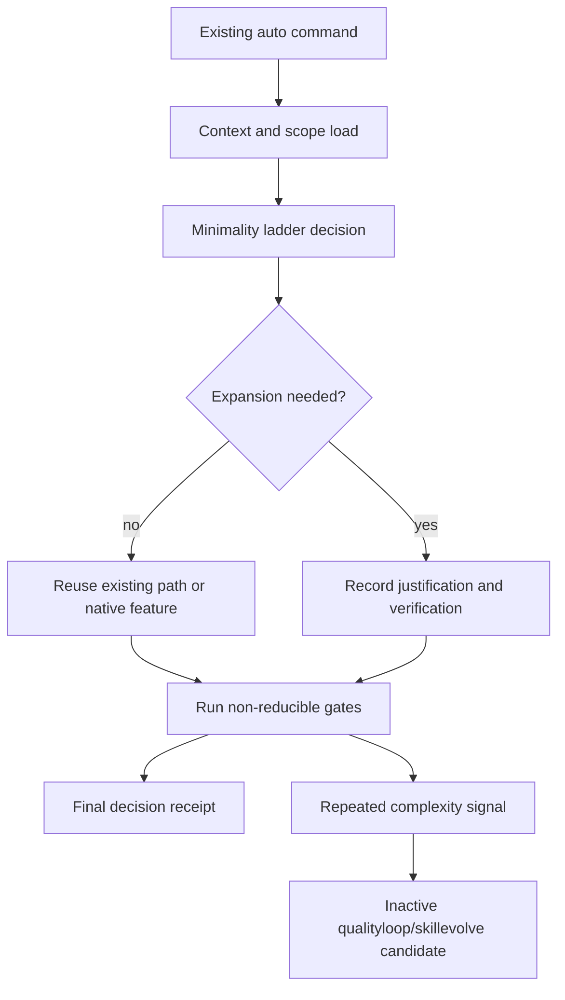

# SPEC-ADK-MINIMALITY-DISCIPLINE-001 Research: Default Minimality Discipline For Autopus Workflows

**Updated**: 2026-06-27

## Input Context

The direct user request asks Autopus-ADK to introduce a Ponytail-inspired Minimality Discipline as a default Autopus work discipline, not as "Ponytail mode." The requested user-facing behavior is:

- users keep using `@auto plan`, `@auto go`, `@auto fix`, and `@auto review`;
- Autopus automatically checks whether the change is needed and whether existing code, stdlib/native features, or existing dependencies cover it;
- explicit user requests for expansion, new abstraction, or new dependency are respected but justified;
- bug fixes check shared root-cause/caller paths before symptom patches;
- reviews separate correctness/security findings from complexity findings;
- final responses show a short receipt of important decisions, not mode state;
- qualityloop/skillevolve may produce improvement candidates, but existing quarantine/replay/approval flow remains authoritative.

## Plan Intent Ledger

| Field | Status | Source | Confidence | Decision / Assumption | If Wrong | Plan Handoff |
| --- | --- | --- | ---: | --- | --- | --- |
| `goal` | answered | user | 9 | Make minimal implementation discipline default across existing Autopus workflows. | Users still over-manage mode state. | requirement seed |
| `scope_boundary` | answered | user | 9 | No user lean/Ponytail mode, no Ponytail vendoring, no root generated-surface edits. | Scope creep into plugin/runtime surfaces. | non-goal |
| `constraints` | answered | user/project-doc | 8 | Source of truth is `autopus-adk`; root `autopus-co` is a meta workspace. | Generated-surface drift or wrong repo ownership. | risk |
| `done_evidence` | answered | user | 8 | Existing workflows apply the ladder, justify new dependencies/abstractions, preserve safety gates, and emit receipts. | SPEC accepts vague guidance without observable behavior. | acceptance seed |
| `brownfield_impact` | answered | code | 7 | Affects workflow templates, agent skills, reviewer/debugger guidance, and qualityloop/skillevolve candidate routing. | Implementation misses a surface and users see inconsistent behavior. | reviewer focus |

## Question Audit

| Field | Value |
| --- | --- |
| `question_transport` | none |
| `question_count` | 0 |
| `unresolved_fields` | none |
| `reason` | User supplied goal, scope, non-goals, target, outcome lock, acceptance seeds, and provenance constraints. |

## Existing Code And Surface Analysis

- `templates/codex/skills/auto-plan.md.tmpl` already requires an inline intent ledger, semantic invariant inventory, reference discipline, reviewer brief, outcome lock, completion debt, evolution ideas, and visual planning brief. It is the right place to add `## Minimality Decision Matrix`.
- `templates/codex/prompts/auto-plan.md.tmpl` is the concise Codex prompt surface and should mirror the decision matrix requirement.
- `templates/codex/skills/auto-go.md.tmpl` and `templates/codex/prompts/auto-go.md.tmpl` own implementation-mode parsing, SPEC path resolution, workflow authenticity, sync readiness, completion handoff, and final output contract. They need stable ladder and receipt handoff guidance.
- `content/skills/agent-pipeline.md`, `templates/codex/skills/agent-pipeline.md.tmpl`, and `templates/gemini/skills/agent-pipeline/SKILL.md.tmpl` own planner, executor, tester, validator, reviewer, security-auditor, and pipeline prompt contracts. These are the core surfaces for "check existing path first."
- `templates/codex/skills/auto-fix.md.tmpl`, `templates/codex/prompts/auto-fix.md.tmpl`, `content/agents/debugger.md`, and `content/skills/debugging.md` already require reproduction-first bug fixing. They lack a caller/shared root-cause path rule.
- `templates/codex/skills/auto-review.md.tmpl`, `templates/codex/prompts/auto-review.md.tmpl`, `content/agents/reviewer.md`, and `content/skills/review.md` already define TRUST 5 and UI design context checks. They need separate correctness/security and complexity sections.
- `templates/claude/commands/auto-router.md.tmpl` and `templates/gemini/commands/auto-router.md.tmpl` embed long routed contracts for plan/go/fix/review and need parity updates.
- `templates/shared/orchestra-reviewer.md.tmpl` already asks whether simpler alternatives exist and tells reviewers to grep callers. It needs explicit complexity section output without weakening PASS/REVISE correctness authority.
- `pkg/adapter/codex/codex_skill_template_mappings.go` renders Codex skill files from template sources, including `auto-plan.md`, `auto-go.md`, `auto-fix.md`, and `auto-review.md`. `pkg/adapter/codex/codex_prompts.go` renders Codex prompt files from workflow prompt templates. `pkg/adapter/codex/codex_extended_skills.go` renders embedded content skills, then `pkg/adapter/codex/codex_extended_skill_rewrites.go` rewrites selected extended skills. The `agent-pipeline` Codex body is hardcoded in `pkg/adapter/codex/codex_extended_skill_rewrites_pipeline.go`, so template-only parity tests are insufficient.
- `pkg/adapter/codex/codex_surface_test.go` already generates a temporary Codex surface and asserts rendered files. Minimality needs an adapter-rendered test in this package so generated `.codex/**` and `.agents/**` outputs are checked, not only source templates.
- `pkg/adapter/opencode/opencode_commands.go` renders OpenCode command files such as `.opencode/commands/auto-plan.md`, `.opencode/commands/auto-go.md`, `.opencode/commands/auto-fix.md`, and `.opencode/commands/auto-review.md` as thin aliases. `pkg/adapter/opencode/opencode_skills.go`, `pkg/adapter/opencode/opencode_workflow_custom.go`, and `pkg/adapter/opencode/opencode_util.go` shape shared skill and OpenCode-specific workflow output, so OpenCode rendered output needs its own adapter test that distinguishes thin commands from contract-bearing shared skills.
- `pkg/adapter/gemini/gemini_skills.go` renders `templates/gemini/skills/*/SKILL.md.tmpl` with `RenderString` and writes the result to `.gemini/skills/autopus/*/SKILL.md`; it does not apply a Codex-style hardcoded workflow-skill rewrite. `pkg/adapter/gemini/gemini_commands.go` renders `templates/gemini/commands/auto-router.md.tmpl` and `templates/gemini/commands/auto/*.toml.tmpl` with `RenderString`; mirror helpers rewrite distribution paths, not the primary workflow contract text. Therefore Gemini workflow parity can be source-template scanned for this SPEC, while Gemini agent templates remain separately scanned as source-owned agent surfaces.
- `pkg/qualityloop` supports normalized improvement candidates, safety decisions, inactive apply state, metadata-only retention, generated-surface rejection, and route metadata. `pkg/qualityloop/aggregate.go` groups repeated ADK-owned failures only when at least three inputs share the same `FailureFingerprint`; `pkg/qualityloop/safety.go` rejects generated surface, plugin-cache, and runtime targets.
- `pkg/skillevolve` supports repeated failure grouping, quarantined candidate bundles, replay plans, promotion gates, and generated-surface path safety. `pkg/skillevolve/generator.go` keeps a separate default `MinCount = 2`; `pkg/skillevolve/safety.go` and `pkg/skillevolve/path_policy.go` must block generated, plugin-cache, and root runtime artifact writes before replay or promotion.

## Minimality Decision Matrix

| Ladder step | Required evidence | Decision output | Revise target when missing | Receipt candidate |
| --- | --- | --- | --- | --- |
| Actual need | Outcome Lock, bug reproduction, review finding, or explicit user request. | `decision=proceed` only when the change closes the requested workflow outcome; otherwise `decision=revise-target`. | Change does not close a user-visible or workflow-visible outcome. | "limited scope to the requested outcome" |
| Existing code/helper/pattern | `rg` or direct code read showing relevant local primitive, helper, caller, or pattern. | `decision=reuse-existing` when a path exists; `decision=no-existing-path-found` only with search/read evidence. | New helper or abstraction appears before existing path review. | "reused existing helper/pattern" |
| Stdlib/native platform | Standard library, browser/native API, framework primitive, CLI feature, or OS capability check. | `decision=use-stdlib-native` or `decision=stdlib-native-insufficient:<reason>`. | New dependency proposed for behavior covered by native/stdlib feature. | "skipped new dependency; native/stdlib covers this" |
| Existing dependency | Current `go.mod`, `package.json`, profile, or project docs checked for usable installed package. | `decision=use-existing-dependency` or `decision=existing-dependency-insufficient:<reason>`. | New dependency proposed without manifest review. | "used existing dependency" |
| New dependency or abstraction | Explicit user request or documented technical need, alternatives considered, version/source evidence when dependency is new. | `decision=accepted-with-justification` or `decision=revise-target`; required fields are `alternatives_considered`, `justification`, and `verification_obligation`. | Justification absent or only convenience-based. | "added justified abstraction/dependency" |
| Minimum sufficient verification | Focused regression, unit/integration, QAMESH lane, security/accessibility/data-safety check as applicable; `non_reducible_gates=security, validation, accessibility, data-loss, deterministic-oracle, generated-surface-hygiene`. | `decision=verification_set:auto spec validate <SPEC_DIR> --strict; templates/minimality_surface_test.go; pkg/adapter/codex/minimality_surface_test.go; pkg/adapter/opencode/minimality_surface_test.go; pkg/adapter/gemini/minimality_surface_test.go; pkg/qualityloop/minimality_test.go when candidate routing changes; pkg/skillevolve/minimality_path_policy_test.go when generator/path policy changes; non_reducible_gates=security, validation, accessibility, data-loss, deterministic-oracle, generated-surface-hygiene`. | Verification is structural-only or omits a non-reducible gate. | "added focused regression test" |

Security, validation, accessibility, data-loss handling, deterministic oracle checks, and generated-surface hygiene are not reduction targets.

## Prompt Layer Manifest

| Layer | Owned inputs | Contract | Cache invalidation / observation |
| --- | --- | --- | --- |
| Stable | Grouped source sets from `plan.md` File Impact Analysis: `content/skills/{agent-pipeline,debugging,review}.md`; `content/agents/{spec-writer,debugger,reviewer}.md`; `templates/codex/skills/{auto-plan,auto-go,auto-fix,auto-review,agent-pipeline,debugging,review}.md.tmpl`; `templates/codex/prompts/{auto-plan,auto-go,auto-fix,auto-review}.md.tmpl`; `templates/codex/agents/{spec-writer,debugger,reviewer}.toml.tmpl`; `templates/gemini/skills/{auto-plan,auto-go,auto-fix,auto-review,agent-pipeline,debugging,review}/SKILL.md.tmpl`; `templates/gemini/agents/{spec-writer,debugger,reviewer}.md.tmpl`; `templates/claude/commands/auto-router.md.tmpl`; `templates/gemini/commands/auto-router.md.tmpl`; `templates/shared/orchestra-reviewer.md.tmpl`; `pkg/adapter/codex/codex_extended_skill_rewrites.go`; `pkg/adapter/codex/codex_extended_skill_rewrites_pipeline.go`; and OpenCode observation points `pkg/adapter/opencode/{opencode_commands,opencode_skills,opencode_workflow_custom,opencode_util}.go`. | Per-surface contracts live in the detailed skills, templates, agents, and hardcoded rewrite bodies: plan matrix, go/pipeline ladder and receipt, fix caller/shared root-cause rule, review section split/tags, non-reducible gates, and candidate-safety rules. OpenCode command files remain thin aliases; `.agents/skills/auto-*` shared workflow skills are the OpenCode contract-bearing outputs. | Source/template parity tests scan all grouped stable source sets; adapter-rendered Codex tests assert per-surface rendered subsets; adapter-rendered OpenCode tests assert command route-only behavior plus contract-bearing shared skills. Gemini source-template scanning is sufficient for workflow surfaces because the adapter evidence above shows no hardcoded workflow contract rewrite. Generated workspace surfaces are refreshed only through ADK generation/update flows. |
| Snapshot | This SPEC package, project context documents, acceptance criteria, frozen review findings, current file-impact analysis, and current qualityloop/skillevolve source anchors. | Snapshot evidence tells workers where the stable rules apply for this implementation. It cannot weaken stable safety gates. | Review reruns, `auto spec validate <SPEC_DIR> --strict`, and traceability checks observe stale or inconsistent snapshot evidence. |
| Ephemeral | Latest user request, run flags, provider review outputs, command retry state, and final-response phrasing examples. | Ephemeral inputs can request expansion or provide examples, but cannot create a mode toggle or override source-of-truth boundaries. | Ephemeral cache is discarded between workflow invocations; important decisions must be written into SPEC/research or final receipts before they affect implementation. |

Cache invalidation scope: changes to ADK source templates or content invalidate rendered `.agents/**`, `.codex/**`, `.gemini/**`, `.claude/**`, and `.opencode/**` surfaces, but those generated workspace outputs are not edited directly. The concrete observation points are `[NEW] templates/minimality_surface_test.go`, `[NEW] pkg/adapter/codex/minimality_surface_test.go`, `[NEW] pkg/adapter/opencode/minimality_surface_test.go`, `[NEW] pkg/adapter/gemini/minimality_surface_test.go`, `[NEW] pkg/qualityloop/minimality_test.go`, `[NEW] pkg/skillevolve/minimality_path_policy_test.go`, and `git status` / tracked-ignored generated-surface checks before staging. The OpenCode adapter-rendered check must keep command assertions route-only and must place matrix/ladder/root-cause/review-split/receipt assertions on `.agents/skills/auto-*` shared skills.

## Design Decisions

1. Default discipline, not a mode.
   The user should not manage state. Guidance belongs in existing workflow contracts and final receipts.

2. Reuse before invention.
   The central instruction is not "shorten the code" but "check existing code paths, native features, and installed dependencies before expanding the surface."

3. Justification, not prohibition.
   Explicit user requests for new dependencies or abstractions remain valid when alternatives and verification obligations are recorded.

4. Safety gates are non-reducible.
   Complexity findings cannot override correctness, security, accessibility, validation, or data-safety findings.

5. Candidate routing stays conservative.
   Repeated complexity issues may become improvement candidates, but they must stay inactive until existing replay and approval gates pass.

6. Ponytail is provenance only.
   The request supplies `DietrichGebert/ponytail` commit and license context. ADK uses the idea as inspiration without copying or vendoring upstream material.

## Visual Planning Brief

## Semantic Invariant Inventory

| ID | Source clause summary | Invariant type | Affected outputs | Acceptance IDs |
| --- | --- | --- | --- | --- |
| `INV-MINDISC-001` | Existing workflows apply an ordered minimality ladder by default, without a mode toggle. | workflow behavior | plan/go/fix/review guidance | AC-MINDISC-001, AC-MINDISC-003 |
| `INV-MINDISC-002` | New dependencies and abstractions require existing-code/native/current-dependency review and justification. | decision matrix | `research.md`, `plan.md`, planner guidance | AC-MINDISC-002 |
| `INV-MINDISC-003` | Implementation prompts check existing paths first and distinguish minimal sufficient implementation from shortest code. | prompt contract | agent-pipeline, auto-go templates | AC-MINDISC-003 |
| `INV-MINDISC-004` | Bug fixes inspect caller and shared root-cause paths before symptom patches. | root-cause workflow | auto-fix/debugger/debugging guidance | AC-MINDISC-004 |
| `INV-MINDISC-005` | Review separates correctness/security from complexity and keeps safety gates authoritative. | review taxonomy | reviewer/review/orchestra-review output | AC-MINDISC-005, AC-MINDISC-011 |
| `INV-MINDISC-006` | Final responses show a concise decision receipt, not user-managed mode state. | response contract | go/fix/review final outputs | AC-MINDISC-006 |
| `INV-MINDISC-007` | Source-owned surfaces and adapter-rendered outputs stay aligned by surface type: Codex rendered outputs carry mapped contract subsets, OpenCode commands stay thin while shared skills carry contracts, Gemini workflow surfaces are source-template verified, and root generated surfaces are not hand-edited. | source ownership / parity | templates, Codex/OpenCode adapter render tests, Gemini source-template scans, and shared reviewer tests | AC-MINDISC-007, AC-MINDISC-011 |
| `INV-MINDISC-008` | Ponytail upstream is provenance only unless copied with license notice. | provenance boundary | source guidance | AC-MINDISC-008 |
| `INV-MINDISC-009` | Repeated complexity findings become inactive improvement candidates under existing safety gates, with qualityloop `len >= 3` aggregation and skillevolve default `MinCount = 2` kept distinct. | candidate lifecycle | qualityloop/skillevolve | AC-MINDISC-009, AC-MINDISC-012 |
| `INV-MINDISC-010` | Minimum sufficient verification is explicit and preserves non-reducible gates. | verification selection | plan matrix, acceptance, go handoff | AC-MINDISC-010 |
| `INV-MINDISC-011` | Stable prompt guidance is classified separately from snapshot SPEC context and ephemeral request/review inputs, with cache invalidation points for generated surfaces. | prompt layer manifest | research, tests, generated-surface update flow | AC-MINDISC-013 |

## Feature Coverage Map

| Need | Covered By This SPEC | Follow-on |
| --- | --- | --- |
| Default behavior in `@auto plan` | Yes. Decision matrix and justification rules are required. | N/A |
| Default behavior in `@auto go` | Yes. Pipeline and executor prompts receive stable ladder. | N/A |
| Rendered Codex output | Yes. Codex adapter-generated `.codex/**` and `.agents/**` outputs are verified, including hardcoded extended-skill rewrites. | N/A |
| Rendered OpenCode output | Yes. OpenCode adapter-generated `.opencode/commands/auto-plan.md`, `auto-go.md`, `auto-fix.md`, and `auto-review.md` thin aliases are verified, and shared `.agents/skills/auto-*` outputs carry the detailed contracts. | N/A |
| Default behavior in `@auto fix` | Yes. Caller/shared root-cause inspection is required. | N/A |
| Default behavior in `@auto review` | Yes. Correctness/security and complexity sections are separated. | N/A |
| Final decision receipt | Yes. Plan/go/fix/review receipt language is required and mode wording is forbidden. | N/A |
| Minimum sufficient verification | Yes. `AC-MINDISC-010` requires explicit verification selection and non-reducible gates. | N/A |
| Prompt layer ownership and cache invalidation | Yes. `AC-MINDISC-013` requires stable/snapshot/ephemeral classification and observation points. | N/A |
| Qualityloop/skillevolve feedback | Yes. Repeated complexity signals route to inactive candidates. | N/A |
| Ponytail vendoring | No. Explicit non-goal. | Separate legal/provenance SPEC only if future copying is requested. |
| Security/accessibility/data-safety reduction | No. Explicitly forbidden. | N/A |

## Reference Discipline

| Reference | Type | Verification |
| --- | --- | --- |
| `autopus-adk/.autopus/project/product.md` | existing | Read directly; confirms ADK owns CLI/workflow/template generation. |
| `autopus-adk/.autopus/project/structure.md` | existing | Read directly; identifies `templates`, `content`, `pkg/qualityloop`, and `pkg/skillevolve`. |
| `autopus-adk/.autopus/project/tech.md` | existing | Read directly; confirms Go module and existing dependencies. |
| `autopus-adk/.autopus/project/workspace.md` | existing | Read directly; source changes should stay reviewable in ADK. |
| `templates/codex/skills/auto-plan.md.tmpl` | existing | Read directly; owns SPEC generation and research sections. |
| `templates/codex/skills/auto-go.md.tmpl` | existing | Read directly; owns implementation routing and completion handoff. |
| `templates/codex/prompts/auto-go.md.tmpl` | existing | Read directly; concise Codex go contract. |
| `templates/codex/skills/auto-fix.md.tmpl` | existing | Read directly; reproduction-first bug fixing. |
| `templates/codex/prompts/auto-fix.md.tmpl` | existing | Read directly; concise Codex fix contract. |
| `templates/codex/skills/auto-review.md.tmpl` | existing | Read directly; TRUST 5 review guidance. |
| `templates/codex/prompts/auto-review.md.tmpl` | existing | Read directly; concise Codex review contract. |
| `templates/gemini/skills/auto-plan/SKILL.md.tmpl` | existing | Located directly; Gemini plan parity surface. |
| `templates/gemini/skills/auto-go/SKILL.md.tmpl` | existing | Located directly; Gemini go parity surface. |
| `templates/gemini/skills/auto-fix/SKILL.md.tmpl` | existing | Located directly; Gemini fix parity surface. |
| `templates/gemini/skills/auto-review/SKILL.md.tmpl` | existing | Located directly; Gemini review parity surface. |
| `templates/claude/commands/auto-router.md.tmpl` | existing | Located directly; Claude routed plan/go/fix/review surface. |
| `templates/gemini/commands/auto-router.md.tmpl` | existing | Located directly; Gemini routed plan/go/fix/review surface. |
| `content/agents/spec-writer.md` | existing | Located directly; actual SPEC writer agent surface for `auto plan`. |
| `templates/codex/agents/spec-writer.toml.tmpl` | existing | Located directly; Codex spec-writer agent template. |
| `templates/gemini/agents/spec-writer.md.tmpl` | existing | Located directly; Gemini spec-writer agent template. |
| `content/skills/agent-pipeline.md` | existing | Read directly; default go pipeline and phase prompts. |
| `content/agents/debugger.md` | existing | Read directly; root-cause and reproduction workflow. |
| `templates/codex/agents/debugger.toml.tmpl` | existing | Located directly; Codex debugger agent template. |
| `templates/gemini/agents/debugger.md.tmpl` | existing | Located directly; Gemini debugger agent template. |
| `content/agents/reviewer.md` | existing | Read directly; TRUST 5 reviewer output. |
| `templates/codex/agents/reviewer.toml.tmpl` | existing | Located directly; Codex reviewer agent template. |
| `templates/gemini/agents/reviewer.md.tmpl` | existing | Located directly; Gemini reviewer agent template. |
| `content/skills/debugging.md` | existing | Read directly; debugging process. |
| `templates/codex/skills/debugging.md.tmpl` | existing | Located directly; Codex debugging skill template. |
| `templates/gemini/skills/debugging/SKILL.md.tmpl` | existing | Located directly; Gemini debugging skill template. |
| `content/skills/review.md` | existing | Read directly; review skill output and gates. |
| `templates/codex/skills/review.md.tmpl` | existing | Located directly; Codex review skill template. |
| `templates/gemini/skills/review/SKILL.md.tmpl` | existing | Located directly; Gemini review skill template. |
| `templates/shared/orchestra-reviewer.md.tmpl` | existing | Read directly; already checks callers and simpler alternatives. |
| `pkg/adapter/codex/codex_skill_template_mappings.go` | existing | Read directly; renders Codex skill files from template sources. |
| `pkg/adapter/codex/codex_prompts.go` | existing | Read directly; renders Codex prompt files from workflow prompt templates. |
| `pkg/adapter/codex/codex_extended_skills.go` | existing | Read directly; renders embedded content skills for Codex and calls extended-skill normalization. |
| `pkg/adapter/codex/codex_extended_skill_rewrites.go` | existing | Read directly; dispatches hardcoded rewrites for `agent-teams`, `agent-pipeline`, `worktree-isolation`, `subagent-dev`, and `prd`. |
| `pkg/adapter/codex/codex_extended_skill_rewrites_pipeline.go` | existing | Read directly; hardcoded generated Codex `agent-pipeline` body that must receive minimality ladder guidance. |
| `pkg/adapter/codex/codex_surface_test.go` | existing | Read directly; existing generated Codex surface assertion pattern. |
| `pkg/adapter/opencode/opencode_commands.go` | existing | Located directly; renders OpenCode workflow command files. |
| `pkg/adapter/opencode/opencode_skills.go` | existing | Located directly; renders OpenCode shared skills. |
| `pkg/adapter/opencode/opencode_workflow_custom.go` | existing | Located directly; owns custom OpenCode workflow bodies. |
| `pkg/adapter/opencode/opencode_util.go` | existing | Located directly; normalizes OpenCode workflow skill body and invocation wording. |
| `pkg/adapter/opencode/opencode_commands_test.go` | existing | Located directly; existing OpenCode command surface assertions. |
| `pkg/adapter/opencode/opencode_plugins_test.go` | existing | Located directly; existing OpenCode workflow skill and command surface assertions. |
| `pkg/adapter/gemini/gemini_skills.go` | existing | Read directly; workflow skill templates render with `RenderString` and no hardcoded workflow contract rewrite. |
| `pkg/adapter/gemini/gemini_commands.go` | existing | Read directly; Gemini router and command templates render with `RenderString`, with mirror helpers limited to distribution path rewrites. |
| `pkg/adapter/gemini/gemini_agents.go` | existing | Read directly; agent templates use `NormalizeAgentReferences`, so agent contract parity remains source-template scoped. |
| `pkg/qualityloop/types.go` | existing | Read directly; candidate fields, apply flags, generated-surface validation, replay metadata, and policy constants. |
| `pkg/qualityloop/aggregate.go` | existing | Read directly; repeated `FailureFingerprint` aggregation with `len >= 3`. |
| `pkg/qualityloop/classify.go` | existing | Read directly; candidate taxonomy routing and generated-surface safety precedence. |
| `pkg/qualityloop/normalize.go` | existing | Read directly; normalization, inactive apply state, and generated-surface safety decisions. |
| `pkg/qualityloop/safety.go` | existing | Read directly; generated-surface, plugin-cache, root runtime artifact, and provider-write rejection. |
| `pkg/skillevolve/types.go` | existing | Read directly; candidate generation options, replay/promotion fields, and safety result schema. |
| `pkg/skillevolve/generator.go` | existing | Read directly; default `MinCount = 2` and quarantined candidate bundle creation. |
| `pkg/skillevolve/safety.go` | existing | Read directly; static admission reason codes for generated surfaces, unsafe instructions, secrets, size, and owned-path checks. |
| `pkg/skillevolve/path_policy.go` | existing | Read directly; generated/root harness path exclusion policy for skill-evolution writes. |
| `pkg/skillevolve/replay.go` | existing | Read directly; deterministic replay as the promotion-readiness authority. |
| `pkg/skillevolve/promotion.go` | existing | Read directly; promotion as the only post-replay source write path. |
| `pkg/skillevolve/candidate_test.go` | existing | Read directly; existing quarantine and generated-surface non-mutation test patterns. |
| `pkg/skillevolve/safety_test.go` | existing | Read directly; existing static admission reason-code tests. |
| `pkg/skillevolve/replay_gate_test.go` | existing | Read directly; existing replay safety and promotion-readiness tests. |
| `pkg/skillevolve/replay_promotion_test.go` | existing | Read directly; existing promotion safety and generated-surface rollback tests. |
| `DietrichGebert/ponytail@c4d1925ae9b76a1b641877328209ad25cfeb5ef2` | user-provided provenance | Treat as inspiration only; no vendoring or trusted prompt execution. |
| `[NEW] templates/minimality_surface_test.go` | planned addition | Parity and wording tests for Codex, Gemini, Claude router, content, and shared reviewer surfaces. |
| `[NEW] pkg/adapter/codex/minimality_surface_test.go` | planned addition | Adapter-rendered Codex output test for generated `.codex/**`, `.agents/**`, and hardcoded extended-skill rewrite bodies. |
| `[NEW] pkg/adapter/opencode/minimality_surface_test.go` | planned addition | Adapter-rendered OpenCode output test for thin generated commands and contract-bearing shared workflow skills. |
| `[NEW] pkg/qualityloop/minimality_test.go` | planned addition | Candidate normalization and safety tests for all minimality reason codes using existing `FailureFingerprint` and `len >= 3` aggregation semantics. |
| `[NEW] pkg/skillevolve/minimality_path_policy_test.go` | planned addition | Candidate default `MinCount`, quarantine, replay, approval, and generated-surface safety tests for generator and path-policy changes. |
| `git status` and `git ls-files -c -i --exclude-standard` | existing command checks | Required before staging to observe generated/runtime drift in root or target workspaces. |

## Reviewer Brief

Intended scope: add a default minimality discipline to ADK source guidance and candidate routing for plan/go/fix/review workflows.

Explicit non-goals: no user mode toggle, no Ponytail vendoring, no safety gate reduction, no line-count metric, no generated root surface hotfixes, no automatic simplification apply.

Self-verified evidence: existing source paths were identified with project docs, `find`, `rg`, and direct reads. `acceptance.md` contains concrete oracle scenarios for matrix, dependency justification, caller/root-cause inspection, section split, rendered Codex/OpenCode outputs, plan/go/fix/review receipt wording, provenance, qualityloop aggregation, and inactive skillevolve candidates.

Reviewer focus: vague wording risk, cross-platform drift, OpenCode thin command routing versus contract-bearing shared skills, hardcoded Codex extended-skill rewrite drift, Gemini source-template parity evidence, generated-surface/plugin-cache/root-runtime safety gate preservation, qualityloop/skillevolve threshold separation, auto-apply prevention, and source-of-truth boundaries.

## Outcome Lock

Autopus users keep using existing `@auto plan`, `@auto go`, `@auto fix`, and `@auto review` workflows. ADK automatically checks reuse, stdlib/native features, existing dependencies, and sufficient verification before implementation, reduces unnecessary new code/dependencies/abstractions, preserves safety gates, and shows only the important decision receipt.

## Completion Debt

None known for the SPEC. Implementation must close all Must acceptance scenarios before sync completion.

## Evolution Ideas

- Add a machine-readable receipt JSON field for downstream telemetry after the prose receipt contract stabilizes.
- Add metrics that count justified dependency additions versus skipped dependency proposals, without using source line count as a target.
- Add richer quality index fingerprints for per-language abstraction smells after initial reason-code routing proves useful.

## Sibling SPEC Decision

No sibling SPEC. The work crosses several source surfaces but remains one cohesive ADK workflow contract and should fit within one implementation sequence.

## Revision 1 closure

| F-ID | category | one-line closure | file:line |
| --- | --- | --- | --- |
| `F-001` | feasibility | OpenCode command outputs are route-only thin aliases; detailed minimality contract assertions are targeted to `.agents/skills/auto-*` shared workflow skills. | `spec.md:204`, `acceptance.md:92` |
| `F-002` | completeness | Prompt Layer Manifest stable inputs now use grouped source sets that cover all modified prompt/template/agent guidance plus Codex/OpenCode render observation points from `plan.md` File Impact Analysis. | `research.md:70`, `acceptance.md:175` |
| `F-003` | correctness | `REQ-MINDISC-SURF-02` now requires each rendered Codex output to carry only its source-owned subset of the relevant minimality contracts. | `spec.md:194` |
| `F-004` | completeness | Gemini workflow parity is source-template scoped with verified adapter evidence that workflow skill/router templates render without a hardcoded content rewrite. | `research.md:49`, `acceptance.md:79` |

## Self-Verify Summary

| ID | Status | Attempt | Files | Reason |
| --- | --- | --- | --- | --- |
| `Q-CORR-04` | PASS | 3 | `research.md` | Reference Discipline separates existing source refs from planned additions, expands concrete file references instead of brace globs, includes Codex render/rewrite and qualityloop/skillevolve safety anchors, and marks Ponytail as provenance only. |
| `Q-COMP-05` | PASS | 4 | `spec.md`, `acceptance.md`, `research.md` | Every semantic invariant maps to requirements, plan tasks, and concrete Must acceptance scenarios, including adapter-rendered Codex/OpenCode output, plan/go/fix/review receipt values, matrix decision values, prompt-layer manifest, and skillevolve threshold/safety cases. |
| `Q-COMP-06` | PASS | 1 | `spec.md`, `research.md` | Traceability Matrix and Reviewer Brief constrain implementation and review scope. |
| `Q-COMP-07` | PASS | 1 | `research.md` | Completion Debt remains blocking scope and Evolution Ideas are advisory only. |
| `Q-FEAS-01` | PASS | 3 | `plan.md`, `research.md` | File impact matches verified ADK source/template/rendered Codex/OpenCode/candidate safety surfaces. |
| `Q-SEC-01` | PASS | 1 | `spec.md`, `acceptance.md`, `research.md` | Non-reducible security/accessibility/data-safety gates and provenance boundaries are explicit. |
| `Q-COMP-03` | PASS | 2 | `spec.md`, `acceptance.md`, `research.md` | OpenCode and Gemini observability points now match their real render layers: OpenCode commands are route-only, OpenCode shared skills carry contracts, and Gemini workflow parity uses verified source-template evidence. |
| `Q-FEAS-02` | PASS | 4 | `spec.md`, `plan.md`, `acceptance.md`, `research.md` | Revision 1 retargets impossible OpenCode command contract assertions to `.agents/skills/auto-*` shared workflow skills while keeping generated root surfaces out of scope. |
| `Q-COMP-05` | PASS | 5 | `spec.md`, `plan.md`, `acceptance.md`, `research.md` | Prompt-layer invariant and surface parity acceptance now trace to per-surface contracts, grouped stable manifest inputs, OpenCode route-only tests, and Gemini source-template evidence. |
