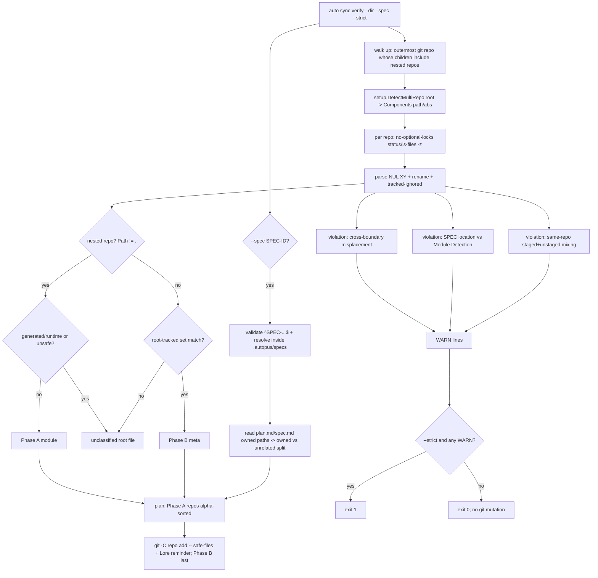

# SPEC-ADK-SYNC-VERIFY-001 구현 계획

## Tasks

- [x] T1: `[NEW] internal/cli/sync.go` — `newSyncCmd()` 부모 cobra 명령(도움말 전용, bare 변이 없음) + `verify` 서브커맨드. 플래그 `--dir`(기본 cwd), `--spec`, `--strict`. `cmd.SilenceUsage=true`로 위반 시 usage 노이즈 억제. `internal/cli/root.go`의 `root.AddCommand(...)` 목록에 `newSyncCmd()` 추가. 배선 oracle은 `[NEW] internal/cli/sync_test.go`(REQ-001·007·009).
- [x] T2: `[NEW] internal/cli/sync_verify_discover.go` — `--dir`/cwd에서 메타 루트를 찾고 `setup.DetectMultiRepo`로 커밋 경계를 열거한다. 각 repo에서 `git --no-optional-locks status --porcelain=v1 -z --untracked-files=all`과 `ls-files -c -i --exclude-standard -z`를 실행해 NUL record를 파싱하고 rename source/destination·XY flags를 보존한다(REQ-001·002·013).
- [x] T3: `[NEW] internal/cli/sync_verify_policy.go`·`sync_verify_classify.go` — canonical root keep과 generated/runtime drop 정책을 built-in fail-closed 판정으로 표현하고, inventory의 모든 path를 Phase A/B·blocked·unclassified 중 하나로 완전 분할한다. misplacement·SPEC-module·혼입 경고도 함께 계산한다(REQ-003~006).
- [x] T4: `[NEW] internal/cli/sync_verify_spec_host.go`·`sync_verify_spec_ownership.go` — `--spec` ID 검증, workspace 전체 exactly-one host 탐색, Lstat containment·regular document 읽기, workspace-relative owned/unrelated 분리와 owned-only 계획을 구현한다(REQ-007·011·012).
- [x] T5: `[NEW] internal/cli/sync_verify_plan.go` — 결정적 Phase A→B 렌더에서 공통 셸에 안전한 token만 `git -C <repo> add -- <files...>`로 출력하고 Lore 리마인더를 붙인다. 경고 존재 && `--strict`이면 sentinel error를 반환한다(REQ-008·009).
- [x] T6: `content/rules/doc-storage.md`, `README.md`, `docs/README.ko.md`, `CHANGELOG.md`에 canonical keep/drop, `--spec`, `--strict`, read-only 경계를 동기화한다(REQ-010).
- [x] T7: `[NEW] internal/cli/sync_verify_discover_test.go` — fixture temp 루트 git repo + nested `mod-a` git repo. S1(파일별 정확 repo 귀속, 각 파일 정확히 한 repo) + S8 read-only(실행 전후 `git status --porcelain` 동일, HEAD sha 불변) oracle.
- [x] T8: `[NEW] internal/cli/sync_verify_classify_test.go` — S2(Phase 집합 정확), S3(misplacement 기대위치), S4(SPEC-module 불일치 기대 모듈), S5(staged+unstaged 혼입 나열) oracle.
- [x] T9: `[NEW] internal/cli/sync_verify_plan_test.go` — S6(--spec 소유/무관 2그룹), S7(Phase A `mod-a`→`mod-b`→`mod-c`→Phase B 정확 순서), S9(위반 시 기본 exit 0 / `--strict` exit 1 / 무위반 `--strict` exit 0) oracle.
- [x] T10: `[NEW] internal/cli/sync_verify_safety_test.go` — S10(`--spec "../../etc"`·`SPEC-x/../y` traversal 거부, specs 트리 밖 미접근) + 절대 경로 비노출.
- [x] T11: `[NEW] internal/cli/sync_verify_hardening_test.go` — complete partition, tracked-but-ignored, nested generated/runtime, rename, 특수 파일명, cross-repo/segment-exact SPEC 소유권, duplicate/symlink/missing document를 oracle로 고정한다(REQ-002·003·007·008·012).
- [x] T12: Git failure fixture로 optional-lock 인자와 stderr/절대 경로 비노출을 검증하고, default·`--spec`·`--strict` 실행 전후 index bytes/hash/mtime 불변을 비교한다(REQ-013).
- [x] T13: focused race, `go vet ./internal/cli`, 전체 `go test ./internal/cli/...`, 실제 meta workspace read-only `--spec` 실행, diff/file-size/tracked-ignored gate를 통과한 뒤 SPEC status를 `completed`로 승격했다.

## Implementation Strategy

- **재사용 우선(새 의존성 0)**: `setup.DetectMultiRepo`와 canonical `content/rules/doc-storage.md` 정책을 재사용한다. 줄 기반 `hygieneGitLines` 파서는 rename·quoted path 경계가 달라 공유하지 않고 NUL parser를 사용한다.
- **read-only 불변식**: Git child process마다 `--no-optional-locks`를 적용하고 `status`·`ls-files`만 실행한다. 계획 문자열의 `add`는 출력일 뿐 실행하지 않으며 index bytes/hash/mtime oracle로 무부작용을 검증한다.
- **결정성**: repo는 `Path` 알파벳순, 각 repo 파일도 정렬. 동일 입력 → 동일 출력(diff/CI 안정, S7 oracle 근거).
- **false-positive 억제**: SPEC-module 불일치는 repo path segment를 정확히 비교한다. canonical keep 밖 루트 path와 unsafe path는 커밋 후보로 추정하지 않고 미분류로 남겨 strict에서 fail-closed한다.
- **exit 계약**: 기본 exit 0(경고만). `--strict`는 훅/CI용으로 위반 시 exit 1. `SilenceUsage`로 위반 exit가 usage 덤프를 내지 않게 한다.
- **TDD / 파일 예산**: 각 검출기(T2~T5)는 대응 oracle 테스트(T7~T10)와 짝. 검출·분류·렌더·spec 분리로 파일당 ≤300줄(목표 <200) 유지.

## Visual Planning Brief (command-flow + data-flow)



명령 흐름 예시(read-only, 출력만):
```
$ auto sync verify
Phase A  mod-a:  git -C mod-a add -- pkg/foo.go
  # commit with Lore format (auto check --lore)
Phase B  meta (.): git -C . add -- ARCHITECTURE.md .autopus/project/product.md
  # commit with Lore format
WARN  SPEC-FOO-001 located at root but references only mod-a paths -> expected mod-a/.autopus/specs/
```

## Feature Completion Scope

Primary SPEC이 Outcome Lock을 단독으로 닫는다. 구현·회귀 oracle·품질 게이트 T1~T13이 모두 완료됐고 승인된 sibling 의존성이나 Completion Debt는 없다.
