# SPEC-ADK-SYNC-VERIFY-001 구현 계획

## Tasks

- [x] T1: `[NEW] internal/cli/sync.go` — `newSyncCmd()` 부모 cobra 명령(도움말 전용, bare 변이 없음) + `verify` 서브커맨드. 플래그 `--dir`(기본 cwd), `--spec`, `--strict`. `cmd.SilenceUsage=true`로 위반 시 usage 노이즈 억제. `internal/cli/root.go`의 `root.AddCommand(...)` 목록에 `newSyncCmd()` 추가. 배선 oracle은 `[NEW] internal/cli/sync_test.go`(REQ-001·007·009).
- [x] T2: `[NEW] internal/cli/sync_verify_discover.go` — `--dir`/cwd에서 상위로 올라가며 직속 자식에 nested git repo(≥1)를 포함하는 가장 바깥 git repo를 메타 루트로 해석(`setup.DetectMultiRepo(candidate)`가 `len(Components)>=2`를 반환하는 최상위 지점). 해석된 루트로 `setup.DetectMultiRepo`를 호출해 `Components`(각 `Path`·`AbsPath`) 획득. repo별로 `hygieneGitLines(absPath, "status", "--porcelain")` read-only 실행 후 `status_hygiene.go`의 XY 파싱 패턴(`code:=line[:2]`, rename `->` 처리, `??` untracked)으로 dirty 파일 수집. staged=X≠space, unstaged=Y≠space 플래그 보존(REQ-001·002).
- [x] T3: `[NEW] internal/cli/sync_verify_classify.go` — (a) Phase 분류: nested repo(`Path != "."`) 파일 → Phase A; 루트 파일 → 루트 추적 집합 매칭 시 Phase B. (b) 위반 검출: misplacement(루트 문서가 단일 모듈 코드 경로 참조 / nested에 루트-scoped 메타 문서명), SPEC-module 불일치(SPEC dir 위치 vs Module Detection 소유 모듈), 혼입(같은 repo staged+unstaged 공존). 루트 추적 집합·Module Detection prefix(`pkg/`·`cmd/`·`internal/`·`src/`·`app/`)는 doc-storage 규칙 상수로 표현(REQ-003·004·005·006).
- [x] T4: `[NEW] internal/cli/sync_verify_spec.go` — `--spec SPEC-ID`를 `^SPEC-[A-Z0-9-]+$` 검증(regexp), `filepath.Join`+`filepath.Rel`로 워크스페이스 `.autopus/specs/<ID>/` 밖 해석 거부(traversal 차단). 대상 `plan.md`·`spec.md`에서 소유/참조 경로 토큰 추출(코드 경로 + `생성 파일 상세`/`[NEW]` 경로). dirty 파일을 소유 집합 vs 무관 집합으로 분리(REQ-007·011).
- [x] T5: `[NEW] internal/cli/sync_verify_plan.go` — 결정적 렌더: Phase A repo를 `Path` 알파벳순 정렬 후 각 repo `git -C <path> add <files...>`(파일도 정렬) + Lore 리마인더 `# commit with Lore format (auto check --lore enforces type prefix + sign-off)`, 마지막에 Phase B 메타 블록. 경고 존재 && `--strict` → exit 1(sentinel error), 아니면 exit 0(REQ-008·009).
- [x] T6: `[NEW]` content 스킬/규칙 sync 절차 문서(예: `content/rules/doc-storage.md`의 `## Sync Commit Rules` 인근)에 `auto sync verify`를 커밋 전 1단계로 1~2줄 언급(`sync verify` 문자열 포함)하고 `go run ./cmd/generate-templates`로 4플랫폼 템플릿 재생성 + 패리티 확인(REQ-010).
- [x] T7: `[NEW] internal/cli/sync_verify_discover_test.go` — fixture temp 루트 git repo + nested `mod-a` git repo. S1(파일별 정확 repo 귀속, 각 파일 정확히 한 repo) + S8 read-only(실행 전후 `git status --porcelain` 동일, HEAD sha 불변) oracle.
- [x] T8: `[NEW] internal/cli/sync_verify_classify_test.go` — S2(Phase 집합 정확), S3(misplacement 기대위치), S4(SPEC-module 불일치 기대 모듈), S5(staged+unstaged 혼입 나열) oracle.
- [x] T9: `[NEW] internal/cli/sync_verify_plan_test.go` — S6(--spec 소유/무관 2그룹), S7(Phase A `mod-a`→`mod-b`→`mod-c`→Phase B 정확 순서), S9(위반 시 기본 exit 0 / `--strict` exit 1 / 무위반 `--strict` exit 0) oracle.
- [x] T10: `[NEW] internal/cli/sync_verify_safety_test.go` — S10(`--spec "../../etc"`·`SPEC-x/../y` traversal 거부, specs 트리 밖 미접근) + 절대 경로·secret 미노출 + `go test ./internal/cli/...` green + 실 워크스페이스 `auto sync verify` 라이브 확인.

## Implementation Strategy

- **재사용 우선(새 의존성 0)**: `setup.DetectMultiRepo`(루트+nested 열거, `Path`/`AbsPath`/`.` 루트), `hygieneGitLines`(read-only git exec), `status_hygiene.go` porcelain XY 파싱 패턴, `pkg/config` 루트 추적 경로 개념, `content/rules/doc-storage.md`의 Storage Matrix + Module Detection 규칙을 상수/판정으로 옮겨 재사용. stdlib `regexp`·`path/filepath`·`sort`·`strings`만 사용.
- **read-only 불변식**: git은 `status --porcelain`·`rev-parse`만. `add`·`commit`·`stash` 등 변이 명령 절대 미사용. 계획은 텍스트로만 제안한다(사람이 복사 실행). 이것이 Outcome Lock의 "변이 0"을 보장하는 핵심.
- **결정성**: repo는 `Path` 알파벳순, 각 repo 파일도 정렬. 동일 입력 → 동일 출력(diff/CI 안정, S7 oracle 근거).
- **false-positive 억제**: SPEC-module 불일치는 참조 경로가 단일 모듈로 명확히 귀속될 때만 경고(2+ 모듈 → 루트 기대, 애매하면 무경고). 루트 추적 집합은 doc-storage에 명시된 경로만 Phase B로, 나머지 루트 파일은 미분류로 남겨 오분류를 피한다.
- **exit 계약**: 기본 exit 0(경고만). `--strict`는 훅/CI용으로 위반 시 exit 1. `SilenceUsage`로 위반 exit가 usage 덤프를 내지 않게 한다.
- **TDD / 파일 예산**: 각 검출기(T2~T5)는 대응 oracle 테스트(T7~T10)와 짝. 검출·분류·렌더·spec 분리로 파일당 ≤300줄(목표 <200) 유지.

## Visual Planning Brief (command-flow + data-flow)

```mermaid
flowchart TD
  A[auto sync verify --dir --spec --strict] --> B[walk up: outermost git repo whose children include nested repos]
  B --> C[setup.DetectMultiRepo root -> Components path/abs]
  C --> D[per repo: hygieneGitLines status --porcelain read-only]
  D --> E[parse XY: staged/unstaged/untracked dirty files]
  E --> F{nested repo? Path != .}
  F -- yes --> G[Phase A module]
  F -- no --> H{root-tracked set match?}
  H -- yes --> I[Phase B meta]
  H -- no --> J[unclassified root file]
  E --> K1[violation: cross-boundary misplacement]
  E --> K2[violation: SPEC location vs Module Detection]
  E --> K3[violation: same-repo staged+unstaged mixing]
  A --> L{--spec SPEC-ID?}
  L -- yes --> M[validate ^SPEC-...$ + resolve inside .autopus/specs]
  M --> N[read plan.md/spec.md owned paths -> owned vs unrelated split]
  G --> P[plan: Phase A repos alpha-sorted]
  I --> P
  N --> P
  P --> Q[git -C repo add files + Lore reminder; Phase B last]
  K1 --> R[WARN lines]
  K2 --> R
  K3 --> R
  R --> S{--strict and any WARN?}
  S -- yes --> T[exit 1]
  S -- no --> U[exit 0; no git mutation]
```



명령 흐름 예시(read-only, 출력만):
```
$ auto sync verify
Phase A  mod-a:  git -C mod-a add pkg/foo.go
  # commit with Lore format (auto check --lore)
Phase B  meta (.): git -C . add ARCHITECTURE.md .autopus/project/product.md
  # commit with Lore format
WARN  SPEC-FOO-001 located at root but references only mod-a paths -> expected mod-a/.autopus/specs/
```

## Feature Completion Scope

Primary SPEC이 Outcome Lock을 단독으로 닫는다. (1) 발견/상태=T1/T2, (2) 분류/위반=T3, (3) --spec 분리=T4, (4) 계획/exit=T5, 패리티 문서=T6, oracle+라이브=T7~T10. 승인된 sibling 의존성 없음. Completion Debt 없음(모든 mandatory requirement가 태스크로 커버되고 read-only·exit·안전 경계까지 태스크에 포함).
