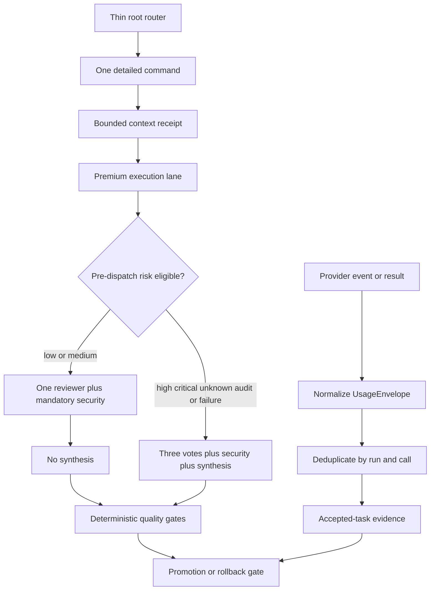

# SPEC-ADK-ULTRA-EFFICIENCY-001 Plan: Token-Efficient Ultra Quality Allocation

**Status**: draft  
**Created**: 2026-07-11  
**Target module**: `autopus-adk/`

## Implementation Strategy

Implement the Outcome Lock in four ordered gates rather than changing every Ultra lever at once.

1. **Measurement gate**: introduce a versioned normalized usage type, preserve provider semantics through worker and orchestra execution, and expose accepted-task reports. No execution policy changes are allowed in this slice.
2. **Lossless prompt/context gate**: render thin root routers, select one detailed command contract, build bounded context receipts, and connect proactive typed pruning. Model tier and review depth remain unchanged while this slice is evaluated.
3. **Risk-bound review gate**: reuse conservative changed-path risk evidence, emit the complete route-team quality binding before dispatch, and select current full Ultra for high/critical/sensitive/unknown, audit, or binding-failure cases. Model, effort, implementation fan-out, retry, and deterministic gates do not change.
4. **Promotion gate**: compare paired accepted tasks, require actual coverage and zero high/critical regression, retain a full-depth audit sample, and fail open or roll back on any integrity failure.

The implementation uses TDD. Each task begins with the concrete acceptance fixture mapped in `acceptance.md`. New source files are marked `[NEW]`; generated workflow and installed platform outputs are regenerated and inspected, never hand-edited.

## Visual Planning Brief



Command-flow summary:

```text
current: full router/context -> fixed Ultra depth -> estimated-only telemetry
target:  thin route -> scoped receipt -> risk-bound review -> full fallback -> actual paired evidence
```

## Feature Completion Scope

This Primary SPEC owns one outcome: measured minimum-sufficient Ultra allocation with the current high/critical contract preserved.

Mandatory completion slices:

- actual/null/estimated usage semantics and call-level aggregation;
- accepted-task denominator and raw-versus-billable reporting;
- thin Claude/Gemini root routing and detailed-command lazy loading;
- bounded context receipts and prompt-layer invalidation evidence;
- proactive typed pruning connected to live worker phase transitions;
- conservative risk resolution and pre-dispatch route-team binding;
- security always, unknown/high/critical/audit full Ultra, unchanged implementation fan-out and effort;
- shadow, audit sample, paired promotion, and rollback receipts;
- generated parity, Balanced regression zero, and source ownership hygiene.

No sibling SPEC is created. The plan has 12 cohesive tasks under one module and does not cross the combined sibling threshold of more than 25 tasks and more than 40 source files. Provider-native caching, tool search, dashboard UX, within-run reviewer expansion, adaptive implementation fan-out, and effort tuning remain optional advisory work.

Completion Debt remains operationally blocking even after hermetic implementation passes: the paired corpus, provider execution-path usage coverage, and live canary/rollback receipts must exist before sync can mark the Outcome Lock complete.

## File Impact Analysis

### Usage schema, aggregation, and reports

| Path | Action | Purpose |
|---|---|---|
| `[NEW] pkg/telemetry/usage.go` | Add | Define versioned `UsageEnvelope`, nullable components, inclusion semantics, status/source/reason codes, and safe raw-usage metadata. |
| `[NEW] pkg/telemetry/usage_aggregate.go` | Add | Provide stateless deterministic deduplication and aggregation over immutable usage inputs; concurrent persistence remains the recorder's responsibility. |
| `[NEW] pkg/telemetry/usage_test.go` | Add | Exact OpenAI/Anthropic/unavailable/cache arithmetic and conflict fixtures. |
| `pkg/telemetry/types.go` | Modify | Add provider/model/effort/attempt/tool-call and UsageEnvelope fields while preserving `EstimatedTokens`. |
| `pkg/telemetry/reporter.go` | Modify | Render actual coverage, raw totals, accepted denominator, and unavailable reasons. |
| `pkg/telemetry/{types,recorder,reader,reporter}_test.go` | Modify | Prove legacy JSONL compatibility and additive reporting. |
| `internal/cli/telemetry.go` | Modify | Register accepted-task comparison and promotion evidence output without breaking existing commands. |
| `internal/cli/telemetry_{record,resolve,json}.go` | Modify | Persist and expose normalized usage, run/arm identity, objective status, and warnings. |
| `[NEW] internal/cli/telemetry_efficiency.go` | Add | Produce paired evidence, provisional target status, quality gate, and rollback reason codes. |
| `internal/cli/telemetry*_test.go` | Modify/Add | Assert human/JSON formula parity, null handling, accepted denominator, and comparison warnings. |

### Provider and execution propagation

| Path | Action | Purpose |
|---|---|---|
| `pkg/worker/adapter/interface.go` | Modify | Carry usage metadata on stream events and task results without changing prompt bodies. |
| `pkg/worker/adapter/{claude,codex,gemini}.go` | Modify | Parse provider-specific usage when exposed and mark cost-only/unavailable otherwise. |
| `pkg/worker/adapter/{claude,codex,gemini}_test.go` | Modify | Add provider fixture oracles, including Codex `turn.completed` propagation and plain Gemini unavailable handling. |
| `pkg/worker/adapter/result_merge.go` | Modify | Merge multiline output and usage independently without dropping or duplicating call receipts. |
| `pkg/worker/adapter/result_merge_test.go` | Modify | Prove distinct call aggregation and identical-call dedup behavior. |
| `pkg/worker/pipeline.go` | Modify | Carry phase usage/tool calls into aggregate task results and install the production compressor. |
| `pkg/worker/pipeline_phase.go` | Modify | Accumulate usage from non-result events and result envelopes while preserving phase identity. |
| `pkg/worker/loop_subprocess.go` | Modify | Preserve usage across live worker event streams and retries. |
| `internal/cli/agent_run_exec.go` | Modify | Return normalized usage from direct agent runs instead of discarding non-result usage events. |
| `pkg/orchestra/types.go` | Modify | Add usage and execution-path capability metadata to `ProviderResponse`, `OrchestraResult`, and serializable summaries. |
| `pkg/orchestra/crosspolinate.go` | Modify | Preserve usage on `ProviderResult` so subprocess pipeline rounds do not discard it. |
| `pkg/orchestra/{provider_runner,subprocess_runner}.go` | Modify | Parse usage from raw stdout before `applyCodexLastMessageOutput` replaces it, then retain the final human-readable output separately. |
| `pkg/orchestra/{pipeline,hook_watcher,pane_backend_collect}.go` | Modify | Carry usage through provider results, rounds, final results, and yields or mark pane/hook paths explicitly unavailable. |
| `[NEW] pkg/orchestra/usage_test.go` | Add | Verify provider path capability, no raw prompt retention, and round aggregation. |

### Thin routing and bounded context

| Path | Action | Purpose |
|---|---|---|
| `templates/claude/commands/auto-router.md.tmpl` | Modify | Reduce to route parsing, common safety/language rules, context profile selection, and one detailed-skill handoff. |
| `[NEW] templates/claude/commands/auto-workflows.md.tmpl` | Add | Preserve the current monolithic subcommand semantics as generation-only source that is never installed as the root router. |
| `[NEW] pkg/adapter/claude/claude_workflow_skills.go` | Add | Deterministically split and render one `.claude/skills/autopus/auto-<subcommand>.md` detail per frozen route. |
| `pkg/adapter/claude/{claude_files,claude_prepare_files}.go` | Modify | Render generated detailed Claude auto skills and the thin root skill through one route inventory. |
| `[NEW] pkg/adapter/claude/claude_workflow_skills_test.go` | Add | Assert every route has exactly one detail and the generation-only source is not installed as root context. |
| `pkg/adapter/claude/{claude_router,claude_workspace_context}_test.go` | Modify | Assert complete route coverage, one selected detail, 8,192-byte root budget, and scoped context. |
| `templates/gemini/commands/auto-router.md.tmpl` | Modify | Make the Gemini root router route-only and use existing detailed skills or bounded extracted detail sources. |
| `[NEW] templates/gemini/skills/{auto-dev,auto-doctor,auto-goal,auto-map,auto-secure,auto-setup,auto-status,auto-test,auto-update,auto-verify,auto-why}/SKILL.md.tmpl` | Add | Fill the frozen Gemini route-inventory gaps with bounded detailed contracts; existing eight auto details remain canonical for their routes. |
| `templates/codex/skills/auto-*.md.tmpl` | Modify | Align shared/Codex detailed command context profiles without expanding the already-thin Codex router. |
| `content/skills/agent-pipeline.md` | Modify | Require scoped receipts in worker contracts and forbid full repeated artifact relay. |
| `pkg/memindex/{types,context}.go` | Verify | Reuse `ContextResult`, including budget, selected prompt, source refs/hashes, and omitted count; do not create a second receipt type. |
| `pkg/promptlayer/layer.go` | Verify/Modify | Reuse stable/snapshot/ephemeral ordering and expose receipt hashes without claiming provider cache hits. |
| `[NEW] pkg/adapter/claude/router_budget_test.go` | Add | Generate a realistic full-mode root and enforce route coverage plus byte-size budget. |
| `pkg/adapter/{codex,gemini,opencode}/**/*surface*_test.go` | Modify | Verify detailed-skill policy parity and generated-source ownership. |

### Proactive pruning

| Path | Action | Purpose |
|---|---|---|
| `pkg/worker/compress/compressor.go` | Modify | Run typed soft pruning before hard summarization when completed stale pairs meet the soft policy. |
| `pkg/worker/compress/events.go` | Modify | Distinguish soft prune and hard compaction while preserving reason/source metadata. |
| `pkg/worker/compress/pruner.go` and `tool_pairs_*.go` | Verify/Modify | Preserve failures, incomplete pairs, protected sections, and recent evidence. |
| `pkg/worker/compress/*_test.go` | Modify | Add exact pruned-pair counts, protected-content, digest/reference, and secret/path redaction oracles. |
| `pkg/worker/loop_exec.go` | Modify | Install `NewDefaultCompressor` on production phase-split execution. |

### Conservative risk and pre-dispatch team binding

| Path | Action | Purpose |
|---|---|---|
| `internal/cli/review_risk_tier.go` | Modify | Reuse existing path and sensitive-domain rules while distinguishing trustworthy empty input from changed-file discovery failure. |
| `[NEW] internal/cli/workflow_binding.go` | Add | Expose `auto workflow binding` JSON that combines risk resolution with the complete canonical quality binding and full-depth audit override. |
| `[NEW] internal/cli/workflow_binding_test.go` | Add | Cover low/medium compact binding, high/critical/sensitive/unknown full binding, deterministic audit, and malformed or discovery-failure fallback. |
| `internal/cli/workflow.go` | Modify | Register the binding command and keep existing doctor/render/gate/merge behavior. |
| `internal/cli/workflow_quality_binding.go` | Modify | Override only `review.verify_votes` and `review.synthesis`; preserve all phase model/effort values and `implementation.fan_out_cap`. |
| `internal/cli/{workflow_quality_binding,workflow_render}_test.go` | Modify | Prove bare phase-map serialization, canonical profile parity, fan-out parity, and exact review-depth differences. |
| `pkg/workflow/{binding,depth}.go` | Verify | Reuse the current binding and depth types; do not create a second risk or adaptive-review abstraction. |
| `content/workflows/route_team.{md,schema.json}` | Verify | Keep the existing runtime-overridable review fields, security call, fan-out cap, retries, and gate structure. |
| `pkg/content/workflow_generate_team.go` and parity/launch tests | Verify | Confirm the existing generator consumes `verify_votes` and `synthesis`; do not add dynamic result-driven calls. |
| `templates/claude/workflows/route_team.workflow.js.tmpl` | Verify | Generated surface only; no source change is expected for static risk binding. |
| `templates/claude/commands/auto-workflows.md.tmpl` | Modify in T9 | Make the generated auto-go detail call the binding command and pass its bare phase map into route-team workflow args. |

## Architecture Considerations

### Dependency direction

- `pkg/telemetry` remains provider-neutral and imports only standard or lower-level utility code.
- Worker adapters and orchestra responses may depend on `pkg/telemetry`; telemetry must not import worker or orchestra packages.
- `pkg/workflow` remains pure and must not import `internal/cli` or `pkg/content`; no new risk abstraction is added there.
- CLI dispatch owns quality/model/effort, changed-repository evidence, risk resolution, and audit selection; it passes only the existing bare phase map into workflow runtime arguments.
- `pkg/content` owns deterministic generation from `content/workflows` source manifests.
- Installed `.claude/**`, `.codex/**`, `.gemini/**`, `.opencode/**`, and generated workflow JS remain downstream outputs.

### Trust boundaries

- Provider outputs and usage fragments are untrusted input.
- Persist only allowlisted numeric usage, identifiers, schema/version, and sanitized reason metadata.
- Do not store prompt, full response, secret, credential, token value, or privileged absolute path in usage receipts.
- Missing or malformed risk/binding evidence fails open to full Ultra; ambiguous provider inclusion semantics blocks the metric.
- Context receipt cells and artifact references do not override stable policy.

### Usage persistence boundary

- Provider adapters, worker results, and orchestra results are transport surfaces; they return `UsageEnvelope` values and do not write telemetry by themselves.
- `auto telemetry record --action agent --usage-json usage-envelope.json` is the single persistence bridge. The supervisor or worker loop that owns SPEC, phase, task, attempt, run, and call identity invokes it exactly once after result aggregation.
- Native pane or workflow-agent paths that cannot expose a trustworthy receipt record `usage_status=unavailable` and cannot satisfy the 95% promotion gate. They are not silently estimated.

### Prompt-state contract

- **Stable**: language/safety/workflow rules, route table, detailed command instructions, tool schemas.
- **Snapshot**: selected workspace policy, relevant SPEC/acceptance, bounded recall, ownership, file/symbol references.
- **Ephemeral**: latest user request, current diff evidence, provider output, retry and review state.

Only a stable-source change invalidates the stable manifest. Selecting a different task or receipt changes snapshot/ephemeral hashes without rewriting unrelated stable content.

### Formula contract

```text
raw_total_tokens =
  input_tokens_total
  + output_tokens_total
  + reasoning_tokens only when reasoning is declared separate
  + tool_tokens only when tool tokens are declared separate

raw_total_tokens_per_accepted_task =
  all eligible attempt raw tokens in the arm
  / distinct final accepted task count
```

Cached input is already part of inclusive input. Reasoning that is a subset of output is already part of inclusive output. Missing or ambiguous inclusion metadata yields null rather than a guessed total.

## Tasks

### T1 — Define the normalized usage contract

- [ ] Add tests for OpenAI-inclusive, Anthropic-breakdown, cost-only, estimated, unavailable, separate-reasoning, and ambiguous-subset fixtures.
- [ ] Add UsageEnvelope, stable reason/source literals, nullable fields, sanitized provenance, and deterministic aggregation helpers.
- [ ] Keep aggregation stateless and race-safe for concurrent caller snapshots; exercise concurrent recorder writes under `go test -race`.
- [ ] Preserve legacy `EstimatedTokens` decoding and label estimates separately.
- **Covers**: REQ-UTE-USAGE-01 through REQ-UTE-USAGE-03; S1–S3.

### T2 — Capture usage in worker adapters

- [ ] Parse usage from every supported Claude result and Codex completion event without losing the final message.
- [ ] Mark plain Gemini or unsupported schemas as cost-only or unavailable.
- [ ] Aggregate usage from non-result and result events with stable run/call identity.
- [ ] Add provider fixture and redaction tests.
- **Covers**: REQ-UTE-USAGE-01 through REQ-UTE-USAGE-04; S1–S4.

### T3 — Propagate usage through worker telemetry and reports

- [ ] Carry usage, tool calls, phase, role, attempt, model, and effort through phase and task aggregation.
- [ ] Extend `auto telemetry record --action agent` with a validated `--usage-json` file bridge; keep adapters and orchestra recorder-neutral.
- [ ] Make the owning worker/supervisor call the bridge exactly once with SPEC, phase, task, attempt, run, and call identity, then extend reader, summary, cost, compare, and JSON output additively.
- [ ] Implement accepted-task denominator, zero-accepted null, failed-spend, actual-coverage, and conflict reporting.
- [ ] Prove old JSONL fixtures still load.
- **Covers**: REQ-UTE-USAGE-04 through REQ-UTE-USAGE-06; S4–S6.

### T4 — Capture orchestra execution-path usage

- [ ] Add UsageEnvelope and capability metadata to provider responses, round history, yield/session serialization, and failure paths.
- [ ] Parse allowlisted usage from raw subprocess stdout before Codex last-message replacement and keep usage independent from displayed output.
- [ ] Carry usage through `ProviderResponse`, `ProviderResult`, round history, pipeline reconstruction, and `OrchestraResult`; mark pane/hook paths explicitly when unavailable.
- [ ] Deduplicate repeated round/result receipts and retain provider failure status.
- **Covers**: REQ-UTE-USAGE-01 through REQ-UTE-USAGE-05; S2–S5.

### T5 — Render thin root routers and lazy command details

- [ ] Freeze current route inventory and mandatory common policy tokens in tests.
- [ ] Move Claude detailed command bodies into one generation-only source and deterministically render one detail per route.
- [ ] Fill only the eleven missing Gemini detailed routes and preserve the existing eight route details.
- [ ] Make Claude and Gemini roots route-only and no larger than 8,192 bytes.
- [ ] Align detailed context-profile contracts across Claude, Gemini, Codex, and shared/OpenCode surfaces.
- [ ] Generate into temporary roots and assert one selected detail, route coverage, size, and source ownership.
- [ ] Fail the size gate instead of relaxing 8,192 bytes when common policy grows; move overflow detail behind the selected route.
- **Covers**: REQ-UTE-ROUTER-01; S7.

### T6 — Build bounded context receipts

- [ ] Define `core`, `architecture`, `test`, `canary`, `signature`, and `learning` context profiles.
- [ ] Select a total receipt budget from 800–2,000 estimated tokens, reserve mandatory handoff fields first, and pass only the residual budget to `auto mem context --format json` and `memindex.ContextResult`; do not add a parallel receipt type.
- [ ] Compose the worker handoff from Outcome Lock, constraints, ownership, acceptance, decision delta, `ContextResult.Prompt`, selected source refs/hashes, omitted count, snapshot hash, and prompt manifest hash.
- [ ] Prove `plan`, `test`, and `canary` profiles do not load each other's optional documents.
- [ ] Prove dynamic receipt changes do not alter stable hashes.
- **Covers**: REQ-UTE-ROUTER-02, REQ-UTE-CONTEXT-01, REQ-UTE-CONTEXT-02; S8–S10.

### T7 — Connect proactive typed pruning

- [ ] Add soft-prune fixtures before changing compressor behavior.
- [ ] Reuse existing tool-pair parsing, summaries, redaction, and blocker contracts.
- [ ] After a direct consumer finishes, keep the two most recent completed successful pairs and replace every older eligible pair with deterministic digest/reference evidence.
- [ ] Preserve failures, incomplete pairs, findings, corrections, invariants, acceptance, decisions, refs, and signatures.
- [ ] Install the default compressor in production worker phase transitions.
- [ ] Keep hard summarization at the existing threshold as fallback and distinguish event reasons.
- **Covers**: REQ-UTE-PRUNE-01 through REQ-UTE-PRUNE-03; S11–S13.

### T8 — Reuse conservative risk evidence

- [ ] Reuse the existing CLI path classifier without adding a duplicate `pkg/workflow` risk model.
- [ ] Preserve current sensitive tokens and high-risk prefixes; add explicit public-API and classifier-failure cases.
- [ ] Add `auto workflow binding --quality ultra --risk-tier auto --files-file changed-files.json --format json` to emit the bare phase map plus risk and selection reason.
- [ ] Define selection and fallback reasons as typed constants with stable JSON strings.
- [ ] Override only review votes and synthesis; preserve canonical model, effort, fan-out, retry, and user-owned provider settings.
- [ ] Treat changed-file discovery failure, missing evidence, malformed risk input, or binding validation failure as full Ultra.
- **Covers**: REQ-UTE-POLICY-01, REQ-UTE-POLICY-04, REQ-UTE-POLICY-05; S14, S17, S18.

### T9 — Connect risk-bound review to live route-team dispatch

- [ ] Make the generated Claude auto-go detail resolve the binding before launching route-team and pass the bare phase map through the existing `quality` workflow argument.
- [ ] Bind one reviewer plus mandatory security and no synthesis only for eligible low/medium risk outside the audit sample.
- [ ] Bind the current three-vote, mandatory-security, synthesis shape before dispatch for high/critical/sensitive/unknown, deterministic audit, or safe-fallback cases.
- [ ] Keep the route-team generator, implementation scheduling, segment boundaries, deterministic gates, hard fan-out cap, retries, and canonical model/effort mapping unchanged.
- [ ] Prove that no within-run model-output-driven expansion is claimed or introduced by this SPEC.
- **Covers**: REQ-UTE-POLICY-01 through REQ-UTE-POLICY-05; S14–S18.

### T10 — Implement paired evidence and promotion evaluation

- [ ] Add A/A instrumentation-neutrality, 95% actual coverage, common-task pairing, unpaired reporting, and AB/BA metadata oracles.
- [ ] Include all attempts and rejected/timeout spend in the numerator and final accepted distinct tasks in the denominator.
- [ ] Report the provisional target without converting it into a product guarantee.
- [ ] Reuse deterministic gate and experiment patterns for reasoned PASS/BLOCKED/ROLLBACK decisions.
- **Covers**: REQ-UTE-EVAL-01 through REQ-UTE-EVAL-03; S19–S21.

### T11 — Add shadow, audit, canary, and rollback receipts

- [ ] Default behavior-changing policy to shadow until measurement gate passes.
- [ ] Use deterministic full-depth audit sampling for eligible low/medium runs.
- [ ] Block or roll back on any high/critical regression, usage conflict, policy parity failure, context-integrity failure, or registered reliability regression.
- [ ] Keep sensitive and unsupported paths full Ultra at every rollout stage.
- **Covers**: REQ-UTE-SCOPE-02, REQ-UTE-EVAL-01 through REQ-UTE-EVAL-03; S19–S22.

### T12 — Verify parity, compatibility, and operational evidence

- [ ] Run focused race/coverage tests, build, vet, format, architecture, generated parity, and hygiene gates.
- [ ] Prove Balanced and custom/pinned provider configs remain unchanged.
- [ ] Regenerate workflow and platform surfaces only through ADK commands; inspect but do not stage runtime outputs.
- [ ] Recover or reconstruct the minimum paired corpus and record live provider/pane usage capability, canary, full-depth audit, and rollback receipts.
- [ ] Keep Completion Debt open until every live evidence item exists.
- **Covers**: REQ-UTE-SCOPE-01, REQ-UTE-SCOPE-02, all compatibility clauses; S22.

## Risks & Mitigations

| Risk | Impact | Mitigation |
|---|---|---|
| Provider inclusion semantics change | High | Versioned source metadata, nullable totals, conflict blocker, provider fixtures. |
| Usage propagation double counts one call | High | Stable run/call identity and exact duplicate/conflict acceptance fixtures. |
| Thin router loses behavior | High | Frozen route inventory, mandatory-token parity, rendered temp-root tests, byte budget. |
| Pruning loses protected evidence | High | Typed preservation, incomplete-pair blocker, stable artifact fallback, adversarial tests. |
| Risk classifier underestimates sensitive work | Critical | Sensitive allowlist, missing-to-unknown, full Ultra fallback, audit sample, immediate rollback. |
| Live route-team omits or corrupts the quality binding | High | Binding command validation, bare-map fixture, full Ultra default, and launch-contract test. |
| 25% target drives denominator gaming | High | All attempts in numerator, accepted tasks in denominator, zero accepted returns null. |
| Live usage coverage stays below 95% | High | Keep adaptive behavior in shadow and report missing execution paths. |
| Source files exceed 300 lines | Medium | Split new Go files by responsibility; documentation files are exempt. |
| Scope expands into cache/pricing/dashboard work | Medium | Keep provider activation and UI advisory unless mandatory evidence proves need. |

## Dependencies

Internal dependencies:

- `pkg/telemetry` recorder/reader/reporter and current JSONL format.
- `pkg/worker/adapter`, worker phase parsing, and result merging.
- `pkg/orchestra` provider execution, round history, and failure diagnostics.
- `pkg/promptlayer` stable/snapshot/ephemeral manifest ordering.
- `pkg/memindex` bounded recall.
- `pkg/worker/compress` structured pruning and compaction.
- `internal/cli/review_risk_tier.go` path rules.
- `pkg/workflow` existing depth, binding, schema, gate, and segmented route contracts.
- `pkg/content` existing workflow generation and parity tests; no generator semantic change is planned.
- `pkg/experiment` median and circuit patterns.
- `pkg/evalregression` fail-closed deterministic gate pattern.

External/operational dependencies:

- Provider CLI usage events where available.
- A representative paired task corpus, currently missing from the expected sibling benchmark path.
- Live Claude route-team/pane evidence for execution paths that hermetic fixtures cannot prove.

No new external library or managed service is required.

## Minimum Sufficient Verification

Focused implementation gates:

```text
go test -race -cover ./pkg/telemetry/... ./pkg/worker/... ./pkg/orchestra/... ./pkg/promptlayer/... ./pkg/memindex/... ./pkg/workflow/... ./pkg/content/... ./pkg/adapter/claude/... ./pkg/adapter/codex/... ./pkg/adapter/gemini/... ./pkg/adapter/opencode/... ./internal/cli/...
go vet ./...
go build ./...
make generate-templates
git diff --exit-code -- templates/claude/workflows/route_a.workflow.js.tmpl templates/claude/workflows/route_team.workflow.js.tmpl
auto arch enforce
auto spec validate .autopus/specs/SPEC-ADK-ULTRA-EFFICIENCY-001 --strict
```

Before staging or sync:

```text
git status
git ls-files -c -i --exclude-standard
git diff --check
```

Operational evidence is separate from hermetic unit tests and must identify provider/CLI version, model, effort, risk policy, cache stratum, task corpus hash, and config hash.

## Exit Criteria

- [ ] Every Must requirement has implementation, test, and acceptance evidence.
- [ ] Every semantic invariant is mapped across spec, plan, acceptance, and research.
- [ ] Changed Go packages achieve at least 85% focused coverage or record an explicit justified exception approved in review.
- [ ] `go test -race`, `go vet`, `go build`, formatting, architecture, generation, strict SPEC, and hygiene gates pass.
- [ ] Claude/Gemini root routers meet the 8,192-byte limit and all detailed routes render from canonical source.
- [ ] Legacy telemetry fixtures and Balanced/custom/pinned configuration regression tests pass.
- [ ] A/A actual-complete coverage is at least 95% for any path promoted beyond shadow.
- [ ] New high/critical objective and security regressions equal zero.
- [ ] Completion Debt items are resolved before sync marks the Outcome Lock complete.
