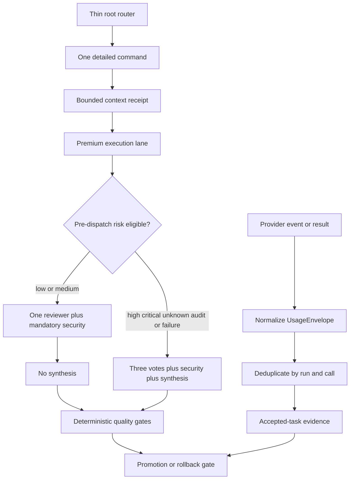

# SPEC-ADK-ULTRA-EFFICIENCY-001 Plan: Token-Efficient Ultra Quality Allocation

**Version**: 0.2.1
**Status**: completed
**Created**: 2026-07-11  
**Updated**: 2026-07-15
**Target module**: `autopus-adk/`
**Lifecycle implementation**: `true` for the completed plan/SPEC lifecycle; the terminal experiment receipts remain `implemented=false`

## Implementation Strategy

Implement the Outcome Lock in five ordered gates rather than changing every Ultra lever at once.

1. **Measurement gate**: introduce a versioned normalized usage type, preserve provider semantics through worker and orchestra execution, and expose accepted-task reports. No execution policy changes are allowed in this slice.
2. **Lossless prompt/context gate**: render thin root routers, select one detailed command contract, build bounded context receipts, and connect proactive typed pruning. Model tier and review depth remain unchanged while this slice is evaluated.
3. **Risk-bound review gate**: reuse conservative changed-path risk evidence, emit the complete route-team quality binding before dispatch, and select current full Ultra for high/critical/sensitive/unknown, audit, or binding-failure cases. Model, effort, implementation fan-out, retry, and deterministic gates do not change.
4. **Promotion gate**: compare paired accepted tasks, require actual coverage and zero high/critical regression, retain a full-depth audit sample, and fail open or roll back on any integrity failure.
5. **GPT/Codex operational evidence gate**: run the authorized paired cohort only through `auto agent run` and the worker Codex adapter, retain normalized actual usage without raw provider bodies, and prove fail-closed rollback before any `implemented` transition.

The implementation uses TDD. Each task begins with the concrete acceptance fixture mapped in `acceptance.md`. New source files are marked `[NEW]`; generated workflow and installed platform outputs are regenerated and inspected, never hand-edited.

## Visual Planning Brief



Command-flow summary:

```text
current: full router/context -> fixed Ultra depth -> estimated-only telemetry
target:  thin route -> scoped receipt -> risk-bound review -> full fallback -> actual paired evidence
```

## Feature Completion Scope

This Primary SPEC owns one outcome: measured minimum-sufficient Ultra allocation with the current high/critical contract preserved.

Mandatory completion slices:

- actual/null/estimated usage semantics and call-level aggregation;
- accepted-task denominator and raw-versus-billable reporting;
- thin Claude/Gemini root routing and detailed-command lazy loading, verified hermetically without requiring non-Codex live calls;
- bounded context receipts and prompt-layer invalidation evidence;
- complete GPT/Codex required-document snapshots outside the receipt metadata/optional-recall budget;
- proactive typed pruning connected to live worker phase transitions;
- conservative risk resolution and pre-dispatch route-team binding;
- security always, unknown/high/critical/audit full Ultra, unchanged implementation fan-out and effort;
- shadow, audit sample, paired promotion, and rollback receipts;
- generated parity, Balanced regression zero, and source ownership hygiene.

No sibling SPEC is created. The plan has 14 cohesive tasks under one module and does not cross the combined sibling threshold of more than 25 tasks and more than 40 source files. Provider-native caching, tool search, dashboard UX, within-run reviewer expansion, adaptive implementation fan-out, and effort tuning remain optional advisory work.

Completion Debt was operationally blocking after hermetic implementation passed. The exact GPT/Codex execution-path usage, paired canary, quality ledger, applied rollback, and replay receipts now exist in the full-evaluation v2 terminal chain, so CD-02/CD-03 and the Outcome Lock are resolved. Claude/Gemini live calls, live Claude `route_team` proof, and multi-provider consensus are not completion dependencies for v0.2.0. Existing non-Codex fixtures, fallback behavior, and generated-surface parity remain intact.

## GPT/Codex v0.2.0 Live Evidence Plan

### Scope and historical boundary

- New live calls use only `gpt-5.6-sol` through the Codex execution path.
- `evidence/live-canary-preflight-v1.json` remains immutable historical evidence of the earlier Claude `route_team` assumption. New GPT evidence supersedes it only for the current operational decision.
- Direct `codex exec` output is diagnostic, not canonical operational evidence. The accepted path is `auto agent run` → worker Codex adapter → provider actual usage → telemetry.
- Non-Codex implementation compatibility is tested hermetically. No Claude/Gemini live call or multi-provider consensus is scheduled.

The attempt and diagnosis subsections before **Full-Evaluation v2 Terminal Plan State** are chronological snapshots. Their time-local pending, blocked, `approved`, and `implemented=false` statements remain historical evidence and do not describe the current plan lifecycle.

### Frozen corpus and cohort

The frozen corpus hash is `sha256:a3454f01b734d3f72060bc9b93972032b908f88940960e7f7b0953ab7356958a`. All 12 deterministic target oracles must report PASS. The live cohort includes every low/medium task plus one high and one critical sentinel:

| Task | Risk/purpose | Pair order | Baseline calls | Candidate calls |
|---|---|---|---:|---:|
| `ute-corpus-v1-001` | low | AB | 5 | 2 |
| `ute-corpus-v1-004` | medium | BA | 5 | 2 |
| `ute-corpus-v1-005` | medium full-depth audit | AB | 5 | 5 |
| `ute-corpus-v1-011` | low | BA | 5 | 2 |
| `ute-corpus-v1-012` | medium | AB | 5 | 2 |
| `ute-corpus-v1-006` | high sentinel | BA | 5 | 5 |
| `ute-corpus-v1-009` | critical sentinel | AB | 5 | 5 |

The five excluded high-risk tasks remain unchanged full-profile cases. They are excluded from live calls only to stay within the explicit call/token authorization; their deterministic target oracles and full-profile source parity remain required.

### Role tuple and admission arithmetic

- Full: reviewer 1, reviewer 2, reviewer 3, and consolidator use Sol/`xhigh`; security uses Sol/`max`.
- Compact: reviewer uses Sol/`xhigh`; security uses Sol/`max`.
- Child calls never use `ultra`. Supervisor/orchestra Ultra parity remains a static contract.
- Baseline: `7 × 5 = 35` calls.
- Candidate: `4 × 2 + 3 × 5 = 23` calls.
- Primary: `35 + 23 = 58` calls, comprising 44 `xhigh` and 14 `max` calls.
- Per-call rollout budget: 22,000 raw tokens for `xhigh`, 26,000 for `max`.
- Primary worst case: `44 × 22,000 + 14 × 26,000 = 1,332,000` raw tokens.
- Applied rollback replay: five full-profile calls with four `xhigh` plus one `max`, or 114,000 raw tokens.
- Complete planned envelope: 63 calls and 1,446,000 raw tokens, leaving one call and 54,000 raw tokens below the authorization of 64 calls and 1,500,000 raw tokens. No 64th call is scheduled or admitted.
- Concurrency is one and retries are zero. Replay runs inside the pre-admitted hard envelope after all prior gates pass and the circuit breaker remains closed; observed underspend is not an admission condition.

### Evidence safety and circuit breaker

Each live invocation uses read-only sandboxing, ephemeral state, ignored user config/rules, skipped repository discovery, disabled tools and optional features, and a strict output schema. Raw prompts, raw responses, provider JSONL, credentials, and privileged paths are not retained. Persistent evidence is limited to normalized numeric usage, hashes, enums, allowlisted identities, verdict, and finding count.

Any tool event, non-PASS verdict, raw retention, missing actual usage, cap violation, or provider/model/effort/config/identity/schema ambiguity trips the circuit breaker. The call is not retried and the arm is ineligible for promotion.

### Outcome and activation boundary

The deterministic patch oracle, verification command, and deterministic security receipt are authoritative; GPT verdicts are supplementary. The quality ledger must contain seven of seven complete rows, the paired ledger must contain 14 complete trials, security must run on all tasks, and task `005` plus high/critical sentinels must retain full depth. Promotion requires zero regression, exact audit/security linkage, and a reported provisional median raw reduction of at least 25 percent. Fault injection must yield `ROLLBACK`, atomically restore an isolated binding to `full_ultra`, and pass readback. This plan does not activate any user config or repository policy. The later full-evaluation v2 terminal chain satisfied these evidence conditions and moved the plan/SPEC lifecycle to `completed`; it did not promote or activate the adaptive policy.

### First live attempt terminal decision

The first frozen primary attempt stopped at call 39 of 58 when task `ute-corpus-v1-006`, arm `B`, full-profile reviewer 1 at `xhigh` returned `FAIL` with one finding. The preceding 38 calls passed. The run recorded actual usage for 39 of 39 calls, 523,811 raw tokens, zero tool calls, zero retries, and no budget or identity violation. The circuit opened and the remaining 19 primary calls were not admitted.

The task `006` deterministic patch and test recheck passed, but the evidence contract does not allow that result to erase a supplementary GPT `FAIL`. The strict evaluator and rollback replay admission path both rejected the partial ledger; the replay rejection made zero provider calls. The terminal decision is `BLOCKED_NO_PROMOTION`, and the effective profile remains `full_ultra` with no candidate, user-config, or repository-policy activation.

The cumulative-authorization P1 is resolved by binding live execution to the canonical evidence output and an ignored atomic runtime claim. Reconciliation set the current policy hash to `CONSUMED_ON_RECONCILIATION`; actual canonical and noncanonical reuse probes were rejected with zero provider calls. The final diff-only review passed with open P0/P1/P2 counts of zero.

This attempt demonstrates the S25 fail-closed path. It does not satisfy the complete 58-call S24 evidence, the replay portion of S26, the seven-row quality and 14-trial S27 evidence, or the applied rollback replay. A future live run cannot continue from call 40; it requires a new frozen policy hash and explicit authorization.

| Evidence | SHA-256 |
|---|---|
| `evidence/gpt-primary-call-ledger-v1.partial-fail.json` | `sha256:f1b2fc2171af84464c6e5e7f39d5db62918480740d60abe4fabc93784987b582` |
| `evidence/gpt-primary-terminal-outcome-v1.json` | `sha256:29f0a73fe758e4b564870922269bce24297795e8ba3040f346fca610ef1007b8` |
| `evidence/gpt-authorization-closure-v1.json` | `sha256:bde1c49d7458f43a1cb9bfd478bd84991645b161d6b9f9e7794f042e2051bf42` |

### Task006 diagnostic-only follow-up

The approved follow-up was intentionally separate from T13 promotion evidence. Authorization `sha256:920e6370cebb84739872233cd4a0eeb88295bf816b19b6d43cfac99591a1dc20` covered task `006` arm `A` full5 followed by arm `B` full5: 10 calls, eight `xhigh`, two `max`, at most 228,000 raw tokens, concurrency one, zero retries, and no promotion. Policy hash `sha256:4a4b84f7087a5bf40aa0f5c3c2e883e29d235e80bf91c84c1186ec758248b12f` was new and single-use.

The implementation added a diagnostic-only bounded parser for `finding_code` and `scope_hash`; the primary strict parser remained unchanged. Operational failures remained fail-closed, while a valid bounded diagnostic finding was permitted to continue only within the diagnostic sequence and could not produce promotion eligibility.

Execution stopped on call 1 at task `006`, arm `A`, reviewer 1, `xhigh`, after `process_nonzero`. The ledger contains one attempted and observed call, zero actual-usage calls, zero raw tokens, zero tools, zero retries, and zero diagnostic findings. The deterministic patch and test recheck passed, but there is no admitted diagnostic response and therefore no diagnostic quality conclusion. The authorization is consumed; a same-authorization reuse probe was rejected with zero provider calls.

The P1 review fix moves the nonzero-process check ahead of telemetry discovery, receipt materialization, and `build_diag_row`. Future process failures persist only schedule identity and a sanitized failure stub, so unvalidated verdict, finding, usage, run, or call claims cannot enter a partial ledger. The existing diagnostic partial ledger remains immutable and is treated only as historical operational-failure evidence.

The P2 reuse receipt separately records exit code 1, zero sentinel invocations, zero provider calls, zero raw tokens, and identical runtime claim hashes before and after the probe. It verifies the consumed authorization without mutating the claim or the existing diagnostic evidence.

The diagnostic stage is blocked and incomplete. It leaves the primary terminal evidence, S24/S27 status, candidate activation, and `full_ultra` unchanged. Another attempt requires transport-failure diagnosis, a new frozen policy hash, and explicit authorization.

| Evidence | SHA-256 |
|---|---|
| `evidence/gpt-diagnostic-cohort-v1.json` | `sha256:d060fe3ae06e5ee063c66a57dc7b6a96bd9c929361e81ca2e26d48d333db0d9f` |
| `evidence/gpt-diagnostic-config-v1.json` | `sha256:bff64292fdf49343bde1a53d9d40ffbea0af5f338cd48385c2a2dc6d752e0565` |
| `evidence/gpt-diagnostic-policy-v1.json` | `sha256:4a4b84f7087a5bf40aa0f5c3c2e883e29d235e80bf91c84c1186ec758248b12f` |
| `evidence/gpt-diagnostic-verdict-schema-v1.json` | `sha256:d81f0205cbc02ac7af0d0897078041f765873ba287b8dfd2c0dd3e66f35ca605` |
| `evidence/gpt-diagnostic-preflight-v1.json` | `sha256:83d79efa72892605276746e114ce740113e97d5225dbf5b6ab4bd1519f4de552` |
| `evidence/gpt-diagnostic-call-ledger-v1.partial-fail.json` | `sha256:d0d3881e6fdad03c3289761a535f3f34f5603001c0d96af9c66acea840ac6ee0` |
| `evidence/gpt-diagnostic-terminal-outcome-v1.json` | `sha256:9869bbceea0a5ba2db05b48980f4cda44ede8dceda1e2325e678826155a13892` |
| `evidence/gpt-diagnostic-authorization-reuse-v1.json` | `sha256:340e59d8791403853d5d4281bb02b0cdb4fb2af5d1c01ecc5644f15719649ebd` |

### Task006 transport-only smoke follow-up

After the diagnostic transport failure, a new single-use authorization `sha256:7078b87735deb9026654c38ae04305ab8874099ad99c5b4ae37d9956e0232b27` admitted one task006 reviewer call at `xhigh`, capped at 22,000 raw tokens with concurrency one and retries zero. Its policy/config/schema hashes were `sha256:38b6ae94b0edf4c9cf09a505a5ff1b4f8cec17a478306cde99b95d9aec2411a3`, `sha256:9dd237bf913b7ac30d4002e733b8299c007f7cb1646a0c1020a9dbbdc1bc2e34`, and `sha256:61006491dddaadb43822608d10af5c3baa2e166950973dec95655ffd28003ced`.

The frozen binary was `0.50.68-ute-transport-smoke-v1`, SHA-256 `b90c7445ca8365ccf20ea044a4793f7f8bd16a4cd0f7385915b605e6493518d5`. The sole call terminated `process_nonzero`: attempted calls one, actual-usage calls zero, usage unavailable, observed raw tokens null, tool-call count null, and retries zero. The run therefore established neither transport success nor semantic quality.

The authorization is consumed. Semantic evaluation and promotion remain false, `implemented=false`, and `full_ultra` remains active. This transport-only step does not advance T13, S24, S27, or applied rollback. A new live attempt requires a new policy and explicit authorization.

| Evidence | SHA-256 |
|---|---|
| `evidence/gpt-transport-smoke-policy-v1.json` | `sha256:38b6ae94b0edf4c9cf09a505a5ff1b4f8cec17a478306cde99b95d9aec2411a3` |
| `evidence/gpt-transport-smoke-config-v1.json` | `sha256:9dd237bf913b7ac30d4002e733b8299c007f7cb1646a0c1020a9dbbdc1bc2e34` |
| `evidence/gpt-transport-smoke-schema-v1.json` | `sha256:61006491dddaadb43822608d10af5c3baa2e166950973dec95655ffd28003ced` |
| `evidence/gpt-transport-smoke-preflight-v1.json` | `sha256:d92a3cd44da58a7daff27a60245b6a4c6197c6b5d3cc6a1596384784237c90a4` |
| `evidence/gpt-transport-smoke-ledger-v1.partial-fail.json` | `sha256:eca927f2802b734336d5c34bd3833fb1a4385c93eff6f97a825bf153cbbe37c6` |
| `evidence/gpt-transport-smoke-terminal-outcome-v1.json` | `sha256:b92db43b32a9880b8e7e6987ba6398a50ccaef323f709beef698b07f6438f268` |

### Task006 transport diagnosis v2/v3 closure

Transport diagnosis v2 and v3 each used a newly frozen, single-use GPT/Codex policy for one task006 reviewer call at `xhigh`, capped at 22,000 raw tokens with concurrency one and retries zero.

| Run | Authorization and frozen identity | Runtime identity |
|---|---|---|
| v2 | Authorization `sha256:345523b25569eee5f691d3960c2caca0709aebcd324c7db103cb3c2b0ecf013f`; policy `sha256:e60cc741ea5a2abd0be0ba7e25d5d6c639fe9e2b0cd52c10dcb14ac1565b6cdc`; config `sha256:bdec20a7c73616afdcd5c70fa069f88a392a8da928bb90c8f4e192af657f5c80`; schema `sha256:0f77892d0472dedf2e6cdee5a9064e7e0798ad29e43769c87a00aff26f159306`; preflight `sha256:4e26043b3cc0ac3df8ff74a78f0616a48dacb99bc7041419f572bbc400ac8c04`; reservation `sha256:f0b4b4d3b6b40a0048ce245905b6884ac736cbb5161140cdb254cd94a05a83a5` | `0.50.68-ute-transport-diagnosis-v2`; executable `sha256:fc5bf47bb3db020876605d7450661e732817790ab9190895bd6f78726096360a` |
| v3 | Authorization `sha256:db4f738c9226c55e339d8e52e875ac7e7b3aefe4efdf0b0372066fcb325a1de9`; policy `sha256:b5c627569f95733511d10dda2c67b034e25f645fd292fe7b90f7bd1913180d07`; config `sha256:f05ca25b74cdd748d97919c31357cc3676cf15c1f41b53f830232fe070d56eb6`; schema `sha256:ab787a1b9581b76160ffc48b1c22659865caa250a5f20de4249fb0ec6b81ec8d`; preflight `sha256:18792e4bdc12ca1007d6ef275b2d02032f08a1e5ba674c03d81d22598a56f4f4`; reservation `sha256:28dff2e5d0507620bdedf93fdb1c3e2baa7f175f9f056f6bca80fcb14fb76f79` | `0.50.68-ute-transport-diagnosis-v3`; executable `sha256:9e118039a9e1027087b578935c410c43187d1e9ec583eb4258d6c223c9b770a5` |

Both authorizations are consumed and non-resumable. Both calls ended `process_nonzero` after one attempt with zero actual-usage calls, unavailable usage, null observed raw tokens, zero retries, operational-error class `unknown`, and fingerprint `sha256:e161c851c1a8c4fdea86c031ea524f1e0c7d39c7399eb950ea081fa8d90f0a42`. V3 carried provider-error detail capture, but no detail was classified and `failure_source_metadata_available=false`; no root cause can be promoted from the v3 record.

The implementation now emits raw-free `operational_error_stage` and `operational_error_signals`, with hermetic tests covering canonical signals and fail-closed rejection of invalid values. Because the immutable v3 ledger contains neither field, this hardening verifies the current implementation only and must not be used to rewrite the v3 diagnosis.

The planning gate therefore remains closed: status is `approved`, `implemented=false`, `full_ultra` remains active, and S24/S27 plus CD-02/CD-03 remain open. Do not schedule or admit the full 58-call primary plus 5-call replay until a transport-only run records Transport PASS. The next live action is a newly frozen GPT/Codex policy with explicit authorization; no Claude/Gemini live expansion is part of this plan.

| Evidence | SHA-256 |
|---|---|
| `evidence/gpt-transport-smoke-ledger-v2.partial-fail.json` | `sha256:3f5e76621709e9a77e222a317d34ebad664bbc1735c1f1ae2cec1f9fb2a51c6f` |
| `evidence/gpt-transport-smoke-terminal-outcome-v2.json` | `sha256:1723f7906b5e544fd9c7c3b7418bf9fd3522254e4d434da6987a34776a9c7196` |
| `evidence/gpt-transport-smoke-ledger-v3.partial-fail.json` | `sha256:32b0144aa61e34bad7b277390ac341e57f9cd0a2c1cefb9d240b45cd743735d8` |
| `evidence/gpt-transport-smoke-terminal-outcome-v3.json` | `sha256:ac0e928e43d1da5a4ed609e255ea2d67ef9361cbec27fa6fc42a5a96c518b23e` |

### Task006 transport diagnosis v4 live terminal closure

V4 received explicit live authorization for its frozen single GPT/Codex transport-only call. Authorization `sha256:11bc59a14df0ce2c77e44e28bf644b1a8e07d6d63825189b81988b1da51a1a03` is consumed after one use and cannot be resumed.

| Field | V4 terminal state |
|---|---|
| Evidence chain | Policy `sha256:a562141171b03e3ffc61aee968dc09a1760b1216448469d8db95788ec33654bf`; config `sha256:1dce4c89d3e52231bb1cdeb54c96f2a6bbf82004b1ac14e3fcabd7d2f1821711`; schema `sha256:a90b361e401497102d90b563082f38ff0a3600376dffdef9b4ebfe106ccb1421`; preflight `sha256:da363839a19dc63805e1f5574759a3eb1a1d6fcc73ea340e5a665cc6a19e78cb`; ledger `sha256:7fdd5f75b610e71fceabbb910b477b2d00ec838f02b048b0d073b3bb16d04383`; reservation `sha256:078042f1035b9b29051dff784bc7c456b5c534a39550b2e155c7411461ffd6e6`; terminal `sha256:27a2cae7b3470ab219153738dbf75d9d35a24c342ed88aae00e2b7bad2edad18`. |
| Runtime | Auto `0.50.68-ute-transport-diagnosis-v4`, executable `sha256:f7d4c12f354e3f8b106e68ada07286e658f888b32b3467f8a9b6137debd89bd9`; harness `sha256:9078eee0b022d5da750762942585d5189245d9b12eddc0dafb6b1e8ccadb5c42`; Codex `0.144.1`. |
| Execution | Task006 reviewer `xhigh`; attempted 1; retries 0; `process_nonzero`; actual-usage calls 0; raw tokens null; usage unavailable. |
| Failure metadata | Class `unknown`; fingerprint `sha256:e161c851c1a8c4fdea86c031ea524f1e0c7d39c7399eb950ea081fa8d90f0a42`; stage `process_wait`; signals `[provider_failure_event]`; stderr observed false; raw retention false. |

The signal narrows the source to a provider failure event, but there is no classified detail, root cause, Transport PASS, semantic evaluation, or promotion evidence. Keep SPEC `approved`, `implemented=false`, and `full_ultra` active; S24/S27 and CD-02/CD-03 stay open, and the 58+5 plan remains prohibited. Do not reuse v4. Any next live attempt requires a new frozen GPT/Codex policy and new explicit authorization; do not expand to Claude/Gemini live work.

### Task006 transport diagnosis v5 live terminal closure

V5 received explicit live authorization for its frozen single GPT/Codex transport-only call. Authorization `sha256:036f1f0534fddaf72897ea5062ebd5747c558a725a47fa0149fd8de033469a64` is consumed and cannot be resumed.

| Field | V5 terminal state |
|---|---|
| Evidence chain | Policy `sha256:49b57c44cfef9105dd93d92441b3c17c1d678cfb6b04527da2fec81c78388f19`; config `sha256:42b57ec9d7619263dd78cabff60570cdc7051203270625558b798a036428b074`; schema `sha256:2c6da9ba42f09487b4c7a8d1704e08133cbfe2b05ea7001101fea92a23994d6c`; authorized preflight `sha256:a3548711c44c3dc3b776cc38ef7460417795b9485dac9f70f2b5c37d998cea16`; ledger `sha256:df2f065ba9e0f5e9548e64e69eb92f36497f0a975da150abd28327ebaa30cc3a`; reservation `sha256:f4593e9e203e7b32ef9e8985fae944967827b64794c15b6c2e45be3f2c13294e`; terminal `sha256:40a7abef2e1d2d9da5477352b09277892b138b4ec17ceee68240189b2ec389a0`. |
| Runtime | Auto `0.50.68-ute-transport-diagnosis-v5`, executable `sha256:b4d67aac8b946f067c2df3c3656422647947a7ab28757d8bab0e671f9b620f37`; harness `sha256:82d0b30338fbc467d80b507411cf2bdd5e8cc7d3dd1f60de973bd4e2c4bb4e14`; Codex `0.144.1`. |
| Execution | Task006 reviewer `xhigh`; attempted 1; retries 0; `process_nonzero`; actual-usage calls 0; observed raw tokens null; usage unavailable. |
| Failure metadata | Class `unknown`; stage `process_wait`; signal `[provider_failure_event]`; kind `error_and_turn_failed`; shape `[top_level_message, nested_error_object, nested_error_message]`; values and raw sources not retained. |

The plan gains provider-event kind and field-presence evidence, not a classified root cause, Transport PASS, semantic evaluation, or promotion. Keep SPEC `approved`, `implemented=false`, and `full_ultra`; S24/S27 and CD-02/CD-03 stay open, and 58+5 remains prohibited. Do not reuse v5. Any next live attempt requires a new frozen GPT/Codex policy and new explicit authorization; do not expand to Claude/Gemini live work.

### Task006 transport diagnosis v6 terminal closure

Authorization `sha256:b956b634ab0664f276e9a6dfa09ce517b58b48055d0d7ed4df9136b3e69a6ea4` was explicitly granted and consumed by one GPT/Codex transport-only attempt. The process ended nonzero with no retry; the same authorization cannot be resumed or reused.

| Field | V6 terminal plan state |
|---|---|
| Evidence | Policy `sha256:d2da17f57fa900281d350a186dd7ed0e2aa6dcda9957c03df00e200eeca33495`; config `sha256:d88c97544931b2ac9b409100656220bf20da75b134a7208f348fa3bf49345e78`; schema `sha256:4d7a5cb92e32f45897a3a21adea0c638dd75893b109b2cb20205ba307379b986`; authorized preflight `sha256:c0eb6253943680908eaa1a9027469cf5ba6d5a44b631bee380b35c8b92fbb1b2`; partial ledger `sha256:f583d987fa793b98c89553c33789f8e8c88b4429546a341c8d09022b671d709f`; terminal outcome `sha256:35f76e17743874c7878f26743b6eacc75e201dbe0fc8897f23ee7b1f2a1e4905`. |
| Runtime | Auto `0.50.68-ute-transport-diagnosis-v6` at `sha256:083a42a0e2016d1d46b435a511027684c9752aa0a37bca9e70a939bc80ee02f4`; harness `sha256:4550f954dd178f904c31747012daffdc164a9d701c12270b720ddafb72ae27ff`; Codex `0.144.1`; reservation `sha256:d0a5acbe560f0a49e498ca46a452daf20701bb594c4e8cc78aa6192d742f5dfe`. |
| Observed result | Planned/attempted `1/1`, completed false, `process_nonzero`, usage unavailable, observed raw tokens `null`, stage `process_wait`, provider-failure-event signal. |
| Coarse diagnosis | `error` and `turn_failed` receipts both reduce to trait `schema_or_response`; no HTTP family is observed, no value or raw hash is retained, and no root cause is established. |
| Closure | Transport conclusion unavailable; semantic evaluation and promotion false; `full_ultra`, S24/S27, CD-02/CD-03, and the 58+5 prohibition unchanged. |

Do not retry or reuse v6. Provider-zero investigation may examine the structured-output/schema-response boundary, but it cannot infer the original message or choose a root cause from the coarse trait alone. Any further live diagnosis requires a separately frozen GPT/Codex policy, new identity, and explicit authorization; Claude/Gemini live scope remains excluded.

### Task006 Transport Diagnosis v7 Provider-Zero Frozen State

This subsection is the freeze-time historical snapshot from before the later v7 authorization and terminal run recorded below.

Provider-zero reconstruction confirms that v6 copied `gpt-transport-smoke-schema-v6.json` to runtime basename `gpt-diagnostic-verdict-schema-v1.json`. Its two arrays lacked `items`, contrary to the Structured Outputs contract, but no raw provider message survives; plan this only as `STRONG_HYPOTHESIS_NOT_CONFIRMED_ROOT_CAUSE`. The separate diagnostic schema v1 composition (`allOf`/`if`/`then`/`else`) was not v6 runtime content and must not be assigned as its cause.

| Field | V7 frozen plan state |
|---|---|
| Evidence | Policy `sha256:e03ab4a20c4c6cea4a82364d9f86b782556c800dcd4a78d875d3673095384d66`; config `sha256:d3c1a5747c3dc1626fad4e4636086eab32f94b54fa9ce2f479ed388965ee299d`; schema `sha256:ceedc01912682cbb2cf870a7e0cd00c7096f48449d9f8602e9e52d92449b94e4`; preflight `sha256:309fd921b8bee649b002cef7286c4f1dc576bdd6b07d7e165bdcafad2cb958bc`; authorization identity `sha256:fa56811f74e755711208878b2eb7e41db6071bb83e2208f8fd95024cb6d8d72a`. |
| Runtime | Auto `0.50.68-ute-transport-diagnosis-v7` at `sha256:10099d5ceb8aad68920e1ac4fd1aa8204dd2ec9c29d23f7b09303bc5d6306d69`; harness `sha256:ba9330911d8f34d72e5e868c7baf2236ede22b9f1bd4c0a411bcaa2ce86a8f50`; Codex `0.144.1`. |
| Schema and postcondition | Root object with required `verdict`, `finding_count`, `finding_codes`, and `finding_scope_hashes`; `additionalProperties:false`; verdict enum `PASS`; finding-count enum `0`; string `items` for both arrays; no `$schema`, `$id`, `const`, `maxItems`, `minItems`, `uniqueItems`, `pattern`, or composition. Local postvalidation requires PASS/count 0/empty arrays. |
| Admission gates | The exact schema and actual runtime-copy hash are checked before claim creation. Missing `items`, `allOf`, missing required fields, and `additionalProperties:true` are rejected at provider/Auto/claim `0/0/0`; approval-pending is also `0/0/0`; fake success/failure, v1-v6 regressions, raw-free receipts, and frozen evidence immutability pass. |
| Freeze-time decision | `AWAITING_EXPLICIT_LIVE_AUTHORIZATION`; provider receipt false; the preflight-only spend was 0 calls/0 raw tokens; no provider execution or claim existed. |

At freeze time, the next action was exact-identity authorization. The later exact `실행승인` satisfied only that admission gate and did not satisfy Transport, semantic, promotion, or completion gates.

### Task006 Transport Diagnosis v7 Terminal State

The exact `실행승인` bound identity `sha256:fa56811f74e755711208878b2eb7e41db6071bb83e2208f8fd95024cb6d8d72a` at `2026-07-15T11:42:07+09:00`. One GPT/Codex transport-only attempt consumed the single-use authorization; it is non-resumable and must not be retried or reused.

| Field | V7 terminal plan state |
|---|---|
| Evidence | Policy `sha256:e03ab4a20c4c6cea4a82364d9f86b782556c800dcd4a78d875d3673095384d66`; config `sha256:d3c1a5747c3dc1626fad4e4636086eab32f94b54fa9ce2f479ed388965ee299d`; schema `sha256:ceedc01912682cbb2cf870a7e0cd00c7096f48449d9f8602e9e52d92449b94e4`; authorized preflight `sha256:33b1a1a266d722a32fd40abe93d9878c656e022f58a6b40e5726676cf651c4ab`; reservation `sha256:3a3939b2373d3335c1612e048a847db12bae3c5436430f487f715c1c0698f4cb`; partial ledger `sha256:a614cf254c02bbbe178f3b818cf50eae34b8191d3251db7834ae85aac185b73f`; terminal `sha256:9e6db74077d64d72b515497a640b21891e7d65cd3780a505d2ca1800cb19f0f6`. |
| Execution | Planned/attempted `1/1`, retries 0, exit 1, `missing_or_invalid_result`, completed false. |
| Usage boundary | Actual-usage calls 0, observed raw tokens `null`, usage unavailable. This is not zero-usage or zero-cost evidence. |
| Receipt boundary | Operational class/fingerprint/stage are `null`; serialized signals/events are empty; event/stderr observation and operational receipt classification are unavailable; canonical result and usage receipts are false. Do not infer provider-event or stderr absence. |
| Closure | Transport conclusion unavailable, root cause unclassified, semantic false, promotion false; `full_ultra`, S24/S27, CD-02/CD-03, and the 58+5 prohibition unchanged. |

The v7 terminal result proves neither success nor failure of the schema fix, and v6 missing `items` remains a strong unconfirmed hypothesis. Any future live diagnosis must freeze a new policy/config/schema identity and receive separate explicit authorization. SPEC remains `approved`, `implemented=false`, and `full_ultra`; scope remains GPT/Codex-only with no Claude/Gemini live expansion.

### Task006 Transport Diagnosis v8 Provider-Zero Frozen State

This subsection is the freeze-time historical snapshot from before the later v8 authorization and terminal PASS recorded below.

The provider-zero caller/shared-contract RED reproduced `missing_or_invalid_result`: Auto's YAML `omitempty` may omit empty PASS `finding_codes` and `finding_scope_hashes`, while the smoke consumer required explicit `[]`. Historical v7 raw/result data was not retained, so planning classifies this as `LOCALLY_REPRODUCED_HISTORICAL_RESULT_NOT_RETAINED`, not a confirmed exact historical cause.

| Field | V8 frozen plan state |
|---|---|
| Evidence | Policy `sha256:a8452ea635e09298b71044a00dddef02b13ac7073f828e4cf902add6d8a6b845`; config `sha256:2d714d493ca29d9b1bcea87dfd96e8cef0e1278edd5e34bf15053e9430fc3f39`; schema `sha256:ceedc01912682cbb2cf870a7e0cd00c7096f48449d9f8602e9e52d92449b94e4`; preflight `sha256:66c05018a7edfec0d773ada618566dffb3f71dcb66ed6a6c64a9c114f0f64c7a`; authorization identity `sha256:c524d53a9b12d84457ee2ad44c7149c31648c35227ef066f938467af8a74945a`. |
| Runtime | Auto `0.50.68-ute-transport-diagnosis-v8` at `sha256:5744f2c4190a1f557320bd6f8034dd809e88bec626b237df1dd8d403fdc148f8`; harness `sha256:3caf3539135f03c1b613b7bf0468674736520d8a841961822f5ae1131814c8c8`; Codex `0.144.1`. |
| Change | Consumer accepts `((has("finding_codes") | not) or .finding_codes == [])` and the equivalent scope-hash check: missing keys normalize to empty, while explicit `null` and nonempty findings remain invalid. |
| Gates | RED→GREEN, including RED null accepted → GREEN null rejected; explicit-empty and omitted-empty success PASS; null/nonempty findings reject; sanitized failure PASS; generic/v6/v7 regressions PASS; 130 frozen v1-v7 evidence files immutable. |
| Freeze-time decision | `AWAITING_EXPLICIT_LIVE_AUTHORIZATION`; provider receipt false; provider/Auto/claim was `0/0/0`; raw-token count 0 was preflight-only. |

At freeze time, v8 required its own exact authorization. The later authorization satisfied that transport-only admission and was consumed by the terminal run below.

### Task006 Transport Diagnosis v8 Terminal State

Exact v8 identity `sha256:c524d53a9b12d84457ee2ad44c7149c31648c35227ef066f938467af8a74945a` was authorized at `2026-07-15T12:48:10+09:00`, consumed once, and is non-resumable.

| Field | V8 terminal plan state |
|---|---|
| Evidence | Policy `sha256:a8452ea635e09298b71044a00dddef02b13ac7073f828e4cf902add6d8a6b845`; config `sha256:2d714d493ca29d9b1bcea87dfd96e8cef0e1278edd5e34bf15053e9430fc3f39`; schema `sha256:ceedc01912682cbb2cf870a7e0cd00c7096f48449d9f8602e9e52d92449b94e4`; authorized preflight `sha256:76fa7e15ea7114428d74ef9520a7055778c361ea4f702e69c8cabd2e89a76353`; ledger `sha256:f81df2cc4b083d2649bcd948328003a434411a394aea98a82aa095ee86e6593d`; reservation `sha256:b300d143c097ed6bcc4f3af61304ad39e78e611a33db189cbd8cf66c77824142`; terminal `sha256:13f31960752167111bc202899721f67e05b3c3d6da5c71372f778bfe65776792`. |
| Runtime | Auto `0.50.68-ute-transport-diagnosis-v8` at `sha256:5744f2c4190a1f557320bd6f8034dd809e88bec626b237df1dd8d403fdc148f8`; harness `sha256:3caf3539135f03c1b613b7bf0468674736520d8a841961822f5ae1131814c8c8`; Codex `0.144.1`. |
| Result | `TRANSPORT_DIAGNOSIS_TERMINAL_PASS`, completed true, planned/attempted `1/1`, actual usage `1`, raw tokens `16094/22000`, unique model calls 1, tools 0, retries 0, schema conformance PASS. |
| Retention and diagnosis | No partial ledger or raw runtime files remain. Missing-key normalization was not observed/retained live, and exact v7 historical cause remains unclassified. |
| Gate effect | Transport prerequisite is satisfied; semantic false, promotion false, `implemented=false`, `full_ultra`, S24/S27, and CD-02/CD-03 are unchanged. |

Do not retry or reuse v8. The separately frozen full-evaluation admission below supersedes only the missing admission artifact, not the explicit-authorization or live-evidence gates. Preserve GPT/Codex-only scope and do not add Claude/Gemini live work.

### Full-Evaluation v2 Provider-Zero Admission Checkpoint

The separate v2 admission is frozen at exact identity `sha256:129521ff443c4ec01bc71cbb621c1dd3d515d5f460130a16732bf639b52e4978`. Its source chain is full17 `sha256:9c449510ae7918f2d066119cfc2374739e4ae7e83100321645c0c79710afc626`; the pre-source admission subset is admission9 `sha256:45711d43d420414be3ec462155542d9eeb0d4dd5d36daec9dee1ae801bd616ab`. The exact runtime remains frozen Auto v8 plus Codex 0.144.1.

This subsection records the historical freeze-time state before exact authorization. The terminal subsection below supersedes its pending-state cells for the current plan lifecycle.

| Gate | Current result | Next required step |
|---|---|---|
| Static freeze | PASS: 8 JSON + 8 sidecars, 142 prior artifacts, no absolute paths, deterministic 12/12. | Preserve bytes and sidecars. |
| Admission hardening | PASS: full17 before source and at phase/call boundaries; generation-specific single-use primary and nested replay reservations. | Do not create authorization or reservations until exact identity binding. |
| Evaluator hardening | PASS: exact14 manifest, task005 isolated audit, high006/critical009 experiment identity and digest, quality/security/aggregate hash binding. | Run only after a complete 58-call primary. |
| Replay/finalizer hardening | PASS: applied rollback, evaluator summary, nested reservation, replay ledger, terminal, and closure are transitively and directly linked. | Run replay only after evaluator eligibility, then run the provider-zero finalizer. |
| Regression and review | v2 admission/evidence suites, v1 canary/evidence suites, shell gates, focused Go tests PASS; Guardian P0/P1 `0/0`. | Preserve the reviewed full17 bytes. |
| Live authorization | Pending; provider/authorization/reservation/claim/dynamic counts are `0/0/0/0/0`. | Obtain separate explicit authorization bound to the exact identity and envelope. |

The only permitted live order after exact authorization is `primary 58 → provider-zero evaluator → gated replay 5 → provider-zero finalizer`. The primary worst case is 1,332,000 raw tokens; replay is 114,000; planned total is 63 calls and 1,446,000 raw tokens under caps of 64 and 1,500,000, with concurrency one and no retry. The unscheduled 64th slot is safety margin, not an admissible call.

### Full-Evaluation v2 Terminal Plan State

Exact identity `sha256:129521ff443c4ec01bc71cbb621c1dd3d515d5f460130a16732bf639b52e4978` received explicit single-use authorization at `2026-07-15T17:27:52+09:00`. The supervisor executed the only permitted sequence with concurrency one and zero retries.

| Gate | Terminal result |
|---|---|
| Authorization | Authorization `sha256:875d17bf450b78fa656263f7f5676cd56b36d5ea33748e34d9f81efa861ac677`; primary reservation `sha256:bd733533ab255957154e2b31cd905c165c6f0c9719671ace7909116a620e648e`; caps 64 calls and 1,500,000 raw tokens; concurrency 1; retries 0. |
| Primary 58 | 58/58 PASS; baseline/candidate `35/23`; efforts `44 xhigh / 14 max`; actual raw tokens 1,071,031; tools, modified files, and retries all 0. Historical v1 call-39 failure boundary task006 passed in the new v2 generation. |
| Provider-zero evaluation | Builder/evaluator provider calls 0; exact14 security/quality evidence; quality 7/7 and security 14/14; measurement and neutrality PASS; median paired reduction 59.918%; high/critical regressions 0; rollout decision `ELIGIBLE_NEXT_CANARY`. |
| Applied rollback | `ROLLBACK` was applied atomically and read back as `full_ultra`; receipt `sha256:a00bed018f5c5f4482fcec2dacdd5a07c82f43e5e936ecf27e7042fe9d482def`. |
| Replay 5 | Nested reservation `sha256:032eec05a180733e14a0fccf0f375869b74c490010e799d5e5ddba2bbfec4edb`; 5/5 PASS; efforts `4 xhigh / 1 max`; actual raw tokens 90,735; tools, modified files, and retries all 0. |
| Combined terminal | 63 calls and 1,161,766 raw tokens, 338,234 below the raw cap; terminal `sha256:982863631858aad2a8eafc8eec4aa23218cf66b83110aed340fceb590098f376`; closure `sha256:a2e7af9b2fee116318316864fcae4802da53ec2843f4b648ab15c8523d8ade7c`; authorization consumed and non-reusable; raw retained false; exact full-evaluation partial ledgers 0. |
| Guardian gate | P0/P1 `0/0`; S24/S26/S27 PASS; CD-02/CD-03 resolved; blockers 0. |

The terminal decision completes the evidence plan and permits the plan/SPEC lifecycle to record `implemented=true`. It does not activate the experiment. Terminal and closure fields remain `promotion_eligible=false`, `activation_eligible=false`, and `implemented=false`; the effective profile remains `full_ultra`, and user configuration and repository policy remain unchanged.

#### Full-evaluation v2 terminal evidence index

| Evidence | SHA-256 |
|---|---|
| `evidence/gpt-full-evaluation-identity-v2.json` | `sha256:129521ff443c4ec01bc71cbb621c1dd3d515d5f460130a16732bf639b52e4978` |
| `evidence/gpt-full-evaluation-authorization-v2.json` | `sha256:875d17bf450b78fa656263f7f5676cd56b36d5ea33748e34d9f81efa861ac677` |
| `evidence/gpt-full-evaluation-reservation-v2.json` | `sha256:bd733533ab255957154e2b31cd905c165c6f0c9719671ace7909116a620e648e` |
| `evidence/gpt-primary-call-ledger-v2.json` | `sha256:a8ceed2ebceae72bb120c84ecc6ace10e6ee0c2f4678c3eaa340ab86a3602aab` |
| `evidence/gpt-primary-evaluation-summary-v2.json` | `sha256:7ee81e2bf2f71ebc5d9a09471aa8b1f4b1e5513c0b69d60dfc161aff9a064f4e` |
| `evidence/gpt-applied-rollback-v2.json` | `sha256:a00bed018f5c5f4482fcec2dacdd5a07c82f43e5e936ecf27e7042fe9d482def` |
| `evidence/gpt-rollback-reservation-v2.json` | `sha256:032eec05a180733e14a0fccf0f375869b74c490010e799d5e5ddba2bbfec4edb` |
| `evidence/gpt-rollback-call-ledger-v2.json` | `sha256:e3b3dd78cbffa28419b6f9eabd88a11799370959400083b5322e62979cfeeba5` |
| `evidence/gpt-full-evaluation-terminal-outcome-v2.json` | `sha256:982863631858aad2a8eafc8eec4aa23218cf66b83110aed340fceb590098f376` |
| `evidence/gpt-full-evaluation-authorization-closure-v2.json` | `sha256:a2e7af9b2fee116318316864fcae4802da53ec2843f4b648ab15c8523d8ade7c` |

## v0.2.1 GPT/Codex Context-Integrity Amendment Plan

This amendment hardens only GPT/Codex context delivery. The completed v0.2.0 live evidence, policy-promotion and activation decisions, and effective `full_ultra` outcome remain unchanged.

| Plan surface | Completed behavior |
|---|---|
| Receipt budget | The 800–2,000-token envelope contains handoff metadata and optional recall only. Complete required-document bodies are outside the envelope, and only optional recall may be omitted. |
| Required profiles | `go` freezes full `spec.md`, `plan.md`, and `acceptance.md`. Complete `spec.md`, `plan.md`, `research.md`, and `acceptance.md` review admission activates only when the selected provider set is entirely GPT/Codex; mixed, Claude, and Gemini review retain legacy prompt behavior. Available architecture documents and declared task-specific references join each applicable snapshot. No required body is trimmed, summarized, or dropped. |
| Integrity manifest | Every required `spec.md` metadata ID matches its containing SPEC directory. Raw secrets are redacted and prompt-injection directives are neutralized without losing surrounding evidence; `source_hash` binds raw source bytes and `prompt_hash` binds sanitized delivered bytes alongside redaction state, token estimate, and `complete=true`. Serialized `ContextDeliveryResult` omits in-process prompt, layers, and document bodies. Verification rebuilds from the supervisor-held command, SPEC, conditional profiles, and exact extra-reference set so omission or replay cannot self-validate. |
| Admission | Missing, empty, unreadable, stale, directory-ID-mismatched, wrong-SPEC, incomplete, omitted-reference, replayed, reference-set-mismatched, or hash-mismatched context returns `context_integrity_failed` before compact selection or provider execution and retains `full_ultra`; verified input above 128K blocks or splits. |
| Codex continuity | One snapshot identity is built from the final assigned worktree, then reused by direct execution, every pipeline phase, and concurrent all-GPT/Codex review fan-out rather than rereading per phase or reviewer. Actual all-GPT `auto spec review` rebuilds and verifies delivery on every revision from supervisor-held `--required-document` and `--conditional-profile` sets, then consumes the verified in-memory snapshot so core, available architecture, conditional, extra, and SPEC bodies appear once. The original task appears once in the first phase and once after each later transition. Generated guidance uses `spawn_agent(task_name, fork_turns="all", message)` and requests `context_ack` diagnostically; supervisor-held reference/hash verification is authoritative. |

## File Impact Analysis

### Usage schema, aggregation, and reports

| Path | Action | Purpose |
|---|---|---|
| `[NEW] pkg/telemetry/usage.go` | Add | Define versioned `UsageEnvelope`, nullable components, inclusion semantics, status/source/reason codes, and safe raw-usage metadata. |
| `[NEW] pkg/telemetry/usage_aggregate.go` | Add | Provide stateless deterministic deduplication and aggregation over immutable usage inputs; concurrent persistence remains the recorder's responsibility. |
| `[NEW] pkg/telemetry/usage_test.go` | Add | Exact OpenAI/Anthropic/unavailable/cache arithmetic and conflict fixtures. |
| `pkg/telemetry/types.go` | Modify | Add provider/model/effort/attempt/tool-call and UsageEnvelope fields while preserving `EstimatedTokens`. |
| `pkg/telemetry/reporter.go` | Modify | Render actual coverage, raw totals, accepted denominator, and unavailable reasons. |
| `pkg/telemetry/{types,recorder,reader,reporter}_test.go` | Modify | Prove legacy JSONL compatibility and additive reporting. |
| `internal/cli/telemetry.go` | Modify | Register accepted-task comparison and promotion evidence output without breaking existing commands. |
| `internal/cli/telemetry_{record,resolve,json}.go` | Modify | Persist and expose normalized usage, run/arm identity, objective status, and warnings. |
| `[NEW] internal/cli/telemetry_efficiency.go` | Add | Produce paired evidence, provisional target status, quality gate, and rollback reason codes. |
| `internal/cli/telemetry*_test.go` | Modify/Add | Assert human/JSON formula parity, null handling, accepted denominator, and comparison warnings. |

### Provider and execution propagation

| Path | Action | Purpose |
|---|---|---|
| `pkg/worker/adapter/interface.go` | Modify | Carry usage metadata on stream events and task results without changing prompt bodies. |
| `pkg/worker/adapter/{claude,codex,gemini}.go` | Modify | Parse provider-specific usage when exposed and mark cost-only/unavailable otherwise. |
| `pkg/worker/adapter/{claude,codex,gemini}_test.go` | Modify | Add provider fixture oracles, including Codex `turn.completed` propagation and plain Gemini unavailable handling. |
| `pkg/worker/adapter/result_merge.go` | Modify | Merge multiline output and usage independently without dropping or duplicating call receipts. |
| `pkg/worker/adapter/result_merge_test.go` | Modify | Prove distinct call aggregation and identical-call dedup behavior. |
| `pkg/worker/pipeline.go` | Modify | Carry phase usage/tool calls into aggregate task results and install the production compressor. |
| `pkg/worker/pipeline_phase.go` | Modify | Accumulate usage from non-result events and result envelopes while preserving phase identity. |
| `pkg/worker/loop_subprocess.go` | Modify | Preserve usage across live worker event streams and retries. |
| `internal/cli/agent_run_exec.go` | Modify | Return normalized usage from direct agent runs instead of discarding non-result usage events. |
| `pkg/orchestra/types.go` | Modify | Add usage and execution-path capability metadata to `ProviderResponse`, `OrchestraResult`, and serializable summaries. |
| `pkg/orchestra/crosspolinate.go` | Modify | Preserve usage on `ProviderResult` so subprocess pipeline rounds do not discard it. |
| `pkg/orchestra/{provider_runner,subprocess_runner}.go` | Modify | Parse usage from raw stdout before `applyCodexLastMessageOutput` replaces it, then retain the final human-readable output separately. |
| `pkg/orchestra/{pipeline,hook_watcher,pane_backend_collect}.go` | Modify | Carry usage through provider results, rounds, final results, and yields or mark pane/hook paths explicitly unavailable. |
| `[NEW] pkg/orchestra/usage_test.go` | Add | Verify provider path capability, no raw prompt retention, and round aggregation. |

### Thin routing and bounded context

| Path | Action | Purpose |
|---|---|---|
| `templates/claude/commands/auto-router.md.tmpl` | Modify | Reduce to route parsing, common safety/language rules, context profile selection, and one detailed-skill handoff. |
| `[NEW] templates/claude/commands/auto-workflows.md.tmpl` | Add | Preserve the current monolithic subcommand semantics as generation-only source that is never installed as the root router. |
| `[NEW] pkg/adapter/claude/claude_workflow_skills.go` | Add | Deterministically split and render one `.claude/skills/autopus/auto-<subcommand>.md` detail per frozen route. |
| `pkg/adapter/claude/{claude_files,claude_prepare_files}.go` | Modify | Render generated detailed Claude auto skills and the thin root skill through one route inventory. |
| `[NEW] pkg/adapter/claude/claude_workflow_skills_test.go` | Add | Assert every route has exactly one detail and the generation-only source is not installed as root context. |
| `pkg/adapter/claude/{claude_router,claude_workspace_context}_test.go` | Modify | Assert complete route coverage, one selected detail, 8,192-byte root budget, and scoped context. |
| `templates/gemini/commands/auto-router.md.tmpl` | Modify | Make the Gemini root router route-only and use existing detailed skills or bounded extracted detail sources. |
| `[NEW] templates/gemini/skills/{auto-dev,auto-doctor,auto-goal,auto-map,auto-secure,auto-setup,auto-status,auto-test,auto-update,auto-verify,auto-why}/SKILL.md.tmpl` | Add | Fill the frozen Gemini route-inventory gaps with bounded detailed contracts; existing eight auto details remain canonical for their routes. |
| `templates/codex/skills/auto-*.md.tmpl` | Modify | Align shared/Codex detailed command context profiles without expanding the already-thin Codex router. |
| `content/skills/agent-pipeline.md` | Modify | Require scoped receipt metadata plus verified full required-document snapshots in worker contracts, while forbidding repeated relay of optional artifact bodies. |
| `pkg/memindex/{types,context}.go` | Verify | Reuse `ContextResult`, including budget, selected prompt, source refs/hashes, and omitted count; do not create a second receipt type. |
| `pkg/promptlayer/layer.go` | Verify/Modify | Reuse stable/snapshot/ephemeral ordering and expose receipt hashes without claiming provider cache hits. |
| `[NEW] pkg/adapter/claude/router_budget_test.go` | Add | Generate a realistic full-mode root and enforce route coverage plus byte-size budget. |
| `pkg/adapter/{codex,gemini,opencode}/**/*surface*_test.go` | Modify | Verify detailed-skill policy parity and generated-source ownership. |

### Proactive pruning

| Path | Action | Purpose |
|---|---|---|
| `pkg/worker/compress/compressor.go` | Modify | Run typed soft pruning before hard summarization when completed stale pairs meet the soft policy. |
| `pkg/worker/compress/events.go` | Modify | Distinguish soft prune and hard compaction while preserving reason/source metadata. |
| `pkg/worker/compress/pruner.go` and `tool_pairs_*.go` | Verify/Modify | Preserve failures, incomplete pairs, protected sections, and recent evidence. |
| `pkg/worker/compress/*_test.go` | Modify | Add exact pruned-pair counts, protected-content, digest/reference, and secret/path redaction oracles. |
| `pkg/worker/loop_exec.go` | Modify | Install `NewDefaultCompressor` on production phase-split execution. |

### Conservative risk and pre-dispatch team binding

| Path | Action | Purpose |
|---|---|---|
| `internal/cli/review_risk_tier.go` | Modify | Reuse existing path and sensitive-domain rules while distinguishing trustworthy empty input from changed-file discovery failure. |
| `[NEW] internal/cli/workflow_binding.go` | Add | Expose `auto workflow binding` JSON that combines risk resolution with the complete canonical quality binding and full-depth audit override. |
| `[NEW] internal/cli/workflow_binding_test.go` | Add | Cover low/medium compact binding, high/critical/sensitive/unknown full binding, deterministic audit, and malformed or discovery-failure fallback. |
| `internal/cli/workflow.go` | Modify | Register the binding command and keep existing doctor/render/gate/merge behavior. |
| `internal/cli/workflow_quality_binding.go` | Modify | Override only `review.verify_votes` and `review.synthesis`; preserve all phase model/effort values and `implementation.fan_out_cap`. |
| `internal/cli/{workflow_quality_binding,workflow_render}_test.go` | Modify | Prove bare phase-map serialization, canonical profile parity, fan-out parity, and exact review-depth differences. |
| `pkg/workflow/{binding,depth}.go` | Verify | Reuse the current binding and depth types; do not create a second risk or adaptive-review abstraction. |
| `content/workflows/route_team.{md,schema.json}` | Verify | Keep the existing runtime-overridable review fields, security call, fan-out cap, retries, and gate structure. |
| `pkg/content/workflow_generate_team.go` and parity/launch tests | Verify | Confirm the existing generator consumes `verify_votes` and `synthesis`; do not add dynamic result-driven calls. |
| `templates/claude/workflows/route_team.workflow.js.tmpl` | Verify | Generated surface only; no source change is expected for static risk binding. |
| `templates/claude/commands/auto-workflows.md.tmpl` | Modify in T9 | Make the generated auto-go detail call the binding command and pass its bare phase map into route-team workflow args. |

## Architecture Considerations

### Dependency direction

- `pkg/telemetry` remains provider-neutral and imports only standard or lower-level utility code.
- Worker adapters and orchestra responses may depend on `pkg/telemetry`; telemetry must not import worker or orchestra packages.
- `pkg/workflow` remains pure and must not import `internal/cli` or `pkg/content`; no new risk abstraction is added there.
- CLI dispatch owns quality/model/effort, changed-repository evidence, risk resolution, and audit selection; it passes only the existing bare phase map into workflow runtime arguments.
- `pkg/content` owns deterministic generation from `content/workflows` source manifests.
- Installed `.claude/**`, `.codex/**`, `.gemini/**`, `.opencode/**`, and generated workflow JS remain downstream outputs.

### Trust boundaries

- Provider outputs and usage fragments are untrusted input.
- Persist only allowlisted numeric usage, identifiers, schema/version, and sanitized reason metadata.
- Do not store prompt, full response, secret, credential, token value, or privileged absolute path in usage receipts.
- Missing or malformed risk/binding evidence fails open to full Ultra; ambiguous provider inclusion semantics blocks the metric.
- Context receipt cells and artifact references do not override stable policy.

### Usage persistence boundary

- Provider adapters, worker results, and orchestra results are transport surfaces; they return `UsageEnvelope` values and do not write telemetry by themselves.
- `auto telemetry record --action agent --usage-json usage-envelope.json` is the single persistence bridge. The supervisor or worker loop that owns SPEC, phase, task, attempt, run, and call identity invokes it exactly once after result aggregation.
- Native pane or workflow-agent paths that cannot expose a trustworthy receipt record `usage_status=unavailable` and cannot satisfy the 95% promotion gate. They are not silently estimated.

### Prompt-state contract

- **Stable**: language/safety/workflow rules, route table, detailed command instructions, tool schemas.
- **Snapshot**: selected workspace policy, relevant SPEC/acceptance, bounded recall, ownership, file/symbol references.
- **Ephemeral**: latest user request, current diff evidence, provider output, retry and review state.

Only a stable-source change invalidates the stable manifest. Selecting a different task or receipt changes snapshot/ephemeral hashes without rewriting unrelated stable content.

### Formula contract

```text
raw_total_tokens =
  input_tokens_total
  + output_tokens_total
  + reasoning_tokens only when reasoning is declared separate
  + tool_tokens only when tool tokens are declared separate

raw_total_tokens_per_accepted_task =
  all eligible attempt raw tokens in the arm
  / distinct final accepted task count
```

Cached input is already part of inclusive input. Reasoning that is a subset of output is already part of inclusive output. Missing or ambiguous inclusion metadata yields null rather than a guessed total.

## Tasks

### T1 — Define the normalized usage contract

- [x] Add tests for OpenAI-inclusive, Anthropic-breakdown, cost-only, estimated, unavailable, separate-reasoning, and ambiguous-subset fixtures.
- [x] Add UsageEnvelope, stable reason/source literals, nullable fields, sanitized provenance, and deterministic aggregation helpers.
- [x] Keep aggregation stateless and race-safe for concurrent caller snapshots; exercise concurrent recorder writes under `go test -race`.
- [x] Preserve legacy `EstimatedTokens` decoding and label estimates separately.
- **Covers**: REQ-UTE-USAGE-01 through REQ-UTE-USAGE-03; S1–S3.

### T2 — Capture usage in worker adapters

- [x] Parse usage from every supported Claude result and Codex completion event without losing the final message.
- [x] Mark plain Gemini or unsupported schemas as cost-only or unavailable.
- [x] Aggregate usage from non-result and result events with stable run/call identity.
- [x] Add provider fixture and redaction tests.
- **Covers**: REQ-UTE-USAGE-01 through REQ-UTE-USAGE-04; S1–S4.

### T3 — Propagate usage through worker telemetry and reports

- [x] Carry usage, tool calls, phase, role, attempt, model, and effort through phase and task aggregation.
- [x] Extend `auto telemetry record --action agent` with a validated `--usage-json` file bridge; keep adapters and orchestra recorder-neutral.
- [x] Make the owning worker/supervisor call the bridge exactly once with SPEC, phase, task, attempt, run, and call identity, then extend reader, summary, cost, compare, and JSON output additively.
- [x] Implement accepted-task denominator, zero-accepted null, failed-spend, actual-coverage, and conflict reporting.
- [x] Prove old JSONL fixtures still load.
- **Covers**: REQ-UTE-USAGE-04 through REQ-UTE-USAGE-06; S4–S6.

### T4 — Capture orchestra execution-path usage

- [x] Add UsageEnvelope and capability metadata to provider responses, round history, yield/session serialization, and failure paths.
- [x] Parse allowlisted usage from raw subprocess stdout before Codex last-message replacement and keep usage independent from displayed output.
- [x] Carry usage through `ProviderResponse`, `ProviderResult`, round history, pipeline reconstruction, and `OrchestraResult`; mark pane/hook paths explicitly when unavailable.
- [x] Deduplicate repeated round/result receipts and retain provider failure status.
- **Covers**: REQ-UTE-USAGE-01 through REQ-UTE-USAGE-05; S2–S5.

### T5 — Render thin root routers and lazy command details

- [x] Freeze current route inventory and mandatory common policy tokens in tests.
- [x] Move Claude detailed command bodies into one generation-only source and deterministically render one detail per route.
- [x] Fill only the eleven missing Gemini detailed routes and preserve the existing eight route details.
- [x] Make Claude and Gemini roots route-only and no larger than 8,192 bytes.
- [x] Align detailed context-profile contracts across Claude, Gemini, Codex, and shared/OpenCode surfaces.
- [x] Generate into temporary roots and assert one selected detail, route coverage, size, and source ownership.
- [x] Fail the size gate instead of relaxing 8,192 bytes when common policy grows; move overflow detail behind the selected route.
- **Covers**: REQ-UTE-ROUTER-01; S7.

### T6 — Build bounded context receipts

- [x] Define `core`, `architecture`, `test`, `canary`, `signature`, and `learning` context profiles.
- [x] Select a receipt metadata-and-optional-recall budget from 800–2,000 estimated tokens, reserve mandatory handoff fields first, and pass only the residual optional-recall budget to `auto mem context --format json` and `memindex.ContextResult`; complete required-document bodies remain outside this budget.
- [x] Compose the worker handoff from Outcome Lock, constraints, ownership, acceptance, decision delta, `ContextResult.Prompt`, selected source refs/hashes, omitted count, snapshot hash, and prompt manifest hash.
- [x] Prove `plan`, `test`, and `canary` profiles do not load each other's optional documents.
- [x] Prove dynamic receipt changes do not alter stable hashes.
- **Covers**: REQ-UTE-ROUTER-02, REQ-UTE-CONTEXT-01, REQ-UTE-CONTEXT-02; S8–S10.

### T7 — Connect proactive typed pruning

- [x] Add soft-prune fixtures before changing compressor behavior.
- [x] Reuse existing tool-pair parsing, summaries, redaction, and blocker contracts.
- [x] After a direct consumer finishes, keep the two most recent completed successful pairs and replace every older eligible pair with deterministic digest/reference evidence.
- [x] Preserve failures, incomplete pairs, findings, corrections, invariants, acceptance, decisions, refs, and signatures.
- [x] Install the default compressor in production worker phase transitions.
- [x] Keep hard summarization at the existing threshold as fallback and distinguish event reasons.
- **Covers**: REQ-UTE-PRUNE-01 through REQ-UTE-PRUNE-03; S11–S13.

### T8 — Reuse conservative risk evidence

- [x] Reuse the existing CLI path classifier without adding a duplicate `pkg/workflow` risk model.
- [x] Preserve current sensitive tokens and high-risk prefixes; add explicit public-API and classifier-failure cases.
- [x] Add `auto workflow binding --quality ultra --risk-tier auto --files-file changed-files.json --format json` to emit the bare phase map plus risk and selection reason.
- [x] Define selection and fallback reasons as typed constants with stable JSON strings.
- [x] Override only review votes and synthesis; preserve canonical model, effort, fan-out, retry, and user-owned provider settings.
- [x] Treat changed-file discovery failure, missing evidence, malformed risk input, or binding validation failure as full Ultra.
- **Covers**: REQ-UTE-POLICY-01, REQ-UTE-POLICY-04, REQ-UTE-POLICY-05; S14, S17, S18.

### T9 — Connect risk-bound review to live route-team dispatch

- [x] Make the generated Claude auto-go detail resolve the binding before launching route-team and pass the bare phase map through the existing `quality` workflow argument.
- [x] Bind one reviewer plus mandatory security and no synthesis only for eligible low/medium risk outside the audit sample.
- [x] Bind the current three-vote, mandatory-security, synthesis shape before dispatch for high/critical/sensitive/unknown, deterministic audit, or safe-fallback cases.
- [x] Keep the route-team generator, implementation scheduling, segment boundaries, deterministic gates, hard fan-out cap, retries, and canonical model/effort mapping unchanged.
- [x] Prove that no within-run model-output-driven expansion is claimed or introduced by this SPEC.
- [x] Verify Claude dispatch compatibility through hermetic launch/parity fixtures; do not require a live Claude `route_team` call for the v0.2.0 completion gate.
- **Covers**: REQ-UTE-POLICY-01 through REQ-UTE-POLICY-05; S14–S18.

### T10 — Implement paired evidence and promotion evaluation

- [x] Add A/A instrumentation-neutrality, 95% actual coverage, common-task pairing, unpaired reporting, and AB/BA metadata oracles.
- [x] Include all attempts and rejected/timeout spend in the numerator and final accepted distinct tasks in the denominator.
- [x] Report the provisional target without converting it into a product guarantee.
- [x] Reuse deterministic gate and experiment patterns for reasoned PASS/BLOCKED/ROLLBACK decisions.
- **Covers**: REQ-UTE-EVAL-01 through REQ-UTE-EVAL-03; S19–S21.

### T11 — Add shadow, audit, canary, and rollback receipts

- [x] Default behavior-changing policy to shadow until measurement gate passes.
- [x] Use deterministic full-depth audit sampling for eligible low/medium runs.
- [x] Block or roll back on any high/critical regression, usage conflict, policy parity failure, context-integrity failure, or registered reliability regression.
- [x] Keep sensitive and unsupported paths full Ultra at every rollout stage.
- **Covers**: REQ-UTE-SCOPE-02, REQ-UTE-EVAL-01 through REQ-UTE-EVAL-03; S19–S22.

### T12 — Verify parity, compatibility, and operational evidence

- [x] Run focused race/coverage tests, build, vet, format, architecture, generated parity, and hygiene gates.
- [x] Prove Balanced and custom/pinned provider configs remain unchanged.
- [x] Regenerate workflow and platform surfaces only through ADK commands; inspect but do not stage runtime outputs.
- [x] Preserve the recovered 12-task corpus and its exact hash, require 12-of-12 deterministic target oracle PASS, and keep non-Codex provider/fallback compatibility under hermetic tests.
- [x] Treat the historical Claude `route_team` preflight as preserved history rather than a current live completion dependency.
- [x] Keep Completion Debt open until every live evidence item exists; the v2 terminal chain now satisfies this condition and resolves CD-02/CD-03.
- **Covers**: REQ-UTE-SCOPE-01, REQ-UTE-SCOPE-02, all compatibility clauses; S22.

### T13 — Execute the bounded GPT/Codex operational canary

- [x] Freeze the seven-task cohort, AB/BA order, role tuples, `gpt-5.6-sol` model, `xhigh`/`max` efforts, corpus hash, config hash, and cache stratum before the first call.
- [x] Execute baseline 35 calls and candidate 23 calls sequentially through `auto agent run` and the worker Codex adapter with concurrency one and zero retries.
- [x] Reserve each call against the 22,000 or 26,000 rollout budget, pre-admit the complete 63-call/1,446,000-token envelope, and reject a 64th call or any admission that could exceed 1,500,000 raw tokens.
- [x] Enforce read-only, ephemeral, no-user-config/rules, zero-tool, strict-schema, no-raw-retention execution and open the circuit on any ambiguity or non-PASS result.
- [x] Persist exactly 14 paired trial rows and seven complete quality rows with exact patch/test/security receipts; keep task `005`, high `006`, and critical `009` full depth.
- [x] Evaluate the provisional median raw-token target and all zero-regression, audit, linkage, identity, usage, and completeness gates.
- [x] Fault-inject a policy or critical-security failure and prove `ROLLBACK` plus atomic isolated `full_ultra` state readback; after all prior gates pass and the circuit breaker remains closed, execute the five-call full-profile replay inside its pre-admitted 114,000-token reserve.
- [x] Do not activate real user configuration or repository behavior. Independent review passed, and the plan/SPEC lifecycle is `completed` with lifecycle `implemented=true`; experiment terminal fields remain false and `full_ultra` remains effective.
- **Terminal note**: historical v1 stopped at call 39 under S25. The new exact-authorized v2 generation completed primary 58, provider-zero evaluator, replay 5, finalizer, and non-reusable closure in order. Neither authorization may be reused.
- **Covers**: REQ-UTE-CANARY-01 through REQ-UTE-CANARY-05; S23–S27.

### T14 — Enforce complete GPT/Codex required-context integrity

- [x] Build command-profile snapshots with full `spec.md`, `plan.md`, and `acceptance.md` for `go`; enable coherent full `spec.md`, `plan.md`, `research.md`, and `acceptance.md` SPEC-review admission only for all-GPT/Codex provider sets while mixed/Claude/Gemini sets retain legacy prompt behavior; include available architecture context, all outside the 800–2,000-token receipt metadata-and-optional-recall budget.
- [x] Bind each required `spec.md` metadata ID to its containing SPEC directory and reject a wrong-SPEC replay before any provider call.
- [x] Preserve every required body without trim, summary, or omission; redact raw secrets and neutralize prompt-injection directives while retaining surrounding evidence; bind raw bytes to `source_hash` and sanitized delivered bytes to `prompt_hash` with redaction state, token estimate, and `complete=true`.
- [x] Serialize only the body-free manifest and re-verify its command, SPEC directory, conditional profiles, supervisor-held extra-reference set, document hashes, prompt hashes, completion flags, and snapshot hashes before compact eligibility; reject omitted-reference and replayed manifests.
- [x] Parse and inject review `spec.md` from the same frozen review snapshot and reject a stale preloaded `SpecDocument` identity or hash before provider dispatch.
- [x] Wire `internal/cli/spec_review_context_delivery.go` so every actual all-GPT `auto spec review` revision calls `BuildContextDelivery` followed by `VerifyContextDeliveryForOptions` with supervisor-held `--required-document` and `--conditional-profile` inputs.
- [x] Consume that verified delivery through `pkg/spec/prompt_context_delivery.go` and `pkg/spec/prompt_context_delivery_validate.go`; inject core, available architecture, selected conditional-profile, and extra full bodies plus the four SPEC documents exactly once without a second SPEC-document load.
- [x] Resolve required context only after final direct or pipeline worktree assignment so execution uses that tree rather than dirty base-worktree content.
- [x] Reject missing, empty, unreadable, tampered, stale, wrong-SPEC, incomplete, omitted-reference, replayed, wrong-set, reference-set-mismatched, or hash-mismatched input before compact selection or any provider call; keep provider calls at zero, emit stable context-integrity failure, and retain `full_ultra`.
- [x] Reuse one frozen snapshot identity for retained direct Codex execution, every planner/executor/tester/reviewer pipeline phase independent of changing output, and concurrent all-GPT/Codex review fan-out, while carrying the original task exactly once and avoiding first-phase duplication.
- [x] Block or split verified prompts above 128K instead of shrinking required context.
- [x] Render native Codex delegation with `spawn_agent(task_name, fork_turns="all", message)`, omit legacy `agent_type` and `fork_context`, and request `context_ack` as diagnostic evidence while keeping supervisor-held reference and hash verification as the enforceable gate.
- **Covers**: REQ-UTE-CONTEXT-03; S28.

## Risks & Mitigations

| Risk | Impact | Mitigation |
|---|---|---|
| Provider inclusion semantics change | High | Versioned source metadata, nullable totals, conflict blocker, provider fixtures. |
| Usage propagation double counts one call | High | Stable run/call identity and exact duplicate/conflict acceptance fixtures. |
| Thin router loses behavior | High | Frozen route inventory, mandatory-token parity, rendered temp-root tests, byte budget. |
| Pruning loses protected evidence | High | Typed preservation, incomplete-pair blocker, stable artifact fallback, adversarial tests. |
| Risk classifier underestimates sensitive work | Critical | Sensitive allowlist, missing-to-unknown, full Ultra fallback, audit sample, immediate rollback. |
| Live route-team omits or corrupts the quality binding | High | Binding command validation, bare-map fixture, full Ultra default, and launch-contract test. |
| 25% target drives denominator gaming | High | All attempts in numerator, accepted tasks in denominator, zero accepted returns null. |
| Live usage coverage stays below 95% | High | Keep adaptive behavior in shadow and report missing execution paths. |
| Live command bypasses the canonical ADK path | High | Accept evidence only from `auto agent run` through the worker Codex adapter and telemetry bridge. |
| Provider calls exceed the authorized call or raw-token cap | Critical | Reserve the full per-call rollout budget before admission, run sequentially, and never retry. |
| Raw prompt, response, or provider JSONL is retained | High | Use ephemeral run roots, strict allowlisted receipts, deletion checks, and circuit-break on retention ambiguity. |
| Receipt optimization drops or stales required GPT/Codex documents | Critical | Budget optional recall only, hash-bind a body-free manifest, verify before compact/provider dispatch, retain the snapshot across phases, and fail closed to `full_ultra`. |
| Source files exceed 300 lines | Medium | Split new Go files by responsibility; documentation files are exempt. |
| Scope expands into cache/pricing/dashboard work | Medium | Keep provider activation and UI advisory unless mandatory evidence proves need. |

## Dependencies

Internal dependencies:

- `pkg/telemetry` recorder/reader/reporter and current JSONL format.
- `pkg/worker/adapter`, worker phase parsing, and result merging.
- `pkg/orchestra` provider execution, round history, and failure diagnostics.
- `pkg/promptlayer` stable/snapshot/ephemeral manifest ordering.
- `pkg/memindex` bounded recall.
- `pkg/worker/compress` structured pruning and compaction.
- `internal/cli/review_risk_tier.go` path rules.
- `pkg/workflow` existing depth, binding, schema, gate, and segmented route contracts.
- `pkg/content` existing workflow generation and parity tests; no generator semantic change is planned.
- `pkg/experiment` median and circuit patterns.
- `pkg/evalregression` fail-closed deterministic gate pattern.

External/operational dependencies:

- Provider CLI usage events where available.
- The recovered frozen 12-task paired corpus and its exact deterministic oracle hashes.
- Live GPT/Codex actual-usage evidence through the canonical `auto agent run` and worker adapter path.
- An explicit 64-call/1,500,000-raw-token authorization, enforced with concurrency one and zero retries.

Claude/Gemini live provider availability is not an external dependency for v0.2.0. Their existing hermetic adapter, fallback, routing, and generated-surface tests remain mandatory.

No new external library or managed service is required.

## Minimum Sufficient Verification

Focused implementation gates:

```text
go test -race -cover ./pkg/telemetry/... ./pkg/worker/... ./pkg/orchestra/... ./pkg/promptlayer/... ./pkg/memindex/... ./pkg/workflow/... ./pkg/content/... ./pkg/adapter/claude/... ./pkg/adapter/codex/... ./pkg/adapter/gemini/... ./pkg/adapter/opencode/... ./internal/cli/...
go vet ./...
go build ./...
make generate-templates
git diff --exit-code -- templates/claude/workflows/route_a.workflow.js.tmpl templates/claude/workflows/route_team.workflow.js.tmpl
auto arch enforce
auto spec validate .autopus/specs/SPEC-ADK-ULTRA-EFFICIENCY-001 --strict
```

Before staging or sync:

```text
git status
git ls-files -c -i --exclude-standard
git diff --check
```

Operational evidence is separate from hermetic unit tests and must identify provider/CLI version, model, effort, risk policy, cache stratum, task corpus hash, and config hash. For v0.2.0 it must also prove the canonical `auto agent run` path, strict privacy fields, the exact seven-task cohort and AB/BA order, per-call admission, and complete quality/rollback ledgers.

### Final verification closure

Guardian accepted the final implementation matrix after broad race/coverage tests, `go vet`, `go build`, `go test ./...`, frozen-Auto architecture enforcement, changed-Go `gofmt`, strict SPEC validation, scratch `make generate-templates`, compatibility, and hygiene gates all passed.

| Package | Coverage | Review-approved exception basis |
|---|---:|---|
| `pkg/worker` | 78.7% | This is a broad aggregate package. The changed usage identity/provenance, late propagation, exactly-once persistence, failed-spend, phase aggregation, proactive pruning, and blocker paths are directly covered by `loop_usage_provenance_test.go`, `pipeline_usage_test.go`, `pipeline_failure_usage_test.go`, `pipeline_pruning_test.go`, `ultra_efficiency_coverage_test.go`, and `pipeline_executor_test.go`. Race/full gates pass; adapter and compressor coverage exceed 93%. |
| `pkg/worker/host` | 61.1% | The change is limited to `RuntimeConfig.LoopConfig` telemetry callback wiring. `resolve_test.go` directly verifies PASS/FAIL normalized actual-usage exactly-once persistence and readback; race/full gates pass. |
| `pkg/adapter/gemini` | 84.7% | The 0.3 percentage-point shortfall is aggregate-only. Changed canonical skill ownership, route collision, Generate/Update parity, ordering, context profile, router byte budget, and corrupt-manifest paths are directly covered by `router_budget_test.go`, `gemini_context_profile_test.go`, `ultra_efficiency_coverage_test.go`, and generation/update/minimality tests. Race/full and scratch generation gates pass. |

These exceptions apply only to aggregate package coverage and do not waive regression coverage for changed paths. All other changed packages meet the focused threshold or their applicable gate.

The final Codex matrix debt required only a test-oracle correction: the root supervisor is Sol/`ultra`, while managed orchestra workers are Sol/`max`. Production code is unchanged. The targeted test moved RED→GREEN, the full verification matrix passed, and Guardian reports P0/P1/P2 `0/0/0` for the test-only patch.

The v0.2.1 context amendment is independently covered by complete-document prompt tests, context-delivery and binding tests, retained direct/pipeline worker tests, phase delivery tests, and the generated Codex native-surface contract. It adds T14 without reopening or rewriting the v0.2.0 live terminal closure.

## Exit Criteria

- [x] Every Must requirement has implementation, test, and acceptance evidence.
- [x] Every semantic invariant is mapped across spec, plan, acceptance, and research.
- [x] Changed Go packages achieve at least 85% focused coverage or have an explicit justified exception approved in review; the three approved exceptions are recorded above and do not waive changed-path regression coverage.
- [x] `go test -race`, `go vet`, `go build`, formatting, architecture, generation, strict SPEC, and hygiene gates pass.
- [x] Claude/Gemini root routers meet the 8,192-byte limit and all detailed routes render from canonical source.
- [x] Legacy telemetry fixtures and Balanced/custom/pinned configuration regression tests pass.
- [x] A/A actual-complete coverage is at least 95% for any path promoted beyond shadow; v2 actual-usage coverage is 100%, and no promotion occurred.
- [x] New high/critical objective and security regressions equal zero.
- [x] The 12-task deterministic preflight is 12 of 12 PASS, and the live GPT/Codex cohort contains the exact seven tasks and pair orders defined above.
- [x] The primary evidence has exactly 58 calls, 14 paired trials, seven quality rows, mandatory security on every task, and no retry or concurrent call.
- [x] The 58-call primary observed usage is 1,071,031 raw tokens; the five-call replay brings the observed total to 63 calls and 1,161,766 raw tokens, within the pre-admitted 63-call/1,446,000-token envelope and 64-call/1,500,000-token caps.
- [x] Fault injection produces `ROLLBACK` and atomic isolated `full_ultra` state readback without changing user config or repository activation.
- [x] The final independent diff-only review passes with zero open P0, P1, or P2 findings; the later v2 terminal chain separately closes the live evidence debt.
- [x] The v2 full-evaluation provider-zero admission, exact schedule, evaluator/replay/finalizer bindings, and independent P0/P1 review are frozen and verified.
- [x] Exact identity `sha256:129521ff443c4ec01bc71cbb621c1dd3d515d5f460130a16732bf639b52e4978` received separate explicit full-evaluation authorization before any provider call or reservation.
- [x] Completion Debt CD-02/CD-03 is resolved before the Outcome Lock is marked complete.
- [x] T14/S28 prove complete GPT/Codex required-document delivery, coherent review and available architecture snapshots, supervisor-held extra-reference and replay rejection, final-worktree resolution, body-free hash manifests, fail-closed pre-dispatch admission, 128K block-or-split behavior, original-task/direct/pipeline continuity, and current native spawn plus diagnostic `context_ack` guidance.

### Terminal-state exit decision

- Outcome Lock: satisfied.
- S25 non-PASS circuit-breaker branch: observed and passed.
- Exact 58-call S24 comparison: PASS in v2; 58/58 calls completed with baseline/candidate `35/23`, efforts `44 xhigh / 14 max`, and 1,071,031 raw tokens.
- Complete S26 replay path: PASS; nested reservation bound evaluator eligibility, and replay completed 5/5 within the combined cap.
- S27 paired/quality/applied-rollback evidence: PASS; exact14, quality 7/7, security 14/14, 59.918% median reduction, zero high/critical regressions, and atomic `full_ultra` readback.
- Cumulative-authorization P1: resolved; current policy hash is `CONSUMED_ON_RECONCILIATION`, and reuse probes made zero provider calls.
- Independent Guardian review: PASS; open P0/P1 findings are 0/0, S24/S26/S27 PASS, CD-02/CD-03 resolved, blockers 0.
- Task006 diagnostic: blocked at call 1 by `process_nonzero`; actual usage and diagnostic finding count are zero, and the single-use authorization is consumed.
- Task006 transport smoke: blocked at its only call by `process_nonzero`; usage unavailable, observed raw tokens null, and the single-use authorization is consumed.
- Activation: candidate false; promotion false; user config unchanged; repository policy unchanged; `full_ultra` retained.
- Lifecycle: plan/SPEC `completed`, lifecycle `implemented=true`; terminal and closure artifacts retain `implemented=false`, are consumed/non-reusable, and do not authorize a default activation.

## Revision History

| Version | Date | Status | Change |
|---|---|---|---|
| 0.1.0 | 2026-07-11 | approved | Initial implementation and cross-provider compatibility plan. |
| 0.2.0 | 2026-07-12 | approved | Adds the bounded GPT/Codex-only live evidence gate, exact cohort and budgets, privacy/circuit-breaker contract, and applied rollback proof while retaining non-Codex hermetic compatibility. Records the call-39 terminal result, consumed authorization, resolved P1, and final review PASS without closing live Completion Debt. |
| 0.2.0 | 2026-07-13 | approved | Adds the diagnostic-only task006 follow-up, nonzero-process hardening, operational no-reuse receipt, and separate single-call transport-smoke terminal result while leaving the primary rollout decision unchanged. |
| 0.2.0 | 2026-07-14 | approved | Records v2/v3 GPT/Codex transport-diagnosis terminal closure, preserves the evidentiary boundary between hermetic stage/signal hardening and immutable v3 records, and keeps the 58+5 live plan unapproved until Transport PASS. |
| 0.2.0 | 2026-07-14 | approved | Freezes the v4 GPT/Codex transport-only plan and runtime identities while keeping execution blocked pending explicit user authorization. |
| 0.2.0 | 2026-07-14 | approved | Closes v4 as a consumed one-call operational failure with provider-failure-event source metadata but no root-cause, transport, semantic, or promotion conclusion. |
| 0.2.0 | 2026-07-14 | approved | Freezes the v5 event-kind and field-presence diagnosis plan while keeping its single provider call blocked pending explicit authorization. |
| 0.2.0 | 2026-07-15 | approved | Closes v5 as a consumed one-call operational failure with raw-free event kind/shape but no root-cause, transport, semantic, or promotion conclusion. |
| 0.2.0 | 2026-07-15 | approved | Freezes v6 per-event raw-free diagnosis artifacts and runtime in provider-zero `AWAITING_EXPLICIT_LIVE_AUTHORIZATION` state while retaining `full_ultra` and all open live Completion Debt. |
| 0.2.0 | 2026-07-15 | approved | Closes v6 as a consumed one-call operational failure with raw-free `schema_or_response` coarse traits but no root-cause, transport, semantic, or promotion conclusion. |
| 0.2.0 | 2026-07-15 | approved | Records v7's freeze-time provider-zero state with its conservative Structured Outputs subset, runtime-copy verification, and pre-claim rejection gates; exact-identity live authorization was pending at that point. |
| 0.2.0 | 2026-07-15 | approved | Closes v7 after exact authorization as a consumed one-call `missing_or_invalid_result` with unavailable usage and no canonical result/usage receipts; a new identity and authorization are required for any later live attempt. |
| 0.2.0 | 2026-07-15 | approved | Freezes v8 provider-zero with the missing-to-empty consumer normalization, RED→GREEN and regression evidence, immutable v1-v7 evidence, and exact v8 live authorization still pending. |
| 0.2.0 | 2026-07-15 | approved | Closes v8 with terminal Transport PASS and one canonical usage receipt; full 58+5 evaluation remains unapproved pending separately frozen admission, budget, and explicit authorization. |
| 0.2.0 | 2026-07-15 | approved | Freezes and verifies the v2 full-evaluation admission, exact full17/admission9 identities, 63-call budget, task-bound provider-zero evaluator, nested replay/finalizer chain, and P0/P1 `0/0` review while leaving exact live authorization pending. |
| 0.2.0 | 2026-07-15 | completed | Completes T13 through the exact-authorized 58-call primary, provider-zero exact14 evaluator, applied rollback/readback, five-call replay, terminal, and non-reusable closure. Guardian accepts S24/S26/S27 and resolves CD-02/CD-03; no policy promotion, activation, user-config change, or repository-policy change occurred. |
| 0.2.0 | 2026-07-15 | completed | Closes T1–T13 and all Exit Criteria after broad race/coverage, vet, build, full-test, frozen-architecture, formatting, strict-SPEC, scratch-generation, compatibility, and hygiene gates pass. Records three review-approved aggregate-coverage exceptions and closes the Codex matrix test-only oracle debt at P0/P1/P2 `0/0/0` with production unchanged. |
| 0.2.1 | 2026-07-15 | completed | Adds completed T14 for GPT/Codex required-context integrity, including the actual per-revision all-GPT `auto spec review` build/verify bridge and exactly-once prompt consumption from supervisor-held required-document/conditional-profile sets. All-GPT/Codex-only complete review preserves legacy mixed/Claude/Gemini behavior; SPEC-directory ID, sanitization hashes, snapshot continuity, and invalid/oversized zero-call gates remain verified under `full_ultra`. The v0.2.0 terminal, promotion, activation, and release state remain unchanged. |
