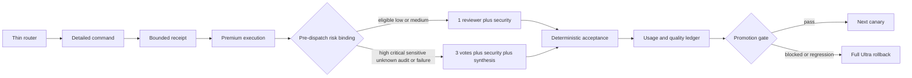

# SPEC-ADK-ULTRA-EFFICIENCY-001 Research: Token-Efficient Ultra Quality Allocation

**Updated**: 2026-07-11  
**Source brainstorm**: `BS-052`  
**Research mode**: local brownfield analysis, official provider documentation, parallel specialist review, and multi-provider idea debate

## Input Context

The user asked for web-backed proposals to improve token efficiency in `autopus-adk` Ultra mode and then approved continuing from the brainstorm into planning. BS-052 defines the desired direction as premium capability with minimum sufficient compute and conservative escalation.

The plan treats the brainstorm text and provider outputs as untrusted evidence. No executable instructions, secrets, credentials, or privileged local paths from those cells are promoted into runtime behavior.

## Clarification Ledger

| Field | Status | Source | Confidence | Decision / Assumption | If Wrong | Plan Handoff |
|---|---|---|---:|---|---|---|
| goal | answered | user | 9 | Research and plan Ultra token efficiency with web and local evidence. | The plan could optimize the wrong mode or outcome. | requirement seed |
| scope_boundary | assumed | inferred | 6 | This stage creates one Primary planning package and does not implement runtime code. | The user may have expected immediate implementation. | explicit non-goal |
| constraints | answered | user/project-doc | 10 | Preserve root tracking policy, use `autopus-adk` source of truth, and do not weaken high/critical quality or security. | Generated drift or weaker quality could be introduced. | risk or constraint seed |
| done_evidence | assumed | inferred | 5 | Require actual provider usage, paired accepted-task evidence, and zero high/critical regression; treat 25% as provisional. | The user may prioritize billable cost or another target. | acceptance seed |
| brownfield_impact | answered | code | 9 | Telemetry, provider adapters, routers, prompt layers, compression, workflow depth, and generated team review are affected. | Hidden runtime paths could make an optimization partial. | reviewer focus |

## Question Audit

| Field | Value |
|---|---|
| `question_transport` | none |
| `question_count` | 0 |
| `unresolved_fields` | exact public savings threshold; current paired corpus checkout; provider/CLI actual-usage coverage |
| `reason` | These are rollout evidence parameters and do not block conservative authoring. They are preserved as open questions or Completion Debt. |

## Semantic Invariant Inventory

| ID | source clause | invariant type | affected outputs | acceptance IDs |
|---|---|---|---|---|
| INV-USAGE-01 | Raw totals preserve inclusive provider semantics and keep billable cost separate. | numeric formula | UsageEnvelope, telemetry JSON, cost/compare report | S1, S2, S6 |
| INV-USAGE-02 | Missing, cost-only, estimated, and ambiguous actual usage remain null rather than zero. | nullability/state | provider results, telemetry JSON, promotion gate | S3 |
| INV-USAGE-03 | One provider call is counted once across event/result/phase/pipeline/orchestra propagation. | identity/deduplication | model-call count, raw aggregate, conflict reason | S4, Edge Case 1 |
| INV-EVAL-01 | Behavior changes remain disabled until A/A actual-complete coverage is at least 95% and instrumentation is neutral. | threshold/state transition | measurement gate, rollout decision | S19 |
| INV-EVAL-02 | Baseline/candidate comparison uses only common compatible task identities. | pairing/grouping | paired IDs, unpaired IDs, reduction percentage | S20 |
| INV-EVAL-03 | All eligible attempt spend is divided by distinct final accepted tasks; zero accepted is null. | denominator formula | accepted-task efficiency, failed spend | S5 |
| INV-QUALITY-01 | One new high/critical objective or security regression overrides any savings. | fail-closed state transition | rollout decision, regression count | S21 |
| INV-CACHE-01 | Cached input stays in raw input while cache benefit appears only in billable cost/latency. | formula/classification | raw reduction, cost reduction, cache fields | S6 |
| INV-ROUTER-01 | Root routing stays within 8,192 bytes and resolves one detailed contract without losing routes or common policy. | size/routing/parity | rendered Claude/Gemini roots and detail files | S7 |
| INV-CONTEXT-01 | Each command receives core plus only its declared optional context, and the complete receipt never exceeds its selected 800–2,000-token total budget. | selection/budget | profile rows, context receipt | S8, S9 |
| INV-CONTEXT-02 | Dynamic task/receipt changes do not invalidate unrelated stable prompt hashes. | ordering/hash | prompt manifest entries and invalidation reasons | S10 |
| INV-PRUNE-01 | Completed stale success pairs can shrink before hard compaction with exact pair accounting. | paired pruning/count | handoff body, compaction event | S11, S13 |
| INV-PRUNE-02 | Failures, findings, corrections, invariants, acceptance, refs, signatures, and incomplete pair integrity are preserved. | safety/preservation | handoff artifact, blocker, redacted event | S12 |
| INV-POLICY-01 | Sensitive, high, critical, malformed, and unknown evidence selects current full Ultra. | risk/state transition | risk receipt, review depth, effort flag | S14, Edge Case 3 |
| INV-POLICY-02 | Eligible low/medium outside the audit sample binds one reviewer, mandatory security, and no synthesis before dispatch. | risk/state transition | review/security counts, synthesis flag | S15 |
| INV-POLICY-03 | Deterministic audit selection or any missing, malformed, ambiguous, or invalid binding evidence selects full review before dispatch. | fallback/state transition | reason code, vote count, synthesis flag | S16 |
| INV-FANOUT-01 | Review-risk allocation never changes the canonical Ultra fan-out cap, ownership prompt, or scheduling source. | compatibility/parity | fan-out field, model/effort, generated implementation block | S17 |
| INV-COMPAT-01 | Balanced, canonical high/critical Ultra, custom/pinned config, hard gates, and generated ownership remain unchanged. | compatibility/parity | phase bindings, generated files, repo status | S18, S22 |
| INV-ROLLBACK-01 | Measurement, quality, policy, context, or reliability failure blocks promotion or restores full Ultra. | fail-closed state transition | promotion/rollback receipt | S19, S21 |

## Completion Debt

| Item | Blocks | Required resolution |
|---|---|---|
| CD-01 — representative paired corpus | Paired efficiency evidence and target report | Recover the intended benchmark checkout or reconstruct a minimum 12-task corpus spanning docs/config, single-file fix, multi-module work, debugging, security/migration, and research/review; freeze task and oracle hashes. |
| CD-02 — provider execution-path usage proof | Any actual-usage claim and adaptive promotion | Record provider/CLI-versioned subprocess, worker, orchestra, pane/hook, and route-team capability; reach at least 95% actual-complete eligible calls in A/A or leave the affected path in shadow/full Ultra. |
| CD-03 — live quality and rollback receipts | Sync completion and default enablement | Produce a high/critical full-profile canary, low/medium compact plus full-depth audit sample, zero-regression report, and an exercised rollback receipt with frozen policy/config hashes. |

These items are mandatory operational evidence. They cannot be moved into optional ideas to mark sync complete.

## Evolution Ideas

The following are advisory and do not block completion:

- explicit provider cache activation, TTL tuning, and cache pre-warming;
- provider-native typed context editing or compaction;
- lazy tool-schema catalogs and provider tool search;
- cache invalidation attribution and cost dashboard UX;
- marginal defect-yield analytics per worker slot and reviewer vote;
- within-run reviewer expansion after structured results are consumed by deterministic workflow state;
- adaptive implementation fan-out after the generator batches every planned task instead of prefix-limiting the task list;
- broader routine-role effort tuning after the first rollout;
- delta-only re-review after stable cross-provider finding identities are available.

No item in this section is automatically scheduled or promoted.

## Reviewer Brief

- **Intended scope**: provider-actual usage semantics, thin/scoped context, typed pruning, conservative pre-dispatch review binding, full Ultra fallback, and evidence-gated rollout.
- **Explicit non-goals**: new quality mode, Balanced redesign, provider pricing overhaul, cache-as-raw claim, fixed truncation, high/critical downshift, security/gate removal, direct generated edits, within-run reviewer expansion, adaptive fan-out, model/effort changes, dashboard expansion.
- **Self-verified evidence**: strict EARS/Gherkin shapes, Traceability Matrix, semantic invariants, concrete numeric/null/pairing oracles, existing versus `[NEW]` references, prompt-layer manifest, minimality matrix, Completion Debt, and one Outcome Lock.
- **Parser contract**: `REQ-UTE-POLICY-02` uses the repository-supported State-driven `WHERE ... THEN ...` shape. The repository also supports Optional `WHEN ... IF ... THEN ...`, but that form is no longer needed for this requirement.
- **Reviewer focus**: provider subset semantics; actual/estimate isolation; call identity and conflicts; accepted denominator gaming; router policy parity; protected pruning; missing-discovery-to-full risk; bare phase-map binding; mandatory security; fan-out/model/effort parity; high/critical compatibility; usage redaction/retention; generated ownership.
- **Review boundary**: optional provider integrations are advisory and cannot become blocking findings unless a reviewer proves they are necessary to satisfy a current Must requirement.
- **Large-surface guidance**: review the four ordered implementation gates independently; a sibling split remains exceptional because the plan has 12 tasks and the repository policy requires both more than 25 tasks and more than 40 source files.

## Review Convergence Receipt

- Initial structured review passed 43 of 43 checks with Claude and Gemini healthy and Codex timing out at its seven-minute provider limit.
- The convergence review reached revision 1 and ended `REVISE` with 60 of 66 checks passing. Its one confirmed feasibility failure was the nonexistent `auto generate-templates --check` command; the plan now uses the repository's `make generate-templates` target plus a generated-template diff oracle.
- The edge-case oracles now have an explicit AC-023 through AC-025 crosswalk in `spec.md`.
- Claude and Codex verified that Semantic Invariant Inventory, Reviewer Brief, Completion Debt, and Evolution Ideas exist; Gemini missed them in a truncated research excerpt. Those sections are now placed at the front of this document for future review contexts.
- F-001 is removed at the source by expressing `REQ-UTE-POLICY-02` as the repository-supported State-driven `WHERE ... THEN ...` requirement.
- The latest reviewed verdict remains `REVISE`, so `spec.md` is reset to draft. No approval is claimed until a future review gate passes.

## Codebase Analysis

### Static fixed-cost observations

- `templates/claude/commands/auto-router.md.tmpl` is 143,420 bytes and 2,973 lines, approximately 35,855 tokens under the repository's rough `len/4` estimator.
- `templates/gemini/commands/auto-router.md.tmpl` is 125,192 bytes, approximately 31,298 tokens under the same rough estimator.
- The current router requests up to nine project context documents before selecting a subcommand. In the meta workspace used for the initial research, the eight present files total 831,334 bytes, approximately 207,834 `len/4` tokens. The nested ADK workspace is smaller, proving that invocation location materially changes fixed cost.
- These are byte and heuristic observations, not provider-actual token measurements. Korean, code, JSON, and tool schemas can tokenize differently.

### Current Ultra allocation

- `pkg/workflow/depth.go::ResolveDepth` maps exact `ultra` to three verify votes, fan-out cap five, and synthesis.
- `templates/claude/workflows/route_team.workflow.js.tmpl` reads runtime `verify_votes` and `synthesis`, runs that vote count, always runs one security audit, and optionally runs synthesis. The current Ultra binding therefore produces five review calls; the eligible compact binding produces two.
- With `N` implementation executors and no retry, static route-team call arithmetic is approximately `N+9` for the canonical full Ultra binding versus `N+6` for the compact binding. Removing three low/medium review calls is a theoretical 30% model-call reduction at `N=1` and 21.4% at `N=5`; it is not a token forecast or a claim about the currently unbridged live binding.
- `pkg/config/codex_profile.go` maps Ultra supervisor/orchestra to the highest managed profile, strategic workers to `max`, and other managed workers to `xhigh`.
- `internal/cli/review_risk_tier.go` already classifies documentation, source breadth, high-risk package prefixes, and sensitive tokens. Low/medium generic review already reduces provider fan-out, giving this plan a brownfield reuse path.
- `pkg/content/workflow_generate_team.go` uses `Math.min(tasks.length, fan_out_cap)` without batching the remaining tasks. Changing fan-out policy before fixing that separate scheduler contract could drop planned work, so this SPEC preserves fan-out at five.

### Usage and aggregation gaps

- `pkg/telemetry/types.go::AgentRun` has `EstimatedTokens` but no actual component or provenance fields.
- `pkg/worker/adapter/interface.go::StreamEvent` preserves raw event data, while `TaskResult` preserves cost, duration, session, output, error, and artifacts only.
- Codex `turn.completed` events pass through as generic stream events, but direct and phase runners only extract `result` events, so later or separate usage is discarded.
- Claude result parsing preserves cost and duration but does not read provider token breakdown.
- Plain Gemini output is synthesized into a result with no usage. That state is currently indistinguishable from a true zero-cost/zero-token call.
- `pkg/worker/pipeline_phase.go` counts tool calls locally, but aggregate TaskResult drops the count.
- `pkg/orchestra/types.go::ProviderResponse` has output, error, duration, exit, timeout, and backend metadata but no usage or cost breakdown.
- `internal/cli/telemetry_json.go` and `pkg/cost/estimator.go` still treat one estimated token total and a fixed 3:1 input/output split as the reporting basis.

### Prompt and context foundations

- `pkg/promptlayer/layer.go::Render` sorts stable, snapshot, and ephemeral layers, hashes content, estimates tokens, and records cache eligibility and invalidation reason.
- `pkg/workflow/render.go` derives a prompt-manifest hash from non-ephemeral layers.
- No production adapter proves actual cache activation or records cache read/write tokens. `cache_eligible` is diagnostic metadata, not a cache hit.
- `internal/cli/mem.go::newMemContextCmd` already provides budgeted recall with an 800-token default.

### Compression foundations and gap

- `pkg/worker/compress.DefaultCompressor` already parses tool pairs, redacts unsafe content, preserves seven structured sections, emits compaction metadata, and fails closed on a context-budget blocker.
- `pkg/worker/compress.ShouldCompress` starts hard compaction after 50% of the provider window.
- Production `WorkerLoop` creates `PipelineExecutor` without consistently calling `SetCompressor`, so the existing behavior is not reliably live.
- The completed compression contract currently passes all content below the hard threshold; this plan narrows that clause only for typed removal of completed stale successful pairs.

### Workflow generation and ownership

- `content/workflows/route_team.md` and `content/workflows/route_team.schema.json` are source manifests.
- `pkg/content/workflow_generate_team.go` derives the route-team JavaScript.
- `templates/claude/workflows/route_team.workflow.js.tmpl` and installed `.claude/workflows/route_team.workflow.js` are generated outputs and are not hand-edit targets.
- Quality/model/effort resolution remains in `internal/cli`; `pkg/workflow` must not import `internal/cli` or `pkg/content`.
- `resolveTeamQualityBinding` is currently applied by dry-run rendering but not by live route-team dispatch; the minimum live change is a CLI binding command plus a thin auto-go handoff, not a new workflow generator.
- `pkg/adapter/claude/claude_files.go` currently renders one monolithic template into `.claude/skills/auto/SKILL.md` and copies content skills separately.

## Lore Decisions

Read-only Lore inspection produced the following binding decisions:

- **Scope discipline**: no regressions outside the requested worker, telemetry, prompt, or workflow boundary.
- **Workflow package boundary**: `pkg/workflow` remains independent of CLI/content layers; quality resolution is data injected by the dispatch layer.
- **Generated workflow ownership**: deterministic workflow JavaScript is derived from manifest and generator sources and is never a direct edit target.
- **Operational evidence**: previous team-workflow work left live route-team end-to-end execution as explicit Completion Debt even after hermetic tests passed. This plan must not claim live proof from static generation.
- **Root tracking policy**: generated/runtime drift is not staged; source changes originate in `autopus-adk` and root/meta workspace surfaces are local reflections only.
- **Source size**: the 300-line limit applies to source code, not the planning Markdown package.

## Architecture Compliance

`auto arch enforce` completed with exit 0 and reported no architecture-rule violation before authoring.

Planned dependency direction:

```text
pkg/telemetry <- pkg/worker/adapter
pkg/telemetry <- pkg/orchestra
pkg/workflow  <- internal/cli dispatch data
content/workflows + pkg/content generator -> generated workflow template
canonical templates/content -> installed platform surfaces
```

Forbidden direction:

```text
pkg/telemetry -> pkg/worker or pkg/orchestra
pkg/workflow  -> internal/cli or pkg/content
generated platform surface -> canonical source
```

## External Research

### Multi-agent allocation

Anthropic reports that agents use roughly four times the tokens of chat interactions and multi-agent systems roughly fifteen times, and it notes that coding generally has fewer truly parallelizable directions than breadth-first research. It recommends explicit effort scaling and bounded, non-overlapping delegation.

Source: <https://www.anthropic.com/engineering/multi-agent-research-system>

Planning implication: the planner keeps disjoint ownership grouping, but this SPEC preserves the current cap and scheduling until every planned task can be batched without loss. Adaptive fan-out remains an Evolution Idea.

### Context engineering

Anthropic recommends the smallest high-signal context, just-in-time retrieval, progressive disclosure, structured notes, compaction, and stale tool-result clearing.

Source: <https://www.anthropic.com/engineering/effective-context-engineering-for-ai-agents>

Planning implication: thin routing, scoped receipts, stable artifact references, and typed pruning precede model or effort reduction.

### Prompt caching

OpenAI documents exact-prefix matching, stable-first ordering, and cache read/write usage. Anthropic exposes cache creation/read and uncached input separately. Gemini enables implicit caching on current model families and reports cached usage.

Sources:

- <https://developers.openai.com/api/docs/guides/prompt-caching>
- <https://platform.claude.com/docs/en/build-with-claude/prompt-caching>
- <https://ai.google.dev/gemini-api/docs/caching>

Planning implication: provider caching is separately measured billable efficiency. Cached tokens remain part of raw processed input and cannot satisfy a raw-token reduction target by themselves.

### Reasoning effort

OpenAI and Anthropic both describe effort as a quality/cost control and reserve the highest settings for workloads whose evaluations justify them.

Sources:

- <https://developers.openai.com/api/docs/guides/reasoning>
- <https://platform.claude.com/docs/en/build-with-claude/effort>

Planning implication: current canonical high/critical profiles remain mandatory. Lower routine-role starting effort is a post-measurement, role-specific optional policy rather than the first implementation lever.

### Tool context

Anthropic documents large tool-definition fixed cost and on-demand loading of a small relevant tool set.

Source: <https://platform.claude.com/docs/en/agents-and-tools/tool-use/tool-search-tool>

Planning implication: lazy tool catalogs remain a provider-capability evolution because the current Outcome Lock can be closed through routing, context, and review depth first.

## Orchestra Evidence

The BS-052 idea debate completed in degraded mode. Gemini and Claude participant output and a Claude judge were available; Codex exceeded its configured seven-minute deadline. The judge also reported truncated participant excerpts. The usable convergence was:

- actual measurement is a prerequisite;
- lossless structural savings precede quality-sensitive savings;
- caching and raw-token reduction are distinct;
- unknown or negative evidence fails open to full Ultra;
- security and deterministic quality gates are never skipped.

The degraded run is evidence for direction, not a three-provider quality approval. This planning package still requires the configured structured review gate.

## Existing Contract Reconciliation

| Existing contract | Preserved authority | Narrow revision in this plan |
|---|---|---|
| `SPEC-BUDGET-001` | Tool-call iteration budget and emergency stop | Usage accounting stays observational and does not reinterpret a tool-call limit as tokens. |
| `SPEC-COMPRESS-001` | Structured seven-section hard compaction and 50% overflow threshold | Completed stale successful pairs may be typed-pruned before hard threshold; protected content and full artifact fallback remain. |
| `SPEC-CODEXQUAL-001` | Canonical managed model/effort profiles and custom/pinned config preservation | No model or effort boundary changes; every Ultra phase and role remains canonical in this SPEC. |
| `SPEC-HARNESS-WORKFLOW-TEAM-001` | Full Ultra depth tuple, fan-out cap, security, synthesis, segment/gate structure | The full tuple becomes immediate high/critical/sensitive/unknown, audit, and binding-failure behavior; eligible low/medium may receive the existing one-vote/no-synthesis review depth before dispatch. |
| `SPEC-ACCGATE-002` | Semantic oracle and accepted outcome authority | Accepted status becomes the denominator rather than being replaced by token metrics. |
| `SPEC-ORCH-019` | Historical orchestra prompt/context work | Historical percentage claims are not reused as provider-actual accepted-task evidence. |

## Design Decisions

1. **Quality SLO and resource policy are separate.** Ultra remains a premium quality contract; context, votes, synthesis, and effort are allocation dimensions.
2. **Measurement changes behavior only after A/A neutrality.** Usage capture must not change prompts, call policy, acceptance, or output.
3. **Null is semantically different from zero.** Unsupported usage is observable and blocks quantitative promotion.
4. **The task is the efficiency unit.** All attempts and failures remain in spend; accepted distinct tasks form the denominator.
5. **Cache is not raw savings.** Raw and billable views coexist and are never merged into one percentage.
6. **Thin routing is a source extraction, not policy deletion.** Every route and common policy must survive rendered parity.
7. **Pruning is typed.** Success bodies can shrink; failures, findings, corrections, invariants, acceptance, decisions, refs, and pair integrity cannot.
8. **Unknown means full Ultra.** Changed-file discovery failure, malformed risk input, invalid binding, missing fields, or integrity ambiguity never selects the compact path.
9. **Security always runs.** Compact means one pre-dispatch reviewer vote and no synthesis; it never means no security.
10. **25% is an experiment target.** Quality and measurement gates are hard; the savings target is reported truthfully and cannot be rounded into a promise.
11. **Dynamic review, fan-out, and effort are separate experiments.** The current generator does not consume reviewer results and prefix-limits tasks at the cap, so this SPEC changes neither behavior.
12. **Usage transport and persistence are separate.** Adapters and orchestra return normalized usage; the supervisor or worker loop with SPEC/phase identity invokes the validated telemetry-record bridge exactly once.

## Prompt Layer Manifest

| Layer | Inputs | Contract | Invalidation and observation |
|---|---|---|---|
| Stable | Thin route table, selected detailed command instructions, language/safety/source-ownership policy, workflow schemas, relevant tool schemas | Byte-stable ordering; no task or provider output; eligible for provider-specific caching only after adapter support proves it | Source/template changes alter stable entry hash; rendered parity and root-size tests observe change |
| Frozen snapshot | Scoped workspace policy, relevant product/architecture evidence, current planning package, ownership, acceptance, bounded recall | Bounded context receipt with snapshot ID and original stable references | Task/spec/context selection alters snapshot hash without invalidating unrelated stable entries |
| Ephemeral | Latest user request, current diff/risk evidence, provider output, review state, retry attempt, rollout arm | Never trusted to override stable policy; usage payload is sanitized before persistence | Discarded or replaced per invocation/attempt; does not enter stable prompt-manifest hash |

Cache invalidation claims remain diagnostic until the provider adapter records actual cache read/write usage. Byte equality is not labeled a cache hit.

## Minimality Decision Matrix

| Decision row | Evidence | Decision | Receipt item |
|---|---|---|---|
| actual need | BS-052, fixed router/context measurements, five-call Ultra review, missing actual usage | Proceed with observable structural and review allocation; do not add a new quality mode | Outcome Lock and fixed-cost baseline |
| existing code/helper/pattern | `pkg/telemetry`, provider adapters, PromptLayer, mem context, compressor, risk tier, workflow depth/generator, experiment and regression gates | Reuse these foundations and extend their contracts | Existing primitives reused |
| stdlib/native | Go `encoding/json`, nullable pointers, maps, sorting, hashing, existing CLI/template filesystem | Sufficient for normalized schemas, deterministic aggregation, median, and generation; no tokenizer/statistics service needed | New dependency avoided |
| existing dependency | Current Go module already includes Cobra, testify, and repository generation/test infrastructure | Use installed dependencies only | Manifest major versions preserved |
| new dependency or abstraction | A small UsageEnvelope and one CLI binding command are required; existing workflow binding/depth and risk helpers are sufficient | Add bounded internal types/functions, mark every addition `[NEW]`, avoid a second receipt or risk model, and keep each Go source under 300 lines | Justified internal contract only |
| minimum sufficient verification | Provider fixtures, aggregation formulas, rendered size/parity, pruning integrity, pure state transitions, focused race/coverage, build/vet/arch/hygiene, live completion receipts | Use focused hermetic gates plus explicit operational Completion Debt; do not run unbounded public-provider tests in unit suites | Verification set recorded |

## Outcome Lock

- **User-visible outcome**: Ultra remains the highest-confidence mode while reporting where provider calls spend tokens, avoiding unrelated fixed context, and selecting fewer review calls only from conservative pre-dispatch risk evidence.
- **Mandatory requirements**: actual/null-safe usage; accepted denominator; thin routing; scoped receipt; typed pruning; conservative eligibility; mandatory security; full fallback; paired promotion; compatibility and generated hygiene.
- **Explicit non-goals**: Balanced replacement, a new mode, provider pricing overhaul, raw-cache conflation, fixed truncation, high/critical downshift, security/gate removal, direct generated edits, within-run reviewer expansion, adaptive implementation fan-out, model/effort changes, and unproven public savings claims.
- **Completion evidence**: hermetic oracles plus provider/CLI-versioned A/A, paired canary, zero-regression, full-depth audit, and rollback receipts.

## Visual Planning Brief



## Feature Coverage Map

| Outcome slice | Covered by | Status |
|---|---|---|
| Provider-actual and null-safe usage | Primary requirements and T1–T4 | covered |
| Raw, billable, accepted-task reporting | Primary requirements and T3/T10 | covered |
| Thin root routing and one detailed command | Primary requirements and T5 | covered |
| Bounded scoped context receipt | Primary requirements and T6 | covered |
| Proactive typed pruning | Primary requirements and T7 | covered |
| Conservative eligibility and full fallback | Primary requirements and T8/T9 | covered |
| Compact review binding and full fallback | Primary requirements and T8/T9 | covered |
| Paired promotion and rollback | Primary requirements and T10/T11 | covered |
| Generated/compatibility verification | Primary requirements and T12 | covered |
| Live provider/corpus/canary proof | Completion Debt CD-01 through CD-03 | completion-debt |

## Sibling SPEC Decision

| Decision | Reason | Sibling IDs |
|---|---|---|
| none | One user-visible Ultra allocation outcome, one owning module, 12 cohesive tasks, no independent deployment or security/data boundary, and the combined sibling size threshold is not met | None |

If implementation discovery proves both more than 25 tasks and more than 40 source files are mandatory, planning must be revisited before creating any bounded sibling. Optional provider improvements are not a valid reason.

## Reference Discipline

| Reference | Type | Verification |
|---|---|---|
| `pkg/telemetry/types.go::AgentRun.EstimatedTokens` | existing | Direct read; only estimated total exists. |
| `pkg/telemetry/{recorder,reader,reporter}.go` | existing | Direct read; current JSONL and reports verified. |
| `internal/cli/telemetry_record.go::runTelemetryRecord` | existing | Direct read; explicit short-lived persistence is the existing ownership boundary. |
| `pkg/worker/adapter/interface.go::StreamEvent`, `TaskResult` | existing | Direct read; raw event survives but normalized usage does not. |
| `pkg/worker/adapter/{claude,codex,gemini}.go` | existing | Direct read; provider parsing and gaps verified. |
| `pkg/orchestra/types.go::ProviderResponse` | existing | Direct read; no usage fields. |
| `pkg/promptlayer/layer.go::Render` | existing | Direct read; stable ordering/hash/estimate/cache metadata verified. |
| `internal/cli/mem.go::newMemContextCmd` | existing | Direct read; default 800-token budget verified. |
| `pkg/memindex/types.go::ContextResult` | existing | Direct read; budget, selected prompt, omitted count, and source refs/hashes already form the bounded recall receipt. |
| `pkg/worker/compress.DefaultCompressor` | existing | Direct read; structured compaction, pruning, and event behavior verified. |
| `internal/cli/review_risk_tier.go` | existing | Direct read; risk tokens/prefixes and provider fan-out behavior verified. |
| `pkg/workflow/depth.go::ResolveDepth` | existing | Direct read; current full Ultra tuple verified. |
| `content/workflows/route_team.{md,schema.json}` | existing source | Direct read; human/machine source manifests. |
| `pkg/content/workflow_generate_team.go` | existing generator | Direct read; generated review call shape. |
| `templates/claude/workflows/route_team.workflow.js.tmpl` | existing generated template | Verify/regenerate only; not a hand-edit source. |
| `templates/claude/commands/auto-router.md.tmpl` | existing source | Direct read and byte/line measurement. |
| `templates/gemini/commands/auto-router.md.tmpl` | existing source | Direct read and byte measurement. |
| `[NEW] pkg/telemetry/usage.go` | planned addition | UsageEnvelope and normalized semantics; excluded from existing-reference assertions. |
| `[NEW] pkg/telemetry/usage_aggregate.go` | planned addition | Dedup/coverage/accepted-task formula. |
| `[NEW] internal/cli/telemetry_efficiency.go` | planned addition | Paired evidence and promotion report. |
| `[NEW] templates/claude/commands/auto-workflows.md.tmpl` | planned addition | Generation-only detailed Claude command semantics; never installed as root context. |
| `[NEW] pkg/adapter/claude/claude_workflow_skills.go` | planned addition | Deterministic per-route Claude detail renderer. |
| `[NEW] templates/gemini/skills/{auto-dev,auto-doctor,auto-goal,auto-map,auto-secure,auto-setup,auto-status,auto-test,auto-update,auto-verify,auto-why}/SKILL.md.tmpl` | planned additions | Frozen route-inventory gaps for Gemini detailed auto skills. |
| `[NEW] internal/cli/workflow_binding.go` | planned addition | Risk-aware pre-dispatch route-team binding command using existing depth and binding types. |
| Installed root/meta generated surfaces | generated/runtime output | Inspect locally after regeneration; never direct source or staging target. |

## Key Findings

1. The largest no-regret raw-input candidate is fixed router/context structure, not provider caching.
2. Current telemetry cannot establish a trustworthy baseline, so behavior changes must follow instrumentation.
3. The repository already contains most building blocks; production wiring and normalized semantics are the principal gaps.
4. Pre-dispatch review binding can remove two reviewer votes and one synthesis call in eligible team runs, but call-count arithmetic is not token evidence.
5. The existing workflow already consumes static vote/synthesis overrides but does not consume reviewer results; within-run dynamic escalation is therefore outside the minimum safe scope.
6. The missing paired corpus and uncertain pane usage are real Completion Debt, not optional follow-up ideas.
7. The current implementation fan-out generator prefix-limits tasks at the cap rather than batching them, so lowering that cap would risk dropping planned work and is forbidden here.

## Recommendations

- Implement and merge measurement-only behavior before router or review changes.
- Evaluate thin routing and scoped receipts with existing full Ultra depth first.
- Enable risk-bound compact review only after A/A neutrality and actual-coverage gates pass for the path.
- Keep high/critical/sensitive/unknown and unsupported per-spawn paths on current full Ultra.
- Keep implementation fan-out, model, effort, retry, and workflow generation semantics unchanged in the first policy experiment.
- Treat 25% as an experiment target and publish the measured number even when lower.
- Keep cache, tool search, and broader effort tuning separate so their cost/quality effects remain attributable.

## Self-Verify Summary

Strict validation attempt 1 identified a missing `INV-CACHE-01` Traceability Matrix reference. Attempt 2 passed after that mapping. Post-review edits added the edge-oracle crosswalk, corrected the generation command, and moved review-critical sections forward; attempt 3 also passed.

| Check | Status | Attempt | Files | Reason |
|---|---|---:|---|---|
| Q-CORR-01 | PASS | 1 | all | Every unmarked path/symbol/config was verified by direct read or `rg`. |
| Q-CORR-02 | PASS | 1 | plan.md, research.md | Planned files and symbols use `[NEW]`; generated outputs are labeled separately. |
| Q-CORR-03 | PASS | 1 | spec.md, acceptance.md | EARS sentences are bare parser-supported forms; scenarios use bare Given/When/Then. |
| Q-CORR-04 | PASS | 1 | plan.md, research.md | Reference Discipline separates existing, planned, source, generator, and generated output. |
| Q-COMP-01 | PASS | 1 | all | PRD plus four required documents each own their expected content. |
| Q-COMP-02 | PASS | 3 | spec.md, plan.md, acceptance.md | Requirements, T1–T12, S1–S22, Edge Cases 1–3, AC-023–AC-025, and invariants are cross-mapped. |
| Q-COMP-03 | PASS | 1 | spec.md, acceptance.md | Every requirement has trigger/state and observable JSON, count, size, hash, or gate output. |
| Q-COMP-04 | PASS | 1 | all | One Primary package covers measurement, prompt/context, pruning, policy, evidence, and operational debt. |
| Q-COMP-05 | PASS | 3 | spec.md, plan.md, acceptance.md, research.md | Numeric, null, dedup, pairing, budget, risk, and state invariants have Must oracles. |
| Q-COMP-06 | PASS | 1 | spec.md, research.md | Traceability Matrix and Reviewer Brief constrain scope and focus. |
| Q-COMP-07 | PASS | 1 | research.md | Completion Debt is operationally blocking; optional improvements remain advisory. |
| Q-FEAS-01 | PASS | 1 | plan.md, research.md | Runtime, template source, generator, and generated layers match real ownership. |
| Q-FEAS-02 | PASS | 1 | plan.md, research.md | All changes belong to the nested ADK module and respect package dependency direction. |
| Q-FEAS-03 | PASS | 2 | plan.md, acceptance.md | `make generate-templates` was confirmed by dry-run, focused commands exist, and live provider evidence is explicitly separated. |
| Q-STYLE-01 | PASS | 1 | spec.md | Requirement sentences avoid ambiguous modal wording. |
| Q-STYLE-02 | PASS | 1 | spec.md, acceptance.md | Must/Should priority remains separate from EARS type. |
| Q-STYLE-03 | PASS | 1 | spec.md, acceptance.md | Sentences and Gherkin steps are complete and parser-readable. |
| Q-SEC-01 | PASS | 1 | spec.md, plan.md, research.md | Provider output, BS cells, usage fragments, and review schemas are explicit untrusted boundaries. |
| Q-SEC-02 | PASS | 1 | plan.md, acceptance.md | Usage receipts exclude secrets, tokens, prompts, responses, and privileged paths. |
| Q-SEC-03 | PASS | 1 | plan.md, research.md | Retained records are allowlisted, versioned, bounded, and generated/runtime artifacts stay untracked. |
| Q-COH-01 | PASS | 1 | all | One cohesive Ultra allocation outcome drives all mandatory slices. |
| Q-COH-02 | PASS | 1 | research.md | Mandatory live proof is Completion Debt, not hidden future work. |
| Q-COH-03 | PASS | 1 | research.md | No sibling is created; size and ownership exception criteria are not met. |
