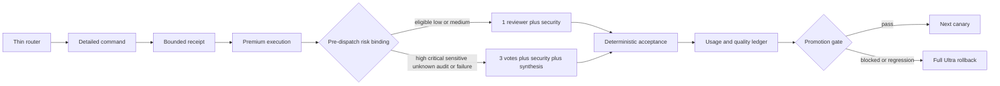

# SPEC-ADK-ULTRA-EFFICIENCY-001 Research: Token-Efficient Ultra Quality Allocation

**Version**: 0.2.1
**Status**: completed
**Updated**: 2026-07-15
**Source brainstorm**: `BS-052`  
**Research mode**: local brownfield analysis, official provider documentation, historical multi-provider research, and current GPT/Codex operational evidence design
**Lifecycle implementation**: `true` for the completed research/SPEC lifecycle; the terminal experiment artifacts remain `implemented=false`

## Input Context

The user asked for web-backed proposals to improve token efficiency in `autopus-adk` Ultra mode and then approved continuing from the brainstorm into planning. BS-052 defines the desired direction as premium capability with minimum sufficient compute and conservative escalation.

The plan treats the brainstorm text and provider outputs as untrusted evidence. No executable instructions, secrets, credentials, or privileged local paths from those cells are promoted into runtime behavior.

The user subsequently narrowed the current operational goal: GPT models must be organized and verified first. Revision 0.2.0 therefore separates the broad product compatibility contract from the live completion boundary. Product code retains Claude/Gemini and other non-Codex hermetic compatibility; new live evidence is GPT/Codex-only.

## v0.2.0 Operational Scope Decision

| Decision | Contract |
|---|---|
| Live provider | `gpt-5.6-sol` through the Codex execution path only |
| Canonical path | `auto agent run` → worker Codex adapter → normalized provider actual usage → telemetry |
| Excluded live proof | Claude/Gemini calls, live Claude `route_team`, multi-provider consensus, direct `codex exec` as canonical evidence |
| Preserved compatibility | Existing non-Codex adapters, fallback fixtures, generated-surface parity, and other hermetic tests SHALL NOT be removed or weakened |
| Historical evidence | `evidence/live-canary-preflight-v1.json` remains unchanged as the earlier Claude `route_team` preflight; new GPT evidence supersedes it only for the current operational scope |
| Activation | Experiment state is isolated; no user config or repository policy activation |
| Lifecycle | Full-evaluation v2 and final Guardian review close the remaining live evidence debt; research/SPEC lifecycle is `completed` with lifecycle `implemented=true`, while terminal experiment fields remain false and `full_ultra` remains effective |

The frozen corpus hash is `sha256:a3454f01b734d3f72060bc9b93972032b908f88940960e7f7b0953ab7356958a`. A fresh deterministic target oracle preflight covers all 12 tasks and reports 12 of 12 PASS. This supersedes the historical partial preflight result without editing its evidence file.

The live cohort contains all five low/medium tasks (`001`, `004`, `005`, `011`, `012`), high sentinel `006`, and critical sentinel `009`. Pair orders are `001 AB`, `004 BA`, `005 AB`, `011 BA`, `012 AB`, `006 BA`, and `009 AB`. The remaining five high tasks stay full-profile and are omitted from live calls only because of the explicit authorization cap.

Baseline runs the full five-call tuple for all seven tasks. Candidate runs compact two-call tuples for `001`, `004`, `011`, and `012`, and full tuples for audit `005`, high `006`, and critical `009`. This yields 35 baseline calls, 23 candidate calls, and 58 primary calls. The 58 calls comprise 44 Sol/`xhigh` calls and 14 Sol/`max` calls. The full tuple is three reviewers plus security plus consolidator; compact is reviewer plus security. Child calls do not use `ultra`, while supervisor/orchestra Ultra parity remains static.

At 22,000 raw tokens per `xhigh` call and 26,000 per `max` call, primary worst-case admission is 1,332,000 raw tokens. A five-call applied rollback replay reserves another 114,000 tokens, so the complete plan is 63 calls and 1,446,000 raw tokens. This leaves one call and 54,000 raw tokens below the authorization of 64 calls and 1,500,000 raw tokens; no 64th call is scheduled or admitted. Concurrency is one and retries are zero. Replay runs inside the pre-admitted hard envelope after every prior gate passes and the circuit breaker remains closed; it does not depend on observed underspend.

## First GPT/Codex Live Attempt Findings

This section and the task006 diagnosis/transport sections through v8 preserve chronological findings at their observation time. Their open-debt and `implemented=false` statements are historical and are superseded for the current SPEC lifecycle only by the later full-evaluation v2 terminal findings.

The first frozen primary attempt reached 39 of 58 planned calls. Calls 1 through 38 passed. Call 39 was the first review call for high sentinel task `ute-corpus-v1-006` candidate arm `B`, using the full-five profile with reviewer ordinal 1 and effort `xhigh`; it returned `FAIL` with one finding. The circuit opened immediately, no retry occurred, and no later primary or replay call was admitted.

All 39 attempted calls produced provider actual-usage receipts with unique call and run identities. Observed raw usage was 523,811 tokens. Tool calls, retries, budget violations, identity mismatches, and retained raw provider material were all zero. The deterministic task `006` patch hash matched and `go test ./internal/cli ./pkg/spec` passed, but this does not erase the supplementary GPT failure under the frozen admission contract.

The partial ledger was rejected by the strict efficiency evaluator, which published no evaluator artifacts. The applied rollback replay admission was also rejected and made zero provider calls. This result empirically confirms the S25 fail-closed branch. It does not supply the complete S24 58-call comparison, the complete S26 replay path, the S27 14 paired trials or seven quality rows, or an applied rollback replay.

The terminal decision is `BLOCKED_NO_PROMOTION`. Candidate activation, user-config mutation, and repository-policy activation remain false; the effective safe profile is `full_ultra`. Version and status remain `0.2.0` and `approved`, with `implemented=false`.

The cumulative-authorization P1 is resolved by requiring canonical output and an ignored atomic runtime claim. Reconciliation marks the current policy hash `sha256:1640281825b184f9ffbb92dc36a9afac27a5b55a9ff9d2632aadfa2dcce9430b` as `CONSUMED_ON_RECONCILIATION`. Actual canonical and noncanonical reuse probes both rejected admission with zero provider calls and zero raw tokens. The final independent diff-only review passed with open P0/P1/P2 counts of 0/0/0. A future live attempt therefore requires a newly frozen policy hash and explicit authorization rather than resuming the partial ledger or reusing its authorization.

### Terminal evidence index

| Evidence | SHA-256 | Scope |
|---|---|---|
| `evidence/gpt-primary-call-ledger-v1.partial-fail.json` | `sha256:f1b2fc2171af84464c6e5e7f39d5db62918480740d60abe4fabc93784987b582` | Sanitized 39-call primary ledger with 38 PASS and one FAIL. |
| `evidence/gpt-primary-terminal-outcome-v1.json` | `sha256:29f0a73fe758e4b564870922269bce24297795e8ba3040f346fca610ef1007b8` | Terminal decision, deterministic recheck, fail-closed evaluator/replay checks, privacy, and activation state. |
| `evidence/gpt-authorization-closure-v1.json` | `sha256:bde1c49d7458f43a1cb9bfd478bd84991645b161d6b9f9e7794f042e2051bf42` | Resolved cumulative-authorization P1, consumed policy hash, zero-call reuse probes, and final diff-only review PASS. |

## Task006 Diagnostic Protocol And Outcome

The follow-up research question was narrow: determine whether the task006 A/B full-five reviewer population produced a bounded, scope-linked finding without reopening promotion. Authorization `sha256:920e6370cebb84739872233cd4a0eeb88295bf816b19b6d43cfac99591a1dc20` approved 10 single-use calls and at most 228,000 raw tokens. The new policy hash was `sha256:4a4b84f7087a5bf40aa0f5c3c2e883e29d235e80bf91c84c1186ec758248b12f`. Both arms retained full5, yielding eight `xhigh` and two `max` calls.

The parser change was deliberately isolated to diagnostic mode. It allowed only bounded `finding_code` and `scope_hash` output and did not weaken the primary strict parser. This permitted a valid bounded failure finding to remain diagnostic data rather than a promotion verdict, while operational integrity failures still stopped the sequence.

The sequence stopped before that research question could be answered. Call 1, task006 arm A, full-profile reviewer 1 at `xhigh`, returned `process_nonzero` with empty output and unavailable usage. Attempted and observed calls equal one; actual-usage calls, raw tokens, tools, retries, and admitted diagnostic findings equal zero. The deterministic patch and test command passed, but deterministic correctness cannot substitute for a missing diagnostic response. No task006 A/B quality comparison or finding-code conclusion is supportable.

P1 review then identified an evidence-ordering weakness: the nonzero process path could construct a diagnostic row from result and telemetry material before process success was established. The fix checks process status first and emits only a sanitized failure stub with schedule-bound identity. It bypasses telemetry lookup and `build_diag_row`, preventing unvalidated verdict, finding, usage, run, or call values from becoming evidence. The already-published partial ledger remains immutable historical input and gains no diagnostic authority from the fix.

The single-use authorization is consumed. A separate P2 operational receipt records a same-authorization probe with exit code 1, zero sentinel invocations, zero provider calls, zero raw tokens, and runtime claim hash `sha256:cb719f052ed7eb14b3a099eb5db4488ddd3bb310dc44bc309d2c4764003079cb` unchanged before and after. Promotion remains false, candidate activation remains false, the primary terminal evidence and prior authorization closure remain immutable, and `full_ultra` remains active. Further live investigation first requires transport-failure diagnosis, then a new frozen policy hash and explicit authorization.

### Diagnostic evidence index

| Evidence | SHA-256 | Scope |
|---|---|---|
| `evidence/gpt-diagnostic-cohort-v1.json` | `sha256:d060fe3ae06e5ee063c66a57dc7b6a96bd9c929361e81ca2e26d48d333db0d9f` | Task006 A/B full-five cohort and call order. |
| `evidence/gpt-diagnostic-config-v1.json` | `sha256:bff64292fdf49343bde1a53d9d40ffbea0af5f338cd48385c2a2dc6d752e0565` | Read-only, zero-tool, no-retention diagnostic configuration. |
| `evidence/gpt-diagnostic-policy-v1.json` | `sha256:4a4b84f7087a5bf40aa0f5c3c2e883e29d235e80bf91c84c1186ec758248b12f` | Single-use call/token authorization policy and no-promotion boundary. |
| `evidence/gpt-diagnostic-verdict-schema-v1.json` | `sha256:d81f0205cbc02ac7af0d0897078041f765873ba287b8dfd2c0dd3e66f35ca605` | Bounded diagnostic code and scope-hash schema. |
| `evidence/gpt-diagnostic-preflight-v1.json` | `sha256:83d79efa72892605276746e114ce740113e97d5225dbf5b6ab4bd1519f4de552` | Local preflight with provider execution not started. |
| `evidence/gpt-diagnostic-call-ledger-v1.partial-fail.json` | `sha256:d0d3881e6fdad03c3289761a535f3f34f5603001c0d96af9c66acea840ac6ee0` | One-attempt process failure and zero actual usage. |
| `evidence/gpt-diagnostic-terminal-outcome-v1.json` | `sha256:9869bbceea0a5ba2db05b48980f4cda44ede8dceda1e2325e678826155a13892` | Diagnostic operational failure, deterministic recheck, and unchanged rollout decision. |
| `evidence/gpt-diagnostic-authorization-reuse-v1.json` | `sha256:340e59d8791403853d5d4281bb02b0cdb4fb2af5d1c01ecc5644f15719649ebd` | Exit/sentinel/provider-zero reuse rejection and stable runtime claim hash. |

## Task006 Transport-Smoke Outcome

To separate transport health from task006 semantics, a new single-call policy was frozen under authorization `sha256:7078b87735deb9026654c38ae04305ab8874099ad99c5b4ae37d9956e0232b27`. It admitted one reviewer call at `xhigh`, capped at 22,000 raw tokens with zero retries. The policy/config/schema hashes were `sha256:38b6ae94b0edf4c9cf09a505a5ff1b4f8cec17a478306cde99b95d9aec2411a3`, `sha256:9dd237bf913b7ac30d4002e733b8299c007f7cb1646a0c1020a9dbbdc1bc2e34`, and `sha256:61006491dddaadb43822608d10af5c3baa2e166950973dec95655ffd28003ced`.

The executable identity was `0.50.68-ute-transport-smoke-v1`, SHA-256 `b90c7445ca8365ccf20ea044a4793f7f8bd16a4cd0f7385915b605e6493518d5`. The process again terminated nonzero. The ledger records one attempt, zero actual-usage calls, and usage status unavailable. Observed raw tokens and tool calls are null; interpreting either as zero would be unsupported.

The transport smoke therefore provides no transport-success or semantic-quality conclusion. Promotion remains false, the authorization is consumed, and `full_ultra` remains active with `implemented=false`. Existing primary and diagnostic evidence remains unchanged, and S24/S27 Completion Debt is unaffected.

### Transport-smoke evidence index

| Evidence | SHA-256 | Scope |
|---|---|---|
| `evidence/gpt-transport-smoke-policy-v1.json` | `sha256:38b6ae94b0edf4c9cf09a505a5ff1b4f8cec17a478306cde99b95d9aec2411a3` | Single-call transport-only policy. |
| `evidence/gpt-transport-smoke-config-v1.json` | `sha256:9dd237bf913b7ac30d4002e733b8299c007f7cb1646a0c1020a9dbbdc1bc2e34` | Canonical transport-only execution configuration. |
| `evidence/gpt-transport-smoke-schema-v1.json` | `sha256:61006491dddaadb43822608d10af5c3baa2e166950973dec95655ffd28003ced` | Structured acknowledgement schema without findings. |
| `evidence/gpt-transport-smoke-preflight-v1.json` | `sha256:d92a3cd44da58a7daff27a60245b6a4c6197c6b5d3cc6a1596384784237c90a4` | Provider-zero preflight and frozen authorization identity. |
| `evidence/gpt-transport-smoke-ledger-v1.partial-fail.json` | `sha256:eca927f2802b734336d5c34bd3833fb1a4385c93eff6f97a825bf153cbbe37c6` | One-attempt operational-failure ledger with null observed raw tokens. |
| `evidence/gpt-transport-smoke-terminal-outcome-v1.json` | `sha256:b92db43b32a9880b8e7e6987ba6398a50ccaef323f709beef698b07f6438f268` | Runtime identity, consumed authorization, and null-safe terminal decision. |

## Task006 Transport Diagnosis v2/v3 Findings

Transport diagnosis v2 used single-use authorization `sha256:345523b25569eee5f691d3960c2caca0709aebcd324c7db103cb3c2b0ecf013f`, and v3 used `sha256:db4f738c9226c55e339d8e52e875ac7e7b3aefe4efdf0b0372066fcb325a1de9`. Each authorization admitted one GPT/Codex task006 reviewer call at `xhigh` under a 22,000-raw-token cap, concurrency one, and zero retries; each was consumed once and is not resumable.

| Run | Frozen identities | Runtime identity |
|---|---|---|
| v2 | Policy `sha256:e60cc741ea5a2abd0be0ba7e25d5d6c639fe9e2b0cd52c10dcb14ac1565b6cdc`; config `sha256:bdec20a7c73616afdcd5c70fa069f88a392a8da928bb90c8f4e192af657f5c80`; schema `sha256:0f77892d0472dedf2e6cdee5a9064e7e0798ad29e43769c87a00aff26f159306`; preflight `sha256:4e26043b3cc0ac3df8ff74a78f0616a48dacb99bc7041419f572bbc400ac8c04`; reservation `sha256:f0b4b4d3b6b40a0048ce245905b6884ac736cbb5161140cdb254cd94a05a83a5` | `0.50.68-ute-transport-diagnosis-v2`; executable `sha256:fc5bf47bb3db020876605d7450661e732817790ab9190895bd6f78726096360a` |
| v3 | Policy `sha256:b5c627569f95733511d10dda2c67b034e25f645fd292fe7b90f7bd1913180d07`; config `sha256:f05ca25b74cdd748d97919c31357cc3676cf15c1f41b53f830232fe070d56eb6`; schema `sha256:ab787a1b9581b76160ffc48b1c22659865caa250a5f20de4249fb0ec6b81ec8d`; preflight `sha256:18792e4bdc12ca1007d6ef275b2d02032f08a1e5ba674c03d81d22598a56f4f4`; reservation `sha256:28dff2e5d0507620bdedf93fdb1c3e2baa7f175f9f056f6bca80fcb14fb76f79` | `0.50.68-ute-transport-diagnosis-v3`; executable `sha256:9e118039a9e1027087b578935c410c43187d1e9ec583eb4258d6c223c9b770a5` |

The empirical result did not change between runs. Both ended `process_nonzero` after one attempt, with zero actual-usage calls, usage unavailable, observed raw tokens null, zero retries, operational-error class `unknown`, and fingerprint `sha256:e161c851c1a8c4fdea86c031ea524f1e0c7d39c7399eb950ea081fa8d90f0a42`. V3 added provider-error detail capture to the diagnosis surface, but its terminal record still reports the detail unclassified and `failure_source_metadata_available=false`.

Current code additionally retains allowlisted, raw-free `operational_error_stage` and `operational_error_signals`. Hermetic tests cover canonical values, secret-free retention, and null/empty fail-closed behavior for forged values. This improves future observability, but the immutable v3 ledger contains neither field. Inferring the v3 failure source from current behavior would therefore be retrospective attribution unsupported by the live evidence.

The supported conclusion remains narrow: both outcomes are `TRANSPORT_DIAGNOSIS_TERMINAL_OPERATIONAL_FAILURE`; there is no Transport PASS, semantic evaluation, promotion eligibility, or root-cause classification. SPEC status remains `approved`, while `implemented=false`, effective profile `full_ultra`, S24/S27 unmet, and CD-02/CD-03 open. The full 58-call primary plus 5-call replay is prohibited and unapproved until Transport PASS. Another live run requires a new frozen policy and explicit authorization, remains GPT/Codex-only, and does not add Claude/Gemini live work.

### Transport-diagnosis v2/v3 evidence index

| Evidence | SHA-256 | Finding |
|---|---|---|
| `evidence/gpt-transport-smoke-ledger-v2.partial-fail.json` | `sha256:3f5e76621709e9a77e222a317d34ebad664bbc1735c1f1ae2cec1f9fb2a51c6f` | v2 terminal partial ledger; class unknown and actual usage absent. |
| `evidence/gpt-transport-smoke-terminal-outcome-v2.json` | `sha256:1723f7906b5e544fd9c7c3b7418bf9fd3522254e4d434da6987a34776a9c7196` | v2 consumed authorization, non-resumable terminal state, and unchanged rollout. |
| `evidence/gpt-transport-smoke-ledger-v3.partial-fail.json` | `sha256:32b0144aa61e34bad7b277390ac341e57f9cd0a2c1cefb9d240b45cd743735d8` | v3 ledger did not retain failure-source stage or signals. |
| `evidence/gpt-transport-smoke-terminal-outcome-v3.json` | `sha256:ac0e928e43d1da5a4ed609e255ea2d67ef9361cbec27fa6fc42a5a96c518b23e` | Exact sidecar SHA for v3 terminal closure; capture did not yield classified detail. |

## Task006 Transport Diagnosis v4 Live Terminal Findings

The frozen v4 GPT/Codex transport-only package received explicit authorization. Authorization `sha256:11bc59a14df0ce2c77e44e28bf644b1a8e07d6d63825189b81988b1da51a1a03` was consumed by one attempt and is non-resumable.

| Field | V4 terminal finding |
|---|---|
| Evidence chain | Policy `sha256:a562141171b03e3ffc61aee968dc09a1760b1216448469d8db95788ec33654bf`; config `sha256:1dce4c89d3e52231bb1cdeb54c96f2a6bbf82004b1ac14e3fcabd7d2f1821711`; schema `sha256:a90b361e401497102d90b563082f38ff0a3600376dffdef9b4ebfe106ccb1421`; preflight `sha256:da363839a19dc63805e1f5574759a3eb1a1d6fcc73ea340e5a665cc6a19e78cb`; ledger `sha256:7fdd5f75b610e71fceabbb910b477b2d00ec838f02b048b0d073b3bb16d04383`; reservation `sha256:078042f1035b9b29051dff784bc7c456b5c534a39550b2e155c7411461ffd6e6`; terminal `sha256:27a2cae7b3470ab219153738dbf75d9d35a24c342ed88aae00e2b7bad2edad18`. |
| Runtime | Auto `0.50.68-ute-transport-diagnosis-v4`, executable `sha256:f7d4c12f354e3f8b106e68ada07286e658f888b32b3467f8a9b6137debd89bd9`; harness `sha256:9078eee0b022d5da750762942585d5189245d9b12eddc0dafb6b1e8ccadb5c42`; Codex `0.144.1`. |
| Execution | Task006 reviewer `xhigh`; attempted 1; retries 0; `process_nonzero`; actual-usage calls 0; raw tokens null; usage unavailable. |
| Failure metadata | Class `unknown`; fingerprint `sha256:e161c851c1a8c4fdea86c031ea524f1e0c7d39c7399eb950ea081fa8d90f0a42`; stage `process_wait`; signals `[provider_failure_event]`; stderr observed false; raw retention false. |

V4 improves the finding from an entirely unknown source to an observed provider-failure-event source. Because no event detail was retained or classified, this does not identify a root cause and supplies no Transport PASS, semantic evaluation, or promotion evidence. SPEC remains `approved`, `implemented=false`, effective profile `full_ultra`, S24/S27 unmet, and CD-02/CD-03 open. The 58+5 sequence remains prohibited. Further live research requires a new frozen GPT/Codex policy and new explicit authorization, with no Claude/Gemini live expansion.

## Task006 Transport Diagnosis v5 Live Terminal Findings

The frozen v5 GPT/Codex transport-only package received explicit authorization. Authorization `sha256:036f1f0534fddaf72897ea5062ebd5747c558a725a47fa0149fd8de033469a64` was consumed by one attempt and is non-resumable.

| Field | V5 terminal finding |
|---|---|
| Evidence chain | Policy `sha256:49b57c44cfef9105dd93d92441b3c17c1d678cfb6b04527da2fec81c78388f19`; config `sha256:42b57ec9d7619263dd78cabff60570cdc7051203270625558b798a036428b074`; schema `sha256:2c6da9ba42f09487b4c7a8d1704e08133cbfe2b05ea7001101fea92a23994d6c`; authorized preflight `sha256:a3548711c44c3dc3b776cc38ef7460417795b9485dac9f70f2b5c37d998cea16`; ledger `sha256:df2f065ba9e0f5e9548e64e69eb92f36497f0a975da150abd28327ebaa30cc3a`; reservation `sha256:f4593e9e203e7b32ef9e8985fae944967827b64794c15b6c2e45be3f2c13294e`; terminal `sha256:40a7abef2e1d2d9da5477352b09277892b138b4ec17ceee68240189b2ec389a0`. |
| Runtime | Auto `0.50.68-ute-transport-diagnosis-v5`, executable `sha256:b4d67aac8b946f067c2df3c3656422647947a7ab28757d8bab0e671f9b620f37`; harness `sha256:82d0b30338fbc467d80b507411cf2bdd5e8cc7d3dd1f60de973bd4e2c4bb4e14`; Codex `0.144.1`. |
| Execution | Task006 reviewer `xhigh`; attempted 1; retries 0; `process_nonzero`; actual-usage calls 0; observed raw tokens null; usage unavailable. |
| Failure metadata | Class `unknown`; stage `process_wait`; signal `[provider_failure_event]`; kind `error_and_turn_failed`; shape `[top_level_message, nested_error_object, nested_error_message]`; values and raw sources not retained. |

V5 narrows the observed source to a combined error/turn-failed event with three present field shapes. It does not retain field values or establish a root cause, Transport PASS, semantic evaluation, or promotion. SPEC remains `approved`, `implemented=false`, effective profile `full_ultra`, S24/S27 unmet, and CD-02/CD-03 open. The 58+5 sequence remains prohibited. Further live research requires a new frozen GPT/Codex policy and new explicit authorization, with no Claude/Gemini live expansion.

## Task006 Transport Diagnosis v6 Terminal Findings

The exact v6 identity was explicitly authorized and consumed by one GPT/Codex transport-only attempt. The run ended `process_nonzero` after provider-failure events were observed. V6 retained only allowlisted coarse traits and shapes, so the original messages and root cause remain unavailable.

| Field | V6 terminal finding |
|---|---|
| Authorization | `sha256:b956b634ab0664f276e9a6dfa09ce517b58b48055d0d7ed4df9136b3e69a6ea4`; single-use reservation consumed; same identity non-resumable; planned/attempted `1/1`; retries 0. |
| Terminal evidence | Authorized preflight `sha256:c0eb6253943680908eaa1a9027469cf5ba6d5a44b631bee380b35c8b92fbb1b2`; partial ledger `sha256:f583d987fa793b98c89553c33789f8e8c88b4429546a341c8d09022b671d709f`; reservation `sha256:d0a5acbe560f0a49e498ca46a452daf20701bb594c4e8cc78aa6192d742f5dfe`; terminal outcome `sha256:35f76e17743874c7878f26743b6eacc75e201dbe0fc8897f23ee7b1f2a1e4905`. |
| Usage | Completion false; actual-usage calls 0; observed raw total tokens `null`; usage status `unavailable`. This cannot be restated as zero usage. |
| Failure receipt | `process_wait`, provider-failure-event signal, coarse class `schema_or_response`, combined `error_and_turn_failed` kind, aggregate shapes `top_level_message`, `nested_error_object`, and `nested_error_message`. Both per-event receipts contain trait `schema_or_response`; no HTTP status family is observed. |
| Privacy and immutability | No provider-event values or raw hashes are retained. All 106 pre-v6 evidence files match the frozen baseline byte-for-byte. |

The observation narrows future provider-zero investigation toward the schema/structured-response boundary, but it cannot distinguish request schema rejection, response validation, stream parsing, or another schema-related failure. Transport conclusion and semantic evaluation remain unavailable, promotion remains false, and SPEC stays `approved`, `implemented=false`, and `full_ultra`, with S24/S27 and CD-02/CD-03 open. The 58+5 sequence remains prohibited, and no Claude/Gemini live work is added.

## Task006 Transport Diagnosis v7 Provider-Zero Frozen State

This subsection is the freeze-time historical snapshot from before the later v7 authorization and terminal run recorded below.

Provider-zero reconstruction established that v6 copied `gpt-transport-smoke-schema-v6.json` to runtime basename `gpt-diagnostic-verdict-schema-v1.json`. The two arrays in that actual runtime schema omitted `items`, which does not satisfy the documented Structured Outputs schema contract. No raw provider message was retained, so the finding is `STRONG_HYPOTHESIS_NOT_CONFIRMED_ROOT_CAUSE`, not a confirmed cause. The separate diagnostic schema v1 composition (`allOf`/`if`/`then`/`else`) was not v6 runtime content and cannot be attributed to that failure.

| Field | V7 frozen research state |
|---|---|
| Evidence | Policy `sha256:e03ab4a20c4c6cea4a82364d9f86b782556c800dcd4a78d875d3673095384d66`; config `sha256:d3c1a5747c3dc1626fad4e4636086eab32f94b54fa9ce2f479ed388965ee299d`; schema `sha256:ceedc01912682cbb2cf870a7e0cd00c7096f48449d9f8602e9e52d92449b94e4`; preflight `sha256:309fd921b8bee649b002cef7286c4f1dc576bdd6b07d7e165bdcafad2cb958bc`; authorization identity `sha256:fa56811f74e755711208878b2eb7e41db6071bb83e2208f8fd95024cb6d8d72a`. |
| Runtime | Auto `0.50.68-ute-transport-diagnosis-v7` at `sha256:10099d5ceb8aad68920e1ac4fd1aa8204dd2ec9c29d23f7b09303bc5d6306d69`; harness `sha256:ba9330911d8f34d72e5e868c7baf2236ede22b9f1bd4c0a411bcaa2ce86a8f50`; Codex `0.144.1`. |
| Conservative schema | Root object; required `verdict`, `finding_count`, `finding_codes`, and `finding_scope_hashes`; `additionalProperties:false`; `PASS`; count `0`; string `items` for both arrays; no `$schema`, `$id`, `const`, `maxItems`, `minItems`, `uniqueItems`, `pattern`, or composition. Local postvalidation enforces PASS/count 0/empty arrays. |
| Harness evidence | Exact v7 schema and copied-runtime hash are verified before claim creation while v6 raw-free failure receipts remain. Missing `items`, `allOf`, missing required fields, and `additionalProperties:true` are rejected at provider/Auto/claim `0/0/0`; approval-pending is `0/0/0`; fake success/failure, v1-v6 regression, and evidence immutability pass. |
| Freeze-time decision | `AWAITING_EXPLICIT_LIVE_AUTHORIZATION`; provider receipt false; observed 0 calls/0 raw tokens were preflight-only; provider execution had not started and no claim existed. |

The official [Structured Outputs guide](https://developers.openai.com/api/docs/guides/structured-outputs), [Codex non-interactive schema guidance](https://learn.chatgpt.com/docs/non-interactive-mode#create-structured-outputs-with-a-schema), and [`gpt-5.6-sol` model page](https://developers.openai.com/api/docs/models/gpt-5.6-sol) support the v7 contract and model capability. They do not recover the missing v6 provider message or confirm its root cause.

At freeze time, the next gate was exact-identity live authorization. The later exact `실행승인` satisfied only that admission gate and did not confirm the v6 hypothesis or any transport, semantic, promotion, usage, or completion claim.

## Task006 Transport Diagnosis v7 Terminal State

The user's exact `실행승인` bound identity `sha256:fa56811f74e755711208878b2eb7e41db6071bb83e2208f8fd95024cb6d8d72a` at `2026-07-15T11:42:07+09:00`. The one-call GPT/Codex transport-only authorization was consumed and cannot be resumed.

| Field | V7 terminal finding |
|---|---|
| Evidence | Policy `sha256:e03ab4a20c4c6cea4a82364d9f86b782556c800dcd4a78d875d3673095384d66`; config `sha256:d3c1a5747c3dc1626fad4e4636086eab32f94b54fa9ce2f479ed388965ee299d`; schema `sha256:ceedc01912682cbb2cf870a7e0cd00c7096f48449d9f8602e9e52d92449b94e4`; authorized preflight `sha256:33b1a1a266d722a32fd40abe93d9878c656e022f58a6b40e5726676cf651c4ab`; reservation `sha256:3a3939b2373d3335c1612e048a847db12bae3c5436430f487f715c1c0698f4cb`; partial ledger `sha256:a614cf254c02bbbe178f3b818cf50eae34b8191d3251db7834ae85aac185b73f`; terminal `sha256:9e6db74077d64d72b515497a640b21891e7d65cd3780a505d2ca1800cb19f0f6`. |
| Execution | Planned/attempted `1/1`, retries 0, exit 1, `missing_or_invalid_result`, completed false. |
| Usage evidence | Actual-usage calls 0; observed raw total tokens `null`; usage unavailable. This cannot support a zero-usage or zero-cost claim. |
| Operational evidence | Class/fingerprint/stage are `null`; serialized signals/events are empty; event/stderr observation and operational receipt classification are unavailable; canonical result and usage receipts are false. This does not prove provider-event/stderr absence or classify a root cause. |
| Decision | Transport conclusion unavailable; root cause unclassified; semantic evaluation false; promotion false. |

V7 does not prove whether the schema fix succeeded or failed; v6 missing `items` remains `STRONG_HYPOTHESIS_NOT_CONFIRMED_ROOT_CAUSE`. V7 must not be retried or reused. Further live research requires a new policy/config/schema identity and separate explicit authorization, remains GPT/Codex-only, and adds no Claude/Gemini live scope. SPEC remains `approved`, `implemented=false`, and `full_ultra`; S24/S27 and CD-02/CD-03 remain open and 58+5 remains prohibited.

## Task006 Transport Diagnosis v8 Provider-Zero Frozen State

This subsection is the freeze-time historical snapshot from before the later v8 authorization and terminal PASS recorded below.

Provider-zero caller/shared-contract research reproduced `missing_or_invalid_result`: Auto's task result uses YAML `omitempty` for `finding_codes` and `finding_scope_hashes`, so empty PASS arrays can disappear from `result.yaml`, while the smoke consumer required explicit arrays. Since the historical v7 raw/result artifact was not retained, the supported classification is `LOCALLY_REPRODUCED_HISTORICAL_RESULT_NOT_RETAINED`, not confirmation of the exact v7 cause.

| Field | V8 frozen research state |
|---|---|
| Evidence | Policy `sha256:a8452ea635e09298b71044a00dddef02b13ac7073f828e4cf902add6d8a6b845`; config `sha256:2d714d493ca29d9b1bcea87dfd96e8cef0e1278edd5e34bf15053e9430fc3f39`; schema `sha256:ceedc01912682cbb2cf870a7e0cd00c7096f48449d9f8602e9e52d92449b94e4`; preflight `sha256:66c05018a7edfec0d773ada618566dffb3f71dcb66ed6a6c64a9c114f0f64c7a`; authorization identity `sha256:c524d53a9b12d84457ee2ad44c7149c31648c35227ef066f938467af8a74945a`. |
| Runtime | Auto `0.50.68-ute-transport-diagnosis-v8` at `sha256:5744f2c4190a1f557320bd6f8034dd809e88bec626b237df1dd8d403fdc148f8`; harness `sha256:3caf3539135f03c1b613b7bf0468674736520d8a841961822f5ae1131814c8c8`; Codex `0.144.1`. |
| Minimal fix | Consumer accepts `((has("finding_codes") | not) or .finding_codes == [])` and the equivalent scope-hash check: only missing keys normalize to empty, while explicit `null` and nonempty values fail as `missing_or_invalid_result`. |
| Local evidence | RED→GREEN, including RED null accepted → GREEN null rejected; explicit-empty and omitted-empty success PASS; null/nonempty findings reject; sanitized failure PASS; generic/v6/v7 regressions PASS; all 130 v1-v7 evidence files remain immutable. |
| Freeze-time decision | `AWAITING_EXPLICIT_LIVE_AUTHORIZATION`; provider receipt false; provider/Auto/claim was `0/0/0`; raw-token 0 was preflight-only. |

At freeze time, prior authorization was consumed by v7 and exact v8 authorization was pending. The later exact v8 authorization was consumed by the terminal transport result below.

## Task006 Transport Diagnosis v8 Terminal State

Identity `sha256:c524d53a9b12d84457ee2ad44c7149c31648c35227ef066f938467af8a74945a` was authorized at `2026-07-15T12:48:10+09:00`, consumed once, and is non-resumable.

| Field | V8 terminal finding |
|---|---|
| Evidence | Policy `sha256:a8452ea635e09298b71044a00dddef02b13ac7073f828e4cf902add6d8a6b845`; config `sha256:2d714d493ca29d9b1bcea87dfd96e8cef0e1278edd5e34bf15053e9430fc3f39`; schema `sha256:ceedc01912682cbb2cf870a7e0cd00c7096f48449d9f8602e9e52d92449b94e4`; authorized preflight `sha256:76fa7e15ea7114428d74ef9520a7055778c361ea4f702e69c8cabd2e89a76353`; ledger `sha256:f81df2cc4b083d2649bcd948328003a434411a394aea98a82aa095ee86e6593d`; reservation `sha256:b300d143c097ed6bcc4f3af61304ad39e78e611a33db189cbd8cf66c77824142`; terminal `sha256:13f31960752167111bc202899721f67e05b3c3d6da5c71372f778bfe65776792`. |
| Runtime | Auto `0.50.68-ute-transport-diagnosis-v8` at `sha256:5744f2c4190a1f557320bd6f8034dd809e88bec626b237df1dd8d403fdc148f8`; harness `sha256:3caf3539135f03c1b613b7bf0468674736520d8a841961822f5ae1131814c8c8`; Codex `0.144.1`. |
| Execution | `TRANSPORT_DIAGNOSIS_TERMINAL_PASS`; completed true; planned/attempted `1/1`; actual usage 1; observed raw tokens 16,094 within 22,000; unique model calls 1; tools 0; retries 0; schema conformance PASS. |
| Evidence boundary | No partial ledger or raw runtime files remain. The missing-key normalization branch was not observed/retained live, so exact v7 historical cause remains unclassified. |
| Decision | Transport prerequisite satisfied; semantic evaluation false; promotion false; `implemented=false`; `full_ultra` remains effective. |

The full 58+5 sequence is no longer blocked specifically by Transport PASS, but it is still unapproved and non-executable until a separately frozen full-evaluation admission and budget receive explicit authorization. V8 authorization is consumed and cannot be reused. Research remains GPT/Codex-only with no Claude/Gemini live expansion; S24/S27 and CD-02/CD-03 remain open.

## Full-Evaluation v2 Provider-Zero Admission Findings

The separately frozen full-evaluation package has identity `sha256:129521ff443c4ec01bc71cbb621c1dd3d515d5f460130a16732bf639b52e4978`, full17 source-chain hash `sha256:9c449510ae7918f2d066119cfc2374739e4ae7e83100321645c0c79710afc626`, and admission9 pre-source hash `sha256:45711d43d420414be3ec462155542d9eeb0d4dd5d36daec9dee1ae801bd616ab`. Eight canonical JSON artifacts and eight sidecars bind the frozen Auto v8 runtime, resolved Codex 0.144.1 executable, exact bare snapshot, 142 prior artifacts, 12/12 deterministic preflight, and the 63-call/1,446,000-token plan.

Three admission findings drove the final design:

1. Verifying only a narrow source subset after helper loading was insufficient. The current harness verifies the exact full17 before sourcing admission/evaluator/finalizer helpers and again before primary reservation, nested replay reservation, provider execution, and every provider call. Admission9 remains an additional pre-source subset, not a substitute for full17.
2. Auto intentionally rejects high/critical rows that masquerade as audit samples. Task005 therefore remains the isolated 100% audit receipt, while high task006 and critical task009 carry no `audit_task_hash`, use explicit audit rate 0, and bind `<kind>:<task-id>:<cohort-task-hash>` to the evaluator's SHA-256 experiment receipt. Aggregate, rollback admission, summary, and finalizer independently cross-check these identities and file hashes.
3. A replay ledger alone did not prove closure. The current exact14 summary binds security, quality, primary evaluator, audit/high/critical, aggregate, rollback decision, and applied rollback artifacts. A no-clobber nested reservation then binds the primary reservation, primary ledger, applied rollback, and summary before replay; the replay ledger and finalizer bind the nested reservation and combined budget again.

Hermetic admission and evaluator/finalizer suites pass the phase-boundary, task-swap, file/sidecar replacement, exact-manifest, nested-reservation, ledger, summary, and terminal negatives with zero provider calls. V1 canary/evidence regressions, relevant shell gates, focused Go tests, and independent review also pass; Guardian reports P0/P1 `0/0` and closes all three findings.

At this freeze-time checkpoint, no v2 authorization receipt, reservation, runtime claim, dynamic evaluator/ledger artifact, or provider call existed, and the decision was `AWAITING_EXPLICIT_FULL_EVALUATION_AUTHORIZATION`. This was stronger readiness evidence, not S24/S26/S27 or CD-02/CD-03 completion. The later authorization followed the only admissible order: `primary 58 → provider-zero evaluator → gated replay 5 → provider-zero finalizer`.

## Full-Evaluation v2 Terminal Findings

The exact identity `sha256:129521ff443c4ec01bc71cbb621c1dd3d515d5f460130a16732bf639b52e4978` received explicit single-use authorization at `2026-07-15T17:27:52+09:00`. The resulting chain confirms the design findings under live GPT/Codex execution without expanding scope to Claude or Gemini.

| Finding | Evidence-backed conclusion |
|---|---|
| Admission and identity | Authorization `sha256:875d17bf450b78fa656263f7f5676cd56b36d5ea33748e34d9f81efa861ac677` and primary reservation `sha256:bd733533ab255957154e2b31cd905c165c6f0c9719671ace7909116a620e648e` bind the exact identity, 63-call/1,446,000-token plan, caps 64/1,500,000, concurrency 1, and retries 0. |
| Primary behavior | 58/58 calls PASS with baseline/candidate `35/23`, efforts `44 xhigh / 14 max`, 58 actual-usage receipts, 1,071,031 raw tokens, and no tool call, modified file, retry, or circuit break. |
| Efficiency and quality | The provider-zero evaluator made 0 provider calls. Measurement and neutrality PASS; median paired raw reduction is 59.918%; paired trials 14; quality 7/7; security 14/14; audit005, high006, and critical009 PASS; high/critical regressions 0. |
| Rollback invariant | The injected decision is `ROLLBACK`; atomic replace, fsync, and state readback PASS with active profile `full_ultra`. Applied receipt `sha256:a00bed018f5c5f4482fcec2dacdd5a07c82f43e5e936ecf27e7042fe9d482def`. |
| Replay and envelope | Nested reservation `sha256:032eec05a180733e14a0fccf0f375869b74c490010e799d5e5ddba2bbfec4edb` admits replay only after evaluator eligibility. Replay 5/5 PASS at 90,735 raw tokens; combined use is 63 calls and 1,161,766 raw tokens, 338,234 below the authorization cap. |
| Privacy and single use | Raw retained false; exact full-evaluation partial-ledger count 0; closure is consumed and non-reusable. No user config or repository policy changed. |
| Independent conclusion | Guardian final reports P0/P1 `0/0`, S24/S26/S27 PASS, CD-02/CD-03 resolved, and blockers 0. |

The measured result supports `ELIGIBLE_NEXT_CANARY` only as an evidence-gate decision. It is not an adaptive-policy promotion or activation. The terminal and closure retain `promotion_eligible=false`, `activation_eligible=false`, and `implemented=false`, and the effective profile remains `full_ultra`. The completed evidence and Guardian review instead permit the separate research/SPEC document lifecycle to move to `completed` with lifecycle `implemented=true`.

### Full-evaluation v2 terminal evidence index

| Evidence | SHA-256 |
|---|---|
| `evidence/gpt-full-evaluation-identity-v2.json` | `sha256:129521ff443c4ec01bc71cbb621c1dd3d515d5f460130a16732bf639b52e4978` |
| `evidence/gpt-full-evaluation-authorization-v2.json` | `sha256:875d17bf450b78fa656263f7f5676cd56b36d5ea33748e34d9f81efa861ac677` |
| `evidence/gpt-full-evaluation-reservation-v2.json` | `sha256:bd733533ab255957154e2b31cd905c165c6f0c9719671ace7909116a620e648e` |
| `evidence/gpt-primary-call-ledger-v2.json` | `sha256:a8ceed2ebceae72bb120c84ecc6ace10e6ee0c2f4678c3eaa340ab86a3602aab` |
| `evidence/gpt-primary-evaluation-summary-v2.json` | `sha256:7ee81e2bf2f71ebc5d9a09471aa8b1f4b1e5513c0b69d60dfc161aff9a064f4e` |
| `evidence/gpt-applied-rollback-v2.json` | `sha256:a00bed018f5c5f4482fcec2dacdd5a07c82f43e5e936ecf27e7042fe9d482def` |
| `evidence/gpt-rollback-reservation-v2.json` | `sha256:032eec05a180733e14a0fccf0f375869b74c490010e799d5e5ddba2bbfec4edb` |
| `evidence/gpt-rollback-call-ledger-v2.json` | `sha256:e3b3dd78cbffa28419b6f9eabd88a11799370959400083b5322e62979cfeeba5` |
| `evidence/gpt-full-evaluation-terminal-outcome-v2.json` | `sha256:982863631858aad2a8eafc8eec4aa23218cf66b83110aed340fceb590098f376` |
| `evidence/gpt-full-evaluation-authorization-closure-v2.json` | `sha256:a2e7af9b2fee116318316864fcae4802da53ec2843f4b648ab15c8523d8ade7c` |

## v0.2.1 GPT/Codex Context-Integrity Decision

Local implementation and regression inspection established that receipt efficiency and required-document completeness are separate concerns. Revision 0.2.1 therefore treats required GPT/Codex documents as a non-reducible frozen snapshot and limits the existing 800–2,000-token envelope to handoff metadata and optional recall.

| Decision | Evidence-backed contract |
|---|---|
| Budget boundary | Required document bodies are outside the receipt budget. Optional recall alone consumes the residual budget and may be omitted. |
| Command document sets | `go` requires complete `spec.md`, `plan.md`, and `acceptance.md`. Complete four-document SPEC-review admission applies only when every selected provider is GPT/Codex; mixed, Claude, and Gemini review retain legacy prompt behavior. Available architecture documents and declared task-specific references join each applicable snapshot. Required content is never trimmed, summarized, or dropped. |
| Integrity identity | Each required `spec.md` metadata ID is bound to its containing SPEC directory. Raw secrets are redacted and prompt-injection directives are neutralized while surrounding evidence remains; `source_hash` records original source bytes and `prompt_hash` records sanitized delivered bytes with redaction state, token estimate, and `complete=true`. Serialized manifests are body-free and deterministic. Verification rebuilds from the supervisor-held command, SPEC, conditional profiles, and exact extra-reference set so an omitted or replayed manifest cannot choose its own acceptance set. |
| Fail-closed boundary | Missing, empty, unreadable, tampered, stale, directory-ID-mismatched, wrong-SPEC, incomplete, omitted-reference, replayed, wrong-set, reference-set-mismatched, or hash-mismatched input fails with zero provider calls and retains `full_ultra`; verified prompts above 128K also block or split before provider execution. |
| Retained execution | Required context is resolved after final worktree assignment. One frozen snapshot identity is reused by direct Codex, every pipeline phase, and concurrent all-GPT/Codex review fan-out; the original task appears once in the first phase and once after each later transition. Actual all-GPT `auto spec review` separately rebuilds and verifies its delivery on every revision from supervisor-held CLI sets, then composes the verified full bodies exactly once. |
| Native Codex contract | Generated guidance uses `spawn_agent(task_name, fork_turns="all", message)`, requests hash-bound `context_ack` as diagnostic evidence, keeps supervisor-held reference/hash verification authoritative, and rejects legacy `agent_type`/`fork_context` as the current schema. |
| Lifecycle boundary | This hardening does not rewrite the v0.2.0 live terminal evidence, promote or activate the candidate, mutate user/repository configuration, or change effective `full_ultra`. |

Primary implementation evidence is in `pkg/promptlayer/context_delivery.go`, `pkg/promptlayer/context_delivery_verify.go`, `pkg/promptlayer/context_spec_identity.go`, `internal/cli/spec_review_context_delivery.go`, `internal/cli/spec_review_context_scope.go`, `pkg/spec/prompt_context_delivery.go`, `pkg/spec/prompt_context_delivery_validate.go`, `pkg/spec/prompt_documents.go`, `pkg/worker/context_delivery.go`, `pkg/worker/pipeline_context.go`, `internal/cli/workflow_binding_context.go`, and the Codex pipeline context rewrite. The actual review bridge calls build then supervisor-set verification inside every revision and the `pkg/spec/prompt_context_delivery*.go` path consumes the in-memory result without reloading or duplicating the four SPEC documents. Focused tests cover all required tails exactly once, CLI required-document/conditional-profile normalization, all-GPT/Codex-only admission and legacy mixed-provider scope, missing/tampered/wrong-set/stale/wrong-SPEC zero-call rejection, 128K admission, SPEC-directory binding, sanitization hashes, available architecture context, post-worktree and phase continuity, and native spawn parity.

## Clarification Ledger

| Field | Status | Source | Confidence | Decision / Assumption | If Wrong | Plan Handoff |
|---|---|---|---:|---|---|---|
| goal | answered | user | 9 | Research and plan Ultra token efficiency with web and local evidence. | The plan could optimize the wrong mode or outcome. | requirement seed |
| scope_boundary | assumed | inferred | 6 | This stage creates one Primary planning package and does not implement runtime code. | The user may have expected immediate implementation. | explicit non-goal |
| constraints | answered | user/project-doc | 10 | Preserve root tracking policy, use `autopus-adk` source of truth, and do not weaken high/critical quality or security. | Generated drift or weaker quality could be introduced. | risk or constraint seed |
| done_evidence | assumed | inferred | 5 | Require actual provider usage, paired accepted-task evidence, and zero high/critical regression; treat 25% as provisional. | The user may prioritize billable cost or another target. | acceptance seed |
| brownfield_impact | answered | code | 9 | Telemetry, provider adapters, routers, prompt layers, compression, workflow depth, and generated team review are affected. | Hidden runtime paths could make an optimization partial. | reviewer focus |

## Question Audit

| Field | Value |
|---|---|
| `question_transport` | none |
| `question_count` | 0 |
| `unresolved_fields` | exact public savings threshold; any broader future-canary corpus checkout |
| `reason` | These are optional future rollout questions. Full-evaluation v2 resolved the current provider/CLI actual-usage coverage and completion-debt questions. |

## Semantic Invariant Inventory

| ID | source clause | invariant type | affected outputs | acceptance IDs |
|---|---|---|---|---|
| INV-USAGE-01 | Raw totals preserve inclusive provider semantics and keep billable cost separate. | numeric formula | UsageEnvelope, telemetry JSON, cost/compare report | S1, S2, S6 |
| INV-USAGE-02 | Missing, cost-only, estimated, and ambiguous actual usage remain null rather than zero. | nullability/state | provider results, telemetry JSON, promotion gate | S3 |
| INV-USAGE-03 | One provider call is counted once across event/result/phase/pipeline/orchestra propagation. | identity/deduplication | model-call count, raw aggregate, conflict reason | S4, Edge Case 1 |
| INV-EVAL-01 | Behavior changes remain disabled until A/A actual-complete coverage is at least 95% and instrumentation is neutral. | threshold/state transition | measurement gate, rollout decision | S19 |
| INV-EVAL-02 | Baseline/candidate comparison uses only common compatible task identities. | pairing/grouping | paired IDs, unpaired IDs, reduction percentage | S20 |
| INV-EVAL-03 | All eligible attempt spend is divided by distinct final accepted tasks; zero accepted is null. | denominator formula | accepted-task efficiency, failed spend | S5 |
| INV-QUALITY-01 | One new high/critical objective or security regression overrides any savings. | fail-closed state transition | rollout decision, regression count | S21 |
| INV-CACHE-01 | Cached input stays in raw input while cache benefit appears only in billable cost/latency. | formula/classification | raw reduction, cost reduction, cache fields | S6 |
| INV-ROUTER-01 | Root routing stays within 8,192 bytes and resolves one detailed contract without losing routes or common policy. | size/routing/parity | rendered Claude/Gemini roots and detail files | S7 |
| INV-CONTEXT-01 | Each command receives core plus only its declared optional context; receipt metadata and optional recall never exceed the selected 800–2,000-token budget, while complete required-document bodies remain outside that envelope. | selection/budget | profile rows, context receipt | S8, S9 |
| INV-CONTEXT-02 | Dynamic task/receipt changes do not invalidate unrelated stable prompt hashes. | ordering/hash | prompt manifest entries and invalidation reasons | S10 |
| INV-CONTEXT-03 | Applicable GPT/Codex required documents form one coherent post-worktree snapshot identity reused across phases and concurrent all-GPT/Codex review; every actual `auto spec review` revision build-verifies the supervisor-held required-document/conditional-profile set and injects core, architecture, extra, and four SPEC bodies exactly once; `spec.md` stays directory-bound, raw-source and sanitized-prompt hashes remain distinct, and missing, tampered, wrong-set, stale, wrong-SPEC, or oversized input blocks provider execution under `full_ultra`; mixed Codex+Claude, Claude, and Gemini stay legacy and `context_ack` remains diagnostic. | completeness/hash/sanitization/scope/fail-closed admission | context manifest, review/direct/pipeline prompts, binding receipt, native Codex contract | S28 |
| INV-PRUNE-01 | Completed stale success pairs can shrink before hard compaction with exact pair accounting. | paired pruning/count | handoff body, compaction event | S11, S13 |
| INV-PRUNE-02 | Failures, findings, corrections, invariants, acceptance, refs, signatures, and incomplete pair integrity are preserved. | safety/preservation | handoff artifact, blocker, redacted event | S12 |
| INV-POLICY-01 | Sensitive, high, critical, malformed, and unknown evidence selects current full Ultra. | risk/state transition | risk receipt, review depth, effort flag | S14, Edge Case 3 |
| INV-POLICY-02 | Eligible low/medium outside the audit sample binds one reviewer, mandatory security, and no synthesis before dispatch. | risk/state transition | review/security counts, synthesis flag | S15 |
| INV-POLICY-03 | Deterministic audit selection or any missing, malformed, ambiguous, or invalid binding evidence selects full review before dispatch. | fallback/state transition | reason code, vote count, synthesis flag | S16 |
| INV-FANOUT-01 | Review-risk allocation never changes the canonical Ultra fan-out cap, ownership prompt, or scheduling source. | compatibility/parity | fan-out field, model/effort, generated implementation block | S17 |
| INV-COMPAT-01 | Balanced, canonical high/critical Ultra, custom/pinned config, hard gates, and generated ownership remain unchanged. | compatibility/parity | phase bindings, generated files, repo status | S18, S22 |
| INV-ROLLBACK-01 | Measurement, quality, policy, context, or reliability failure blocks promotion or restores full Ultra. | fail-closed state transition | promotion/rollback receipt | S19, S21 |
| INV-CANARY-01 | Current live completion evidence uses the canonical GPT/Codex path while non-Codex compatibility remains hermetic and unchanged. | scope/path compatibility | provider manifest, execution-path receipt, compatibility tests | S23, S25 |
| INV-CANARY-02 | Exact cohort, pair order, role tuple, effort, call count, and pre-admitted raw-token arithmetic stay within the explicit authorization. | identity/ordering/numeric budget | cohort manifest, call ledger, admission decision | S23, S24, S26 |
| INV-CANARY-03 | Live evidence retains no raw provider body and any tool, usage, identity, config, or schema ambiguity opens the circuit without retry. | privacy/fail-closed state | sanitized receipt, deletion check, circuit status | S25 |
| INV-CANARY-04 | Deterministic outcomes are authoritative; seven complete quality rows, 14 trials, security/audit linkage, zero regressions, and applied rollback govern promotion. | completeness/quality/state transition | quality ledger, evaluator decision, atomic binding state | S27 |

## Completion Debt

| Item | Status | Blocks | Required resolution |
|---|---|---|---|
| CD-01 — representative paired corpus | resolved | none | The 12-task corpus and oracle hashes are frozen; the latest isolated deterministic target preflight is 12 of 12 PASS. Preserve its exact hash and receipts. |
| CD-02 — canonical GPT/Codex usage proof | resolved | none | Full-evaluation v2 produced 58/58 primary actual-usage receipts through the canonical path, then five replay receipts; combined calls/raw tokens are 63/1,161,766 with retries and tools 0. |
| CD-03 — GPT live quality and rollback receipts | resolved | none | Exact14, quality 7/7, security 14/14, audit/high/critical PASS, zero high/critical regressions, applied atomic `full_ultra` rollback/readback, replay 5/5, terminal, and non-reusable closure are sidecar-bound. |

These items were mandatory operational evidence and were not moved into optional ideas. The live terminal chain resolves them. Independent Guardian review reports P0/P1 `0/0`, S24/S26/S27 PASS, and blockers 0.

## Evolution Ideas

The following are advisory and do not block completion:

- explicit provider cache activation, TTL tuning, and cache pre-warming;
- provider-native typed context editing or compaction;
- lazy tool-schema catalogs and provider tool search;
- cache invalidation attribution and cost dashboard UX;
- marginal defect-yield analytics per worker slot and reviewer vote;
- within-run reviewer expansion after structured results are consumed by deterministic workflow state;
- adaptive implementation fan-out after the generator batches every planned task instead of prefix-limiting the task list;
- broader routine-role effort tuning after the first rollout;
- delta-only re-review after stable cross-provider finding identities are available.

No item in this section is automatically scheduled or promoted.

## Reviewer Brief

- **Intended scope**: provider-actual usage semantics, thin/scoped context, typed pruning, conservative pre-dispatch review binding, full Ultra fallback, and a GPT/Codex-only evidence-gated rollout.
- **Explicit non-goals**: new quality mode, Balanced redesign, provider pricing overhaul, cache-as-raw claim, fixed truncation, high/critical downshift, security/gate removal, direct generated edits, within-run reviewer expansion, adaptive fan-out, model/effort changes, dashboard expansion.
- **Self-verified evidence**: strict EARS/Gherkin shapes, Traceability Matrix, semantic invariants, concrete numeric/null/pairing oracles, existing versus `[NEW]` references, prompt-layer manifest, minimality matrix, Completion Debt, and one Outcome Lock.
- **Parser contract**: `REQ-UTE-POLICY-02` uses the repository-supported State-driven `WHERE ... THEN ...` shape. The repository also supports Optional `WHEN ... IF ... THEN ...`, but that form is no longer needed for this requirement.
- **Reviewer focus**: provider subset semantics; actual/estimate isolation; call identity and conflicts; accepted denominator gaming; router policy parity; protected pruning; missing-discovery-to-full risk; bare phase-map binding; mandatory security; fan-out/model/effort parity; high/critical compatibility; usage redaction/retention; generated ownership.
- **Review boundary**: Claude/Gemini live execution, Claude `route_team` proof, multi-provider consensus, and optional provider integrations cannot become blocking v0.2.0 completion findings. Non-Codex hermetic compatibility remains a Must and may produce blocking findings if weakened.
- **Operational focus**: verify the exact seven-task AB/BA cohort, 58-call primary arithmetic, 44 `xhigh` plus 14 `max` identity, 1,332,000-token primary and 1,446,000-token complete hard envelope, canonical path, zero-tool/no-retention execution, complete seven-row quality ledger, 14 paired trials, and applied atomic rollback.
- **Large-surface guidance**: review the five ordered implementation gates independently; a sibling split remains exceptional because the plan has 13 tasks and the repository policy requires both more than 25 tasks and more than 40 source files.

## Review Convergence Receipt

- The initial multi-provider review and its provider availability are historical planning evidence, not a current completion gate.
- An earlier convergence pass ended `REVISE` with 60 of 66 checks passing. Its confirmed feasibility failure was the nonexistent `auto generate-templates --check` command; the plan now uses the repository's `make generate-templates` target plus a generated-template diff oracle.
- The edge-case oracles now have an explicit AC-023 through AC-025 crosswalk in `spec.md`.
- Claude and Codex verified that Semantic Invariant Inventory, Reviewer Brief, Completion Debt, and Evolution Ideas exist; Gemini missed them in a truncated research excerpt. Those sections are now placed at the front of this document for future review contexts.
- F-001 is removed at the source by expressing `REQ-UTE-POLICY-02` as the repository-supported State-driven `WHERE ... THEN ...` requirement.
- Subsequent authoring/review work first moved the SPEC to `approved`. The final full-evaluation v2 chain and Guardian review then closed the live evidence debt, so the current document lifecycle is `completed` with lifecycle `implemented=true`. The terminal experiment receipts remain non-promotional, non-activating, and `implemented=false`.
- The final Codex matrix debt was confined to a test oracle. The corrected matrix distinguishes root supervisor Sol/`ultra` from managed orchestra Sol/`max`; production code is unchanged, targeted RED→GREEN and the full matrix pass, and the test-only patch has P0/P1/P2 `0/0/0`.

## Codebase Analysis

### Static fixed-cost observations

- `templates/claude/commands/auto-router.md.tmpl` is 143,420 bytes and 2,973 lines, approximately 35,855 tokens under the repository's rough `len/4` estimator.
- `templates/gemini/commands/auto-router.md.tmpl` is 125,192 bytes, approximately 31,298 tokens under the same rough estimator.
- The current router requests up to nine project context documents before selecting a subcommand. In the meta workspace used for the initial research, the eight present files total 831,334 bytes, approximately 207,834 `len/4` tokens. The nested ADK workspace is smaller, proving that invocation location materially changes fixed cost.
- These are byte and heuristic observations, not provider-actual token measurements. Korean, code, JSON, and tool schemas can tokenize differently.

### Current Ultra allocation

- `pkg/workflow/depth.go::ResolveDepth` maps exact `ultra` to three verify votes, fan-out cap five, and synthesis.
- `templates/claude/workflows/route_team.workflow.js.tmpl` reads runtime `verify_votes` and `synthesis`, runs that vote count, always runs one security audit, and optionally runs synthesis. The current Ultra binding therefore produces five review calls; the eligible compact binding produces two.
- With `N` implementation executors and no retry, static route-team call arithmetic is approximately `N+9` for the canonical full Ultra binding versus `N+6` for the compact binding. Removing three low/medium review calls is a theoretical 30% model-call reduction at `N=1` and 21.4% at `N=5`; it is not a token forecast or a claim about the currently unbridged live binding.
- `pkg/config/codex_profile.go` maps Ultra supervisor/orchestra to the highest managed profile, strategic workers to `max`, and other managed workers to `xhigh`.
- `internal/cli/review_risk_tier.go` already classifies documentation, source breadth, high-risk package prefixes, and sensitive tokens. Low/medium generic review already reduces provider fan-out, giving this plan a brownfield reuse path.
- `pkg/content/workflow_generate_team.go` uses `Math.min(tasks.length, fan_out_cap)` without batching the remaining tasks. Changing fan-out policy before fixing that separate scheduler contract could drop planned work, so this SPEC preserves fan-out at five.

### Usage and aggregation gaps

- `pkg/telemetry/types.go::AgentRun` has `EstimatedTokens` but no actual component or provenance fields.
- `pkg/worker/adapter/interface.go::StreamEvent` preserves raw event data, while `TaskResult` preserves cost, duration, session, output, error, and artifacts only.
- Codex `turn.completed` events pass through as generic stream events, but direct and phase runners only extract `result` events, so later or separate usage is discarded.
- Claude result parsing preserves cost and duration but does not read provider token breakdown.
- Plain Gemini output is synthesized into a result with no usage. That state is currently indistinguishable from a true zero-cost/zero-token call.
- `pkg/worker/pipeline_phase.go` counts tool calls locally, but aggregate TaskResult drops the count.
- `pkg/orchestra/types.go::ProviderResponse` has output, error, duration, exit, timeout, and backend metadata but no usage or cost breakdown.
- `internal/cli/telemetry_json.go` and `pkg/cost/estimator.go` still treat one estimated token total and a fixed 3:1 input/output split as the reporting basis.

### Prompt and context foundations

- `pkg/promptlayer/layer.go::Render` sorts stable, snapshot, and ephemeral layers, hashes content, estimates tokens, and records cache eligibility and invalidation reason.
- `pkg/workflow/render.go` derives a prompt-manifest hash from non-ephemeral layers.
- No production adapter proves actual cache activation or records cache read/write tokens. `cache_eligible` is diagnostic metadata, not a cache hit.
- `internal/cli/mem.go::newMemContextCmd` already provides budgeted recall with an 800-token default.

### Compression foundations and gap

- `pkg/worker/compress.DefaultCompressor` already parses tool pairs, redacts unsafe content, preserves seven structured sections, emits compaction metadata, and fails closed on a context-budget blocker.
- `pkg/worker/compress.ShouldCompress` starts hard compaction after 50% of the provider window.
- Production `WorkerLoop` creates `PipelineExecutor` without consistently calling `SetCompressor`, so the existing behavior is not reliably live.
- The completed compression contract currently passes all content below the hard threshold; this plan narrows that clause only for typed removal of completed stale successful pairs.

### Workflow generation and ownership

- `content/workflows/route_team.md` and `content/workflows/route_team.schema.json` are source manifests.
- `pkg/content/workflow_generate_team.go` derives the route-team JavaScript.
- `templates/claude/workflows/route_team.workflow.js.tmpl` and installed `.claude/workflows/route_team.workflow.js` are generated outputs and are not hand-edit targets.
- Quality/model/effort resolution remains in `internal/cli`; `pkg/workflow` must not import `internal/cli` or `pkg/content`.
- `resolveTeamQualityBinding` is currently applied by dry-run rendering but not by live route-team dispatch; the minimum live change is a CLI binding command plus a thin auto-go handoff, not a new workflow generator.
- `pkg/adapter/claude/claude_files.go` currently renders one monolithic template into `.claude/skills/auto/SKILL.md` and copies content skills separately.

## Lore Decisions

Read-only Lore inspection produced the following binding decisions:

- **Scope discipline**: no regressions outside the requested worker, telemetry, prompt, or workflow boundary.
- **Workflow package boundary**: `pkg/workflow` remains independent of CLI/content layers; quality resolution is data injected by the dispatch layer.
- **Generated workflow ownership**: deterministic workflow JavaScript is derived from manifest and generator sources and is never a direct edit target.
- **Operational evidence**: previous team-workflow work left live route-team end-to-end execution as explicit Completion Debt even after hermetic tests passed. This plan must not claim live proof from static generation.
- **Root tracking policy**: generated/runtime drift is not staged; source changes originate in `autopus-adk` and root/meta workspace surfaces are local reflections only.
- **Source size**: the 300-line limit applies to source code, not the planning Markdown package.

## Architecture Compliance

`auto arch enforce` completed with exit 0 and reported no architecture-rule violation before authoring.

Planned dependency direction:

```text
pkg/telemetry <- pkg/worker/adapter
pkg/telemetry <- pkg/orchestra
pkg/workflow  <- internal/cli dispatch data
content/workflows + pkg/content generator -> generated workflow template
canonical templates/content -> installed platform surfaces
```

Forbidden direction:

```text
pkg/telemetry -> pkg/worker or pkg/orchestra
pkg/workflow  -> internal/cli or pkg/content
generated platform surface -> canonical source
```

## External Research

### Multi-agent allocation

Anthropic reports that agents use roughly four times the tokens of chat interactions and multi-agent systems roughly fifteen times, and it notes that coding generally has fewer truly parallelizable directions than breadth-first research. It recommends explicit effort scaling and bounded, non-overlapping delegation.

Source: <https://www.anthropic.com/engineering/multi-agent-research-system>

Planning implication: the planner keeps disjoint ownership grouping, but this SPEC preserves the current cap and scheduling until every planned task can be batched without loss. Adaptive fan-out remains an Evolution Idea.

### Context engineering

Anthropic recommends the smallest high-signal context, just-in-time retrieval, progressive disclosure, structured notes, compaction, and stale tool-result clearing.

Source: <https://www.anthropic.com/engineering/effective-context-engineering-for-ai-agents>

Planning implication: thin routing, scoped receipts, stable artifact references, and typed pruning precede model or effort reduction.

### Prompt caching

OpenAI documents exact-prefix matching, stable-first ordering, and cache read/write usage. Anthropic exposes cache creation/read and uncached input separately. Gemini enables implicit caching on current model families and reports cached usage.

Sources:

- <https://developers.openai.com/api/docs/guides/prompt-caching>
- <https://platform.claude.com/docs/en/build-with-claude/prompt-caching>
- <https://ai.google.dev/gemini-api/docs/caching>

Planning implication: provider caching is separately measured billable efficiency. Cached tokens remain part of raw processed input and cannot satisfy a raw-token reduction target by themselves.

### Reasoning effort

OpenAI and Anthropic both describe effort as a quality/cost control and reserve the highest settings for workloads whose evaluations justify them.

Sources:

- <https://developers.openai.com/api/docs/guides/reasoning>
- <https://platform.claude.com/docs/en/build-with-claude/effort>

Planning implication: current canonical high/critical profiles remain mandatory. Lower routine-role starting effort is a post-measurement, role-specific optional policy rather than the first implementation lever.

### Tool context

Anthropic documents large tool-definition fixed cost and on-demand loading of a small relevant tool set.

Source: <https://platform.claude.com/docs/en/agents-and-tools/tool-use/tool-search-tool>

Planning implication: lazy tool catalogs remain a provider-capability evolution because the current Outcome Lock can be closed through routing, context, and review depth first.

## Historical Orchestra Evidence

The BS-052 idea debate completed in degraded mode. Gemini and Claude participant output and a Claude judge were available; Codex exceeded its configured seven-minute deadline. The judge also reported truncated participant excerpts. The usable convergence was:

- actual measurement is a prerequisite;
- lossless structural savings precede quality-sensitive savings;
- caching and raw-token reduction are distinct;
- unknown or negative evidence fails open to full Ultra;
- security and deterministic quality gates are never skipped.

The degraded run is evidence for direction, not a three-provider quality approval. Revision 0.2.0 does not require repeating it or obtaining multi-provider consensus. Current operational evidence is GPT/Codex-only; the full-evaluation v2 chain and independent Guardian review close the document lifecycle while leaving policy promotion and activation false.

## Existing Contract Reconciliation

| Existing contract | Preserved authority | Narrow revision in this plan |
|---|---|---|
| `SPEC-BUDGET-001` | Tool-call iteration budget and emergency stop | Usage accounting stays observational and does not reinterpret a tool-call limit as tokens. |
| `SPEC-COMPRESS-001` | Structured seven-section hard compaction and 50% overflow threshold | Completed stale successful pairs may be typed-pruned before hard threshold; protected content and full artifact fallback remain. |
| `SPEC-CODEXQUAL-001` | Canonical managed model/effort profiles and custom/pinned config preservation | No model or effort boundary changes; every Ultra phase and role remains canonical in this SPEC. |
| `SPEC-HARNESS-WORKFLOW-TEAM-001` | Full Ultra depth tuple, fan-out cap, security, synthesis, segment/gate structure | The full tuple becomes immediate high/critical/sensitive/unknown, audit, and binding-failure behavior; eligible low/medium may receive the existing one-vote/no-synthesis review depth before dispatch. |
| `SPEC-ACCGATE-002` | Semantic oracle and accepted outcome authority | Accepted status becomes the denominator rather than being replaced by token metrics. |
| `SPEC-ORCH-019` | Historical orchestra prompt/context work | Historical percentage claims are not reused as provider-actual accepted-task evidence. |

## Design Decisions

1. **Quality SLO and resource policy are separate.** Ultra remains a premium quality contract; context, votes, synthesis, and effort are allocation dimensions.
2. **Measurement changes behavior only after A/A neutrality.** Usage capture must not change prompts, call policy, acceptance, or output.
3. **Null is semantically different from zero.** Unsupported usage is observable and blocks quantitative promotion.
4. **The task is the efficiency unit.** All attempts and failures remain in spend; accepted distinct tasks form the denominator.
5. **Cache is not raw savings.** Raw and billable views coexist and are never merged into one percentage.
6. **Thin routing is a source extraction, not policy deletion.** Every route and common policy must survive rendered parity.
7. **Pruning is typed.** Success bodies can shrink; failures, findings, corrections, invariants, acceptance, decisions, refs, and pair integrity cannot.
8. **Unknown means full Ultra.** Changed-file discovery failure, malformed risk input, invalid binding, missing fields, or integrity ambiguity never selects the compact path.
9. **Security always runs.** Compact means one pre-dispatch reviewer vote and no synthesis; it never means no security.
10. **25% is an experiment target.** Quality and measurement gates are hard; the savings target is reported truthfully and cannot be rounded into a promise.
11. **Dynamic review, fan-out, and effort are separate experiments.** The current generator does not consume reviewer results and prefix-limits tasks at the cap, so this SPEC changes neither behavior.
12. **Usage transport and persistence are separate.** Adapters and orchestra return normalized usage; the supervisor or worker loop with SPEC/phase identity invokes the validated telemetry-record bridge exactly once.
13. **Required documents are invariant inputs, not optional recall.** Receipt optimization may omit only optional recall; complete GPT/Codex documents stay outside the metadata budget, include coherent review and available architecture context, bind each `spec.md` ID to its directory, redact raw secrets, neutralize injection directives without losing surrounding evidence, and distinguish original `source_hash` from sanitized `prompt_hash` in a body-free manifest verified against the supervisor-held extra-reference set. One post-worktree snapshot identity is reused across phases and concurrent all-GPT/Codex review. Actual `auto spec review` rebuilds and verifies that delivery from supervisor-held CLI sets on every revision and injects all full bodies once, while complete four-document review remains all-GPT/Codex-only and mixed/Claude/Gemini remains legacy. Integrity failure blocks provider dispatch under `full_ultra`, and `context_ack` is diagnostic rather than authoritative.

## Prompt Layer Manifest

| Layer | Inputs | Contract | Invalidation and observation |
|---|---|---|---|
| Stable | Thin route table, selected detailed command instructions, language/safety/source-ownership policy, workflow schemas, relevant tool schemas | Byte-stable ordering; no task or provider output; eligible for provider-specific caching only after adapter support proves it | Source/template changes alter stable entry hash; rendered parity and root-size tests observe change |
| Frozen snapshot | Scoped workspace policy, coherent required planning documents, available architecture context, supervisor-declared extra references, ownership, acceptance, and bounded optional recall | Required bodies remain outside the receipt metadata/optional-recall budget; after final worktree assignment, one snapshot identity is reused across applicable phases/concurrent review; raw-source and sanitized-prompt hashes, redaction state, stable references, and completion state remain distinct; complete four-document review is all-GPT/Codex-only | Task/spec/conditional-profile/reference selection alters snapshot hash without invalidating unrelated stable entries; directory-ID mismatch, stale, omitted, replayed, or mismatched input fails supervisor-held verification; mixed/Claude/Gemini review retains its legacy path |
| Ephemeral | Latest user request, current diff/risk evidence, provider output, review state, retry attempt, rollout arm | Never trusted to override stable policy; usage payload is sanitized before persistence | Discarded or replaced per invocation/attempt; does not enter stable prompt-manifest hash |

Cache invalidation claims remain diagnostic until the provider adapter records actual cache read/write usage. Byte equality is not labeled a cache hit.

## Minimality Decision Matrix

| Decision row | Evidence | Decision | Receipt item |
|---|---|---|---|
| actual need | BS-052, fixed router/context measurements, five-call Ultra review, missing actual usage | Proceed with observable structural and review allocation; do not add a new quality mode | Outcome Lock and fixed-cost baseline |
| existing code/helper/pattern | `pkg/telemetry`, provider adapters, PromptLayer, mem context, compressor, risk tier, workflow depth/generator, experiment and regression gates | Reuse these foundations and extend their contracts | Existing primitives reused |
| stdlib/native | Go `encoding/json`, nullable pointers, maps, sorting, hashing, existing CLI/template filesystem | Sufficient for normalized schemas, deterministic aggregation, median, and generation; no tokenizer/statistics service needed | New dependency avoided |
| existing dependency | Current Go module already includes Cobra, testify, and repository generation/test infrastructure | Use installed dependencies only | Manifest major versions preserved |
| new dependency or abstraction | A small UsageEnvelope and one CLI binding command are required; existing workflow binding/depth and risk helpers are sufficient | Add bounded internal types/functions, mark every addition `[NEW]`, avoid a second receipt or risk model, and keep each Go source under 300 lines | Justified internal contract only |
| minimum sufficient verification | Provider fixtures, aggregation formulas, rendered size/parity, pruning integrity, pure state transitions, focused race/coverage, build/vet/arch/hygiene, and bounded GPT/Codex live receipts | Use focused hermetic gates plus the exact 58-call primary admission and explicit operational Completion Debt; do not run live provider tests in unit suites | Verification set recorded |

## Outcome Lock

- **User-visible outcome**: Ultra remains the highest-confidence mode while reporting where provider calls spend tokens, avoiding unrelated fixed context, and selecting fewer review calls only from conservative pre-dispatch risk evidence.
- **Mandatory requirements**: actual/null-safe usage; accepted denominator; thin routing; scoped receipt; typed pruning; conservative eligibility; mandatory security; full fallback; paired promotion; compatibility and generated hygiene.
- **Explicit non-goals**: Balanced replacement, a new mode, provider pricing overhaul, raw-cache conflation, fixed truncation, high/critical downshift, security/gate removal, direct generated edits, within-run reviewer expansion, adaptive implementation fan-out, model/effort changes, and unproven public savings claims.
- **Completion evidence**: hermetic cross-provider compatibility oracles plus provider/CLI-versioned GPT/Codex A/A support, exact paired canary, seven-row quality ledger, zero-regression, full-depth audit/high/critical evidence, and applied rollback receipts.

## Visual Planning Brief



## Feature Coverage Map

| Outcome slice | Covered by | Status |
|---|---|---|
| Provider-actual and null-safe usage | Primary requirements and T1–T4 | covered |
| Raw, billable, accepted-task reporting | Primary requirements and T3/T10 | covered |
| Thin root routing and one detailed command | Primary requirements and T5 | covered |
| Bounded scoped context receipt | Primary requirements and T6 | covered |
| Complete GPT/Codex required-document integrity | REQ-UTE-CONTEXT-03, T14, S28, INV-CONTEXT-03 | covered: per-revision actual `auto spec review` build/verify from supervisor CLI sets, exactly-once core/architecture/conditional/extra/SPEC prompt composition, all-GPT/Codex-only complete review with legacy mixed/Claude/Gemini behavior, SPEC-directory binding, missing/tampered/wrong-set/stale/wrong-SPEC/128K zero-call rejection, sanitization hashes, snapshot/task continuity, and diagnostic native context acknowledgement |
| Proactive typed pruning | Primary requirements and T7 | covered |
| Conservative eligibility and full fallback | Primary requirements and T8/T9 | covered |
| Compact review binding and full fallback | Primary requirements and T8/T9 | covered |
| Paired promotion and rollback | Primary requirements and T10/T11 | covered |
| Generated/compatibility verification | Primary requirements and T12 | covered |
| Frozen 12-task corpus and deterministic target proof | Completion Debt CD-01 | resolved |
| Canonical GPT/Codex live usage and canary proof | Completion Debt CD-02 and CD-03 | resolved: primary 58/58, exact14, quality/security, applied rollback/readback, replay 5/5, terminal, and non-reusable closure pass |
| Task006 bounded diagnostic | Diagnostic-only follow-up | blocked at call 1 by transport/process failure; no actual usage or diagnostic finding |
| Task006 transport smoke | Transport-only follow-up | blocked at the single call; usage unavailable and observed raw tokens null |
| Non-Codex provider compatibility | Hermetic adapter, fallback, routing, and generated parity tests | covered without live calls |

## Sibling SPEC Decision

| Decision | Reason | Sibling IDs |
|---|---|---|
| none | One user-visible Ultra allocation outcome, one owning module, 14 cohesive tasks, no independent deployment or security/data boundary, and the combined sibling size threshold is not met | None |

If implementation discovery proves both more than 25 tasks and more than 40 source files are mandatory, planning must be revisited before creating any bounded sibling. Optional provider improvements are not a valid reason.

## Reference Discipline

| Reference | Type | Verification |
|---|---|---|
| `pkg/telemetry/types.go::AgentRun.EstimatedTokens` | existing | Direct read; only estimated total exists. |
| `pkg/telemetry/{recorder,reader,reporter}.go` | existing | Direct read; current JSONL and reports verified. |
| `internal/cli/telemetry_record.go::runTelemetryRecord` | existing | Direct read; explicit short-lived persistence is the existing ownership boundary. |
| `pkg/worker/adapter/interface.go::StreamEvent`, `TaskResult` | existing | Direct read; raw event survives but normalized usage does not. |
| `pkg/worker/adapter/{claude,codex,gemini}.go` | existing | Direct read; provider parsing and gaps verified. |
| `pkg/orchestra/types.go::ProviderResponse` | existing | Direct read; no usage fields. |
| `pkg/promptlayer/layer.go::Render` | existing | Direct read; stable ordering/hash/estimate/cache metadata verified. |
| `internal/cli/mem.go::newMemContextCmd` | existing | Direct read; default 800-token budget verified. |
| `pkg/memindex/types.go::ContextResult` | existing | Direct read; budget, selected prompt, omitted count, and source refs/hashes already form the bounded recall receipt. |
| `pkg/worker/compress.DefaultCompressor` | existing | Direct read; structured compaction, pruning, and event behavior verified. |
| `internal/cli/review_risk_tier.go` | existing | Direct read; risk tokens/prefixes and provider fan-out behavior verified. |
| `pkg/workflow/depth.go::ResolveDepth` | existing | Direct read; current full Ultra tuple verified. |
| `content/workflows/route_team.{md,schema.json}` | existing source | Direct read; human/machine source manifests. |
| `pkg/content/workflow_generate_team.go` | existing generator | Direct read; generated review call shape. |
| `templates/claude/workflows/route_team.workflow.js.tmpl` | existing generated template | Verify/regenerate only; not a hand-edit source. |
| `templates/claude/commands/auto-router.md.tmpl` | existing source | Direct read and byte/line measurement. |
| `templates/gemini/commands/auto-router.md.tmpl` | existing source | Direct read and byte measurement. |
| `[NEW] pkg/telemetry/usage.go` | planned addition | UsageEnvelope and normalized semantics; excluded from existing-reference assertions. |
| `[NEW] pkg/telemetry/usage_aggregate.go` | planned addition | Dedup/coverage/accepted-task formula. |
| `[NEW] internal/cli/telemetry_efficiency.go` | planned addition | Paired evidence and promotion report. |
| `[NEW] templates/claude/commands/auto-workflows.md.tmpl` | planned addition | Generation-only detailed Claude command semantics; never installed as root context. |
| `[NEW] pkg/adapter/claude/claude_workflow_skills.go` | planned addition | Deterministic per-route Claude detail renderer. |
| `[NEW] templates/gemini/skills/{auto-dev,auto-doctor,auto-goal,auto-map,auto-secure,auto-setup,auto-status,auto-test,auto-update,auto-verify,auto-why}/SKILL.md.tmpl` | planned additions | Frozen route-inventory gaps for Gemini detailed auto skills. |
| `[NEW] internal/cli/workflow_binding.go` | planned addition | Risk-aware pre-dispatch route-team binding command using existing depth and binding types. |
| Installed root/meta generated surfaces | generated/runtime output | Inspect locally after regeneration; never direct source or staging target. |

## Key Findings

1. The largest no-regret raw-input candidate is fixed router/context structure, not provider caching.
2. Current telemetry cannot establish a trustworthy baseline, so behavior changes must follow instrumentation.
3. The repository already contains most building blocks; production wiring and normalized semantics are the principal gaps.
4. Pre-dispatch review binding can remove two reviewer votes and one synthesis call in eligible team runs, but call-count arithmetic is not token evidence.
5. The existing workflow already consumes static vote/synthesis overrides but does not consume reviewer results; within-run dynamic escalation is therefore outside the minimum safe scope.
6. The paired corpus is recovered and its latest deterministic target preflight is 12 of 12 PASS. Historical v1 proved fail-closed behavior at call 39; full-evaluation v2 later completed the paired usage and quality/rollback receipts.
7. The current implementation fan-out generator prefix-limits tasks at the cap rather than batching them, so lowering that cap would risk dropping planned work and is forbidden here.
8. Deterministic task `006` verification passed, but the frozen evidence contract correctly prevented that result from overriding a supplementary GPT `FAIL` for promotion admission.
9. The diagnostic-only parser preserved primary parser semantics, but the diagnostic transport failed before any bounded finding or actual usage could be observed; transport diagnosis is therefore prerequisite to further task006 quality research.
10. The one-call transport smoke reproduced `process_nonzero` without actual usage, so neither a transport-success conclusion nor a zero-token-spend claim is supported.
11. V8 established Transport PASS. The separate v2 full evaluation then received exact authorization and completed primary, provider-zero evaluation, applied rollback, replay, terminal, and non-reusable closure; CD-02/CD-03 are resolved.
12. Context-token efficiency cannot safely treat required documents as recall. The implemented GPT/Codex path keeps full required bodies outside the receipt budget, freezes coherent review and available architecture context after final worktree assignment, verifies body-free hashes against the supervisor-held extra-reference set, preserves the original task once across direct and pipeline execution, and blocks omission, replay, invalid, or oversized input before provider dispatch under `full_ultra`.

## Final Implementation Verification And Coverage Exceptions

Guardian accepts T1–T13, S1–S27, Edge Cases 1–3, DoD, and Exit Criteria after broad race/coverage, `go vet`, `go build`, `go test ./...`, frozen-Auto architecture enforcement, changed-Go formatting, strict SPEC validation, scratch `make generate-templates`, compatibility, and hygiene gates all pass.

Revision 0.2.1 adds completed T14/S28/INV-CONTEXT-03 coverage through the actual per-revision all-GPT `auto spec review` context-delivery bridge, verified in-memory `pkg/spec` prompt consumption, all-GPT/Codex review scope and legacy-provider parity, SPEC-directory identity, sanitization hashes, final-worktree and phase/concurrency continuity, and supervisor-held reference-set tests. Final Guardian findings are P0/P1/P2 `0/0/0`, and the full verification gates pass. `context_ack` remains diagnostic and supervisor-held reference/hash matching remains the zero-provider gate. This additive verification does not reopen the v0.2.0 terminal or alter its no-promotion, no-activation, no-release, and `full_ultra` outcome.

The 85% focused-coverage rule permits an explicit review-approved exception. Three aggregate-package exceptions were approved because their changed paths are directly exercised and the broad race/full gates pass:

| Package | Coverage | Approval basis |
|---|---:|---|
| `pkg/worker` | 78.7% | `loop_usage_provenance_test.go`, `pipeline_usage_test.go`, `pipeline_failure_usage_test.go`, `pipeline_pruning_test.go`, `ultra_efficiency_coverage_test.go`, and `pipeline_executor_test.go` directly cover changed identity/provenance, late propagation, exactly-once, failed-spend, phase aggregation, pruning, and blocker behavior. Adapter/compressor coverage exceeds 93%. |
| `pkg/worker/host` | 61.1% | The change is only `RuntimeConfig.LoopConfig` telemetry callback wiring; `resolve_test.go` directly proves PASS/FAIL normalized actual-usage exactly-once persistence and readback. |
| `pkg/adapter/gemini` | 84.7% | The 0.3 percentage-point shortfall is aggregate-only. Router budget, context profile, Ultra-efficiency, generation/update, and minimality tests directly cover changed ownership, collision, parity, ordering, context selection, and corrupt-manifest behavior; scratch generation passes. |

These exceptions do not exempt changed paths from regression tests. The final Codex matrix test-only correction also passes targeted RED→GREEN and the full gate set with production unchanged and P0/P1/P2 `0/0/0`.

## Recommendations

- Implement and merge measurement-only behavior before router or review changes.
- Evaluate thin routing and scoped receipts with existing full Ultra depth first using hermetic compatibility tests.
- Enable risk-bound compact review only after A/A neutrality and actual-coverage gates pass for the path.
- Keep high/critical/sensitive/unknown and unsupported per-spawn paths on current full Ultra.
- Keep implementation fan-out, model, effort, retry, and workflow generation semantics unchanged in the first policy experiment.
- Treat 25% as an experiment target and publish the measured number even when lower.
- Execute current live proof only through the canonical GPT/Codex adapter path; do not substitute direct Codex output or historical Claude `route_team` evidence.
- Keep cache, tool search, non-Codex live calls, and broader effort tuning separate so their cost/quality effects remain attributable.

## Self-Verify Summary

Strict validation attempt 1 identified a missing `INV-CACHE-01` Traceability Matrix reference. Attempt 2 passed after that mapping. Post-review edits added the edge-oracle crosswalk, corrected the generation command, and moved review-critical sections forward; attempt 3 also passed. Revision 0.2.0 adds the GPT/Codex scope and S23–S27 oracles. Its first strict pass warned about an uppercase modal in explanatory prose; after rephrasing that prose, the next strict pass succeeded with no warning on 2026-07-12. The arithmetic oracle confirmed primary 1,332,000, replay 114,000, total 1,446,000, margin 54,000, and 63 calls. The first live attempt subsequently proved the S25 fail-closed branch at call 39. The cumulative-authorization P1 is resolved and the final diff-only review passed. The diagnostic-only task006 attempt then stopped at call 1 with no actual usage or bounded finding; v8 later passed the transport prerequisite. The v2 admission, evaluator/replay/finalizer contracts, and regressions passed provider-zero verification before exact authorization. The terminal chain then completed 58 primary calls, 14 paired trials, seven quality rows, 14 security receipts, applied rollback/readback, and five replay calls. Broad implementation gates pass; three aggregate-coverage exceptions are explicitly review-approved; the Codex matrix test-only debt closes with production unchanged and P0/P1/P2 `0/0/0`. Guardian accepts T1–T13, S1–S27, Edge Cases 1–3, DoD, Exit Criteria, CD-02/CD-03 resolution, and blockers 0.

Revision 0.2.1 preserves that historical closure and adds the complete-context amendment cross-link `REQ-UTE-CONTEXT-03 → T14 → S28 → INV-CONTEXT-03`; focused implementation and strict-document verification are recorded separately from the live canary evidence.

| Check | Status | Attempt | Files | Reason |
|---|---|---:|---|---|
| Q-CORR-01 | PASS | 1 | all | Every unmarked path/symbol/config was verified by direct read or `rg`. |
| Q-CORR-02 | PASS | 1 | plan.md, research.md | Planned files and symbols use `[NEW]`; generated outputs are labeled separately. |
| Q-CORR-03 | PASS | 1 | spec.md, acceptance.md | EARS sentences are bare parser-supported forms; scenarios use bare Given/When/Then. |
| Q-CORR-04 | PASS | 1 | plan.md, research.md | Reference Discipline separates existing, planned, source, generator, and generated output. |
| Q-COMP-01 | PASS | 1 | all | PRD plus four required documents each own their expected content. |
| Q-COMP-02 | PASS | 5 | spec.md, plan.md, acceptance.md | Requirements, T1–T14, S1–S28, Edge Cases 1–3, AC-023–AC-025, and invariants are cross-mapped. |
| Q-COMP-03 | PASS | 1 | spec.md, acceptance.md | Every requirement has trigger/state and observable JSON, count, size, hash, or gate output. |
| Q-COMP-04 | PASS | 1 | all | One Primary package covers measurement, prompt/context, pruning, policy, evidence, and operational debt. |
| Q-COMP-05 | PASS | 4 | spec.md, plan.md, acceptance.md, research.md | Numeric, null, dedup, pairing, exact 63-call/1,446,000-token budget, risk, and state invariants have Must oracles. |
| Q-COMP-06 | PASS | 1 | spec.md, research.md | Traceability Matrix and Reviewer Brief constrain scope and focus. |
| Q-COMP-07 | PASS | 1 | research.md | Completion Debt remained operationally blocking until the v2 terminal chain resolved it; optional improvements remain advisory. |
| Q-FEAS-01 | PASS | 1 | plan.md, research.md | Runtime, template source, generator, and generated layers match real ownership. |
| Q-FEAS-02 | PASS | 1 | plan.md, research.md | All changes belong to the nested ADK module and respect package dependency direction. |
| Q-FEAS-03 | PASS | 2 | plan.md, acceptance.md | Scratch `make generate-templates`, focused commands, broad gates, and the separate live provider evidence all pass. |
| Q-STYLE-01 | PASS | 1 | spec.md | Requirement sentences avoid ambiguous modal wording. |
| Q-STYLE-02 | PASS | 1 | spec.md, acceptance.md | Must/Should priority remains separate from EARS type. |
| Q-STYLE-03 | PASS | 1 | spec.md, acceptance.md | Sentences and Gherkin steps are complete and parser-readable. |
| Q-SEC-01 | PASS | 1 | spec.md, plan.md, research.md | Provider output, BS cells, usage fragments, and review schemas are explicit untrusted boundaries. |
| Q-SEC-02 | PASS | 1 | plan.md, acceptance.md | Usage receipts exclude secrets, tokens, prompts, responses, and privileged paths. |
| Q-SEC-03 | PASS | 1 | plan.md, research.md | Retained records are allowlisted, versioned, bounded, and generated/runtime artifacts stay untracked. |
| Q-COH-01 | PASS | 1 | all | One cohesive Ultra allocation outcome drives all mandatory slices. |
| Q-COH-02 | PASS | 1 | research.md | Mandatory live proof remained explicit Completion Debt until the v2 terminal chain resolved it. |
| Q-COH-03 | PASS | 1 | research.md | No sibling is created; size and ownership exception criteria are not met. |

## Revision History

| Version | Date | Status | Change |
|---|---|---|---|
| 0.1.0 | 2026-07-11 | approved | Initial brownfield and cross-provider planning research. |
| 0.2.0 | 2026-07-12 | approved | Records the GPT/Codex-only operational decision, recovered corpus, exact cohort/budgets, historical Claude evidence boundary, privacy/circuit breaker, quality ledger, and rollback requirements. Adds the call-39 terminal outcome, consumed authorization, resolved P1, and final review PASS while leaving complete live evidence as Completion Debt. |
| 0.2.0 | 2026-07-13 | approved | Records the diagnostic-only task006 failure, P1 sanitized-failure hardening, operational reuse receipt, and separate transport-smoke failure with unavailable usage and null observed raw tokens. |
| 0.2.0 | 2026-07-14 | approved | Records the v2/v3 GPT/Codex diagnosis findings, exact terminal hashes, and the evidence boundary that prevents current raw-free stage/signal hardening from being claimed as a historical v3 root cause. |
| 0.2.0 | 2026-07-14 | approved | Records v4 provider-zero preflight readiness while preserving the unapproved, unconsumed, and unexecuted live boundary. |
| 0.2.0 | 2026-07-14 | approved | Records the v4 live terminal evidence: source narrowed to a provider failure event, no retained detail or root cause, consumed authorization, and unchanged `full_ultra` fail-closed state. |
| 0.2.0 | 2026-07-14 | approved | Records v5 provider-zero event-shape preflight readiness while preserving the unapproved, unconsumed, and unexecuted live boundary. |
| 0.2.0 | 2026-07-15 | approved | Records v5 live terminal evidence: combined error/turn-failed kind and field-presence shape without values or root cause, consumed authorization, and unchanged `full_ultra` state. |
| 0.2.0 | 2026-07-15 | approved | Records frozen v6 provider-zero research: raw-free per-event coarse traits, converged P1 fixes, approval-pending single-call identity, and unchanged fail-closed `full_ultra` state. |
| 0.2.0 | 2026-07-15 | approved | Records v6 live terminal evidence: consumed single-use authorization, `schema_or_response` coarse traits without values or root cause, unavailable usage, and unchanged `full_ultra` state. |
| 0.2.0 | 2026-07-15 | approved | Records v7 freeze-time provider-zero research: conservative Structured Outputs subset, actual-runtime-copy verification, pre-claim negative gates, and exact-identity authorization pending at that point without a confirmed v6 root cause. |
| 0.2.0 | 2026-07-15 | approved | Records exact-authorized v7 terminal research: consumed non-resumable identity, `missing_or_invalid_result`, unavailable usage, no canonical result/usage receipt, and no conclusion about the schema hypothesis or Transport PASS. |
| 0.2.0 | 2026-07-15 | approved | Records v8 provider-zero research: locally reproduced omitted-empty-array mismatch, missing-to-empty-only consumer fix, immutable v1-v7 evidence, unconfirmed exact v7 causality, and exact v8 authorization pending. |
| 0.2.0 | 2026-07-15 | approved | Records v8 terminal Transport PASS, one canonical actual-usage call, schema conformance, consumed authorization, unobserved normalization branch, and the still-unapproved separately admitted full-evaluation boundary. |
| 0.2.0 | 2026-07-15 | approved | Records the frozen v2 full-evaluation identity, full17/admission9 design, high/critical experiment binding, exact14 and nested replay/finalizer closure, provider-zero regressions, and P0/P1 `0/0` review while preserving open live Completion Debt. |
| 0.2.0 | 2026-07-15 | completed | Records the exact-authorized full-evaluation v2 terminal findings: primary 58/58, provider-zero exact14 evaluation, applied rollback/readback, replay 5/5, terminal, and non-reusable closure. Guardian resolves S24/S26/S27 and CD-02/CD-03; promotion, activation, and user/repository mutation remain false. |
| 0.2.0 | 2026-07-15 | completed | Records final broad verification, approval of three aggregate-coverage exceptions with direct changed-path tests, completion of T1–T13/S1–S27/Edge Cases 1–3/DoD/Exit Criteria, and Codex matrix test-only debt closure at P0/P1/P2 `0/0/0` with production unchanged. |
| 0.2.1 | 2026-07-15 | completed | Records INV-CONTEXT-03 plus the actual per-revision all-GPT `auto spec review` build/verify bridge and exactly-once verified prompt consumption from supervisor-held CLI sets. Missing/tampered/wrong-set/stale/wrong-SPEC/128K input remains zero-call, mixed/Claude/Gemini remains legacy, Guardian is P0/P1/P2 `0/0/0`, and full gates pass. The v0.2.0 terminal, promotion, activation, release, and `full_ultra` state remain unchanged. |
