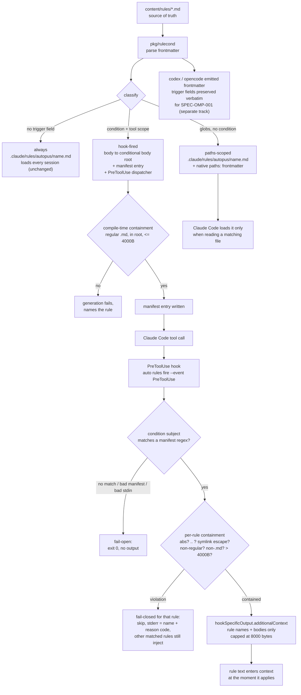

# SPEC-CONDRULE-001 Implementation Plan

## Tasks

- [x] T1: Add the trigger frontmatter schema and parser in `[NEW] pkg/rulecond/schema.go`. Define the rule struct with `Name`, `Description`, `Category`, `Condition`, `Scope`, `Globs`, `AlwaysApply`, `InterruptMode`, `AstCondition`, and a raw-field map that preserves unrecognized keys verbatim. Parse with the existing `gopkg.in/yaml.v3` dependency, splitting frontmatter the same way `pkg/content/skills.go::splitFrontmatter` does. Accept `condition` as either a single string or a string list.
- [x] T2: Add classification and validation in `[NEW] pkg/rulecond/classify.go`. Return exactly one of `always`, `paths-scoped`, `hook-fired` per rule. Reject glob-shaped `condition` values by naming the rule and field. Reject a `condition` without a tool `scope`. Parse `scope` entries of the form `tool:bash` and `tool:edit(<glob>)` into a hook event plus a Claude Code tool matcher.
- [x] T3: Add the claude-code `paths-scoped` compiler in `[NEW] pkg/rulecond/compile_claude.go`. Translate `globs` into a native `paths:` frontmatter list, keep the rule file at `.claude/rules/autopus/<name>.md`, and register no hook entry.
- [x] T4: Extend the same compiler for `hook-fired` rules. Emit the body to `.claude/hooks/autopus/conditional/<name>.md`, emit `.claude/hooks/autopus/conditional-rules.json` with rules sorted by name and stable key order, and return one `adapter.HookConfig` per distinct event and matcher pair. Wire the returned configs through `pkg/content/hooks.go::generateCLIHooks` and the rule routing in `pkg/adapter/claude/claude_prepare_files.go::prepareContentFilesForConfig`, which currently copies every `content/rules` entry into `.claude/rules/autopus/`.
- [x] T5: Add the dispatcher in `[NEW] pkg/rulecond/fire.go` and `[NEW] internal/cli/rules.go`. Implement `auto rules fire --event PreToolUse`: read the hook stdin payload, select the condition subject by `tool_name`, match manifest regexes with Go `regexp`, and print a `hookSpecificOutput.additionalContext` JSON object holding matched rule names and bodies. Enforce the 8000-byte aggregate cap with reverse rule-name dropping, emit only rule text, and fail open to exit zero, with empty output when the manifest, the stdin payload, or any match is absent, and with only the affected rule skipped when a single body file is missing.
- [x] T6: Add `auto rules list` to `[NEW] internal/cli/rules.go`, printing each rule with classification, trigger summary, and compiled claude-code destination. Register `newRulesCmd()` in `internal/cli/root.go`, where the `rules` namespace is currently unused.
- [x] T7: Map the four rules in `content/rules/`. Add full frontmatter to `worktree-safety.md`, which currently has none. Assign `scope: tool:bash` plus condition regexes to `shell-portability.md`, `lore-commit.md`, and `worktree-safety.md`. Assign source-code `globs` to `file-size-limit.md`, keeping its dynamic render path in `pkg/adapter/claude/claude_filesize.go` intact. Leave the other ten rules untouched.
- [x] T8: Preserve trigger fields in the codex and opencode emitted frontmatter. `pkg/adapter/codex/codex_rules.go::ensureCodexRulePlatform` already appends `platform: codex` to an existing frontmatter block and preserves the rest; add a regression test that trigger fields survive. `pkg/adapter/opencode/opencode_rules.go::prepareRuleMappings` copies content verbatim; add the same assertion. Leave `pkg/adapter/gemini/gemini_rules.go` behavior unchanged.
- [x] T9: Reconcile the parity gate and the drift mappings. Extend `classifyFile` in `pkg/adapter/parity_test.go` with a case that returns `rules` when the lowercased target path contains `hooks/autopus/conditional/`, placed alongside the existing `rules/` case. Add `TestParity_ClassifyFile` rows for a conditional body and for the manifest file, since `conditional-rules.json` contains no `conditional/` segment and must stay uncounted. Add the two new generated conditional paths to the `.claude/rules/` source mapping in `internal/cli/check_rules_hygiene.go` so `auto doctor` drift detection does not report them as orphans.
- [x] T10: Write the firing oracle tests and capture live evidence. Add table-driven dispatcher tests, a generated-surface test asserting the eleven remaining baseline rule files, a manifest determinism test, and a benign-absence fail-open test. Then run `auto update`, start a Claude Code session, issue a matching Bash command, and record the observed injection.
- [x] T11: Add read-side containment in `[NEW] pkg/rulecond/contain.go` and enforce it on both sides. At compile time, refuse to write a manifest entry whose body is not a regular `.md` file inside the conditional body root or exceeds 4000 bytes, failing generation with the rule name. At dispatch time, join each manifest-relative body location onto the conditional body root, reject absolute values and any `..` component before touching the filesystem, resolve symlinks with `filepath.EvalSymlinks`, confirm the resolved path still has the root as a prefix, confirm `Mode().IsRegular()` and the `.md` suffix, and enforce the per-body cap before reading. Emit the rule name and reason code to stderr only, never the resolved path or file bytes. Keep containment failures fail-closed per rule while other matched rules still inject.

## Implementation Strategy

The change is additive at the schema level and subtractive at the context level. A rule with no trigger field flows through exactly the code path it uses today, which is what keeps the ten unconditional rules byte-identical.

Two firing mechanisms are used deliberately. Path-scoped rules need no ADK runtime at all because Claude Code already implements `paths:` frontmatter natively; only a field translation is required. Tool-input regex matching has no native equivalent, so it needs the dispatcher. Splitting on this line keeps the new runtime surface as small as the problem allows.

The dispatcher is a Go subcommand rather than a shell script. `auto` is already a hard dependency of the existing hook configs in `pkg/content/hooks.go`, so this adds no new runtime requirement, while a shell dispatcher would add a `jq` dependency of the kind `content/hooks/task-created-validate.sh` already has to work around. Go `regexp` is RE2, so a pathological rule regex cannot cause catastrophic backtracking on attacker-influenced command text.

Containment is enforced twice on purpose. The compile-time check in T11 turns a bad body into a loud generation failure at `auto update`, and the dispatch-time check in T11 defends the case the compile-time check cannot see, which is a manifest that arrived with a cloned repository rather than from this compiler. Only the dispatch-time check is security-relevant; the compile-time check exists so a legitimate rule never stops firing silently after crossing the size cap.

One dispatcher entry per matcher, rather than one per rule, keeps the per-tool-call cost at a single process spawn no matter how many rules are mapped later.

## Visual Planning Brief



Command flow for the dispatcher, which is the only new runtime path:

```
stdin JSON  -> {"tool_name":"Bash","tool_input":{"command":"git commit -m x"}}
subject     -> tool_input.command
match       -> manifest rule "lore-commit" condition /\bgit\s+commit\b/
contain     -> root + "lore-commit.md" -> regular .md inside root, 1.6 KB -> ok
stdout JSON -> {"hookSpecificOutput":{"hookEventName":"PreToolUse",
                "additionalContext":"<lore-commit body>"}}
exit        -> 0 (always; advisory only)
```

## Feature Completion Scope

The Primary SPEC closes the Outcome Lock on its own. T1 and T2 deliver the schema and classification, T3 and T4 deliver both compilation paths, T5 delivers the runtime that makes a hook-fired rule appear in context, T11 keeps that runtime from becoming a file-read primitive, T7 makes the benefit real for four shipped rules, T9 keeps the parity gate honest under relocation, and T10 supplies the live firing evidence that distinguishes a wired feature from a scaffold.

The sibling `SPEC-STICKYRULE-001` depends on T1 for the `alwaysApply` field and on the `pkg/rulecond` parser, but nothing in this Outcome Lock waits on the sibling. A user who installs only this SPEC gets working conditional rules.

No Completion Debt is carried. Items recorded in `research.md` under `## Evolution Ideas` are optional and do not gate sync completion.

## Verification

| Step | Command | Gate |
|------|---------|------|
| Unit | `go test ./pkg/rulecond/...` | oracle tests for classify, compile, contain, fire |
| Wiring | `go test ./pkg/content/... ./pkg/adapter/claude/...` | hook config and file mapping |
| Parity | `go test ./pkg/adapter -run TestParity` | claude 14, codex 14, Codex rules parity 100% |
| Surface | `go build ./... && go vet ./...` | build and vet clean |
| Live | `auto update` then a Claude Code session with a matching Bash command | observed injection trace |
| SPEC | `auto spec validate autopus-adk/.autopus/specs/SPEC-CONDRULE-001 --strict` | zero error findings |
