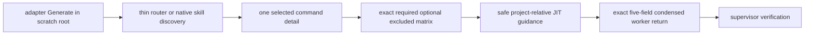

# SPEC-CONTEXT-ENGINEERING-001 Plan

## Implementation Strategy

새 selector/schema/dependency를 만들지 않는다. 기존 four-adapter Generate 경로와 promptlayer delivery를 oracle로 사용하고, generation source의 문구·profile·worker guidance만 정렬한다. RED tests는 scratch root의 effective paths, exact document sets, exact five-field owners, unsafe-reference guidance tokens, doctor symbol/ID stability를 먼저 고정한다.

`templates/claude/commands/auto-workflows.md.tmpl` 상단 preload block은 installed selection을 소유하지 않는 generation-only preamble이다. 이번 구현은 이를 runtime selector로 바꾸거나 설치하지 않으며, `.claude/skills/auto/SKILL.md` → exactly one `.claude/skills/autopus/auto-<route>.md` 경로를 유지한다.

## Visual Planning Brief



## Canonical Generation Oracle

| Platform | Router/discovery path | `go` effective path | pipeline effective path |
|---|---|---|---|
| Claude | `.claude/skills/auto/SKILL.md` | `.claude/skills/autopus/auto-go.md` | `.claude/skills/autopus/agent-pipeline.md` |
| Codex | `.codex/prompts/auto.md` | `.agents/skills/auto-go/SKILL.md` and `.codex/skills/auto-go.md` | `.codex/skills/agent-pipeline.md` |
| OpenCode | `.agents/skills/auto/SKILL.md` | `.agents/skills/auto-go/SKILL.md` | `.agents/skills/agent-pipeline/SKILL.md` |
| Gemini | `.gemini/skills/auto/SKILL.md` | `.gemini/skills/autopus/auto-go/SKILL.md` | `.gemini/skills/autopus/agent-pipeline/SKILL.md` |
| Antigravity mirror | plugin discovery | `.agents/plugins/autopus/skills/auto-go/SKILL.md` | `.agents/plugins/autopus/skills/agent-pipeline/SKILL.md` |

The planned cross-adapter test normalizes syntax only; it does not infer runtime context selection from prose.

## Feature Completion Scope

Primary SPEC 하나가 generated effective paths와 deterministic contract oracle을 닫는다. Runtime `ContextPlan`, provider-native compaction/tool control, default skill pruning, scenario parser migration은 explicit non-goals이며 Completion Debt가 아니다.

## Minimality Decision

| Need | Existing reuse | Decision |
|---|---|---|
| Claude selection | `auto-router.md.tmpl`, `claude_workflow_skills.go`, router budget test | preserve and prove, no new selector |
| supervisor delivery | `BuildContextDelivery`, `availableDefaultConditionalDocuments` | preserve available architecture full-body delivery |
| worker recall | memindex refs/hashes/omitted count | guidance only; no new schema |
| worker receipt | existing four canonical five-field owners | exact set oracle plus additive semantics |
| JIT safety | `cleanContextReference`, `readRequiredContextSource`, `SanitizeContent(PreserveInjectionEvidence)` | restate existing safety contract |
| doctor guard | `ContextLoadSet` and JSON checks | wording only; symbols/IDs unchanged |

## Tasks

- [x] T1: Create `[NEW] pkg/adapter/context_engineering_acceptance_test.go`, `[NEW] pkg/adapter/context_engineering_test_helpers_test.go`, and `[NEW] internal/cli/context_engineering_contract_test.go` as RED tests. Assert scratch effective paths, the exact command/document matrix, Claude one-detail count and absent installed `auto-workflows.md`, route-resolved pipeline reachability, exact five-field owner sets, additive JIT/condensed semantics, unsafe-ref rejection polarity, `ContextLoadSet`, doctor JSON IDs, advisory health, Antigravity mirror parity, and WIP hygiene.
- [x] T2: Align generated command profiles in the Claude, Codex, OpenCode, and Gemini/Antigravity effective generation paths. Distinguish supervisor full delivery from delegated-worker optional recall; do not edit or install the generation-only `auto-workflows` preamble.
- [x] T3: Add safe JIT and bounded condensed-return guidance to the actual platform pipeline sources: `content/skills/agent-pipeline.md`, `templates/codex/skills/agent-pipeline.md.tmpl`, `templates/gemini/skills/agent-pipeline/SKILL.md.tmpl`, and `pkg/adapter/codex/codex_extended_skill_rewrites_pipeline.go`. Preserve the exact five-field receipt schema and forbid raw/repeated body replay.
- [x] T4: Correct context-catalog/scenario guidance and doctor human-readable terminology in `content/rules/doc-storage.md`, `internal/cli/doctor_context_weight.go`, and `internal/cli/doctor_json_checks.go` without renaming `ContextLoadSet` or doctor check IDs.
- [x] T5: Run focused adapters, promptlayer, memindex, worker/compress, templates, doctor, race, vet, build, strict SPEC, architecture, and diff hygiene gates.
- [x] T6: Complete annotation, validator/tester, reviewer/security discovery, then verify only remaining findings.
- [x] T7: Sync SPEC evidence and CHANGELOG to actual results; do not commit or push without separate user authorization.

## Implemented Path Set

The following source-controlled paths are owned by this SPEC. Generated scratch outputs and ignored review artifacts are not part of the commit slice.

- `CHANGELOG.md`
- `content/rules/doc-storage.md`
- `content/skills/agent-pipeline.md`
- `internal/cli/context_engineering_contract_test.go`
- `internal/cli/doctor.go`
- `internal/cli/doctor_context_weight.go`
- `internal/cli/doctor_json_checks.go`
- `pkg/adapter/context_engineering_acceptance_test.go`
- `pkg/adapter/context_engineering_test_helpers_test.go`
- `pkg/adapter/claude/claude_context_profile_test.go`
- `pkg/adapter/claude/claude_workflow_skills.go`
- `pkg/adapter/codex/codex_context_docs.go`
- `pkg/adapter/codex/codex_extended_skill_rewrites_pipeline.go`
- `pkg/adapter/gemini/gemini_context_profile_test.go`
- `pkg/adapter/opencode/opencode_util.go`
- `pkg/adapter/opencode/opencode_workflow_custom.go`
- `templates/codex/skills/agent-pipeline.md.tmpl`
- `templates/codex/skills/auto-canary.md.tmpl`
- `templates/codex/skills/auto-go.md.tmpl`
- `templates/codex/skills/auto-plan.md.tmpl`
- `templates/gemini/skills/agent-pipeline/SKILL.md.tmpl`
- `templates/gemini/skills/auto-canary/SKILL.md.tmpl`
- `templates/gemini/skills/auto-go/SKILL.md.tmpl`
- `templates/gemini/skills/auto-plan/SKILL.md.tmpl`
- `templates/gemini/skills/auto-test/SKILL.md.tmpl`

## Ownership

| Order | Owner | Paths | Forbidden |
|---|---|---|---|
| 1 | Tester | the three `[NEW]` test files in T1 | production and existing dirty tests |
| 2 | Executor A | T2 and T3 platform source/template paths | doctor files, SPEC review artifacts, unrelated WIP |
| 3 | Executor B | T4 documentation/doctor paths | adapter/pipeline sources, unrelated WIP |
| 4 | Validator/Reviewer | read-only scoped verification | edits outside assigned fixes |

Writes are sequential when paths overlap. Scratch generated roots are temporary verification artifacts and are never staged.

## Risks

| Risk | Mitigation |
|---|---|
| prose mistaken for runtime enforcement | generated-surface Outcome Lock and explicit non-goal |
| architecture incorrectly labeled optional | separate supervisor available-auto-inclusion from worker optional recall |
| receipt schema drift | exact five-field owner-set oracle |
| unsafe optional ref | concrete reject matrix and sanitizer/injection-evidence oracle |
| scenario false-green | preserve Build/Command/Verify/Status and forbid index-only replacement |
| existing WIP mixed in | owned paths, status/diff checks, new isolated tests |

## Verification

```bash
go test ./pkg/adapter ./pkg/adapter/claude ./pkg/adapter/codex ./pkg/adapter/gemini ./pkg/adapter/opencode ./internal/cli ./templates -count=1
go test ./pkg/promptlayer ./pkg/memindex ./pkg/worker/compress -count=1
go test -race ./pkg/adapter ./internal/cli ./pkg/promptlayer
go vet ./...
go build ./...
auto spec validate .autopus/specs/SPEC-CONTEXT-ENGINEERING-001 --strict
auto arch enforce .
git diff --check -- .autopus/specs/SPEC-CONTEXT-ENGINEERING-001
```

## Exit Criteria

- [x] S1-S8 and Edge Case 1-3 PASS
- [x] four-adapter scratch matrix and Antigravity mirror parity PASS
- [x] exact five-field owners and JIT security polarity oracle PASS
- [x] full delivery, doctor symbol/ID, scenario wire regressions 0
- [x] no unrelated/generated runtime file staged
- [x] reviewer/security findings resolved
- [x] Completion Debt none
