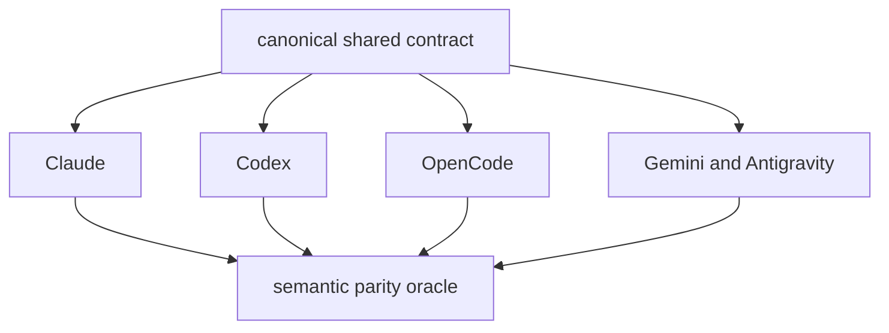

# SPEC-CONTEXT-ENGINEERING-001 Research

## Reviewer Brief

- Intended scope: backward-compatible generated-surface alignment for an exact command/document matrix, safe stable-ref guidance, condensed worker returns, doctor/catalog terminology, and scenario executable-wire protection.
- Explicit non-goals: new context schema/runtime, default skill pruning, provider-native compaction/tool control, promptlayer full-delivery changes, scenario parser behavior changes.
- Reviewer focus: four-platform effective surfaces, no required-context weakening, no scenario false-green encouragement, no root generated artifacts, concise prompt delta.

## Self-Verify Summary

| Check | Result | Evidence |
|---|---|---|
| Q-CORR-04 reference discipline | PASS | existing and planned paths are separated below |
| Q-COMP-05 semantic invariants | PASS | INV-001 through INV-010 map to acceptance IDs |
| Q-COMP-06 reviewer brief | PASS | scope, non-goals, evidence, and focus are explicit |
| Q-COMP-07 completion/evolution separation | PASS | implementation is complete; optional evolution ideas remain non-goals |

## Outcome Lock

네 adapter의 scratch generated effective paths가 exact command/document matrix, safe project-relative retrieval guidance, bounded condensed return을 같은 의미로 제공하고, document rotation이 executable scenario wire를 훼손하지 않게 한다. Runtime JIT selection이나 provider result parsing은 이 Outcome Lock의 일부가 아니다.

## Official Evidence

Anthropic's context-engineering guidance recommends treating context as finite, keeping the smallest high-signal token set, using just-in-time retrieval through stable identifiers, clearing stale tool results, maintaining structured long-horizon notes, and using subagents that return condensed summaries.

Platform-native progressive disclosure already supports this direction:

- Claude Code keeps concise `CLAUDE.md` instructions always loaded while skill bodies are loaded on demand.
- Codex skills use metadata discovery and load full skill instructions only when selected.
- OpenCode skills expose descriptions for discovery and load skill bodies on demand.
- Gemini CLI agent skills expose metadata first and load instructions/resources after activation.

## Current Code Evidence

| Existing boundary | Reuse |
|---|---|
| `pkg/promptlayer/context_profile.go` | command required/conditional profiles |
| `pkg/promptlayer/context_delivery.go` | complete required bodies and body-free ref/hash receipt |
| `pkg/memindex/context_receipt.go` | 800-2,000 token bounded metadata/recall receipt |
| `pkg/worker/compress` | structured seven-section compaction and tool-pair pruning |
| `templates/claude/commands/auto-router.md.tmpl` and `pkg/adapter/claude/claude_workflow_skills.go` | one selected generated detail after routing |
| `content/skills/agent-teams.md` and `templates/shared/orchestration-contract.md.tmpl` | canonical five-field worker receipt ownership |
| Codex/OpenCode/Gemini skill discovery | native progressive disclosure |

## Findings

1. The dominant immediate defect is surface contradiction, not missing infrastructure.
2. `templates/claude/commands/auto-workflows.md.tmpl` top preamble is a generation-only source and is not installed. Existing thin-router/detail generation owns Claude selection; tests must prove that path instead of treating prose as runtime enforcement.
3. `go` context semantics are explicit in Claude but not uniformly present in Codex, OpenCode, and Gemini effective skills.
4. The input receipt already forbids repeated artifact bodies, but it does not clearly pair that rule with a bounded worker return on all generated platforms. The five-field schema is owned by agent-teams and shared orchestration-contract surfaces, not by agent-pipeline alone.
5. Default skill pruning is intentionally compatibility-preserving and must not change without measured rollout evidence.
6. Existing complete GPT/Codex context delivery intentionally includes available architecture documents. Removing that behavior would contradict a completed integrity SPEC.
7. Scenario slimming is dangerous: an index without `Command` and `Verify` can appear runnable to the current parser/runner. This change prevents further archival but leaves parser hardening to a separate compatibility decision.

## Visual Planning Brief

## Semantic Invariant Inventory

| ID | Invariant | Acceptance |
|---|---|---|
| INV-001 | four generated command matrices share exact sets | S2, Edge 1 |
| INV-002 | Claude thin router reaches exactly one generated detail | S1 |
| INV-003 | required documents remain complete and hash-verified | S7, Edge 2 |
| INV-004 | runnable scenario wire retains executable fields | S5 |
| INV-005 | canonical five-field return remains exact | S3, Edge 3 |
| INV-006 | generated retrieval guidance preserves the existing safe-ref boundary | S4, Edge 2 |
| INV-007 | supervisor full delivery is distinct from worker optional recall | S2, S7 |
| INV-008 | raw outputs remain referenced artifacts | S4 |
| INV-009 | doctor symbols/IDs and advisory behavior stay compatible | S6 |
| INV-010 | scratch parity proof remains temporary and does not modify or stage generated/runtime artifacts or unrelated WIP | S8 |

## Feature Coverage Map

| Outcome slice | Coverage | Status |
|---|---|---|
| exact generated command matrix | existing router/profile plus S1/S2 | covered by Primary SPEC |
| safe stable-ref guidance | shared pipeline contract plus S4 | covered by Primary SPEC |
| canonical condensed worker return | canonical owners plus S3 | covered by Primary SPEC |
| four-platform and Antigravity parity | S1-S4 | covered by Primary SPEC |
| scenario executable-wire protection | S5 | covered by Primary SPEC |
| runtime JIT selector, receipt parser, and default change | non-goal | optional future evidence |

## Alternatives Rejected

| Alternative | Reason |
|---|---|
| ContextPlan v2 in this slice | requires runtime/config/schema rollout and compatibility evidence beyond the immediate surface defects |
| remove implicit available architecture now | contradicts completed full-context integrity acceptance |
| set shared skill surface default to core | contradicts completed compatibility decision |
| add vector search/RAG | existing stable filesystem refs and memindex are sufficient |
| provider-specific copies of the policy | increases drift; shared source and platform templates already exist |
| archive verbose scenario bodies | can create index-only false-green under current parser |

## Evolution Ideas

These are optional evolution ideas, not scheduled requirements:

- shadow-only `full|jit` context plan with token delta and selection-hit metrics before any default change
- common additive worker receipt schema after an actual provider-neutral result parser owns it
- Claude/Gemini skill compiler parity and tool capability projection
- scenario parser fail-closed validation with an explicit compatibility migration
- small failure-derived canonical examples for high-risk prompt boundaries

## Reference Discipline

| Reference | Type | Verification |
|---|---|---|
| `pkg/promptlayer/context_profile.go` | existing | read and focused tests PASS |
| `pkg/promptlayer/context_delivery.go` | existing | read; completed integrity contract retained |
| `pkg/memindex/context_receipt.go` | existing | read; 800-2,000 receipt boundary |
| `pkg/worker/compress` | existing | read and focused tests PASS |
| `content/skills/agent-pipeline.md` | existing, edited | shared bounded-return and safe-ref guidance |
| `pkg/adapter/claude/claude_workflow_skills.go` | existing, edited | Claude effective command-profile projection |
| `pkg/adapter/codex/codex_extended_skill_rewrites_pipeline.go` | existing, edited | effective Codex pipeline body owner |
| `pkg/adapter/opencode/opencode_workflow_custom.go` and `pkg/adapter/opencode/opencode_util.go` | existing, edited | OpenCode effective profile and route-safe pipeline reference |
| `templates/codex/skills/auto-go.md.tmpl` | existing, edited | Codex/OpenCode go detail |
| `templates/gemini/skills/auto-go/SKILL.md.tmpl` | existing, edited | Gemini/Antigravity go detail |
| `pkg/adapter/claude/claude_context_profile_test.go` and `pkg/adapter/gemini/gemini_context_profile_test.go` | existing, edited | platform profile regression oracles |
| `[NEW] pkg/adapter/context_engineering_acceptance_test.go` | new | cross-adapter acceptance entrypoint |
| `[NEW] pkg/adapter/context_engineering_test_helpers_test.go` | new | scratch route reachability and security-polarity helpers |
| `[NEW] internal/cli/context_engineering_contract_test.go` | new | doctor, catalog, and scenario compatibility oracle |

## Revision 2 Closure

| Finding | Closure | Evidence |
|---|---|---|
| F-001 | Outcome Lock narrowed to generated surfaces; existing Claude selector and non-installed preamble are explicit | spec Outcome Boundary, plan Canonical Generation Oracle, S1 |
| F-002 | exact command/document set and scratch path oracles replace text-only claims | S1, S2 |
| F-003 | canonical five-field and effective Codex pipeline owners added | Current Code Evidence, Reference Discipline, plan T3 |
| F-004 | authoritative and exit sets both include Edge Case 1-3 | spec Acceptance Criteria, plan Exit Criteria |
| F-005 | path/file-type/sanitization/redaction/injection guards are required | REQ-JIT-001, S4, Edge 2 |
| F-006 | supervisor full delivery and worker optional recall are separate layers | REQ-DELIVERY-001, S2, S7 |
| F-007 | `ContextLoadSet` and exact `doctor.context_weight.*` IDs are invariant | REQ-DOCTOR-001, S6 |
| F-008 | planned tests carry `[NEW]` | Reference Discipline |
| F-009 | exact planned test paths are listed | plan T1, acceptance Oracle Notes |

## Implementation and Review Closure

| Gate | Result | Evidence |
|---|---|---|
| RED-to-GREEN | PASS | focused adapter and CLI contract tests failed before source alignment and pass after implementation |
| Generated reachability | PASS | Claude, Codex, OpenCode, Gemini, and Antigravity `auto-go` pipeline refs resolve to regular files inside the same scratch root; stale and missing targets fail closed |
| Security polarity | PASS | exact restrictive clauses pass; absolute/traversal/symlink/non-regular inversion, sanitize bypass, and raw replay adversarial fixtures fail |
| Compatibility | PASS | promptlayer, memindex, worker/compress, e2e, templates, doctor, full adapter, race, vet, and build gates pass |
| Review convergence | PASS | route reachability, Gemini pipeline reference, and contradictory legacy test-profile findings resolved; verification-only review approved |
| Security convergence | PASS | keyword-only false-positive oracle replaced with polarity-aware adversarial validation; no open security finding |
| Hygiene | PASS | scratch roots remain temporary, tracked-but-ignored set is empty, staging area is empty, and unrelated dirty WIP is preserved |

## Completion Debt

None. This is a source/template generation contract, so deterministic scratch generation is the authoritative gate; no external runtime canary is required.
