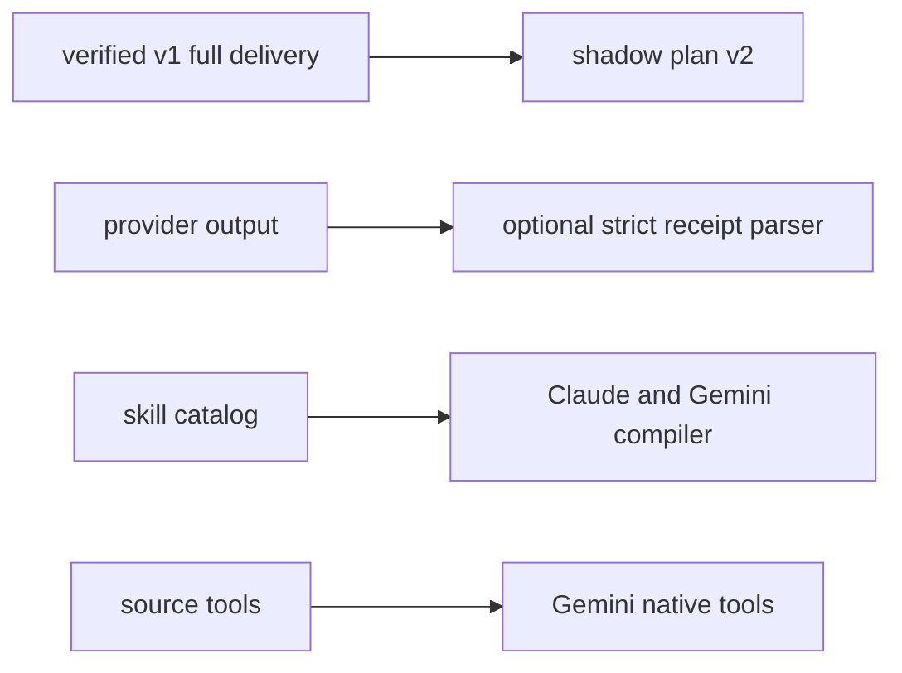

# SPEC-CONTEXT-ENGINEERING-EVOLUTION-001 Plan

## Implementation Strategy

Use additive, shadow-first boundaries. V1 remains active. Receipt parsing is
strict only when an explicit marker exists. Compiler changes affect existing
opt-in split configurations; blank/default remains full.

## Visual Planning Brief



## Feature Completion Scope

This Primary SPEC closes shadow planning, marked worker receipt consumption,
and Claude/Gemini compiler/tool projection. Scenario migration is the only
sibling SPEC. Provider history, default reduction, and body shrink remain
future promotion decisions rather than Completion Debt.

## Tasks

- [x] T1: Add RED tests for sidecar separation, metrics, null hits,
  unavailable non-gating behavior, and v1 invariance.
- [x] T2: Implement `[NEW] pkg/memindex/context_plan.go`,
  `[NEW] internal/cli/workflow_context_plan.go`, and the `[NEW] auto workflow
  context-plan` subcommand.
- [x] T3: Add RED tests for exact fields, marker parsing, bounded evidence,
  unsafe refs, and markerless compatibility.
- [x] T4: Implement `[NEW] pkg/workerreceipt/**`, alias the pipeline receipt
  body type, and append valid envelopes at the pipeline evidence boundary.
- [x] T5: Add RED tests for Claude/Gemini compiler parity, native/mirror
  retention, Gemini tool mapping, and unsupported omission.
- [x] T6: Apply catalog filtering to Claude/Gemini, project Gemini tools,
  regenerate tracked templates, and add canonical examples.
- [x] T7: Run discovery review/security/AX, resolve findings, and repeat only
  verification of open findings.
- [x] T8: Run focused/full verification and sync SPEC/CHANGELOG without commit
  or push absent explicit authorization.

## Sequential Ownership

| Slice | Owned paths | Forbidden |
|---|---|---|
| plan | `[NEW] pkg/memindex/context_plan*`, `[NEW] internal/cli/workflow_context_plan*`, `internal/cli/workflow.go` | v1/worker full-body owners |
| receipt | `[NEW] pkg/workerreceipt/**`, pipeline receipt/evidence files | orchestra debate parser |
| platform | Claude/Gemini skill materialization, agent transformer/templates, pipeline examples | provider settings and defaults |

Writes are sequential because the feature depends on uncommitted baseline
context work.

## Verification

```bash
go test ./pkg/memindex ./pkg/promptlayer ./internal/cli -count=1
go test ./pkg/workerreceipt ./pkg/pipeline -count=1
go test ./pkg/content ./pkg/adapter/claude ./pkg/adapter/gemini -count=1
go test ./pkg/adapter ./pkg/adapter/codex ./pkg/adapter/opencode ./templates -count=1
go test -race ./pkg/memindex ./pkg/workerreceipt ./pkg/pipeline ./pkg/content
go vet ./...
go build ./...
go run ./cmd/auto spec validate .autopus/specs/SPEC-CONTEXT-ENGINEERING-EVOLUTION-001 --strict
go run ./cmd/auto arch enforce .
git diff --check
```

## Exit Criteria

- [x] S1-S8 and Edge Case 1-4 PASS
- [x] v1 delivery and full defaults unchanged
- [x] malformed marked evidence cannot pass
- [x] excluded long-tail skills do not leak in opt-in split mode
- [x] no raw body/query/secret/absolute path in new receipts
- [x] no unrelated/generated root WIP staged
- [x] review/security convergence complete
