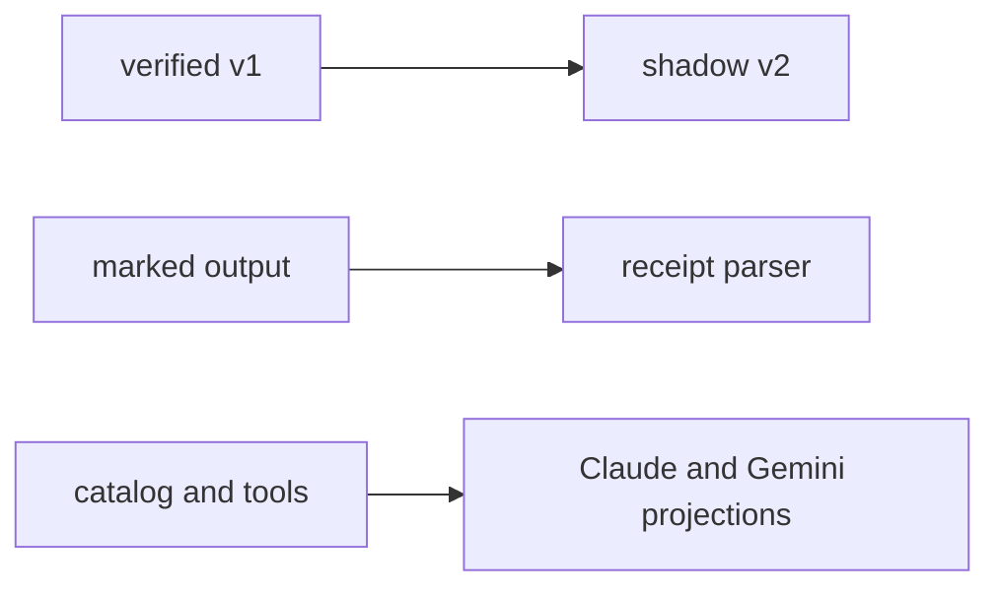

# SPEC-CONTEXT-ENGINEERING-EVOLUTION-001 Research

## Reviewer Brief

- Scope: shadow selection, explicit worker receipt parsing, and existing
  compiler/tool projection parity.
- Non-goals: provider history mutation, defaults, active JIT, body shrink,
  scenario migration.
- Focus: v1 invariance, non-gating shadow failure, parser ambiguity, cleanup
  ownership, and honest capability labels.

## Outcome Lock

Observe a smaller candidate and consume explicit structured evidence without
changing active full delivery, full compiler defaults, or provider-owned
history.

## Visual Planning Brief

## Official Evidence

- Anthropic recommends finite, high-signal context, stable-reference JIT
  retrieval, stale tool-result clearing, structured notes, and condensed
  subagent returns:
  <https://www.anthropic.com/engineering/effective-context-engineering-for-ai-agents>
- Claude supports isolated subagent contexts, native tool allowlists, and
  on-demand skills:
  <https://code.claude.com/docs/en/sub-agents>
- Codex exposes provider-owned compaction/output limits and progressive skill
  disclosure; ADK does not own its native history.
- Gemini custom subagents support native `tools`; official names include
  `read_file`, `grep_search`, `glob`, `run_shell_command`, `replace`, and
  `write_file`:
  <https://geminicli.com/docs/core/subagents/>
  <https://geminicli.com/docs/reference/tools/>
- OpenCode supports per-agent permissions; provider configuration is not a
  license to mutate native history:
  <https://opencode.ai/docs/agents/>

## Findings

1. Verified v1 documents already provide refs, hashes, and token estimates; a
   separate sidecar avoids breaking strict v1 consumers.
2. Pipeline/orchestra duplicate the five-field type but initialize empty lists;
   only pipeline phase output is a valid first consumer.
3. A terminal marker makes rollout unambiguous: absent is legacy, present is
   strict. Exact delimiters are `<!-- AUTOPUS_WORKER_RECEIPT_BEGIN -->` and
   `<!-- AUTOPUS_WORKER_RECEIPT_END -->`.
4. Claude bypasses the compiler by copying all skills. Gemini filters templates
   then reintroduces excluded skills through extended generation.
5. Gemini now supports isolated tool frontmatter, so dropping source
   restrictions is unnecessary.
6. Provider-native history remains outside ADK ownership; existing pair-aware
   compression applies only to ADK-owned phase handoffs.
7. Worker receipt strings are untrusted metadata. Absolute, traversal,
   NUL-bearing, and non-clean paths are rejected. Parsed paths never grant
   filesystem access; any future file consumer must resolve beneath a trusted
   project root and revalidate.
8. Gemini tool projection mirrors trusted canonical source declarations but
   does not alter policy, sandbox, approval, or settings. Unknown and recursive
   capabilities are omitted.

## Semantic Invariant Inventory

| ID | Invariant |
|---|---|
| INV-001 | v1 full delivery remains compatible |
| INV-002 | v2 never gates or replaces v1 |
| INV-003 | receipt body remains exactly five fields; envelope evidence is separate |
| INV-004 | marker absence is compatible, presence strict |
| INV-005 | compiler defaults remain full |
| INV-006 | unsupported tools are never promoted |
| INV-007 | new receipts are body-free and project-relative |

## Feature Coverage Map

| Outcome | Coverage | Status |
|---|---|---|
| shadow plan | S1-S3, Edge 1-2 | implemented |
| worker receipt | S4-S5, Edge 3 | implemented |
| compiler/tool parity | S6-S7, Edge 4 | implemented |
| canonical examples | S8 | implemented |
| scenario migration | sibling SPEC | excluded here |

## Alternatives Rejected

| Alternative | Reason |
|---|---|
| fields inside v1 | strict consumers reject unknown fields |
| active JIT | no paired quality evidence |
| arbitrary embedded JSON | ambiguous unrelated output |
| orchestra parsing | debate output is not a worker handoff |
| provider settings mutation | ownership and version risk |
| default reduction | can silently remove skills |
| vector retrieval | current refs and memindex suffice |

## Sibling SPEC Decision

`SPEC-SCENARIO-PARSER-MIGRATION-001` is the only sibling. It is separated
because scenario admission has an independent warn-to-enforce compatibility
sequence and executable shell boundary. This Primary closes shadow planning,
worker receipt consumption, and platform compiler/tool parity; the sibling
alone owns scenario diagnostics, quarantine, and promotion debt. Each outcome
has independent Must acceptance and can ship without the other.

## Failure-Derived Examples

1. Return a stable ref and hashes instead of replaying an already-delivered
   required body.
2. Reject an explicit receipt marker whose JSON is malformed; do not silently
   fall back to prose.
3. Omit a capability with no verified platform mapping; never label it
   natively enforced.

## Promotion Gates

Active JIT or smaller defaults require representative labels, paired quality
and fallback evidence, zero integrity regressions, rollback, and explicit
approval.

## Evolution Ideas

- promote JIT only after labeled paired-quality evidence;
- evaluate a smaller shared-surface default with key-presence migration;
- add provider-native controls only where official capability negotiation and
  safe fallback exist.
- unify the duplicate orchestra worker receipt type only when orchestra gains
  an explicit worker route; debate output remains unparsed.

## Reference Discipline

| Reference | Type | Verification |
|---|---|---|
| `pkg/promptlayer/context_delivery.go` | existing | v1 compatibility tests |
| `pkg/memindex/**` | existing | focused tests |
| `pkg/pipeline/receipt.go` | existing | persisted receipt tests |
| `pkg/content/skill_catalog_distribution.go` | existing | compiler tests |
| Claude/Gemini adapter skill paths | existing | scratch generation |
| `pkg/memindex/context_plan.go` | implemented | shadow plan tests |
| `internal/cli/workflow_context_plan.go` | implemented | CLI JSON tests |
| `pkg/workerreceipt/receipt.go` | implemented | body/envelope tests |
| `pkg/workerreceipt/parser.go` | implemented | adversarial marker tests |

## Self-Verify Summary

| Check | Result | Evidence |
|---|---|---|
| Q-CORR-04 reference discipline | PASS | existing and planned refs separated |
| Q-COMP-05 semantic invariants | PASS | INV-001 through INV-007 |
| Q-COMP-06 reviewer brief | PASS | scope and focus explicit |
| Q-COMP-07 completion/evolution separation | PASS | promotion ideas remain future |

## Completion Debt

None. Active JIT and smaller defaults remain separate promotion decisions, not
unfinished work in this SPEC.
