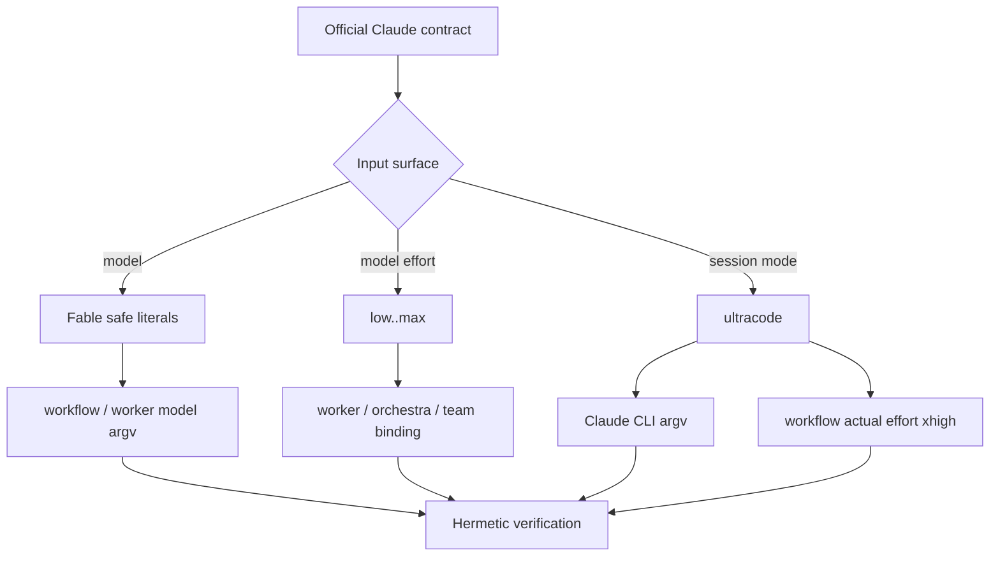

# SPEC-FABLE5-001 Plan: Claude Fable 5 및 세션 effort 지원

## Implementation Strategy

기존 모델 출시 반영 패턴과 CC21 effort resolver를 재사용한다. 새 dependency나 동적 catalog abstraction은 추가하지 않는다. 변경 순서는 fail-closed data tables와 RED 테스트, 최소 runtime 전달, 문서·템플릿 동기화, 통합 검증 순이다.

Fable은 기존 default routing에 삽입하지 않고 명시 model surface에서만 허용한다. `ultracode`는 Claude CLI에 전달 가능한 session 값으로만 취급하고, route-team의 model effort에는 공식 실제 값인 `xhigh`를 기록한다. global explicit flag의 forward-compatible pass-through는 configured/fallback orchestra에 한정하고, worker의 server-originated `TaskConfig.Effort`는 현재 공식 allowlist로 제한한다.

## File Impact Analysis

| 파일 | 작업 | 설명 |
|------|------|------|
| `pkg/workflow/schema_validate.go` | 수정 | Fable full ID와 `fable`/`best` safe literal 추가 |
| `pkg/workflow/schema_validate_test.go` | 수정 | alias/full ID 및 injection 회귀 |
| `pkg/cost/pricing.go` | 수정 | `claude-fable-5` 10/50 pricing 추가 |
| `pkg/cost/pricing_test.go` | 수정 | 가격과 기존 default mapping 불변 검증 |
| `internal/cli/effort_resolve.go` | 수정 | Ultra Fable/full alias/best를 `max`로 매핑 |
| `internal/cli/effort.go` | 수정 | Fable와 session-only `ultracode` help 경계 |
| `internal/cli/fable5_effort_test.go` | 생성 | Fable resolver와 explicit boundary 회귀 |
| `pkg/worker/adapter/claude.go` | 수정 | valid Claude CLI session effort argv 전달 |
| `pkg/worker/adapter/claude_test.go` | 수정 | effort allowlist/omit 및 Fable model argv |
| `internal/cli/orchestra_run_runtime.go` | 수정 | configured Claude Args/PaneArgs runtime upsert |
| `internal/cli/orchestra_helpers.go` | 수정 | split/equals syntax를 처리하는 shared `upsertClaudeEffortArg`와 fallback 적용 |
| `internal/cli/claude_effort_override_test.go` | 생성 | configured/fallback/pinned model 보존 회귀 |
| `internal/cli/workflow_binding.go` | 수정 | `workflowBindingOptions.effort`, global flag threading, quality 분기 전 invalid fail-close |
| `internal/cli/workflow_quality_binding.go` | 수정 | explicit five values 및 `ultracode`→`xhigh` phase normalization helper |
| `internal/cli/workflow_binding_test.go` | 수정 | explicit/invalid receipt 회귀 |
| `internal/cli/workflow_quality_binding_test.go` | 수정 | phase-level model effort 불변 검증 |
| `content/skills/adaptive-quality.md` | 수정 | Fable와 effort surface 구분 |
| `content/skills/using-autopus.md` | 수정 | Claude Fable opt-in 구성 예시 |
| `templates/claude/commands/auto-workflows.md.tmpl` | 수정 | binding argv와 `ultracode` semantics |
| `templates/codex/skills/*.tmpl` | 생성기 동기화 | shared source 문서 parity |
| `templates/gemini/skills/*/*.tmpl` | 생성기 동기화 | shared source 문서 parity |
| `CHANGELOG.md` | 수정 | 사용자 가시 변경 및 버전 경계 |
| `.autopus/specs/SPEC-FABLE5-001/**` | 수정 | lifecycle·evidence 동기화 |

## Architecture Considerations

- `pkg/workflow`의 closed whitelist는 JavaScript injection trust boundary이므로 free-form model 허용으로 넓히지 않는다.
- 가격 key는 결정적인 full model ID만 사용한다. `best`는 entitlement에 따라 해석이 바뀌므로 pricing key가 될 수 없다.
- quality defaults는 `pkg/cost`와 `pkg/config`의 기존 Opus 4.8/Sonnet 5 정책을 유지한다.
- `pkg/worker/adapter`는 argv를 shell string이 아닌 분리된 인자로 구성해 injection surface를 만들지 않는다.
- configured provider 변경은 로드된 config의 in-memory copy에만 적용하며 config file을 저장하지 않는다.
- route-team binding은 model effort 다섯 값만 emit한다. `ultracode` 요청은 `xhigh`로 normalize해 `pkg/workflow.safeEfforts`를 변경하지 않는다.
- source 문서를 먼저 수정하고 template generator를 한 소유자가 한 번 실행해 generated drift를 방지한다.

## Visual Planning Brief

## Feature Completion Scope

이 Primary SPEC 하나가 Fable opt-in catalog와 Claude effort 전달 경로를 닫는다. 승인된 sibling SPEC dependency는 없다. entitlement 탐지와 requested/actual runtime receipt는 Evolution Ideas이며 Completion Debt가 아니다. 이 SPEC의 Must scenario와 deterministic gate가 모두 통과하면 Completion Debt는 `none`이다.

## Tasks

- [x] T1 (REQ-MODEL-001): Fable full ID와 alias를 workflow whitelist에 추가하고 허용/거부 RED 테스트를 작성한다.
- [x] T2 (REQ-PRICE-001): full ID pricing 10/50을 추가하고 기존 가격·quality default 불변 테스트를 보강한다.
- [x] T3 (REQ-QUALITY-001): Ultra resolver가 `claude-fable-5`, `fable`, `best`를 `max`로 해석하게 하고 별도 회귀 테스트를 추가한다.
- [x] T4 (REQ-WORKER-001, REQ-WORKER-002, REQ-BOUNDARY-001): Claude worker adapter의 allowlisted session effort argv 전달과 invalid/empty 생략을 TDD로 구현한다.
- [x] T5 (REQ-RUNTIME-001, REQ-FALLBACK-001, REQ-BOUNDARY-001): `--effort value`와 `--effort=value`를 보존적으로 처리하는 shared `upsertClaudeEffortArg`를 구현하고 configured/fallback Args와 PaneArgs에서 재사용한다.
- [x] T6 (REQ-BINDING-001, REQ-ULTRACODE-001, REQ-BINDING-002, REQ-BOUNDARY-001): `workflowBindingOptions.effort`에 global flag를 thread하고 five values는 그대로, `ultracode`는 `xhigh`로 모든 agent phase에 적용한다. invalid explicit effort 검사는 Balanced/Ultra quality 선택보다 먼저 수행해 canonical Full Ultra로 fail-close하며, empty/valid Balanced는 기존 canonical bytes와 `canonical_balanced` reason을 보존한다.
- [x] T7 (REQ-DOC-001): source skill/help와 Claude command template을 갱신하고 template generator로 Codex/Gemini shared 문서 parity를 재생성한 뒤 결정성을 확인한다.
- [x] T8 (REQ-VERIFY-001): focused tests, race, `go vet`, `go build`, strict SPEC, architecture, diff hygiene와 Guardian review를 실행한다.
- [x] T9 (all): sync 단계에서 CHANGELOG, SPEC task/status, acceptance evidence를 실제 결과와 일치시킨다.

## Task Ordering and Ownership

| Order | Owner | Paths | Depends on |
|------|-------|-------|------------|
| 1 | Builder A | workflow whitelist, pricing, resolver, worker adapter와 해당 tests | approved SPEC |
| 1 | Builder B | configured/fallback orchestra, workflow binding과 해당 tests | approved SPEC |
| 2 | Lead | Builder diff 통합, focused tests, @AX scan handoff | T1-T6 |
| 3 | Builder Docs | source skills, templates, CHANGELOG | stable runtime behavior |
| 4 | Guardian | validator, reviewer, security auditor | all implementation |
| 5 | Lead | SPEC sync와 final verification | Guardian approval |

Builder A와 Builder B는 파일 소유권이 겹치지 않을 때만 병렬 실행한다. template generation은 문서 소유자 한 명이 수행한다.

## Risks & Mitigations

| 리스크 | 영향도 | 대응 |
|--------|--------|------|
| Fable entitlement/ZDR 부재로 live test 불안정 | 높음 | live call을 gate에서 제외하고 official contract + hermetic argv로 검증 |
| `ultracode`를 API effort로 오염 | 높음 | workflow/env/frontmatter enum 불변 테스트, team에서는 `xhigh` normalize |
| `best`의 동적 해석으로 비용 오계산 | 높음 | 가격은 full ID에만 등록 |
| global override가 pinned model/custom argv를 덮음 | 높음 | effort token만 upsert하고 model·순서·다른 flag 보존 테스트 |
| invalid worker effort가 subprocess 실패 유발 | 중간 | closed current CLI allowlist, invalid/empty omit |
| invalid binding effort가 JS에 주입 | 높음 | safeEfforts 유지 및 canonical Full Ultra fail-closed |
| generated template drift | 중간 | source-first single-owner generation + 두 번째 generation no-diff |
| 로컬 Claude 2.1.198에서 ultracode smoke 불가 | 낮음 | 설치 버전을 evidence로 기록하고 v2.1.203/2.1.210 경계를 문서화 |

## Dependencies

- 새 외부 dependency 없음.
- 기존 `ResolveEffort`, `safeAgentModels`, `safeEfforts`, `DefaultPricingTable`, `TaskConfig`, `applyRuntimeHarnessOverrides`, `resolveTeamQualityBinding` 패턴을 재사용한다.
- 공식 근거: Anthropic model configuration, CLI reference, effort API 문서, Claude Code releases.

## Rollback

변경은 additive model entry, bounded argv transformation, docs/tests로 제한된다. 회귀 시 Fable whitelist/pricing/resolver entry와 effort upsert/binding helper를 제거하고 기존 tests를 복원한다. config schema migration이나 persisted user data 변경이 없으므로 데이터 rollback은 필요 없다.

## Exit Criteria

- [x] 모든 mandatory requirement와 Must scenario가 concrete oracle로 통과
- [x] existing Opus 4.8/Sonnet 5 default mapping 회귀 없음
- [x] `ultracode`가 model/API/workflow/env/frontmatter/persisted enum에 추가되지 않음
- [x] focused unit tests와 race tests 통과
- [x] `go vet ./...`와 `go build ./...` 통과
- [x] template generation 재실행 시 추가 diff 없음
- [x] `auto spec validate .autopus/specs/SPEC-FABLE5-001 --strict` 통과
- [x] `auto arch enforce`와 `git diff --check` 통과
- [x] Guardian finding 전부 resolved, Completion Debt `none`
