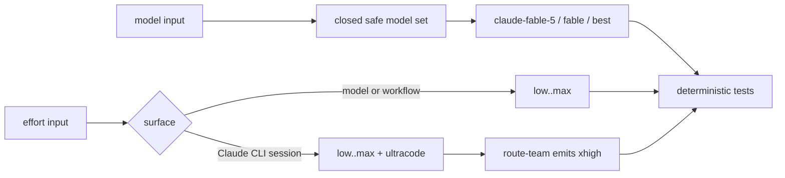

# SPEC-FABLE5-001 Research: Claude Fable 5 및 세션 effort 지원

## Codebase Analysis

ADK에는 Fable 문자열이 없지만 Claude 모델과 effort를 다루는 기존 경계가 명확히 분리되어 있다. 모델 가격과 quality defaults는 `pkg/cost/pricing.go`, generated workflow injection 경계는 `pkg/workflow/schema_validate.go`, CLI quality mapping은 `internal/cli/effort_resolve.go`, worker subprocess argv는 `pkg/worker/adapter/claude.go`, orchestra runtime override는 `internal/cli/orchestra_run_runtime.go`, route-team binding은 `internal/cli/workflow_binding.go`와 `workflow_quality_binding.go`가 소유한다.

`TaskConfig.Effort`는 worker message에서 adapter까지 이미 전달되지만 Claude adapter가 소비하지 않는다. configured orchestra runtime override는 Codex의 quality-managed provider만 갱신하고 Claude provider를 건드리지 않는다. fallback provider도 Claude를 항상 `opus/high`로 만든다. route-team command template은 explicit effort를 최우선이라고 선언하지만 실제 binding invocation과 resolver에는 값이 전달되지 않는다.

### Target Files

| 파일/심볼 | 현재 역할 | 변경 필요 |
|-----------|-----------|-----------|
| `pkg/workflow/schema_validate.go:safeAgentModels` | JS interpolation model whitelist | Fable full ID와 두 official alias 추가 |
| `pkg/cost/pricing.go:DefaultPricingTable` | deterministic full-ID pricing | Fable 10/50 추가 |
| `internal/cli/effort_resolve.go:resolveUltraMode` | quality→model effort | Fable/full alias/best max 분기 |
| `pkg/worker/adapter/claude.go:BuildCommand` | Claude worker argv | valid session effort 전달 |
| `internal/cli/orchestra_run_runtime.go:applyRuntimeHarnessOverrides` | config runtime override | Claude Args/PaneArgs effort upsert |
| `internal/cli/orchestra_helpers.go:buildProviderConfigsForRuntime` | fallback registry | Claude explicit effort 적용 |
| `internal/cli/workflow_binding.go:resolveWorkflowBinding` | route-team receipt | global explicit effort 소비·fail-close |
| `internal/cli/workflow_quality_binding.go` | phase binding | five values, ultracode→xhigh |
| `content/skills/*`, `templates/**` | installed guidance | source-first contract 동기화 |

## Official Contract Evidence

| Fact | Verified value | Source |
|------|----------------|--------|
| Fable full ID | `claude-fable-5` | https://platform.claude.com/docs/en/about-claude/models/overview |
| Claude Code aliases | `fable`, `best` | https://code.claude.com/docs/en/model-config#model-aliases |
| Fable pricing | USD 10 input / USD 50 output per MTok | https://platform.claude.com/docs/en/about-claude/models/introducing-claude-fable-5-and-claude-mythos-5 |
| Fable context/output | native 1M / max 128k | same Fable introduction |
| Fable availability | opt-in, entitlement-dependent, unavailable under ZDR | https://code.claude.com/docs/en/model-config#work-with-fable-5 |
| API/model efforts | `low`, `medium`, `high`, `xhigh`, `max` | https://platform.claude.com/docs/en/build-with-claude/effort |
| Fable minimum | Claude Code 2.1.170 | https://github.com/anthropics/claude-code/releases/tag/v2.1.170 |
| `ultracode` semantics | session-only, sends xhigh + dynamic workflows | https://code.claude.com/docs/en/model-config#adjust-effort-level |
| `ultracode` CLI minimum | 2.1.203 | https://code.claude.com/docs/en/cli-reference#cli-flags |
| agent/team propagation fix | 2.1.210 | https://github.com/anthropics/claude-code/releases/tag/v2.1.210 |
| research-time latest | 2.1.218, 2026-07-22 | https://github.com/anthropics/claude-code/releases/tag/v2.1.218 |

## Lore Decisions

- Sonnet 5 adoption established the pattern: add a new full model ID to pricing and safe whitelist while retaining valid legacy models and refreshing generated surfaces later.
- Opus 4.8 adoption established the directive: every new top-tier model addition must update both `resolveUltraMode` and pricing.
- CC21 established that explicit `--effort` is forward-compatible, while env/frontmatter remain guarded by the five-value enum.
- Existing issue #55 migration intentionally converts one exact historical Claude `opus/max` default tuple to `high`; this SPEC preserves that migration and applies any current explicit flag afterward in memory.

## Architecture Compliance

`auto arch enforce` reported no violation before authoring. Planned dependencies remain inward-compatible: CLI composes config/workflow/cost helpers; adapters construct provider argv; workflow owns its injection whitelist. No new dependency or cross-platform Fable default is introduced.

## Outcome Lock

- User-visible outcome: Fable 5 can be explicitly selected and current Claude effort controls reach actual worker, orchestra, and route-team launches without contaminating stored model effort types.
- Mandatory requirements: REQ-MODEL-001 through REQ-VERIFY-001.
- Explicit non-goals: default adoption, entitlement probe, safety fallback receipts, third-party env generation, global runtime upgrade, SDK catalog.
- Completion evidence: S1-S16, focused/race tests, vet/build, template parity, strict SPEC, Guardian approval.

## Visual Planning Brief

## Semantic Invariant Inventory

| ID | source clause | invariant type | affected outputs | acceptance IDs |
|----|---------------|----------------|------------------|----------------|
| INV-001 | Fable is opt-in but safe | trust boundary | schema verdict | S1, S2 |
| INV-002 | alias resolution is dynamic | pricing identity | pricing map | S3 |
| INV-003 | support is not default adoption | mapping preservation | quality model and effort | S4, S5 |
| INV-004 | worker accepts only current CLI session values | argv cardinality | `exec.Cmd.Args` | S6, S7 |
| INV-005 | explicit runtime effort changes effort only | state transition | provider Args and PaneArgs | S8, S9, S10 |
| INV-006 | ultracode is xhigh at model boundary | normalization/fail-close | binding quality JSON | S11, S12, S13 |
| INV-007 | stored model effort stays five-valued | type boundary | enum and serialized config | S7, S12, S14 |
| INV-008 | version and entitlement limits stay visible | documentation parity | source/generated docs | S15 |
| INV-009 | verification cannot depend on account access | deterministic oracle | command receipts | S16 |

## Feature Coverage Map

| Outcome slice | Covered by | Status |
|---------------|------------|--------|
| Fable safe identity and price | Primary SPEC REQ-MODEL-001, REQ-PRICE-001 | covered |
| Fable quality compatibility without default promotion | Primary SPEC REQ-QUALITY-001 | covered |
| worker Claude argv | Primary SPEC REQ-WORKER-001/002 | covered |
| configured and fallback orchestra | Primary SPEC REQ-RUNTIME-001, REQ-FALLBACK-001 | covered |
| route-team explicit effort | Primary SPEC REQ-BINDING-001/002, REQ-ULTRACODE-001 | covered |
| persistence/type boundary | Primary SPEC REQ-BOUNDARY-001 | covered |
| operator guidance and verification | Primary SPEC REQ-DOC-001, REQ-VERIFY-001 | covered |

## Completion Debt

| Item | Blocks | Required resolution |
|------|--------|---------------------|
| None | - | - |

## Evolution Ideas

Optional future work may add entitlement-aware model discovery, requested-versus-actual Fable fallback receipts, provider-specific Fable environment generation, or SDK `ModelInfo` catalog ingestion. These ideas do not block the Outcome Lock and are not implementation tasks or acceptance criteria here.

## Sibling SPEC Decision

| Decision | Reason | Sibling SPEC IDs |
|----------|--------|------------------|
| none | Primary SPEC closes all mandatory Fable/effort compatibility slices | None |

## Reference Discipline

| Reference | Type | Verification |
|-----------|------|--------------|
| `pkg/workflow/schema_validate.go:safeAgentModels` | existing | verified with rg/read |
| `pkg/workflow/schema_validate.go:safeEfforts` | existing | verified with rg/read; remains five-valued |
| `pkg/cost/pricing.go:DefaultPricingTable` | existing | verified with rg/read |
| `internal/cli/effort_resolve.go:resolveUltraMode` | existing | verified with rg/read |
| `pkg/worker/adapter/claude.go:BuildCommand` | existing | verified with rg/read |
| `internal/cli/orchestra_run_runtime.go:applyRuntimeHarnessOverrides` | existing | verified with rg/read |
| `internal/cli/orchestra_helpers.go:buildProviderConfigsForRuntime` | existing | verified with rg/read |
| `internal/cli/workflow_binding.go:resolveWorkflowBinding` | existing | verified with rg/read |
| `internal/cli/workflow_quality_binding.go:resolveTeamQualityBinding` | existing | verified with rg/read |
| `internal/cli/fable5_effort_test.go` | [NEW] planned addition | excluded from existing-reference checks |
| `internal/cli/claude_effort_override_test.go` | [NEW] planned addition | excluded from existing-reference checks |

## Assumption and Deferred Decision Ledger

| Topic | State | Decision |
|-------|-------|----------|
| default model | assumed | retain Opus 4.8/Sonnet 5 |
| Fable input surface | assumed | use existing explicit model/config/task surfaces; no new global model flag |
| `best` cost | resolved | require resolved full ID; no alias price |
| local ultracode smoke | deferred | local 2.1.198 is below required version |
| entitlement/safety fallback | deferred | operational validation, not deterministic implementation gate |

## Reviewer Brief

- Intended scope: additive Fable opt-in identity/pricing plus correct Claude effort delivery at worker, orchestra, and route-team boundaries.
- Explicit non-goals: default model change, entitlement/live API gate, third-party Fable env, fallback receipt expansion, Claude upgrade, SDK catalog.
- Self-verified: every REQ maps to a plan task, Must scenario, and semantic invariant; live access has an explicit N/A oracle; references distinguish existing and planned additions.
- Reviewer should focus on: injection fail-closedness, alias price ambiguity, argv preservation, session-versus-model effort separation, generated surface hygiene, Completion Debt only.

## Key Findings

1. Fable support is additive; replacing defaults would break organizations without entitlement or with ZDR.
2. The five model effort values already exist. The missing behavior is delivery, not a sixth enum member.
3. `ultracode` belongs only at the Claude CLI session boundary; route-team needs the actual `xhigh` effort.
4. Two independent Claude execution paths currently ignore global effort: configured config override and hardcoded fallback.
5. Worker task effort reaches `TaskConfig` but is dropped by the Claude adapter.
6. Existing exact `opus/max` migration is an operational default policy, not evidence that `max` is unsupported; explicit current flags must win after migration.

## Recommendations

- Reuse current closed whitelists and argv slice patterns; add no parsing dependency.
- Keep runtime override in memory and preserve pinned model/custom args byte-for-byte except the effort token.
- Add tests before implementation for every acceptance branch, especially invalid/empty values.
- Generate shared templates once after source docs stabilize and verify a second run produces no diff.
- Record local Claude 2.1.198 as compatibility evidence without upgrading it.

## Revision 1 closure

| F-ID | category | one-line closure | file:line |
|------|----------|------------------|-----------|
| F1 | completeness/minor | authoritative acceptance IDs를 S1-S16과 Edge Case 1-3으로 단일화 | `spec.md:Acceptance Criteria` |
| F2 | completeness/minor | binding option field, global flag threading, phase normalization 소유를 명시 | `plan.md:File Impact Analysis`, `plan.md:T6` |
| F3 | correctness/suggestion | invalid effort가 quality 분기보다 먼저 fail-close하고 empty/valid Balanced bytes는 보존하도록 oracle 추가 | `plan.md:T6`, `acceptance.md:S11`, `acceptance.md:S13` |
| SUG-001 | correctness/suggestion | split/equals argv를 처리하는 shared helper와 configured/fallback 재사용을 명시 | `plan.md:File Impact Analysis`, `plan.md:T5` |

## Self-Verify Summary

- Q-CORR-04 | status: PASS | attempt: 1 | files: research.md | reason: official URLs and existing/[NEW] repository references are separated and verified
- Q-COMP-05 | status: PASS | attempt: 1 | files: spec.md, plan.md, acceptance.md, research.md | reason: INV-001 through INV-009 map to concrete Must scenarios
- Q-COMP-06 | status: PASS | attempt: 1 | files: spec.md, research.md | reason: Reviewer Brief and complete Traceability Matrix constrain review scope
- Q-COMP-07 | status: PASS | attempt: 1 | files: research.md | reason: Completion Debt is none and optional evolution ideas are advisory prose only
