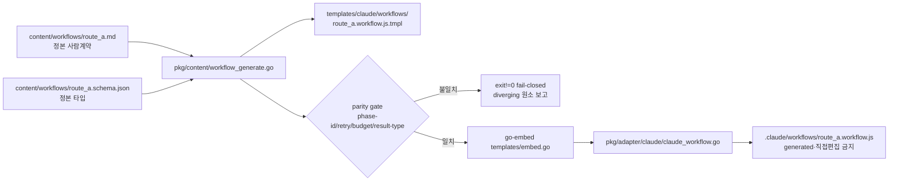
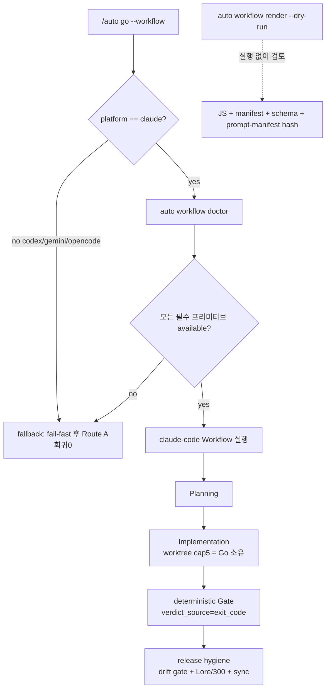

# SPEC-HARNESS-WORKFLOW-001 구현 계획

## Tasks

- [x] T1: 정본 manifest 작성 — `[NEW] content/workflows/route_a.md`(phase/gate 사람 계약) + `[NEW] content/workflows/route_a.schema.json`(phase-id, retry, budget, result-type 집합). 정본 4 phase: `planning`, `implementation`, `gate_build_test`(verdict_source=exit_code), `release_hygiene`. (REQ-001, REQ-011)
- [x] T2: 정본→JS 파생 — `[NEW] pkg/content/workflow_generate.go`로 manifest에서 `[NEW] templates/claude/workflows/route_a.workflow.js.tmpl` 생성, `pkg/content/generate.go::GenerateAllTemplates`에 호출 추가, `content/embed.go`/`templates/embed.go` glob에 `workflows/*` 추가. (REQ-002)
- [x] T3: parity 게이트 — `[NEW] pkg/content/workflow_parity.go` + 테스트. md↔schema↔js의 phase-id/retry/budget/result-type 집합 비교, 불일치 시 fail-closed(exit≠0) + 어긋난 원소 보고, JS 미기록. (REQ-003)
- [x] T4: claude 어댑터 배선 — `[NEW] pkg/adapter/claude/claude_workflow.go` + `pkg/adapter/claude/claude_generate.go` 확장으로 `.claude/workflows` 디렉터리 생성·`route_a.workflow.js` 쓰기·매니페스트 등록·generated 경고 헤더. (REQ-004)
- [x] T5: 비-claude 회귀 가드 — codex/gemini/opencode 산출물에 `--workflow`/workflow JS 부재 + Route A 보존 확인. `pkg/adapter/parity_*_test.go` 패턴 확장한 회귀 테스트. (REQ-005)
- [x] T6: `auto workflow` 커맨드 그룹 — `[NEW] internal/cli/workflow.go`에 `newWorkflowCmd()`(doctor, render, gate 서브커맨드), `internal/cli/root.go`에 등록. `[NEW] pkg/workflow/doctor.go`(capability 리포트 + 주입 가능한 프로버 seam), `[NEW] pkg/workflow/render.go`(dry-run 렌더), `[NEW] pkg/workflow/gate.go`(`CommandRunner` seam — build/test 실행→`{verdict, verdict_source:"exit_code", build_exit, test_exit}` JSON 방출). `auto workflow gate`는 workflow JS가 호출하는 JS→Go exit-code bridge다. (REQ-006, REQ-010, REQ-011)
- [x] T7: 최소 결정적 실행 + Go 경계 + JS→Go bridge — 생성 JS가 4-phase 제어 흐름을 인코딩. deterministic Gate phase는 `auto workflow gate` CLI를 shell out으로 호출하고 반환 JSON(`verdict`/`verdict_source`/`build_exit`)을 파싱해 분기한다(JS→Go bridge). gate verdict는 `[NEW] pkg/workflow/gate.go`의 injectable `CommandRunner`(build/test→exit-code)에서 파생(`verdict = build_exit==0 && test_exit==0`, `verdict_source=exit_code`; LLM·`PhaseBackend` 미의존). 검증: (a) phase 순서는 manifest 파생(generate 결정성), (b) gate verdict는 fake `CommandRunner` replay(S8) + `auto workflow gate` CLI 오라클(build exit=1→`{verdict:"fail"}` JSON, S16), (c) 라이브 router→workflow 디스패치 + gate 호출은 S15 operational 오라클. 위험 repo 변형은 `pkg/pipeline`(`WorktreeManager`(Create/Remove/ActiveCount) + `WorktreeSlotCap`/`ScheduleWorktreeTasksWithCap`)에 유지. (REQ-009, REQ-011)
- [x] T8: `--workflow` 라우트 — `templates/claude/commands/auto-router.md.tmpl`에 `--workflow` 라우트 + doctor 게이트 + Route A fail-fast 폴백 추가(`--team` Route B 패턴 참조). opt-in은 플래그 경로. (REQ-007)
- [x] T9: release hygiene 종단 phase — `[NEW] pkg/workflow/drift_gate.go` + 테스트. 세 enforcement를 구조화 리포트로 차단/통과: (a) staged generated 표면(.claude/.codex/.gemini/.opencode/.autopus/orchestra)이 SoT 변경 없이 올라오면 차단(S6), (b) 300줄 초과 staged 소스 차단(`auto check --arch --staged` 재사용 = file-size limit), (c) 대기 커밋 메시지 Lore 위반 차단(`auto check --lore --message <msgfile>` 사용 — 마지막 커밋이 아니라 pending 메시지 파일 검사). 셋 다 통과 시에만 sync 진행. 각 차단은 사유·경로를 보고(S13 oracle). (REQ-012)
- [x] T10: prompt-manifest 해시 — 기존 `pkg/promptlayer`(`layer.go`/`context_scan.go`) 재사용해 stable+snapshot 해싱(ephemeral 제외), render dry-run에 노출, 결정성 골든. (REQ-010, REQ-011)
- [x] T11: fallback taxonomy 분류기 — `[NEW] pkg/workflow/fallback.go` + 테스트. 모든 실패 경로를 fail-fast/fail-closed/resumable/explicit 중 하나로 분류, silent 금지(totality 테스트). (REQ-008)
- [x] T12: 문서 — `[NEW] content/skills/harness-workflow.md`(opt-in 사용/doctor/fallback/dry-run/gate). **claude-scoped 설치**: 비-claude 어댑터(codex/gemini/opencode)는 이 스킬을 미설치하거나 `--workflow` 미언급 변형으로 처리해 S3(비-claude `--workflow` 0-token) 회귀 경계를 보존. auto-router 참조 갱신. (REQ-001~012 사용 가이드, REQ-005) 

## Implementation Strategy

### 접근 방법
- **정본은 manifest, JS는 generated 어댑터.** Workflow 저작 API가 무계약 내부 프리미티브이므로(BS techstack 실사), 안정 계약을 우리가 소유하는 manifest로 두고 JS는 드리프트 시 폐기·재생성한다. 고정 JS를 정본으로 핀하지 않는다.
- **기존 generate 파이프라인 재사용.** `pkg/content.GenerateAllTemplates`(검증됨)에 workflow 파생을 한 단계로 추가하고, `cmd/generate-templates/main.go`가 그대로 트리거한다. 임베드는 기존 `content/embed.go`/`templates/embed.go` 패턴에 glob만 추가.
- **doctor는 런타임 프로브 + 결정적 검사 혼합.** 버전 핀(claude --version >= 2.1.154)과 generated-surface 무결성은 결정적으로, 프리미티브 존재는 주입 가능한 prober seam으로 점검해 테스트는 fake prober로 hermetic하게 실행한다. 실제 라이브 프로브는 운영 경로.
- **hermetic 실행 검증(CommandRunner seam).** JS는 Go에서 직접 실행 불가하므로, 결정적 실행 증거는 (a) phase 순서 = manifest 파생(generate 결정성)과 (b) deterministic Gate verdict = `[NEW] pkg/workflow/gate.go`의 injectable `CommandRunner`를 fake(build exit=1)로 주입한 replay로 검증한다. 기존 `pkg/pipeline.PhaseBackend`는 build/test exit-code를 노출하지 않으므로 gate verdict 검증에는 사용하지 않는다(필요 시 phase-순서 stub 용도로만 선택적 활용). 라이브 claude-code 실행은 운영 스모크(BS techstack에서 1회 확인).
- **Go 경계 보존.** `pkg/pipeline`/`pkg/orchestra`는 비-claude 폴백·생성·테스트 하네스로 유지. workflow JS는 시퀀싱만, repo 변형은 Go가 소유.

### 기존 코드 활용 (검증됨)
- `pkg/content/generate.go` — `GenerateAllTemplates(contentDir, templateDir)`, `validateName`(path traversal 가드).
- `pkg/adapter/claude/claude_generate.go` — `Generate`, `copyContentFiles`, `ManifestFromFiles`/`m.Save`.
- `pkg/adapter/claude/claude.go` — `NewWithRoot`, `adapterName = "claude-code"`.
- `pkg/pipeline/runner.go` — `RunConfig.WorktreeSlotCap`(기본 5), `ScheduleWorktreeTasksWithCap`, `SequentialRunner`/`ParallelRunner`, `PhaseBackend`.
- `pkg/pipeline/worktree.go` — `WorktreeManager`(Create/Remove/ActiveCount, max-limit); `pkg/worker/parallel/worktree.go` — `WorktreeManager`(task 격리). Go 경계의 repo 변형 소유자(실재).
- `pkg/promptlayer/layer.go`, `context_scan.go` — prompt 레이어 매니페스트/스캔(해시 재사용).
- `internal/cli/root.go` — `root.AddCommand(newDoctorCmd())` 등록 패턴.
- `templates/claude/commands/auto-router.md.tmpl` — Route B `--team` 라우트(폴백 패턴 참조).
- `pkg/adapter/parity_test.go` — 크로스 플랫폼 parity 회귀 패턴(별개 개념, workflow parity는 [NEW]).

### 변경 범위
- 신규 패키지 `pkg/workflow`(doctor/fallback/drift_gate/render/gate) + `pkg/content` 2파일 + claude 어댑터 1파일 + CLI 1파일.
- 기존 확장: generate.go 호출 1개, embed glob 2개, claude_generate 배선, root.go 등록 1줄, auto-router 라우트.
- 모든 신규 소스 파일은 300줄 제한 준수(관심사별 분할: doctor/fallback/drift/render 분리).

## Visual Planning Brief

### 생성 파이프라인 (정본 → generated → 설치)

### 런타임 command-flow (`/auto go --workflow` + doctor)

## Feature Completion Scope

- **Primary SPEC가 Outcome Lock을 닫는 방법**: T1~T12가 SoT 3분할(T1-T4) + parity(T3) + doctor/render(T6,T10) + 비-claude 폴백(T5) + fallback taxonomy(T11) + Go 경계(T7) + 최소 결정적 4-phase 실행(T1,T7) + release hygiene(T9)을 모두 포함해 Outcome Lock의 mandatory requirement를 1:1로 닫는다. dry-run·doctor·fallback·parity는 실제 결정적 실행을 둘러싼 안전장치이며, scaffold-only가 아니라 실행(REQ-011/S7/S8)을 포함한다.
- **승인된 sibling 의존성**: 없음(Primary는 독립 출하·검증 가능). SPEC-HARNESS-WORKFLOW-GATE-002(게이트 엔진)는 fake agent() 골든으로 독립 개발 가능한 병렬 sibling 후보이나, 이 SPEC의 완료에 의존하지 않는다.
- **Completion Debt**: 없음(research.md의 `## Completion Debt` 참조). resume(T4)는 Outcome Lock의 단일-패스 실행을 막지 않으므로 후속 Evolution이다. 기본 `/auto go` 승격(K13)은 명시적 non-goal이다.
