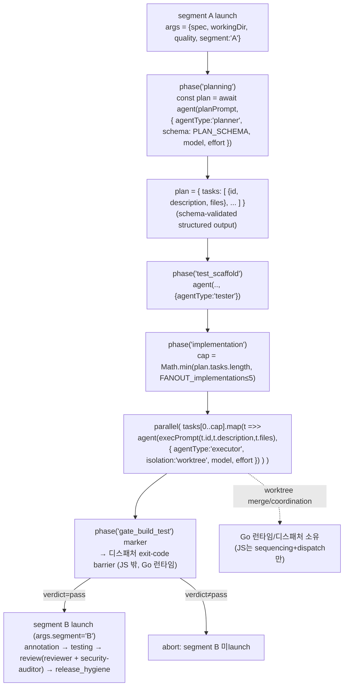

# SPEC-HARNESS-WORKFLOW-FIDELITY-001 구현 계획

## Tasks

- [ ] T1: `pkg/content/workflow_generate_team.go`에 phase→agentType 매핑과 inline `PLAN_SCHEMA` 리터럴 emit을 추가한다. 생성기의 `teamPhaseRoles`(단일 string)를 등록된 subagent type 이름(planning→`planner`, test_scaffold→`tester`, implementation→`executor`, annotation→`annotator`, testing→`tester`, review→`reviewer`)으로 정렬하고, `agentType: '<name>'`를 `teamAgentOpt` opts에 추가한다. PLAN_SCHEMA를 본문 preamble에 한 번 emit한다(byte-stable). (REQ-001,003,005,008)
- [ ] T2: 프롬프트 enrichment — `writeTeamPhaseBlock`/baseline emit에서 bare `Execute <role> agent for spec ...` skeleton을 role-task instruction으로 교체한다. planner 프롬프트는 "Plan SPEC ${ctx.spec} at ${ctx.workingDir}, produce the task assignment table (id, description, file ownership)"; 그 외 role 프롬프트는 role intent + `${ctx.spec}`/`${ctx.workingDir}` 보간. review phase는 reviewer agentType + security-auditor agentType 두 호출을 emit한다. (REQ-001,002,005)
- [ ] T3: planner→executor task threading — planning 블록을 `const plan = await agent(planPrompt, { agentType: 'planner', schema: PLAN_SCHEMA, model, effort })`로 캡처하도록 변경하고, `writeTeamFanOutBlock`을 task-threaded fan-out으로 재작성한다: executor 프롬프트가 `plan.tasks[i]`의 id/description/files를 보간하고 opts에 `agentType: 'executor'` + `isolation: 'worktree'`를 포함한다. (REQ-003,004,005,007)
- [ ] T4: `parallel(...)` + bounded fan-out — executor fan-out을 `parallel(...)`로 감싸 동시 실행하고, fan-out 개수를 `const cap = Math.min((plan && plan.tasks ? plan.tasks.length : 0), FANOUT_implementation)`로 산출한다(`FANOUT_implementation`은 RT override fallback schema fan_out_cap=5). segment A/B 가드와 게이트 marker는 RUNTIME-001 그대로 보존하고, planner/implementation이 segment A 안에 위치함을 유지한다. 300줄 한계 근접 시 fan-out/review/schema emit 헬퍼를 `pkg/content/workflow_generate_team_dispatch.go`(`[NEW]`)로 split한다. (REQ-004,006,007,008)
- [ ] T5: 오라클 — `[NEW] pkg/content/workflow_fidelity_contract_test.go`를 작성한다: 실제 생성 JS에 대해 phase별 `agentType: '<name>'`, review의 `reviewer`+`security-auditor`, `const PLAN_SCHEMA`, `schema: PLAN_SCHEMA` 캡처, `parallel(`, executor `isolation: 'worktree'`, `Math.min(`+`plan.tasks` fan-out, task id/description/files 보간을 단언한다. skeleton 위반 fixture(bare `agent('Execute ... agent')`, agentType 누락, parallel 누락, isolation 누락)는 fail함을 negative-control로 단언한다. `workflow_generate_team_test.go`/`workflow_launch_contract_test.go`의 skeleton 단언을 faithful 단언으로 교체한다. (REQ-009,012)
- [ ] T6: `auto generate-templates`로 `templates/claude/workflows/route_team.workflow.js.tmpl`을 재생성하고(첫 줄 GENERATED 경고 보존), route_a 골든이 byte-unchanged(회귀 0)이며 비-claude 산출물에 route_team `.js` 0건임을 확인한다. (REQ-009,011)
- [ ] T6b: 설치 표면 `.claude/workflows/route_team.workflow.js`는 `auto update`가 `.tmpl`에서 재설치하는 downstream apply임을 문서화한다(generate-templates 범위 밖). (REQ-009)
- [ ] T7: skill/router 문서 정정 — `content/skills/harness-workflow.md`와 `content/skills/agent-teams.md`의 implementation/review phase 서술을 agentType 디스패치 + planner schema + task threading + parallel/worktree-isolation 계약으로 갱신한다. (REQ-010)

## Implementation Strategy

- **접근**: 변경 표면을 `pkg/content/workflow_generate_team.go` 한 생성기에 집중한다. RUNTIME-001이 만든 segment 가드·args 전달·게이트 marker·parity 토큰 emit 위치는 모두 그대로 두고, agent-driven phase 블록의 **opts 확장(agentType/schema/isolation)** 과 **fan-out 루프의 task threading + parallel 래핑**만 바꾼다.
- **기존 코드 활용**: `teamAgentOpt`(opts 빌더)에 `agentType` 추가, `writeTeamFanOutBlock`을 task-threaded로 재작성, `writeTeamReviewBlock`은 이미 reviewer 루프 + security auditor를 emit하므로 두 호출에 각 agentType만 추가한다. parity 게이트(`checkPerPhaseQualityParity`)는 `phaseJSBlock` 내 기존 토큰 PRESENCE만 검사하므로 추가된 `agentType:`/`schema:`/`parallel(`/`isolation:` 토큰은 parity-safe(추가 토큰일 뿐 기존 토큰 보존).
- **agentType 값 정합**: 값은 등록된 subagent type 이름(`.claude/agents/autopus/*.md` frontmatter `name`)과 byte-identical이어야 한다 — `security-auditor`(하이픈), `test_scaffold` phase는 `tester` agent로 매핑(별도 `test_scaffold` agent 미존재). 이는 generation-time 상수이므로 JS-injection whitelist 밖(고정 리터럴).
- **trust boundary**: planner task description은 런타임 `plan.tasks[i]` 객체 필드로만 소비되고 생성 JS 텍스트에 generation-time 보간되지 않는다. PLAN_SCHEMA의 `schema` 강제 검증이 planner 출력 형태를 제약하고, executor 프롬프트는 그 검증된 객체를 런타임 에이전트가 해석한다(생성 소스에 박지 않음).
- **변경 범위**: 생성기 1(+필요 시 split 1) + 테스트 2~3(갱신) + 신규 오라클 1 + `.tmpl` 재생성 1 + 문서 2 ≈ 8~9 파일. 단일 Primary SPEC 한계(≤25 태스크/≤40 소스 파일) 충분 미만.
- **파일 크기**: `workflow_generate_team.go`는 현재 175줄. faithful dispatch로 늘어나면 300줄 한계 근접 시 T4에서 dispatch 헬퍼를 `[NEW] workflow_generate_team_dispatch.go`로 split(by concern: schema/fan-out/review emit).

## Visual Planning Brief

데이터-플로우(planner → schema → task list → parallel executors with isolation):

설계 핵심:
1. planner가 `schema: PLAN_SCHEMA`로 task assignment 표(id/description/file ownership)를 구조화 산출하고 JS가 `plan`으로 캡처한다.
2. executor fan-out은 `plan.tasks` 위를 돌며 task별 배정·file ownership을 받아 `parallel(...)` + `isolation:'worktree'`로 동시 실행한다. fan-out 개수 = `min(plan.tasks.length, fan_out_cap)`.
3. fan-out 구조(PLAN_SCHEMA 리터럴, 루프 bound 표현, parallel/isolation 토큰)는 generation-time 고정(byte-stable). fan-out 개수만 런타임 동적.
4. worktree merge/coordination은 Go 런타임/디스패처 소유(RUNTIME-001 경계 유지). JS는 sequencing + dispatch만.
5. segment A/B 가드 + 게이트 barrier는 RUNTIME-001 그대로. threading은 segment A 안에서 일어난다.

## Feature Completion Scope

- **Primary SPEC가 Outcome Lock을 닫는 방법**: 생성 JS의 **fidelity**(phase별 agentType + planner schema 캡처 + executor task-threaded fan-out + parallel/isolation + task-focused 프롬프트)가 in-scope이며 hermetic 오라클 S1~S4 + byte-stable S7 + segment 보존 S5 + cap/whitelist S6로 닫힌다. 이것이 `/auto go --team`을 Route A subagent 파이프라인 동등-이상 기본값으로 만드는 결정적 substrate 충실도다.
- **승인된 sibling 의존성**: 없음(단일 Primary SPEC).
- **남은 Completion Debt**: 실 multi-agent real-LLM 종단 실행(claude-code Workflow 런타임이 생성 JS를 실제 디스패치해 specialized agentType + task-threaded executor가 실 LLM 트래픽으로 구동되는 operational 확인)은 operational Completion Debt로 남아 sync completion을 막는다(research.md `## Completion Debt`). GENERATED-JS 충실도는 Debt가 아니라 in-scope이며 오라클로 닫힌다.
