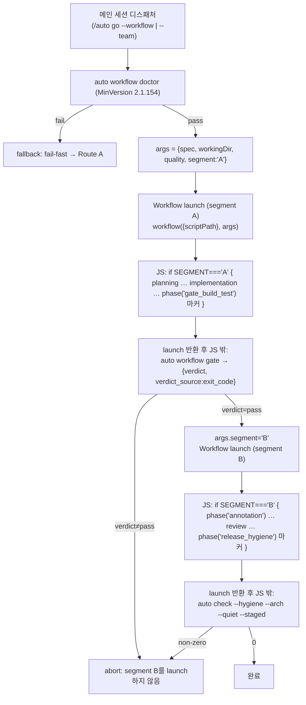

# SPEC-HARNESS-WORKFLOW-RUNTIME-001 구현 계획

## Tasks

- [ ] **T1: route_a 생성기 실제 API + segment 가드 재작성** — `pkg/content/workflow_generate.go::deriveWorkflowJS`/`writePhaseBlock`을 단일 `export const meta` + top-level 본문으로 재작성. `export default async function run()` 제거(REQ-001,002). `phase('id')`는 단일 인자로 emit하고 retry/budget/result-type 토큰은 per-phase 코멘트/const로 이동(REQ-006). gate_build_test·release_hygiene는 `agent.exec` 대신 `phase()` 마커 + `log()`로 축소(REQ-007). top-level 본문에 `const SEGMENT = (args && args.segment) || 'A';` preamble을 emit하고 phase 블록을 `if (SEGMENT === 'A') { … }`/`if (SEGMENT === 'B') { … }` 가드로 분할: segment A = gate_build_test까지(planning, implementation, gate_build_test 마커), segment B = 그 이후(release_hygiene 마커). 단일 launch가 한 segment만 실행해 디스패처가 게이트를 segment 사이 barrier로 강제하게 한다(REQ-005,007). (REQ-001,002,003,005,006,007)
- [ ] **T2: route_team 생성기 실제 API + segment 가드 재작성** — `pkg/content/workflow_generate_team.go::deriveTeamWorkflowJS`/`writeTeamPhaseBlock`/`teamAgentOpt` 등을 재작성. preamble을 `const ctx = args || {}; const RT = (args && args.quality) || {}; const SEGMENT = (args && args.segment) || 'A';`로 두고 `env('AUTOPUS_WORKFLOW_QUALITY')` 미사용(REQ-005). agent 호출을 role + per-run 컨텍스트(`ctx.spec`/`ctx.workingDir`)를 보간한 비자명 task 문자열 + opts 2-인자 형태로 emit(REQ-004). fan-out/review depth 루프 보존하되 단일 인자 `phase()`로 정합(REQ-006). 두 게이트 phase를 마커로 축소(REQ-007). phase 블록을 `if (SEGMENT === 'A')`/`if (SEGMENT === 'B')` 가드로 분할: segment A = {planning, test_scaffold, implementation, gate_build_test 마커}, segment B = {annotation, testing, review, release_hygiene 마커}. gate_build_test 마커가 segment A 가드의 마지막 `phase(`, annotation이 segment B 가드의 첫 `phase(`가 되게 emit(REQ-005,007). (REQ-001~007)
- [ ] **T3: parity 게이트 토큰 재지정** — `pkg/content/workflow_parity.go`의 `checkWorkflowParity`/`checkPerPhaseQualityParity`/`phaseJSBlock`이 새 emission 위치(코멘트/const)에서 retry/budget/result-type/model/effort/depth 토큰을 계속 탐지하도록 token 형식을 갱신. phase-id SET 검사와 fail-closed 동작은 보존. depth cap·whitelist 경계 불변(REQ-006,010).
- [ ] **T4: quality binding 전달 채널 전환** — `internal/cli/workflow_quality_binding.go`의 `teamQualityEnvKey`/`serializeTeamQualityBinding`를 args 페이로드 키로 전환(예: `teamQualityArgsKey` + binding을 `args.quality`에 직렬화). `resolveTeamQualityBinding` 계산 로직은 불변. `internal/cli/workflow_render.go`의 overlay 경로 영향 점검(REQ-005).
- [ ] **T5: launch-contract 오라클 작성** — `[NEW] pkg/content/workflow_launch_contract_test.go`. 생성된 route_a·route_team JS에 대해 (a) `export const meta`로 시작, (b) `export` 토큰 정확히 1회/`export default` 0건, (c) `env(` 0건, (d) `agent.exec(` 0건, (e) `function run(` 0건, (f) agent 호출 첫 인자가 args-derived template literal, (g) gate phase 본문에 `agent.exec` 0건 + phase 마커 존재를 concrete expected/forbidden substring으로 단언. 위반 픽스처 주입 시 fail(negative control) 포함(REQ-011).
- [ ] **T6: wrong-API 테스트 갱신 + `.tmpl` 재생성(generate-templates)** — `workflow_generate_test.go`(route_a `agent.exec`/`export default` 단언), `workflow_generate_team_test.go`(`agent.exec`/`env` 단언), `workflow_parity_team_test.go`(`teamDriftJS = export default...` 픽스처)를 실제 계약 단언으로 교체. `auto generate-templates`(`cmd/generate-templates` → `pkg/content/generate.go::GenerateAllTemplates` → `generateWorkflowTemplates`) 재실행으로 **SoT-derived 템플릿** `templates/claude/workflows/route_{a,team}.workflow.js.tmpl`만 재생성(이 명령은 `.tmpl`만 write하고 설치 `.claude/*.js`는 건드리지 않음). 재생성 `.tmpl` 첫 줄 GENERATED 경고 보존 확인(REQ-008,010,012).
- [ ] **T6b: 설치 표면 drift 닫기(auto update)** — 설치된 `.claude/workflows/route_{a,team}.workflow.js`는 claude 어댑터(`pkg/adapter/claude/claude_workflow.go::workflowFiles`/`workflowRoutes`)가 `auto init`/`auto update` 때 embedded `.tmpl`에서 `OverwriteAlways`로 재설치하는 downstream apply다(generate-templates 범위 밖). 현재 설치본은 아직 구버전(`export default async function run()` + `JSON.parse(env('AUTOPUS_WORKFLOW_QUALITY'))` + 3-인자 `phase`)이라 launch 불가이며, 이 drift는 `auto update` 적용으로만 닫힌다. 이 SPEC은 generators + `.tmpl`(autopus-adk 소유)을 정합하고 설치 표면 갱신이 `auto update`임을 skill/router 문서에 명시한다(REQ-008).
- [ ] **T7: skill/router/manifest 문서 정정** — `content/skills/harness-workflow.md`(L78,157,161,182의 `agent.exec` 게이트 + `AUTOPUS_WORKFLOW_QUALITY` env 서술), `content/skills/agent-teams.md`, `templates/claude/commands/auto-router.md.tmpl`(L1256,1259,1392), 그리고 `content/workflows/route_a.md`/`route_team.md`의 게이트·API 서술을 실제 계약(args 전달, JS 외부 Go 게이트, top-level 본문)으로 정정. args 스키마(`{spec, workingDir, quality}`)를 skill 문서에 명세(REQ-005,007,009).
- [ ] **T8: 통합 검증 + 자체 검증 루프** — `go build ./...`, `go test ./pkg/content/... ./pkg/workflow/... ./internal/cli/... ./pkg/adapter/...` green. `auto generate-templates` 후 git drift 없음(생성 JS = 커밋본). `auto workflow render --dry-run`(route_a/route_team) 정상. spec-quality 자체 검증 루프 + `auto spec validate --strict`.

## Implementation Strategy

**접근 방법**: manifest SoT(route_a/route_team `.md`+`.schema.json`)와 schema 파싱(`pkg/workflow/schema.go`)·doctor·fallback·depth는 그대로 두고, **오직 JS emission 형태와 그 검증/문서 표면만** 실제 Workflow API로 정합한다. 결정적 phase SET, quality resolver, 비-claude 경로는 손대지 않는다.

**실제 API 계약(타깃)**:
- 스크립트는 `export const meta = {name, description, phases?}` 순수 리터럴로 시작. 두 번째 top-level `export` 금지(두 번째 `export`가 곧 SyntaxError).
- 로직은 meta 이후 **top-level 본문**(async 컨텍스트, top-level await 허용). `export default async function run()` entry 없음.
- globals: `agent(prompt, opts)`(prompt=TASK 문자열, opts에 `{label, phase, schema, model, agentType}`), `phase(title)`(단일 인자), `log(message)`, `parallel(thunks)`, `pipeline(items, ...stages)`, `args`, `budget`, `workflow(name|{scriptPath}, args)`. `env()`·`agent.exec()`·role-only `agent('executor')`·3-인자 `phase()`는 없음.

**3대 설계 문제 해소(구체)**:
1. *per-run 컨텍스트*: 정적 생성 JS는 SPEC/task를 내장할 수 없으므로 런타임 `args` global을 읽는다. 디스패처(메인 세션, 정정된 skill 문서 가이드)가 `args = {spec, workingDir, quality}`를 전달하고, 각 agent phase가 role 템플릿 + args로 prompt 문자열을 구성한다.
2. *게이트(segmented dispatch)*: 실제 API는 단일 `workflow({scriptPath}, args)` launch가 top-level 본문의 모든 phase를 무조건 끝까지 실행한다 — 외부 Go 게이트 verdict가 launch 도중 phase 5~8을 막을 re-entry 지점이 없다. 따라서 디스패처가 워크플로우를 **게이트 경계로 분할(segment)** 해 launch한다: route_team은 segment A(planning, test_scaffold, implementation, gate_build_test 마커) launch → 반환 후 디스패처가 `auto workflow gate`(Go, exit-code)를 hard barrier로 실행 → verdict=pass일 때만 segment B(annotation, testing, review, release_hygiene 마커) launch → 디스패처가 `auto check --hygiene --arch --quiet --staged`를 실행. route_a도 단일 게이트 둘레로 동일(segment A = planning, implementation, gate_build_test 마커; 이후 release_hygiene barrier). JS는 `const SEGMENT = (args && args.segment) || 'A'` 가드로 해당 segment phase만 실행하고 게이트 phase는 `phase(id)+log()` 경계 마커로만 남는다. exit-code verdict + barrier 강제는 디스패처/Go 브리지에 있어 `verdict_source: exit_code`와 "JS는 sequencing만, Go가 게이트 소유" 경계가 보존된다. 단일 generated 아티팩트(route당 1개)를 유지하려고 분리 아티팩트 대신 `args.segment`를 택했다(parity가 전체 phase-id SET을 한 JS에서 검사하므로). 대안(JS 내 exec로 게이트)은 API에 exec 프리미티브가 없어 기각.
3. *quality 전달*: `env('AUTOPUS_WORKFLOW_QUALITY')` → `args.quality`. `resolveTeamQualityBinding`/`serializeTeamQualityBinding`(계산)은 보존하고 전달 채널만 args로 변경.

**변경 범위**: 생성기 2 + parity 1 + binding 전달 1 + 테스트 4(갱신3, 신규1) + 생성 산출물 4(재생성) + 문서 5. 소스 파일은 300줄 제한 준수(생성기 분할이 필요하면 concern별 파일 추가). 생성 `.js`/`.tmpl`/`.md`/`.json`은 라인 제한 제외.

## Visual Planning Brief

런타임 command/data-flow:

핵심: 단일 launch는 한 segment의 phase만 실행한다. 게이트는 segment 사이에서 디스패처가 실행하는 Go exit-code barrier이며(verdict가 pass가 아니면 post-gate segment를 launch하지 않음), `args`가 per-run 컨텍스트·quality·segment를 주입하는 유일한 채널(env 아님)이고, agent 호출은 role + args로 만든 task 문자열을 받는다.

## Feature Completion Scope

- **Primary SPEC가 Outcome Lock을 닫는 방법**: T1~T7(+T6b)이 두 생성기를 실제 API + segment 가드로 정합하고 산출물·테스트·문서를 일치시킨다. T5의 launch-contract 오라클이 계약 conformance와 segment/게이트 순서(S11)·runtime caps(S12)를 hermetic하게 닫고(REQ-011), 메인 세션의 Workflow 툴 디스패치(no-agent/minimal)가 양 route 실 런타임 launch(SyntaxError 없음 + phase 실행, S9)를 확인한다. 게이트는 디스패처가 segment 사이에서 실행하는 Go exit-code barrier다. 이들이 anti-theater 요구의 절반들이다.
- **승인된 sibling 의존성**: 없음. 단일 cohesive change(생성 표면 + 그 검증/문서). research.md `## Sibling SPEC Decision` = none.
- **남은 Completion Debt**: operational 실-런타임 launch 확인(메인 세션 디스패치)은 subagent가 Workflow 툴을 호출할 수 없어 `/auto go` 중 1회 수행한다. 상세는 research.md `## Completion Debt`. 전면 multi-agent real-LLM 실행은 Evolution(launch 종결을 막지 않음).
