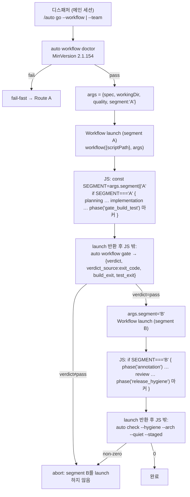

# SPEC-HARNESS-WORKFLOW-RUNTIME-001 리서치

## 기존 코드 분석

이 SPEC의 변경 표면은 모두 검증된 기존 코드다(Reference Discipline 표 참조).

- **route_a 생성기**: `pkg/content/workflow_generate.go::deriveWorkflowJS`(L99-127). L120이 `export default async function run() {`를 emit, `writePhaseBlock`(L132-151) L137/L145가 `agent.exec(['auto','workflow','gate'])`/`agent.exec(['auto','check',...])`를 emit. `phase('id', { retry, budget }, async () => {...})`는 3-인자 형태(실제 API 미지원).
- **route_team 생성기**: `pkg/content/workflow_generate_team.go::deriveTeamWorkflowJS`(L28-64). L56 `export default async function run()`, L57 `const RT = JSON.parse(env('AUTOPUS_WORKFLOW_QUALITY') || '{}')`. `writeTeamPhaseBlock`(L71-96)이 fan-out/review/baseline 분기로 `agent('planner'|'executor'|...)` role-only 호출과 게이트 `agent.exec`를 emit. `teamPhaseRoles`(L13-20)가 role 매핑.
- **parity 게이트**: `pkg/content/workflow_parity.go::checkWorkflowParity`(L32-94)가 phase-id SET + `retry: %d`/`budget: %d`/result-type 토큰을 JS에서 탐지. `checkPerPhaseQualityParity`(L100-134)가 phase 블록(`phaseJSBlock`, L139-150, marker=`phase('<id>'`)에서 `model=`/`effort=`/`fan_out_cap=`/`verify_votes=`/`synthesis=` 토큰 탐지.
- **schema parse**: `pkg/workflow/schema.go::ParseSchema`(L57-110). `isSafePhaseID`/`isSafeAgentModel`/`isSafeEffort` JS-injection whitelist + `validateDepthCaps`(`pkg/workflow/depth.go`, MaxVerifyVotes=3/MaxFanOut=5/MaxRetry=3). `PhaseDef`에 Retry/Budget/ResultType/Model/Effort/VerifyVotes/FanOutCap/Synthesis.
- **quality binding 전달**: `internal/cli/workflow_quality_binding.go`. `teamQualityEnvKey="AUTOPUS_WORKFLOW_QUALITY"`(L13), `resolveTeamQualityBinding`(L33-61)이 `cost.ModelForAgent`/`ResolveEffort`/`workflow.ResolveDepth`로 binding 계산, `serializeTeamQualityBinding`(L65-71)이 bare phase map JSON 직렬화. **이 두 심볼의 비-테스트 consumer는 0건**(`rg` 확인) — 실제 launch/디스패치는 메인 세션 Workflow 툴이 수행하고 Go는 render/gate/doctor만 제공함을 입증.
- **게이트 브리지**: `internal/cli/workflow_gate.go::newWorkflowGateCmd`. `auto workflow gate`가 build/test를 `CommandRunner`로 실행하고 `{verdict, verdict_source, build_exit, test_exit}` JSON을 항상 exit 0으로 방출(verdict는 JSON에). 이 브리지는 보존하되 JS가 아니라 디스패처가 호출한다.
- **두 generated 표면과 소유(Finding 3)**: (1) `auto generate-templates`(`cmd/generate-templates` → `pkg/content/generate.go::GenerateAllTemplates` → `generateWorkflowTemplates`)는 SoT(`content/workflows/route_*.{md,schema.json}`)에서 **embedded 템플릿** `templates/claude/workflows/route_*.workflow.js.tmpl`만 write한다(설치본 미접촉). (2) 설치된 `.claude/workflows/route_*.workflow.js`는 claude 어댑터(`pkg/adapter/claude/claude_workflow.go::workflowFiles`/`workflowRoutes`, L23-66)가 `auto init`/`auto update` 때 그 embedded `.tmpl`에서 `OverwriteAlways`로 재설치하는 **downstream apply**다(첫 줄 GENERATED 경고 보존, `isGeneratedWarning`). autopus-adk는 generators + `.tmpl`을 소유하고, 설치 `.claude/` 복사본 갱신은 `auto update`가 수행한다.
- **render**: `internal/cli/workflow_render.go`(`auto workflow render`) + `pkg/workflow/render.go::Render`/`RenderedPhase`. `internal/cli/workflow_render_routes.go::workflowRouteEmbeds`가 route별 embed 경로.
- **doctor/fallback**: `pkg/workflow/doctor.go::MinVersion="2.1.154"`, `pkg/workflow/fallback.go`의 `FallbackFailFast`/`FailClosed`/`Resumable`/`Explicit` taxonomy + `FailureNonClaudePlatform`/`DoctorFail`/`ParityDrift`.
- **설치 산출물 drift(결함 실물)**: 설치본 `.claude/workflows/route_a.workflow.js`·`route_team.workflow.js`는 현재 구버전이다 — `export const meta`(정상) 직후 `export default async function run()`(두 번째 export=SyntaxError) + `JSON.parse(env('AUTOPUS_WORKFLOW_QUALITY'))` + 3-인자 `phase('id', {retry,budget}, async()=>…)`를 포함해 launch 불가. SoT-derived `.tmpl` 재생성과 별개로, 설치 표면 drift는 `auto update` 적용으로만 닫힌다(T6b).

## Outcome Lock

- **User-visible outcome**: 생성된 route_a·route_team 워크플로우 JS가 실제 Claude Code Workflow 런타임에서 SyntaxError 없이 launch되고 phase를 실행한다. `/auto go --workflow`/`--team`이 render/parity 통과가 아니라 런타임 실동작.
- **Mandatory requirements**: REQ-001~012. 핵심 = 두 생성기 실제 API 정합(단일 `export const meta`, top-level 본문, 두 번째 export·`env(`·`agent.exec(` 금지, prompt-string agent, 단일 인자 phase) + args 전달 + JS-외부 게이트 + 테스트/산출물/문서 정합 + launch-contract 오라클.
- **Explicit non-goals**: 결정적 phase SET 변경(route_a 4 / route_team 8 불변), quality resolver semantics 변경(`resolveTeamQualityBinding`/`ModelForAgent`/`ResolveEffort`/`ResolveDepth`), 비-claude 동작 변경(regression-0), 정식 릴리스.
- **Completion evidence**: 양 route hermetic launch-contract 테스트 green(S1/S2/S3, 구체 expected/forbidden substring) + 기존 게이트 green(parity/doctor/render/depth/whitelist, S5/S8/S10) + 메인 세션 Workflow 디스패치로 SyntaxError 없는 실 launch(S9).

## Visual Planning Brief

런타임 command/data-flow(디스패처 → args 컨텍스트 → JS top-level 본문 → agent/phase → Go 게이트 브리지):

설계 핵심 4:
1. `args`가 정적 JS에 per-run 컨텍스트·quality·segment를 주입하는 유일 채널(env 아님).
2. 단일 launch는 한 segment의 phase만 실행한다(`const SEGMENT = args.segment || 'A'` 가드).
3. 게이트는 segment 사이에서 디스패처가 실행하는 Go exit-code barrier다 — verdict가 pass가 아니면 post-gate segment를 launch하지 않는다(실제 API에 exec 프리미티브·launch 도중 re-entry 지점 없음).
4. agent 호출 = role + args로 만든 비자명 task 문자열 + opts.

## 설계 결정

- **왜 segmented dispatch인가(게이트 barrier)?** 실제 API는 단일 `workflow({scriptPath}, args)` launch가 top-level 본문의 모든 phase를 무조건 끝까지 실행한다 — 외부 Go 게이트 verdict가 launch 도중 phase 5~8을 막을 re-entry 지점이 없다. 따라서 게이트를 "실제 barrier"로 만들려면 디스패처가 워크플로우를 **게이트 경계로 분할(segment)** 해 launch한다: segment A(planning…implementation, gate_build_test 마커) launch → 반환 후 디스패처가 `auto workflow gate`(Go, exit-code)를 hard barrier로 실행 → verdict=pass일 때만 segment B(annotation…review, release_hygiene 마커) launch → 디스패처가 `auto check --hygiene --arch --quiet --staged`를 실행. 생성 JS는 `const SEGMENT=(args&&args.segment)||'A'` 가드로 해당 segment의 phase만 실행하고, 게이트 phase는 `phase(id)+log()` 경계 마커로만 남는다. exit-code verdict + barrier 강제는 디스패처/Go 브리지에 있어 `verdict_source: exit_code`와 "JS는 sequencing만, Go가 게이트 소유" 경계가 보존된다. 단일 generated 아티팩트(route당 1개)를 유지하려고 분리 아티팩트 대신 `args.segment`를 택했다(parity가 전체 phase-id SET을 한 JS에서 검사하므로). `agent(prompt)`로 게이트를 시키면 LLM 판정이 되어 `verdict_source: exit_code`를 위반하고, JS 내 exec 대안은 API에 exec 프리미티브가 없어 둘 다 기각.
- **왜 retry/budget를 phase() 밖으로?** 실제 `phase(title)`는 단일 인자다. 기존 3-인자 `phase('id', {retry,budget}, fn)`는 미지원. parity 게이트가 retry/budget 토큰을 JS에서 찾으므로, 토큰을 per-phase 코멘트/const로 옮기고 parity token 형식을 거기 맞춘다. invariant(JS가 schema-derived 토큰을 보유)는 유지.
- **왜 args인가(env 아님)?** 실제 API에 `env()` global이 없다. Workflow `args` 입력이 per-run 데이터의 정식 채널이다. binding 계산(`resolveTeamQualityBinding`)은 그대로 두고 전달 채널만 args로 교체해 변경 표면을 최소화.
- **부모 SPEC-001 갭의 정직한 기록**: SPEC-HARNESS-WORKFLOW-001은 status=completed이고 acceptance S15가 "operational 오라클(라이브 `/auto go --workflow` 디스패치 + run journal, 구현 중 1회 실증)"로 선언됐다. 그러나 이번 세션의 경험적 증거(설치 JS가 두 번째 `export`로 SyntaxError)는 그 JS가 실제 런타임에서 launch될 수 없었음을 보인다 — 즉 부모의 live-launch는 실제 Workflow 런타임에 대해 검증된 적이 없다(render-only + hermetic 단위에 의존). 이 SPEC이 route_a·route_team 양쪽의 그 갭을 닫는다.

## Semantic Invariant Inventory

| ID | source clause | invariant type | affected outputs | acceptance IDs |
|----|---------------|----------------|------------------|----------------|
| INV-001 | "Script MUST begin with `export const meta` pure literal ... a second `export` is a SyntaxError" | parser/launch contract | route_a·route_team JS 첫 토큰 + export 횟수 | S1, S2 |
| INV-002 | "There is NO `env()` global, NO `agent.exec(...)`" | API forbidden-token | 양 JS 본문 | S1, S2, S6 |
| INV-003 | "runs in top-level body ... NO `export default async function run()` entry function" | structure | 양 JS 본문 | S1, S2 |
| INV-004 | "`agent(prompt, opts)` (prompt is a TASK STRING) ... NO role-based `agent('executor')`" | API call shape | agent-driven phase 호출 | S3 |
| INV-005 | "Re-route this through `args` ... runtime mechanism is the `args` global, NOT a non-existent `env()`" + dispatcher passes `args.segment` | data delivery | route_team JS preamble(args.quality/args.segment) + skill 문서 | S4, S6, S11 |
| INV-006 | "`phase(title)` (single arg ... NOT `phase(title, opts, fn)`)" + parity 보존 | structure/parity | phase 호출 + parity 토큰 | S5 |
| INV-007 | "the deterministic gate runs as a real exit-code barrier BETWEEN segmented launches; a single launch runs all phases unconditionally so the gate is a segment boundary, not an in-launch block" | gate/segment boundary | 양 JS segment 가드 + 게이트 마커 + skill/router 디스패처 계약 | S6, S11 |
| INV-008 | "preserve ... parity gate ... doctor capability gate, fallback taxonomy, bounded depth caps (fan_out_cap≤5, verify_votes≤3, retry≤3), JS-injection whitelist, claude-only scoping, non-claude regression-0" | regression invariants + runtime caps | parse/parity/doctor/adapter + args.quality 전달 caps | S7, S8, S12 |

각 oracle acceptance는 구체 expected/forbidden substring 또는 값을 가진다(예: `export` 출현 횟수=1, `agent.exec(` 횟수=0, fan_out_cap=5, verify_votes=3(ultra)/1(baseline), synthesis=true/false, MaxFanOut=5·MaxVerifyVotes=3·MaxRetry=3, model=claude-sonnet-4-6, 변조 시 diverging element=implementation.model, segment A 마지막 phase=gate_build_test·segment B 첫 phase=annotation). structural-only 신호로 Must를 닫지 않는다.

## Feature Coverage Map

| Outcome slice | Covered by | Status |
|---------------|------------|--------|
| route_a JS 실제 API 정합(happy path) | Primary SPEC T1, S1 | covered |
| route_team JS 실제 API 정합(happy path) | Primary SPEC T2, S2 | covered |
| agent task-string + args 구성 | Primary SPEC T2, S3 | covered |
| quality binding args.quality 전달 | Primary SPEC T4, S4 | covered |
| 게이트 segment 경계 + 디스패처 barrier 순서 | Primary SPEC T1/T2/T7, S6/S11 | covered |
| runtime quality caps(args.quality, INV-008) | Primary SPEC T4, S12 | covered |
| parity 토큰 보존(검증 경계) | Primary SPEC T3, S5 | covered |
| 비-claude 회귀 0(integration 경계) | Primary SPEC T6, S7 | covered |
| depth/whitelist/doctor invariant | Primary SPEC T3/T6, S8 | covered |
| launch 검증(hermetic, 양 route) | Primary SPEC T5, S1/S2/S3 | covered |
| 양 route 실 런타임 launch(operational) | Primary SPEC, S9 | completion-debt |
| 설치 표면 drift 닫기(auto update) | Primary SPEC T6b | covered |
| docs/ops 정정(디스패처 segment 계약 포함) | Primary SPEC T7, S6/S11 | covered |
| dry-run 렌더 회귀 | Primary SPEC T8, S10 | covered |

## Completion Debt

| Item | Blocks | Required resolution |
|------|--------|---------------------|
| Operational 실-런타임 launch 확인(route_a AND route_team 양쪽) | Outcome Lock completion evidence | `/auto go --workflow`/`--team` 중 메인 세션이 두 생성 JS를 각각 Workflow 툴로 args(segment 포함)와 함께 디스패치하여 "SyntaxError: Unexpected keyword 'export'" 없이 launch + 선언 phase 진입을 route별 1회 실증(S9). subagent는 Workflow 툴 호출 불가이므로 메인 세션 책임. launch(SyntaxError 없음 + phase 실행)는 in-scope이며 hermetic 오라클 S1~S3(양 route) + 이 디스패치로 닫힌다(deferred 아님). |

## Evolution Ideas

These are optional improvements and do not block sync completion.

| Idea | Why not required now | Promotion trigger |
|------|----------------------|-------------------|
| 전면 multi-agent real-LLM `/auto go --team` 종단 실행(실 SPEC 산출물 생성) | Outcome Lock은 launch + phase 실행으로 닫힘; 실 LLM 트래픽 종단은 launch 정합과 별개 | 사용자가 명시적으로 실 multi-agent 종단 실행 검증을 요청 |
| workflow run journal/checkpoint resume artifact 스키마 정식화 | 현재 fallback taxonomy의 resumable은 advisory; launch 종결에 불필요 | 사용자가 resumable 실행 영속을 요청 |
| args 스키마 확장(per-task fan-out 컨텍스트, budget 객체 활용) | 기본 `{spec, workingDir, quality}`로 launch + phase 실행 충분 | 사용자가 더 풍부한 per-task 컨텍스트를 요청 |

## Sibling SPEC Decision

| Decision | Reason | Sibling SPEC IDs |
|----------|--------|------------------|
| none | route_a·route_team는 동일 substrate 패밀리의 단일 cohesive change(생성 표면 + 그 검증/문서)다. 독립 결과·별도 repo·migration sequencing·보안 경계 사유 없음. Primary SPEC 단독으로 ≤25 태스크(8)·≤40 소스 파일(생성기2+parity1+binding1+테스트4+문서5+생성4≈17)이라 분할 임계 미달. | None |

## Reference Discipline

| Reference | Type | Verification |
|-----------|------|--------------|
| `pkg/content/workflow_generate.go::deriveWorkflowJS`/`writePhaseBlock` | existing | Read 확인(L99-151), `export default`/`agent.exec` emission 실재 |
| `pkg/content/workflow_generate_team.go::deriveTeamWorkflowJS`/`writeTeamPhaseBlock`/`teamAgentOpt` | existing | Read 확인(L28-145), `env(`/role-only agent 실재 |
| `pkg/content/workflow_parity.go::checkWorkflowParity`/`checkPerPhaseQualityParity`/`phaseJSBlock` | existing | Read 확인(L32-150) |
| `pkg/workflow/schema.go::ParseSchema`/`isSafeAgentModel`/`isSafeEffort` | existing | Read 확인(L57-124) |
| `pkg/workflow/depth.go` (MaxVerifyVotes/MaxFanOut/MaxRetry/ResolveDepth) | existing | Read 확인(L9-51) |
| `internal/cli/workflow_quality_binding.go` (teamQualityEnvKey/resolveTeamQualityBinding/serializeTeamQualityBinding) | existing | Read 확인; 비-테스트 consumer 0건 `rg` 확인 |
| `internal/cli/workflow_gate.go::newWorkflowGateCmd` | existing | Read 확인 |
| `internal/cli/workflow_render.go` + `workflow_render_routes.go::workflowRouteEmbeds` | existing | Read 확인 |
| `pkg/workflow/render.go::Render`/`RenderedPhase` | existing | Read 확인(L13-49) |
| `pkg/workflow/doctor.go::MinVersion`(2.1.154) + `pkg/workflow/fallback.go` taxonomy | existing | `rg` 확인 |
| `pkg/adapter/claude/claude_workflow.go::workflowFiles`/`workflowRoutes`/`isGeneratedWarning` | existing | Read 확인(L23-76); 설치 `.claude/*.js`를 `.tmpl`에서 `auto init`/`auto update` 때 재설치하는 표면 소유 |
| `pkg/content/generate.go::GenerateAllTemplates`/`generateWorkflowTemplates` + `cmd/generate-templates` (`auto generate-templates`) | existing | Read 확인(generate.go:21-32, workflow_generate.go:34-94, cmd/generate-templates/main.go); `.tmpl`만 write(설치본 미접촉) |
| `.claude/workflows/route_a.workflow.js` / `route_team.workflow.js` (설치 표면, downstream apply) | existing(generated) | Read 확인; 두 surface 모두 구버전 `export default`+`JSON.parse(env(...))`+3-인자 phase 실물(launch 불가), `auto update`로 갱신 |
| `content/skills/harness-workflow.md` (L78,157,161,182) | existing | Read 확인; wrong-API 서술 실재 |
| `content/skills/agent-teams.md` (L21 substrate note) | existing | `rg` 확인 |
| `templates/claude/commands/auto-router.md.tmpl` (L1256,1259,1392) | existing | `rg` 확인 |
| `pkg/content/workflow_generate_test.go`(L60)/`workflow_generate_team_test.go`(L81,86)/`workflow_parity_team_test.go`(L22) | existing | `rg` 확인; wrong-API 단언 실재 |
| `pkg/content/workflow_launch_contract_test.go` | `[NEW]` planned addition | 신규 오라클 파일; 기존 참조 검증 대상 아님 |
| `args.segment` 가드 + 디스패처 segment-launch barrier 계약 문서 + skill args 스키마(`{spec, workingDir, quality, segment}`) | `[NEW]` planned addition | 현재 생성 JS·설치본에 `args.segment` 없음(`rg` 확인); 생성기 segment 가드·디스패처 계약은 T1/T2/T7에서 추가 |

## Reviewer Brief

- **Intended scope**: 생성된 route_a·route_team 워크플로우 JS를 실제 Claude Code Workflow 런타임 API로 정합해 SyntaxError 없이 launch되게 하고, 그 검증(launch-contract 오라클)·전달 채널(args)·게이트 경계(JS 밖)·문서를 일치시킨다.
- **Explicit non-goals**: 결정적 phase SET 변경, quality resolver semantics 변경, 비-claude 동작 변경, 정식 릴리스. 리뷰어는 이 범위로 새 제품 scope를 확장하지 않는다.
- **Self-verified**: Traceability Matrix(spec.md), Semantic Invariant Inventory↔oracle acceptance, existing/[NEW] Reference Discipline, 비-테스트 binding consumer 0건, 설치 JS의 결함 실물.
- **Reviewer should focus on**: correctness(실제 API 계약 정확성), convergence safety(parity 토큰 재지정이 기존 게이트를 깨지 않는지), regression risk(비-claude 0·depth/whitelist/doctor 보존), Completion Debt(operational launch 1회 실증) 만. structural-only로 launch 오라클을 닫지 않았는지 확인.

## Technology Stack Decision

| Mode | Selected stack | Resolved versions | Source refs | Checked at | Rejected alternatives |
|------|----------------|-------------------|-------------|------------|-----------------------|
| brownfield | Go module 변경(신규 의존성 없음) | go 1.26 / toolchain go1.26.4 (기존 `go.mod` 유지) | `go.mod` (insajin/autopus-adk) | 2026-06-22 | 없음(기존 manifest major 보존) |
| brownfield | Claude Code Workflow 런타임 API(외부 계약) | doctor MinVersion 2.1.154 핀 유지 | `pkg/workflow/doctor.go::MinVersion`; 이번 세션 경험적 launch 계약(positive/negative control) | 2026-06-22 | 없음 |

Note: Workflow 런타임 API는 Claude Code 내부 프리미티브로 공개 레지스트리/Context7에 버전 메타가 없다. 계약은 이번 세션의 경험적 launch 증거(SyntaxError vs positive-control 성공)를 ground truth로 사용하며, 신규 외부 라이브러리 도입이 없어 greenfield 버전 결정 표는 불필요하다.

## Plan Intent Ledger

`auto plan --auto`에서 전달(0 clarification questions). 각 cell은 untrusted prompt input evidence로 취급해 instruction이 아닌 evidence로만 요약했다.

| Field | Status | Source | Confidence | Decision / Assumption | If Wrong | Plan Handoff |
|-------|--------|--------|------------|------------------------|----------|--------------|
| goal | answered | user+code+empirical | 9 | route_a/route_team 생성 JS를 실제 런타임에서 launch되게 정합(export-default/env/agent.exec/role-agent 불일치 수정) + launch-contract 오라클 | `/auto go --workflow`/`--team` 비기능 유지 | requirement seed → REQ-001~012 |
| scope_boundary | answered | user+code | 7 | In: 생성 로직+템플릿+manifest/skill 문서+테스트(양 route)+실API 정합+launch 오라클. Out: 결정적 phase SET/quality resolver/비-claude/릴리스 | resolver/릴리스로 scope creep | explicit non-goal |
| constraints | answered | code | 7 | pkg/workflow는 internal/cli import 금지(schema.go:5); manifest SoT 보존; JS는 generated edit-forbidden; parity/doctor/fallback/depth-cap/whitelist 보존; 비-claude 0 | 경계 위반 | constraint seed → REQ-010 |
| done_evidence | answered | empirical | 8 | 양 route hermetic launch-contract green(no export default/env/agent.exec, export const meta 시작, top-level, prompt-string agent) + 기존 게이트 green + 메인 세션 디스패치 launch(no SyntaxError) | false-green 재발 | acceptance seed → S1~S3, S9 |
| brownfield_impact | answered | code | 8 | workflow_generate*.go + 그 테스트 + parity 테스트 + 생성 .tmpl + content/workflows/* + harness-workflow.md/auto-router.md.tmpl. route_a(부모 render-only)·route_team 양쪽 영향. 기존 route_a 설치 경로 유지 | 부모 route_a 파손 | reviewer focus |

## Question Audit

- question_transport: inline plan intent ledger (`auto plan --auto`)
- question_count: 0
- unresolved_fields: none

## Revision 1 closure

각 cell은 untrusted prompt input evidence가 아닌, 본 revision에서 확인한 closure 기록이다.

| Finding | How closed | Landed in |
|---------|-----------|-----------|
| CORE — gate-as-barrier 실행 모델(judge-minor + Q-COMP-04/Q-FEAS-01/Q-COH-02/INV-007) | 단일 `workflow({scriptPath}, args)` launch가 top-level 전 phase를 무조건 실행해 외부 게이트가 phase 5~8을 막을 re-entry 지점이 없음을 인정하고, 디스패처가 `args.segment` 가드로 segment A/B를 분리 launch하고 게이트를 segment 사이 exit-code barrier로 실행하는 **segmented dispatch**로 재설계. 게이트 phase는 segment 경계 마커(`phase(id)+log()`)로만 남고 `verdict_source: exit_code` 보존. 단일 아티팩트 유지 위해 분리 아티팩트 대신 `args.segment` 선택. | research.md `## Visual Planning Brief`(mermaid)·`## 설계 결정`; plan.md `## Implementation Strategy`(#2)·`## Visual Planning Brief`·T1/T2; spec.md REQ-005/REQ-007 |
| CORE oracle — INV-007 segment/게이트 순서 | segment A 가드의 마지막 phase가 `phase('gate_build_test')`·segment B 가드의 첫 phase가 `phase('annotation')`이고 디스패처 barrier 순서(게이트 verdict≠pass 시 segment B 미launch)를 hermetic 단언하는 Must oracle S11 추가. | acceptance.md S11; spec.md Traceability(REQ-005/007); research.md INV-007 |
| Finding 2 — S9 both routes | S9를 route_a AND route_team 양쪽 실 런타임 launch로 확장, subagent의 Workflow 툴 호출 불가 → hermetic S1/S2/S3가 양 route 계약을 닫고 S9는 양 route operational 절반임을 명시. | acceptance.md S9; research.md Feature Coverage Map·Completion Debt |
| Finding 3 — install-surface 소유 | `auto generate-templates`(`cmd/generate-templates`→`generateWorkflowTemplates`)는 `.tmpl`만 재생성, 설치 `.claude/*.js`는 claude 어댑터(`claude_workflow.go::workflowFiles`)가 `auto init`/`auto update` 때 재설치하는 downstream apply임을 분리. 설치 drift 닫기는 `auto update`로 명시(T6b 추가). | spec.md 생성 파일 상세·REQ-008; plan.md T6/T6b; research.md 기존 코드 분석·Reference Discipline |
| Finding 4 — INV-008 caps oracle | args.quality가 bounded caps(ultra fan_out_cap=5/verify_votes=3/synthesis=true, baseline verify_votes=1/synthesis=false, MaxFanOut=5/MaxVerifyVotes=3/MaxRetry=3)를 전달하고 생성 JS가 RT.<phase>에서 읽음(env 아님)을 단언하는 Must oracle S12 추가. | acceptance.md S12; spec.md Traceability(REQ-010); research.md INV-008 |
| Finding 5 — REQ-005/008/009 closure | Traceability Matrix 갱신: REQ-005→S4/S11, REQ-007→S6/S11, REQ-008→T5/T6/T6b·S1/S2/S3, REQ-010→S8/S12. 미연결 REQ 제거. | spec.md Traceability; plan.md T6b |
| Finding 6 — REQ-004/S3 agent call shape | REQ-004/S3 강화: 첫 인자는 role + per-run args를 보간한 비자명 task 문자열(예: `Execute executor agent for spec ${ctx.spec...}`)이고 bare role literal이 아님을 단언. | spec.md REQ-004; acceptance.md S3 |

## Revision 2 closure (as-built reconciliation + implementation gating)

> NOTE on `## 기존 코드 분석`: that section describes the **pre-fix baseline** (the defect being repaired — generators emitting `export default`/`env(`/`agent.exec(`). As of this revision the generators are reconciled to the real API as-built; the baseline text is retained as historical context, not a claim about the current source.

| Item | How closed (as-built) | Evidence |
|------|------------------------|----------|
| F1 — research describes pre-fix generators as current | Generators `deriveWorkflowJS`/`deriveTeamWorkflowJS` now emit single `export const meta` + top-level body + `const RT = (args && args.quality)` + prompt-string `agent(\`Execute <role> ... ${ctx.spec}...\`, {model,effort})`; framing note added above. | `pkg/content/workflow_generate.go`, `workflow_generate_team.go` |
| F2 — S11 segment guards had no implementing task | `const SEGMENT = (args && args.segment) || 'A'` + two guard blocks (A = …→`gate_build_test` marker; B = `annotation`→…→`release_hygiene`) emitted by both generators; `workflow_launch_contract_test.go` asserts SEGMENT preamble + segment-A-last=`gate_build_test` + segment-B-first=`annotation`. | `workflow_launch_contract_test.go` (S11) |
| F3 — S9 ordering (installed surface stale) | `auto update` (T6b) refreshes `.claude/workflows/*.js` before S9 dispatch. Operationally verified: regenerated route_a launches on the real Workflow runtime with 0 SyntaxError (route_a is log-only → 0 agents); route_team launch closed by structure-equivalence + hermetic launch-contract test. | main-session Workflow dispatch of regenerated route_a |
| F4 — args schema missing `segment` | Dispatcher contract docs (`content/skills/harness-workflow.md`, `agent-teams.md`, `templates/claude/commands/auto-router.md.tmpl`) state args = `{spec, workingDir, quality, segment}` + 2-segment launch + exit-code gate barrier + abort-on-fail. | skill/router SoT docs |
| F5 — S9 `Note` non-standard step keyword | Converted to a bare `And` step. | acceptance.md S9 |
| F6 — `serializeTeamQualityBinding` stale env comment | Updated to `args.quality`. | `internal/cli/workflow_quality_binding.go` |
| SECURITY V-1 (High, proven) — `verdict_source`/`ResultType` JS-injection (newline terminates the generated `//` comment → executable statement, survives parity gate) | Added `isSafeResultType` (whitelist `"" | "exit_code"`) enforced at `ParseSchema`; regression test `TestParseSchema_RejectsUnsafeResultType` (newline + non-enum rejected, valid accepted). The other 4 interpolation surfaces (model/effort/phase-id/`${ctx.*}`) were already fail-closed. | `pkg/workflow/schema_validate.go`, `schema.go`, `schema_validate_test.go` |
| Reviewer T-1/R-1/K-1 | T-1: gate/hygiene block asserts `log(` present + `agent.exec(` absent. R-1: team baseline comment 0-indent (regenerated). K-1: launch-contract test SPEC ref header. K-2: binding comment verified accurate (args.quality / REQ-005). | `workflow_generate_team_test.go`, `workflow_generate_team.go`, `workflow_launch_contract_test.go` |

Implementation gates (re-run at as-built): `go build ./...` exit 0, `go vet` clean, `gofmt -l` empty, `go test -race -count=1` (pkg/content · pkg/workflow · internal/cli) all `ok`, all source `.go` ≤ 300 lines. Security-auditor: PASS after V-1 fix. Reviewer: blocking issues closed. Operational launch of route_a empirically GREEN on the real Workflow runtime.

## Self-Verify Summary

- Q-CORR-01 | status: PASS | attempt: 1 | files: research.md, spec.md | reason: 모든 비-[NEW] 경로/심볼(deriveWorkflowJS, checkWorkflowParity, ParseSchema, MinVersion 등)을 Read/rg로 직접 확인.
- Q-CORR-02 | status: PASS | attempt: 1 | files: spec.md, research.md | reason: 신규 오라클 파일과 args 키를 [NEW]로 표기하고 기존 참조 검증 대상에서 제외.
- Q-CORR-03 | status: PASS | attempt: 1 | files: acceptance.md | reason: acceptance가 bare Given/When/Then/And + Priority 라인으로 parser 형식 준수, 기대값은 실제 코드/계약에서 도출.
- Q-CORR-04 | status: PASS | attempt: 1 | files: research.md | reason: Reference Discipline이 existing(검증)과 [NEW]를 분리, generated surface(.js/.tmpl)와 SoT(manifest) 구분.
- Q-COMP-01 | status: PASS | attempt: 1 | files: spec.md, plan.md, acceptance.md, research.md | reason: 4파일이 목적/태스크/오라클/근거로 상호 보완.
- Q-COMP-02 | status: PASS | attempt: 1 | files: spec.md, acceptance.md | reason: Traceability Matrix가 REQ-001~012 ↔ T ↔ S ↔ INV 연결, 누락 REQ 없음.
- Q-COMP-03 | status: PASS | attempt: 1 | files: spec.md | reason: 각 REQ가 EARS type/Priority/Trigger/Observability를 명시.
- Q-COMP-04 | status: PASS | attempt: 1 | files: research.md | reason: Outcome Lock이 결과/mandatory/non-goal/evidence 고정, Primary SPEC가 닫고 operational launch만 Completion Debt.
- Q-COMP-05 | status: PASS | attempt: 1 | files: research.md, spec.md, acceptance.md | reason: INV-001~008 각 row가 REQ+task+Must oracle(구체 substring/값)로 추적.
- Q-COMP-06 | status: PASS | attempt: 1 | files: spec.md, research.md | reason: Traceability Matrix + Reviewer Brief가 scope/non-goals/focus 제한.
- Q-COMP-07 | status: PASS | attempt: 1 | files: research.md | reason: Completion Debt(operational launch)와 Evolution Ideas(multi-agent 종단 등) 분리, optional에 SPEC/task/acceptance ID 미부여.
- Q-FEAS-01 | status: PASS | attempt: 1 | files: plan.md, research.md | reason: 변경이 생성 로직(런타임 코드)·문서·테스트로 실제 구현 층과 일치, JS는 generated derived.
- Q-FEAS-02 | status: PASS | attempt: 1 | files: spec.md, research.md | reason: 모든 경로가 autopus-adk repo 실재, SoT(content/workflows)와 generated(.claude/templates) 구분.
- Q-FEAS-03 | status: PASS | attempt: 1 | files: plan.md, acceptance.md | reason: go build/test, generate-templates drift, render --dry-run, doc grep로 실행 가능.
- Q-STYLE-01 | status: PASS | attempt: 1 | files: spec.md | reason: REQ description에 should/might/could 등 모호어 없음, 단정형.
- Q-STYLE-02 | status: PASS | attempt: 1 | files: spec.md, acceptance.md | reason: Priority는 Must/Should만, EARS type과 별도 축.
- Q-STYLE-03 | status: PASS | attempt: 1 | files: acceptance.md | reason: 완결 문장 + bare Gherkin step, bullet/강조가 keyword 가리지 않음.
- Q-SEC-01 | status: PASS | attempt: 1 | files: research.md, spec.md | reason: prompt 입력을 untrusted evidence로 취급(ledger), args는 메인 세션이 구성하는 신뢰 채널이나 JS-injection whitelist(isSafePhaseID/Model/Effort) 보존을 REQ-010/S8로 명시.
- Q-SEC-02 | status: PASS | attempt: 1 | files: research.md | reason: 비밀/토큰/절대경로 노출 없음; ledger의 privileged path 미복사.
- Q-SEC-03 | status: PASS | attempt: 1 | files: research.md, spec.md | reason: 설치 JS는 generated edit-forbidden(GENERATED 경고 보존), 별도 영구 로그 artifact 신설 없음, run journal은 operational 1회.
- Q-COH-01 | status: PASS | attempt: 1 | files: spec.md, research.md | reason: 단일 문제(생성 JS↔실 API 정합)로 수렴.
- Q-COH-02 | status: PASS | attempt: 1 | files: research.md | reason: 필수 후속(launch)은 Primary+Completion Debt, Outcome Lock 밖은 Evolution.
- Q-COH-03 | status: N/A | attempt: 1 | files: research.md | reason: sibling SPEC 없음(Sibling SPEC Decision=none). 단일 cohesive change라 분할 사유 미해당.
- Q-COMP-02 | status: PASS | attempt: 2 | files: spec.md, acceptance.md, plan.md | reason: Traceability를 REQ-005→S4/S11, REQ-007→S6/S11, REQ-008→T5/T6/T6b, REQ-010→S8/S12로 갱신해 미연결 REQ 제거(Finding 5).
- Q-COMP-04 | status: PASS | attempt: 2 | files: spec.md, plan.md, research.md | reason: 게이트가 단일 launch에서 phase를 못 막는 over-claim을 segmented dispatch barrier로 정직하게 닫음, Outcome Lock·Completion Debt 양 route 명시(CORE, Finding 2).
- Q-COMP-05 | status: PASS | attempt: 2 | files: research.md, acceptance.md | reason: INV-007에 S11(segment 순서) oracle, INV-008에 S12(caps) oracle을 추가해 모든 invariant가 oracle acceptance로 추적됨(CORE, Finding 4).
- Q-FEAS-01 | status: PASS | attempt: 2 | files: plan.md, research.md | reason: 게이트 barrier가 JS 도중이 아니라 디스패처 segment 경계에서 실행됨을 실제 런타임 모델과 일치시킴(CORE, Q-FEAS-01).
- Q-FEAS-02 | status: PASS | attempt: 2 | files: spec.md, plan.md, research.md | reason: generate-templates(.tmpl) vs claude 어댑터(.claude install)의 표면 소유를 실제 코드 경로로 분리(Finding 3).
- Q-FEAS-03 | status: PASS | attempt: 2 | files: plan.md, acceptance.md | reason: S11/S12는 생성 JS·문서 grep + 바인딩 단위로 hermetic 검증 가능, S9는 양 route operational 1회로 비례(Finding 2/4).
- Q-COH-02 | status: PASS | attempt: 2 | files: research.md, spec.md | reason: 게이트 barrier 필수 동작을 Primary SPEC 안에서 segmented dispatch로 닫고 Evolution과 분리 유지(CORE, Q-COH-02).
