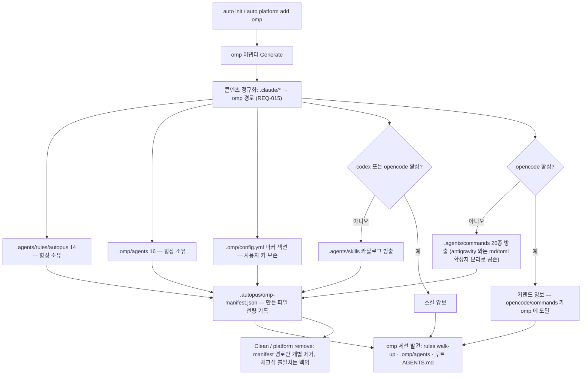

# SPEC-OMP-001 Plan: omp 플랫폼 최소 표면 지원

## Implementation Strategy

**기존 코드 활용**: 새 추상화를 만들지 않는다. `pkg/adapter/opencode`가 정석 패턴이므로 구조를 따르고, 규칙·에이전트·스킬 로딩과 트랜잭션·manifest는 기존 헬퍼를 재사용한다. 파괴적 제거 방지는 `adapter.PruneManagedPaths`를 호출하지 않고 omp `Clean` 안에 같은 계약("체크섬 불일치 시 백업 후 제거, 빈 부모만 정리")을 직접 구현한다. 양보한 표면을 manifest 순회 이전에 건너뛰어야 해서 호출 지점이 맞지 않기 때문이다.

**리뷰에서 드러난 세 가지 구조적 수정**

1. **콘텐츠 정규화가 없으면 발견돼도 오작동한다.** `pathReplacements`(`skill_transformer_replace.go:28`)는 codex·gemini·opencode 세 키뿐이고 `replacePaths`는 miss 시 원문을 반환한다. `NormalizeAgentReferences`의 `brandingRule` 맵도 omp 키가 없어 저장소 내부 경로로 폴백한다. omp 키를 추가하지 않으면 T3·T5·T13이 실질적으로 아무 변환도 하지 않는다(T15).
2. **스킬은 컴파일 게이트에서 먼저 막힌다.** `shouldCompileCatalogSkill`은 `CompileTargets`에 플랫폼이 없으면 즉시 거부하고, 기본 `compileTargetsForSkill`(`skill_catalog_policy.go:94`)은 omp를 반환하지 않는다. 식별자 테이블만 고치면 스킬이 0개 생성된다(T16).
3. **`.omp/`는 사용자 소유 native 루트다.** 디렉터리 통째 삭제와 `/.omp/` 전체 gitignore는 사용자의 `.omp/rules/`, `.omp/RULES.md`, provider 설정을 파괴한다. manifest 기반 개별 제거와 마커 섹션 설정으로 바꾼다(T6, T17, T9).

**소유권 설계** (코드 실측 기반)

| 표면 | omp 소유 조건 | 근거 |
|------|---------------|------|
| `.agents/rules/autopus/` | 항상 | 다른 어댑터가 이 경로에 쓰지 않는다 |
| `.omp/agents/`, `.omp/config.yml` | 항상 | omp 전용, 단 `.omp/` 루트는 사용자 소유 |
| `.agents/skills/` | codex·opencode 모두 비활성 | 두 어댑터가 실제 writer. gemini는 `.agents/plugins/autopus/skills/`로 미러링하므로 제외 |
| `.agents/commands/` | opencode 비활성 | gemini도 이 디렉터리에 쓰지만(`antigravity_plugin.go:98,100`) `.toml`만 만들고 omp는 `md`만 읽는다. 확장자가 겹치지 않아 양보 대신 공존하며, 양보하면 omp가 커맨드를 못 받는다 |

**omp 도구명 매핑표**: Read→`read`, Write→`write`, Edit→`edit`, Grep→`grep`, Glob→`glob`, Bash→`bash`, TodoWrite→`todo`, WebSearch→`web_search`, WebFetch→`web_search`, `mcp__*`→그대로. `yield`와 `spawns`는 omp 파서가 자동 채우므로 방출하지 않는다.

## File Impact Analysis

| 파일 | 작업 | 설명 |
|------|------|------|
| `pkg/config/schema.go` | 수정 | `validPlatforms`에 omp |
| `internal/cli/init_helpers.go` | 수정 | `initSupportedPlatforms` + `generatePlatformFiles` case |
| `pkg/detect/detect.go` | 수정 | `knownCLIs` 추가와 버전 형태 검증(REQ-019) |
| `pkg/detect/runtime.go` | 수정 | `[NEW] AgentRuntimeOMP` 상수와 인식 분기 |
| `pkg/content/skill_transformer.go` | 수정 | `supportedPlatforms`에 omp |
| `pkg/content/skill_transformer_replace.go` | 수정 + 분할 | `pathReplacements`·`brandingRule`·agent call·tool 정규화에 omp. 326행이 되어 300행 한도를 넘겨 `[NEW] skill_transformer_replace_mcp.go`·`[NEW] skill_transformer_replace_tools.go`로 순수 이동 분할 |
| `pkg/content/skill_catalog_policy.go` | 수정 | `compileTargetsForSkill` 기본값에 omp |
| `pkg/content/skill_catalog_distribution.go` | 수정 | `normalizeCatalogPlatform`·`resolveDefaultSkillTarget`에 omp |
| `internal/cli/platform.go` | 수정 | 디스패치 2곳 + REQ-018 provider 등록 스킵 |
| `internal/cli/{platform_update,update_preview,update_workspace,doctor,doctor_json_platforms,doctor_drift_content}.go` | 수정 | 디스패치 7곳 |
| `internal/cli/init.go` | 수정 | `gitignorePatterns` 디렉터리형 3종 |
| `pkg/adapter/parity_{acceptance,coverage,helpers}_test.go` | 수정 | 목록 + 어댑터 switch case |
| `[NEW] pkg/adapter/omp/*.go` | 생성 | 어댑터 9파일 + 테스트 |
| `[NEW] pkg/content/agent_transformer_omp.go`, `[NEW] pkg/content/rule_frontmatter_omp.go` | 생성 | 변환기 2파일. 규칙 변환기는 인식 키가 없을 때 본문에서 `description`을 합성하는 omp 전용 경로를 포함한다 |

## Architecture Considerations

어댑터는 `pkg/adapter/omp` 하나로 격리되고 `PlatformAdapter`만 노출한다. 콘텐츠 변환은 `pkg/content`에 두어 기존 의존 방향을 지킨다. 방출기를 rules·agents·skills·commands·config 다섯 파일로 나누고 소유권 판정을 `omp_ownership.go`로 뽑아 300줄 제한을 지킨다.

## Visual Planning Brief

## Feature Completion Scope

Primary SPEC 하나가 Outcome Lock을 닫는다. sibling SPEC은 없다. T1~T9가 표면과 배선, T13~T16이 소유권·정규화·컴파일 게이트, T17~T19가 안전성과 경계, T10~T12·T20이 검증을 담당한다. T12 라이브 실측이 드러낸 규칙 노출 갭은 omp 전용 description 합성으로 닫고 재실측 14/14로 확인했으므로 `research.md`의 `## Completion Debt`는 None이다.

## Tasks

- [x] **T1**: 식별자 5곳 등록 — `validPlatforms`, `initSupportedPlatforms`, `knownCLIs`, `[NEW] AgentRuntimeOMP`, `supportedPlatforms`.
- [x] **T2**: `pkg/adapter/omp` 골격 — `PlatformAdapter` 10개 메서드 전부 구현(`SupportsHooks`는 false, `InstallHooks`는 no-op), manifest 이름 `omp`, 만든 파일 전량 기록.
- [x] **T3**: 규칙 방출기 — 14종을 `.agents/rules/autopus/<name>.md`로. frontmatter는 omp 인식 키만 통과, 본문 비면 실패. `deferred-tools.md`는 opencode 선례처럼 omp용 문구로 치환(치환본도 `TransformRuleForOMP`를 거친다). 인식 키가 하나도 없으면 본문 H1에서 `description`을 결정적으로 합성해 세션 발견을 보장한다.
- [x] **T4**: `[NEW] pkg/content/agent_transformer_omp.go` — `TransformAgentForOMP`. `ompToolMap` 매핑, `mcp__` 통과, 미매핑 제거, 중복 제거 후 정렬. `name`·`description`·`model` 방출.
- [x] **T5**: 에이전트 방출기 — 16종을 `.omp/agents/<name>.md`로. 본문은 T15의 omp 정규화를 거친다.
- [x] **T6**: `.omp/config.yml` 마커 섹션 방출기 — `OverwriteMarker` 기계장치로 `skills.customDirectories`만 관리하고 마커 밖 사용자 키는 보존. cwd의 `.omp/`에 쓴다(omp settings는 walk-up하지 않는다).
- [x] **T7**: 수명주기 — `Validate`와 manifest 기반 `Clean`. `.claude/CLAUDE.md`를 만들 수 없음을 단위 테스트로 고정.
- [x] **T8**: CLI 디스패치 10곳 — `init_helpers.go:55`, `platform_update.go:29`, `update_preview.go:192`·`:223`, `update_workspace.go:194`, `platform.go:147`·`:218`, `doctor.go:136`, `doctor_json_platforms.go:145`, `doctor_drift_content.go:95`.
- [x] **T9**: `gitignorePatterns`에 `.agents/rules/autopus/`, `.omp/agents/`, `.omp/config.yml` 추가. `/.omp/` 전체는 추가하지 않는다. 발견 루트 아래 파일명형 패턴을 만들지 않는다.
- [x] **T10**: 파리티 — `parity_helpers_test.go` 3개 맵, `parity_acceptance_test.go`·`parity_coverage_test.go`의 플랫폼 목록 **및 어댑터 switch case** 추가. 목록만 넣으면 unknown-platform 에러로 즉시 실패한다.
- [x] **T11**: 오라클 단위 테스트 — S1~S6, S9~S15를 구현.
- [x] **T12**: 라이브 omp 검증 — `auto init --platforms omp` 후 무인증 RPC 세션에서 발견 결과를 확인. 2026-08-01 omp 17.1.8로 실행 완료. 이 버전의 `/context`는 토큰 사용량만 반환하므로 시작 시 `available_commands_update` 프레임과 `/dump`의 실제 시스템 프롬프트를 증거로 썼다. 1차 실측에서 규칙 8/14 FAIL을 발견해 omp 전용 description 합성으로 닫고, 같은 절차로 재실측해 **규칙 14/14(`<domain-rules>` 11 + TTSR 3, 중복 0)**, 에이전트 16, 커맨드 20, 스킬 `auto`, 정규화 전부 PASS를 확인했다. 절차와 설계 근거는 `research.md`의 `## Implementation Evidence`에 있다.
- [x] **T13**: 스킬 소유권 양보 — `[NEW] omp_ownership.go`의 `ompOwnsSharedSkillSurface`(codex·opencode 모두 없을 때 참)와 `omp_skills.go`. 변환은 `LoadSkillCatalogFromFS`·`NewSkillTransformerFromFS` 재사용.
- [x] **T14**: 커맨드 표면 — `ompOwnsCommandSurface`(opencode가 없을 때 참)와 `omp_commands.go`, `[NEW] omp_specs.go`의 20종 목록. gemini가 같은 디렉터리에 쓰는 `.toml` 파일은 manifest에 담지 않고 건드리지 않는다.
- [x] **T15**: omp 콘텐츠 정규화 — `skill_transformer_replace.go`의 `pathReplacements`에 omp 항목, `brandingRule`에 `.agents/rules/autopus/branding.md`, `replaceAgentCalls`·`replaceTodoWrite`·`replaceWorkflowTools`에 omp 분기 추가. **`:195`의 `openCodeSkillPathRe` 2단계 재작성(`.agents/skills/<name>.md` → `.agents/skills/<name>/SKILL.md`)을 omp에도 적용**한다. 접두사 매핑만 하면 `.claude/skills/autopus/ax-annotation.md`가 존재하지 않는 `.agents/skills/ax-annotation.md`가 된다.
- [x] **T16**: `compileTargetsForSkill` 기본 반환값에 omp 추가, `normalizeCatalogPlatform`·`resolveDefaultSkillTarget`에 omp 대상 경로 `.agents/skills/<name>/SKILL.md` 추가.
- [x] **T17**: 파괴적 제거 제거 — `Clean`과 `platform remove` 경로에서 `.omp/`·`.agents/` 디렉터리 삭제를 없애고 manifest 경로만 개별 제거한다. `adapter.PruneManagedPaths`를 호출하지 않고 `omp_lifecycle.go`의 `Clean`이 같은 계약(체크섬 불일치 백업 → 제거 → 빈 부모 정리)을 직접 구현한다. **Clean과 remove는 manifest를 읽기 전에 양보 조건을 먼저 재평가하고, 더 이상 소유하지 않는 표면은 백업조차 하지 않고 통째로 건너뛴다.** `auto platform add opencode`가 omp manifest를 갱신하지 않기 때문에 체크섬만 믿으면 opencode의 활성 파일을 지운다.
- [x] **T18**: `internal/cli/platform.go`에서 `PlatformToProvider`가 빈 값이면 `EnsureOrchestraProvider` 호출을 건너뛴다. 같은 폴백을 쓰는 `cursor`에도 적용되는 의도된 변경임을 주석으로 남긴다.
- [x] **T19**: `pkg/detect`에 omp 버전 형태 검증 추가 — `omp --version` 출력이 oh-my-pi 형태일 때만 플랫폼으로 인정.
- [x] **T20**: 문서 정합 — `research.md`의 수치를 최종값(REQ 19, INV 19, 태스크 20, 신규 소스 13)으로 맞추고, `## Implementation Evidence`에 S7 실측·E4 prune root 결정·파일 분할을 기록한다.

## Risks & Mitigations

| 리스크 | 영향도 | 대응 |
|--------|--------|------|
| 정규화 누락으로 발견은 되나 오작동 | 높음 | T15 + S12 오라클이 경로 문자열을 직접 검사 |
| `.omp/` 사용자 데이터 손실 | 높음 | REQ-017, T17, S13이 비관리 파일 보존을 고정 |
| 양보 조건 오류로 스킬·커맨드 미도달 또는 타 플랫폼 파일 삭제 | 높음 | S10·S11이 4개 설정과 공존 시 발견까지 검사 |
| gitignore 파일명형 패턴이 발견을 조용히 차단 | 중간 | REQ-011 제약과 S8이 gitignore 적용 후 발견을 재확인 |
| omp 바이너리 이름 충돌 | 중간 | REQ-019 버전 형태 검증 |
| `workflowSpecs` 세 번째 복사본의 드리프트 | 낮음 | 소유권을 `omp_specs.go`에 명시하고 S11이 20종 집합 동등성을 고정 |

## Dependencies

신규 외부 의존성 없음. 내부 의존은 `pkg/adapter`, `pkg/content`, `pkg/config`, `content` 임베디드 FS.

## Exit Criteria

- [x] REQ-001 부터 REQ-019 구현 완료
- [x] S1 부터 S15, E1 부터 E6 통과 — 오라클 테스트와 2026-08-01 라이브 재실측(규칙 14/14 포함)으로 전건 확인
- [x] `go test ./...` green
- [x] `auto doctor` omp 검증 통과 — omp 항목 3건 전부 `[OK]`이고 `--json`의 `data.platforms`가 `[{"name":"omp","valid":true}]`
