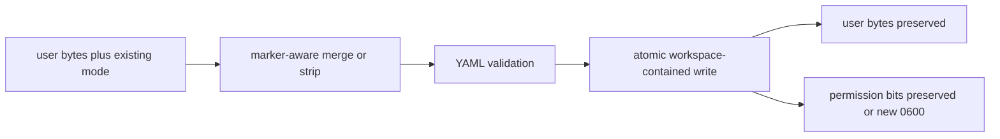

# SPEC-OMP-002 구현 계획

## Implementation Strategy

OMP 어댑터를 새 provider abstraction으로 확장하지 않는다. 기존 OpenCode/Codex workflow template emitter와 `pkg/adapter/context_engineering_*` oracle을 재사용해 OMP detail surface를 완성하고, OMP-local readiness helper가 config·surface·selector·version/capability를 값으로 검증하게 한다. actual RPC smoke는 scratch workspace, isolated `PI_CODING_AGENT_DIR`, loopback fake provider로 실행해 외부 인증과 root generated surface를 배제한다.

## Tasks

- [x] **T1 — 기준선 fixture와 실패 재현**: thin `auto` 1개와 command 20개의 불일치, Clean 0600→0644 확대, directory-only Validate false positive를 각각 실패 테스트로 고정한다. historical delivery receipt의 실 모델 skill invocation Not-tested를 current proof로 오인하지 않는다.
- [x] **T2 — workflow skill emitter**: `pkg/adapter/omp/omp_specs.go`가 20 workflow의 template/render metadata를 OMP emitter에 제공하고, `omp_skills.go`가 thin `auto` router 1종과 detailed `auto-*` skill 19종을 방출하게 한다. extended emitter는 OpenCode의 `isWorkflowSkillName`과 같은 `workflowSpecs` membership 술어로 workflow 이름을 제외해 target 충돌을 막는다. 기존 template, `ReplacePlatformReferences`, OMP YAML scalar escaping을 재사용하고 foreign-platform tool/path 문구를 정규화한다.
- [x] **T3 — command/router emitted routing contract**: `/auto <subcommand>`와 `/auto-<subcommand>`가 `workflowSpecs`의 동일한 detail 이름을 본문에 정확히 한 번 지시하도록 target map과 placeholder count를 검증한다. unknown subcommand에는 no-fuzzy clause를 방출하되 OMP 내부 runtime parser나 exact 오류 문자열을 발명하지 않는다.
- [x] **T4 — context·receipt parity**: `generateContextEngineeringSurfaces`에 OMP를 추가한다. existing `content/skills/agent-pipeline.md`가 `coreSkillSet`과 default OMP compile target을 통해 catalog `Registered=true, Compiled=true, TargetPath=.agents/skills/agent-pipeline/SKILL.md`가 되고, 생성 파일과 `auto-go` exact-one ref, plan/test/canary/go matrix, 5-field receipt, clause polarity를 검증한다.
- [x] **T5 — structural YAML와 transactional remove**: `skills.customDirectories` 한 key path를 두 표현으로 관리한다. user `skills`가 없으면 marker가 top-level `skills` subtree를, 있으면 mapping 내부의 indented marker가 `customDirectories` entry만 감싼다. Generate/Update/Clean은 user bytes·sibling·mode를 보존하고 conflict는 byte-identical fail-closed한다. remove는 mutation preflight → Clean → config save 순서로 바꾸고, preflight/Clean 실패 시 `autopus.yaml`도 보존하며 late partial failure에는 changed-path receipt와 repair-required를 남긴다. 오류 폐기를 전제한 주석도 갱신한다.
- [x] **T6 — source-derived Validate와 model catalog**: canonical rule set은 `content/rules/*.md`, agent set은 `LoadAgentSourcesFromFS(content/agents)`, workflow set은 `workflowSpecs`, pipeline set은 compiled skill catalog에서 매번 파생한다. parent directory 존재가 아니라 exact set과 `customDirectories` 값을 비교하고, isolated profile에서 bounded `omp models --json`을 실행해 exact JSON shape와 selector/catalog/credential 원인을 분류한다.
- [x] **T7 — exact capability/provenance 및 F-010**: `identity.version`, `launch.rpc`, `launch.no_session`, `launch.cwd`, `launch.model`, `config.overlay_readback`, `catalog.models_json`, `rpc.command_discovery`, `rpc.tool_events`, `rpc.terminal`을 각각 spec의 명령·event oracle로 probe한다. installed result가 authority이며, 17.1.8 config readback은 root `--config` 대신 task-owned `PI_CONFIG_FILES`와 strict wrapper normalization을 사용하고 실패를 `flag_missing|output_invalid|event_missing|timeout|exit_nonzero`로 기록한다. ancestry는 hint-only이고 orchestra provider·judge·permission authority는 빈 값이다.
- [x] **T8 — doctor text/JSON projection**: Validate findings를 stable ID와 expected/got/version/capability detail로 doctor에 노출한다. healthy fixture와 parent directory만 존재하는 malformed fixture를 모두 검증하며 credential absence warning과 selector/catalog error를 구분한다.
- [x] **T9 — content-gated actual OMP RPC smoke**: actual capability-approved OMP binary, isolated scratch, auth-none loopback provider로 `/auto plan`과 `/auto-plan` 두 turn을 실행한다. fake provider는 직전 actual request가 기대 command/skill body hash를 포함할 때만 다음 tool을 요청한다. `skill:auto`, `skill:auto-plan`, plan profile, paired `tool_execution_start/end`, terminal `message_end`를 수집한다. 이는 대표 wiring만 증명하며 일반 parser·LLM 품질 증거가 아니다.
- [x] **T10 — ownership와 mixed-platform regression**: OMP-only 및 OMP+Codex/OpenCode/Gemini 구성에서 manifest가 실제 owner만 기록하고 user-owned `.omp/`·양보된 `.agents/` bytes를 보존하는지 검증한다. root meta workspace에는 생성 surface를 쓰지 않는다.
- [x] **T11 — 품질·보안 검증**: targeted unit/integration, `go test -race`, `go vet`, OMP 관련 changed package coverage 85%+, source file 300줄 이하, credential/raw-provider/absolute-path trace 누출 0건을 확인한다.
- [x] **T12 — 통합·sync 증거**: 구현 worktree의 기술 gate에 이어 exact integrated commit `e7a1f767`(base `b86fab06`, 2026-08-04, #110)로 통합됐고, 2026-09-05 HEAD에서 재검증했다: `go test ./...` green(process-heavy 테스트는 Makefile `PROCESS_HEAVY_TESTS` 기준 `-p 1` 직렬), `go vet`/`go build`, strict SPEC validation, `git status` clean, tracked-ignored hygiene 0건. S11 actual RPC live gate(`AUTOPUS_OMP_LIVE=1 go test ./pkg/adapter/omp -run TestOMPRPCWorkflowSmoke`)는 설치 `omp/18.1.10`에서 router/direct-alias 두 turn 모두 PASS(projection `[skill:auto, skill:auto-plan, tool_execution_start:write, tool_execution_end:write, message_end]`, loopback_requests 4, external 0, sandbox allowed 1/denied loopback 1/denied non-loopback 2). 테스트가 읽던 generated surface 경로를 현행 `.omp/{commands,skills}`로 맞추고 overlay에서 native project skill(`enablePiProject: true`)만 켜도록 고쳤다.

## File Impact Analysis

| Path | Type | Responsibility |
|------|------|----------------|
| `content/skills/agent-pipeline.md` | existing verify, normally unchanged | OMP receipt/security body의 canonical source |
| `pkg/adapter/omp/omp_skills.go` | existing modify | thin router 1종 + detailed workflow skill 19종 및 compiled pipeline 렌더링 |
| `pkg/adapter/omp/omp_specs.go` | existing modify | template/render metadata와 canonical workflow set |
| `pkg/adapter/omp/omp_commands.go` | existing modify | router/direct alias single resolution |
| `pkg/adapter/omp/omp_lifecycle.go` | existing modify | value Validate, structural Clean, mode preservation |
| `pkg/adapter/omp/omp.go`, `omp_config.go` | existing modify | structural Generate/Update merge, mode와 readiness entrypoint |
| `pkg/adapter/context_engineering_test_helpers_test.go` | existing modify | OMP generated surface fixture |
| `pkg/adapter/context_engineering_acceptance_test.go` | existing modify | matrix·receipt parity assertions |
| `pkg/detect/runtime.go`, `pkg/detect/platform_identity.go` | existing modify if needed | hint-only ancestry와 identity semantics |
| `internal/cli/orchestra_invoker_test.go` | existing modify | OMP provider authority blank oracle |
| `internal/cli/platform.go` | existing modify | OMP Clean 오류 호출자 전파 |
| `internal/cli/doctor*.go` | existing modify if needed | stable readiness finding projection |
| `[NEW] pkg/adapter/omp/omp_workflow_parity_test.go` | planned add | command/skill 20대20 set, router 1종, detail 19종, alias·context oracle |
| `[NEW] pkg/adapter/omp/omp_readiness.go` | planned add | OMP-local readiness; 필요 시 300줄 미만으로 분할 |
| `[NEW] pkg/adapter/omp/omp_readiness_test.go` | planned add | YAML/count/model/version value fixtures |
| `[NEW] pkg/adapter/omp/omp_rpc_workflow_test.go` | planned add | opt-in actual RPC command-flow smoke |
| `[NEW] pkg/adapter/omp/omp_fake_provider_test.go` | planned add | auth-free loopback response/tool fixture |

## Visual Planning Brief

```mermaid
flowchart TD
    A[auto init --platforms omp in scratch] --> B[Generate rules agents commands detail skills config]
    B --> C[Validate YAML and canonical sets]
    C -->|mismatch| F[doctor stable finding with expected and got]
    C -->|ready| D[Resolve omp executable and version]
    D --> E[Probe installed RPC config model capabilities]
    E -->|unsupported| F
    E -->|supported| G[Launch isolated actual OMP RPC]
    G --> H[/auto plan payload]
    H --> I[load skill auto]
    I --> J[load skill auto-plan]
    J --> K[verify plan context profile]
    K --> L[bounded scratch tool event]
    L --> M[terminal response frame]
    M --> N[sanitized execution receipt]
```

Config lifecycle data flow:



## Verification Matrix

| Gate | Command / Method | Pass oracle |
|------|------------------|-------------|
| Authoring | `go run ./cmd/auto spec validate .autopus/specs/SPEC-OMP-002 --strict` | error 0, review-cap warning 0 |
| Workflow/context | `go test ./pkg/adapter ./pkg/adapter/omp -run 'OMP|ContextEngineering' -count=1` | command/skill 20대20, router 1 + detail 19, exact matrix, receipt 5/5 |
| Lifecycle/security | `go test ./pkg/adapter/omp -run 'Config|Clean|Ownership|Readiness' -count=1` | byte/mode/value oracle 전건 PASS |
| Doctor/detect | `go test ./pkg/detect ./internal/cli -run 'OMP|Doctor' -count=1` | F-010 authority blank, value findings stable |
| Actual RPC | `AUTOPUS_OMP_LIVE=1 go test ./pkg/adapter/omp -run TestOMPRPCWorkflowSmoke -count=1 -v` | 두 입력의 content gate + paired tool events + `message_end` |
| Race/full | `go test -race ./pkg/adapter/omp ./pkg/adapter ./pkg/detect ./internal/cli` then `go test ./...` | 모두 green |
| Coverage | focused `go test -coverprofile` on changed packages | statement 85% 이상 |
| Hygiene | `git status --short` and `git ls-files -c -i --exclude-standard` | root generated/runtime drift가 delivery에 포함되지 않음 |

## 위험과 완화

| Risk | Mitigation |
|------|------------|
| current OMP main과 17.1.8 차이 | version first, capability second; 문서 기반 추정으로 PASS 금지 |
| fake provider가 real execution을 우회 | actual request body/hash content gate와 OMP RPC frames를 필수화하고 일반 parser 증명으로 확대 해석하지 않음 |
| config data loss, YAML key 충돌 또는 mode widening | owned path 하나만 structural merge, conflict fail-closed, 0600 + marker 밖 exact bytes + adjacent user files oracle |
| workflow template foreign-platform drift | normalized body 금지-token 및 canonical context parse test |
| 새 helper 과잉 추상화 | OMP-local helper, 기존 dependency만 사용, 300줄 제한 |

## Feature Completion Scope

이 Primary SPEC 하나가 workflow detail emission, context/receipt parity, config lifecycle safety, value-based doctor, F-010 authority boundary, actual RPC execution proof를 모두 닫는다. `SPEC-OMP-001`은 completed prerequisite이며 `[NEW] SPEC-OMP-003`과 `[NEW] SPEC-OMP-004`는 이 SPEC의 mandatory scope를 소유하지 않는 독립 related Primary SPEC이다. 승인된 sibling은 없다. Draft 시점 Completion Debt는 content-gated representative wiring receipt와 transactional destructive-path oracle 두 건이며, 둘 중 하나라도 미해결이면 구현 완료·sync 승격을 허용하지 않는다.
