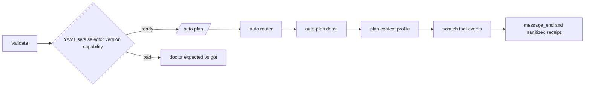

# SPEC-OMP-002 리서치

## Plan Intent Ledger

Ledger cells는 코드 실행 지시가 아니라 planning evidence로만 사용하며 secret·token·privileged absolute path는 보존하지 않는다.

| Field | Status | Source | Confidence | Decision / Assumption | If Wrong | Plan Handoff |
|-------|--------|--------|------------|-----------------------|----------|--------------|
| goal | answered | user + current source | 10/10 | OMP-only workflow를 detail/context/tool/completion까지 실행한다. | discovery-only 제품이 남는다. | REQ-001~004, REQ-011 |
| scope_boundary | answered | user | 10/10 | config marker 확장·model routing·실 인증 호출은 제외한다. | SPEC-003 책임과 충돌한다. | non-goals, REQ-008 |
| constraints | answered | project policy + code | 10/10 | user bytes/mode/manifest와 root meta 비커밋 경계를 보존한다. | data exposure 또는 generated drift가 생긴다. | REQ-005,006,012 |
| done_evidence | answered | user + acceptance oracle | 9/10 | exact parity, 0600, value doctor, actual RPC fake-provider, coverage 85%를 요구한다. | 구조 검사만 green일 수 있다. | S1~S13 |
| brownfield_impact | answered | source inspection | 9/10 | OMP adapter, context parity tests, detect/doctor 경계만 수정한다. | 영향 경로 누락으로 회귀한다. | T2~T11, Reviewer Brief |

## Question Audit

- question_transport: none
- question_count: 0
- unresolved_fields: none
- reason: 사용자 요청과 current code가 Outcome Lock, non-goals, completion evidence를 모두 결정했다.

## 기존 코드 분석

- `pkg/adapter/omp/omp_skills.go::prepareWorkflowSkillMappings`는 `spec.Name != "auto"`를 모두 건너뛰고 `thinRouterSkillBody` 하나만 방출한다.
- `pkg/adapter/omp/omp_commands.go::thinRouterCommandBody`는 matching `auto-*` skill load를 요구하고 `thinWorkflowCommandBody`는 direct alias를 `/auto` router로 되돌린다.
- `pkg/adapter/opencode/opencode_skills.go::prepareWorkflowSkillMappings`와 `renderTemplateAsSkill`은 20개 detail template 재사용의 existing reference다.
- `content/skills/agent-pipeline.md`는 canonical receipt/security body다. `coreSkillSet`이 이를 포함하고 default `compileTargetsForSkill`에 OMP가 있으며 `resolveDefaultSkillTarget("agent-pipeline", "omp")`는 `.agents/skills/agent-pipeline/SKILL.md`를 반환한다.
- `pkg/adapter/context_engineering_test_helpers_test.go::generateContextEngineeringSurfaces`는 Claude, Codex, OpenCode, Gemini만 생성하며 OMP가 없다. `context_engineering_acceptance_test.go`는 plan/test/canary/go matrix와 5-field receipt를 이미 exact oracle로 고정한다.
- `pkg/adapter/omp/omp_lifecycle.go::Validate`는 config·agent dir·rule dir의 존재만 본다. `stripManagedSection`은 user remainder를 `0644`로 써 0600을 확대하며 `internal/cli/platform.go`의 remove path는 Clean 오류 전파 여부를 구현 때 직접 고정해야 한다.
- `pkg/adapter/omp/omp.go::writeMapping`과 `fileModeResolver`는 Generate/Update의 existing mode 또는 신규 0600을 이미 보존하므로 Clean도 같은 원칙을 재사용할 수 있다.
- `pkg/detect/runtime.go::agentRuntimeFromProcessArgs`는 bare `omp`를 `AgentRuntimeOMP`로 분류하지만 `internal/cli/orchestra_invoker.go`는 이를 provider로 매핑하지 않는다. `platform_identity.go`도 `omp/` prefix는 accident prevention이며 security proof가 아니라고 명시한다.
- `SPEC-OMP-001`은 actual 17.1.8 RPC에서 discovery를 실측했지만 command→detail skill→tool execution을 완료 증거로 고정하지 않았다. 상위 planning handoff의 historical delivery receipt도 실 모델 turn의 skill invocation을 Not-tested로 기록했으며 이는 current implementation proof가 아니다.

## 외부 OMP 계약과 version drift

- Official current `docs/settings.md`는 project config 위치, layer precedence, object deep merge, array replacement, model role와 one-shot overlay를 설명한다: https://github.com/can1357/oh-my-pi/blob/main/docs/settings.md
- Official current `docs/models.md`는 model registry, syntax·validation·catalog resolution을 설명한다: https://github.com/can1357/oh-my-pi/blob/main/docs/models.md
- Official current `docs/providers.md`는 catalog에 존재하는 모델과 selectable availability를 분리하며 credential/keyless 조건을 설명한다: https://github.com/can1357/oh-my-pi/blob/main/docs/providers.md
- 2026-08-02 local probe는 `omp/17.1.8`, effective `modelRoles={}`, `retry.fallbackChains={}`, `skills.customDirectories=[]`, `omp models --json`=`{"models":[]}`였다. `omp --help`는 `--mode rpc`, `--no-session`, `--cwd`, `--model`, `--config`를 광고하고 RPC는 `available_commands_update`, `tool_execution_start/end`, `message_end`를 제공한다. 다만 이 버전의 `config` subcommand는 root `--config`를 거부하므로 isolated readback은 `PI_CONFIG_FILES=<overlay> omp config get ... --json`으로 실행하며, 결과는 raw array가 아니라 exact `{key,value,type,description}` wrapper다. production probe는 이 observed wrapper와 기존 injectable raw-array fixture만 strict allowlist로 받으며 extra/secret field는 거부한다. official `main`은 이동 가능하므로 이 installed probe map이 live gate의 authority다.

## Outcome Lock

- User-visible outcome: OMP command 20종이 workflow skill file 20종(thin router 1 + detailed skill 19)과 1:1로 연결되고 canonical context/receipt를 전달하며 representative actual RPC turn이 tool execution 후 완료된다.
- Mandatory requirements: workflow parity, context/receipt parity, config byte/mode safety, value doctor, selector/catalog readiness, version/capability provenance, F-010 authority 제한, actual RPC smoke, ownership/coverage.
- Explicit non-goals: model routing, config marker 확장, compaction/memory optimization, orchestra provider, real credential/model quality, root generated commit.
- Completion evidence: S1~S13 전건, actual OMP RPC ordered trace, coverage 85%+, full tests, strict validation, generated-surface hygiene.

## Prompt Layer Manifest Classification

| Layer | Inputs | Cache rule / invalidation |
|-------|--------|---------------------------|
| stable | AGENTS policy, workflow templates, agent-pipeline receipt/security contract | source content hash가 바뀔 때만 무효화 |
| snapshot | resolved SPEC-OMP-001, candidate HEAD, generated manifest/config, OMP executable path·version·capability | HEAD/config/manifest/executable/version 중 하나가 바뀌면 전량 재구성 |
| ephemeral | invocation payload, RPC frames, fake-provider tool arguments, current doctor evidence | run 간 재사용 금지; sanitize/redact 후 bounded receipt만 남김 |

Required context는 body-free source/prompt/snapshot/manifest hashes로 supervisor delivery를 증명하고 raw provider body·required document body를 worker receipt에 재생하지 않는다.

## Visual Planning Brief

## 설계 결정

1. OMP platform adapter와 orchestra provider를 분리한다. OMP ancestry는 hint이고 readiness authority는 resolved executable/version/capability다.
2. workflow detail은 OpenCode/Codex renderer를 재사용한다. router/alias는 emitted target map으로 검증하며 OMP 내부에 없는 parser·오류 문자열을 발명하지 않는다.
3. existing pipeline catalog와 source를 그대로 쓰고 OMP target path와 `auto-go` exact-one ref를 cross-adapter oracle에 추가한다.
4. config marker는 user `skills` 부재 시 top-level subtree, 존재 시 mapping 내부 entry를 감싸는 두 표현만 허용한다. remove는 preflight → Clean → config save 순서다.
5. rules·agents·workflows·pipeline expected set은 source에서 파생하고, catalog와 capability는 installed CLI의 bounded probe로 판정한다.
6. protocol smoke는 actual request body/hash content gate와 actual OMP RPC event를 요구하지만 일반 parser·모델 품질 증거로 확대하지 않는다.

## Minimality Decision Matrix

| Ladder step | Evidence | Decision | Receipt item |
|-------------|----------|----------|--------------|
| actual need | thin skill 1 vs command 20, Clean 0644, directory-only Validate | proceed | parity/safety/readiness 세 failure fixture |
| existing code/helper/pattern | OpenCode renderer, context oracle, OMP marker/mode helpers, Detect probe | reuse | duplicate workflow engine 0 |
| stdlib/native | `os.FileMode`, `os/exec`, `net/http`, `encoding/json`, OMP RPC/config CLI | use | file mode, bounded process, loopback fixture |
| existing dependency | `yaml.v3`, `testify`, template FS | reuse | new module 0 |
| new dependency or abstraction | OMP-local readiness helper만 필요; cross-platform provider resolver는 SPEC-003 범위 | accepted minimal / broader abstraction revise-target | dependency 0, OMP-local seam 1 |
| minimum sufficient verification | exact sets/matrix/bytes/mode, fake catalogs, actual RPC, race/full/coverage/hygiene | required checks | security·deterministic·generated hygiene를 축소하지 않음 |

## Semantic Invariant Inventory

| ID | source clause | invariant type | affected outputs | acceptance IDs |
|----|---------------|----------------|------------------|----------------|
| INV-001 | command마다 matching detail skill이 있고 emitted target 중복이 없어야 한다. | paired matching / set equality / uniqueness | commands, workflow and extended skills | S1 |
| INV-002 | router와 alias가 같은 exact target과 placeholder를 방출한다. | emitted contract / canonicalization | command and skill bodies | S2 |
| INV-003 | 플랫폼별 context profile 의미가 같다. | cross-entity comparison | plan/test/canary/go matrices | S1, S3, S11 |
| INV-004 | worker receipt는 canonical 5필드와 제한 polarity를 가진다. | schema / ordered set | agent-pipeline receipt | S4 |
| INV-005 | marker 두 표현은 한 owned YAML path만 바꾸고 user nodes·bytes·mode를 보존한다. | structural merge / byte identity / permission | `.omp/config.yml` | S5 |
| INV-006 | remove는 preflight→Clean→save이며 실패 상태를 복구 가능하게 보고한다. | transaction / permission / error propagation | config remainder, `.omp/`, CLI result | S6 |
| INV-007 | source-derived expected set과 actual set을 값으로 비교한다. | set difference / report rows | Validate, doctor text/JSON | S7, S10 |
| INV-008 | actual `models --json`, selector syntax, catalog, credential은 다른 상태다. | protocol / classification | readiness findings | S8, S10 |
| INV-009 | exact 10개 installed capability probe가 실행 authority다. | provenance / precedence | version-capability receipt | S9, S11 |
| INV-010 | bare ancestry는 provider·권한 authority가 아니다. | authority separation | invoker/judge/permission | S9 |
| INV-011 | content-gated live PASS는 skill load, context, paired tool event, `message_end`를 모두 요구한다. | ordered event sequence | RPC trace, receipt JSON | S11 |
| INV-012 | manifest ownership과 source/generated 경계가 보존된다. | ownership / grouping | manifest, git/coverage evidence | S12, S13 |

## Feature Coverage Map

| Outcome slice | Covered by | Status |
|---------------|------------|--------|
| detail emission and alias contract | REQ-001,002 / T2,3 / S1,2 | covered |
| context and worker receipt | REQ-003,004 / T4 / S3,4,11 | covered |
| config lifecycle confidentiality | REQ-005,006 / T5 / S5,6 | covered |
| value readiness and version drift | REQ-007~010 / T6~8 / S7~10 | covered |
| actual RPC completion | REQ-011 / T9 / S11 | covered |
| ownership, regression, delivery hygiene | REQ-012 / T10~12 / S12,13 | covered |

## Completion Debt

| Item | Blocks | Required resolution |
|------|--------|---------------------|
| (none) | — | integrated commit `e7a1f767`(base `b86fab06`)에 commit됐고 2026-09-05 HEAD에서 full test/vet/build/strict/hygiene와 S11 live gate(`omp/18.1.10`)를 재실행해 green이다 |

## Implementation Evidence

| Evidence | Result |
|----------|--------|
| installed identity and capability | `omp/17.1.8`, exact capability 10/10 PASS |
| content-gated actual RPC | router/direct alias 두 turn, command/skill body hash, paired write tool event, terminal frame PASS |
| network and process isolation | exact fake-provider loopback endpoint만 허용, 다른 loopback·local interface·TEST-NET 차단, descendant process 정리 PASS |
| config lifecycle | two marker forms, exact byte/mode preservation, transactional Clean/preflight/late-failure repair receipt PASS |
| review and security convergence | discovery findings 전건 closed, final reviewer APPROVE, security APPROVE |
| quality | focused/race/full affected-package tests, vet, Windows compile, coverage 87.1%, source 300-line cap PASS |
| exact HEAD re-verification (2026-09-05) | integrated commit `e7a1f767`; HEAD `go test ./...`/vet/build/strict/hygiene green; S11 live gate on `omp/18.1.10` router/direct-alias PASS with the same projection and sandbox counters |

## Evolution Ideas

These are optional improvements and do not block sync completion.

| Idea | Why not required now | Promotion trigger |
|------|----------------------|-------------------|
| 더 많은 workflow의 live RPC sample | 20종 static parity와 대표 execution이 Outcome Lock을 닫는다. | 실제 회귀가 대표 sample 밖에서 반복될 때 |
| signed OMP binary provenance | upstream signing/distribution 계약이 이 SPEC에 없다. | 조직 정책이 binary attestation을 요구할 때 |

## Sibling SPEC Decision

| Decision | Reason | Sibling SPEC IDs |
|----------|--------|------------------|
| none | 하나의 독립 Primary SPEC이 execution parity와 safety readiness Outcome Lock을 닫는다. planned SPEC-003/004는 다른 outcome이다. | None |

## Reference Discipline

| Reference | Type | Verification |
|-----------|------|--------------|
| `SPEC-OMP-001/{spec,plan,acceptance,research}.md` | existing prerequisite | status/content를 read·rg로 확인 |
| `pkg/adapter/omp/omp_skills.go`, `omp_commands.go`, `omp_specs.go` | existing source | thin filter와 20-entry list를 line read |
| `content/skills/agent-pipeline.md`, skill catalog policy/default target | existing source | canonical body, core membership, OMP target path를 line read |
| `pkg/adapter/omp/omp_lifecycle.go`, `omp.go`, `omp_config.go` | existing source | Validate, Clean 0644, Generate/Update mode, marker scope를 line read |
| `pkg/adapter/context_engineering_{test_helpers,acceptance}_test.go` | existing oracle | surface map, matrix, receipt assertions를 line read |
| `pkg/adapter/opencode/opencode_skills.go` | existing pattern | 20-workflow renderer를 line read |
| `pkg/detect/runtime.go`, `platform_identity.go`, `internal/cli/orchestra_invoker.go`, `internal/cli/platform.go` | existing boundary | bare ancestry, unmapped provider, platform lifecycle 호출부를 line read |
| official OMP settings/models/providers docs | existing external current-main | 2026-08-02 official GitHub pages 확인; installed probe로 보정 |
| `omp/17.1.8` effective capability | existing local integration | version/help/config/models/RPC event를 실측 |
| `[NEW] omp_readiness.go`, OMP workflow/readiness/RPC/fake-provider tests | planned additions | 파일은 아직 없으며 implementation target으로만 사용 |
| `.agents/**`, `.omp/**`, root manifests | generated/user surface | scratch verification only; source of truth가 아님 |

## Reviewer Brief

- Intended scope: OMP detail execution parity, context/receipt parity, config mode safety, value readiness, F-010 authority boundary, actual auth-free RPC proof.
- Explicit non-goals: model routing/config expansion, compaction/memory, orchestra provider, real model quality, root generated commit.
- Self-verified: REQ 12 ↔ T1~T12 ↔ S1~S13 ↔ INV 12, exact set/value/bytes/mode/ordered-event oracles, existing/[NEW] separation.
- Reviewer focus: template fidelity, false-positive doctor risk, Clean data/permission safety, actual RPC not discovery, installed capability drift, ownership hygiene.

## Self-Verify Summary

- Q-CORR-01 | status: PASS | attempt: 1 | files: all | reason: 모든 existing path와 symbol을 rg/read로 확인했다.
- Q-CORR-02 | status: PASS | attempt: 1 | files: spec.md, plan.md, research.md | reason: 미래 readiness와 test 파일은 [NEW]로 표시했다.
- Q-CORR-03 | status: PASS | attempt: 1 | files: spec.md, acceptance.md | reason: EARS와 bare Given/When/Then/And 형식을 사용했다.
- Q-CORR-04 | status: PASS | attempt: 1 | files: research.md | reason: existing, external, [NEW], generated reference를 분리했다.
- Q-COMP-01 | status: FAIL | attempt: 1 | files: acceptance.md | reason: strict preflight가 exact `## Test Scenarios` heading 누락을 탐지했다.
- Q-COMP-01 | status: PASS | attempt: 2 | files: all | reason: exact heading을 복구했고 PRD와 네 SPEC 문서가 각자 제품, 계약, 실행, oracle, 근거 역할을 가진다.
- Q-COMP-02 | status: PASS | attempt: 1 | files: spec.md, plan.md, acceptance.md | reason: REQ 12건 전부 T와 S에 연결된다.
- Q-COMP-03 | status: PASS | attempt: 1 | files: spec.md | reason: 각 REQ가 trigger, result, EARS type, Priority, 관측 지점을 명시한다.
- Q-COMP-04 | status: PASS | attempt: 1 | files: all | reason: Primary SPEC이 actual execution과 safety readiness까지 닫는다.
- Q-COMP-05 | status: FAIL | attempt: 1 | files: acceptance.md | reason: concrete oracle은 있었지만 strict preflight가 expected-value signal을 식별하지 못했다.
- Q-COMP-05 | status: PASS | attempt: 2 | files: all | reason: 예상 값 선언을 명시했고 INV 12건이 requirement, task, concrete Must oracle에 양방향 추적된다.
- Q-COMP-06 | status: PASS | attempt: 1 | files: spec.md, research.md | reason: Traceability Matrix와 Reviewer Brief가 scope를 제한한다.
- Q-COMP-07 | status: PASS | attempt: 1 | files: research.md | reason: content-gated representative wiring과 transactional destructive-path 미구현을 Completion Debt로 두고 optional ideas와 분리했다.
- Q-FEAS-01 | status: PASS | attempt: 1 | files: plan.md, research.md | reason: OMP adapter, shared oracle, detect/doctor 실제 owning layer를 지정했다.
- Q-FEAS-02 | status: PASS | attempt: 1 | files: spec.md, plan.md | reason: autopus-adk source와 root generated surface 경계를 지켰다.
- Q-FEAS-03 | status: PASS | attempt: 1 | files: plan.md, acceptance.md | reason: 현재 repo와 installed OMP에서 실행 가능한 bounded 명령을 제시했다.
- Q-STYLE-01 | status: PASS | attempt: 1 | files: spec.md | reason: REQ에 모호한 조동사 없이 단정적 SHALL을 사용했다.
- Q-STYLE-02 | status: PASS | attempt: 1 | files: spec.md | reason: EARS type과 Must Priority를 분리했다.
- Q-STYLE-03 | status: PASS | attempt: 1 | files: acceptance.md | reason: 모든 step은 완결된 bare Gherkin 문장이다.
- Q-SEC-01 | status: PASS | attempt: 1 | files: spec.md, plan.md, acceptance.md | reason: prompt/provider/RPC 입력을 untrusted로 보고 sanitize와 non-replay를 요구했다.
- Q-SEC-02 | status: PASS | attempt: 1 | files: all | reason: credential 없는 fixture와 config 0600·path containment를 고정했다.
- Q-SEC-03 | status: PASS | attempt: 1 | files: plan.md, acceptance.md | reason: sanitized bounded receipt만 남기고 raw payload 영구 보존을 금지했다.
- Q-COH-01 | status: PASS | attempt: 1 | files: all | reason: execution parity와 safety readiness라는 하나의 기준선에 수렴한다.
- Q-COH-02 | status: PASS | attempt: 1 | files: research.md | reason: 필수 live execution을 future work로 숨기지 않았다.
- Q-COH-03 | status: PASS | attempt: 1 | files: research.md | reason: sibling은 없고 SPEC-003/004는 독립 related outcome이다.
