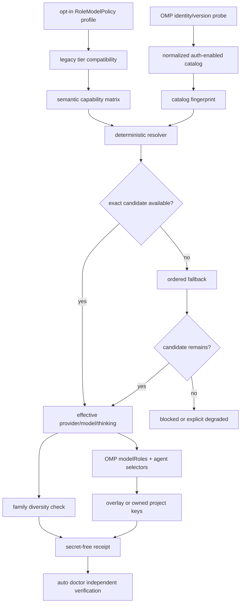

# SPEC-OMP-003 구현 계획

## Implementation Strategy

`pkg/config`에 provider-neutral desired policy를 두고, OMP adapter가 설치 버전과 auth-enabled
catalog를 주입받아 순수 resolver로 컴파일한다. provider/model 이름은 profile 입력에만 존재한다.
resolver 결과를 `modelRoles`, agent frontmatter, fallback chain, doctor/receipt가 함께 소비한다.

설정은 explicit overlay를 기본으로 한다. project-managed 모드는 사용자가 complete key path를
명시적으로 넘기고 이전 fingerprint가 일치할 때만 허용한다. source transformer, config compiler,
runtime probe를 분리해 hermetic fixture로 검증하고 실제 호출은 승인된 1-call canary로 제한한다.

## Visual Planning Brief



## Tasks

- [ ] **T1 — prerequisite/RED gate**: SPEC-OMP-002 completed 상태와 기존 OMP focused/full tests를
  확인한다. opt-in이 없을 때 generated surface가 byte-identical이고
  `PlatformToProvider("omp")==""`인 RED regression을 먼저 고정한다. exact base SHA와
  `pkg/config`, `pkg/adapter/omp`, `pkg/content`, `internal/cli` pre-change package coverage를 baseline receipt에 기록한다. Technical predecessor gates는 green이지만 exact integrated commit/HEAD의 lifecycle status promotion은 deferred다.
- [x] **T2 — provider-neutral schema**: `[NEW] RoleModelPolicyConf`, profile, capability route,
  candidate, family/diversity/safety policy를 `pkg/config`에 추가한다. legacy
  `opus/sonnet/haiku`를 versioned semantic capability로 변환하되 `quality.providers.omp`는 만들지
  않는다. 6개 capability→canonical role과 16개 source agent→role exact table, override mismatch,
  unmapped future agent fail-closed를 검증한다.
- [x] **T3 — bounded OMP probe**: `[NEW] omp_model_catalog.go`에 injectable runner, timeout/stdout
  bounds, `omp/` identity, supported-setting probe, `omp models --json` normalizer를 구현한다.
  provider/model/family/capabilities/thinking/auth-enabled boolean만 canonicalize하고 secret-bearing
  필드는 버린 뒤 sha256 fingerprint를 계산한다.
- [x] **T4 — deterministic resolver**: 역할/override/legacy 입력을 semantic capability로 만든 뒤
  exact selector, thinking, declared fallback 순으로 해석한다. disabled/unauthorized/missing/thinking
  mismatch reason을 분리하고 required role은 fail-closed한다. C1의 두 independent_dissent family와
  C2의 same-family-only catalog로 reviewer/security diversity를 capability filtering과 독립 검증한다.
- [x] **T5 — OMP projection compiler**: capability를 10개 native role alias와 `modelRoles`, agent
  selector, `retry.fallbackChains`로 투영한다. OMP version이 지원하지 않는 key/syntax는 쓰지 않고
  blocked/degraded result로 반환한다. `LoadAgentSourcesFromFS` set과 policy map의 exact equality,
  canonical key/role/candidate ordering golden을 추가한다.
- [x] **T6 — config ownership과 effective activation**: overlay 파일을 0600으로 생성하고 모든 managed invocation에 exact `--config` overlay를 전달한 argv/config hash와 effective readback을 receipt에
  남긴다. overlay 생성만으로 PASS하지 않는다. project-managed 모드는 YAML duplicate, marker scalar, complete-key ownership, previous
  fingerprint를 검증한 뒤 원자적으로 쓴다. arrays는 full ownership 없이 거부하고 unmanaged
  bytes/comments/mode/env placeholders를 보존한다.
- [x] **T7 — agent generation**: `prepareAgentMappings(cfg, compiledPolicy)`가 동일 resolution을
  `TransformAgentForOMP`에 전달하도록 바꾼다. frontmatter는 `OMPYAMLScalar`를 유지하고 raw
  `sonnet`/`opus`, unsupported thinking, selector injection을 차단한다.
- [x] **T8 — receipt/doctor**: `[NEW] omp-model-resolution.v1` schema와 atomic writer를 구현한다.
  doctor가 version/catalog/config를 재-probe해 stale fingerprint, projection mismatch, degraded
  diversity와 role block을 text/JSON exact reason으로 보고하도록 한다. receipt는 exact ignore rule과
  untracked-index 상태를 설치/생성 전후 검증한다.
- [x] **T9 — security/safety**: credential/env/auth DB를 읽거나 serialize하지 않는 sentinel tests,
  symlink/path containment, 0600 new file, existing mode preservation, approval/isolation explicit
  ownership tests를 추가한다. receipt/log에서 secret-like values를 검출한다.
- [x] **T10 — integration boundary**: init/update/preview/doctor/Clean transaction과 manifest에 routing
  profile/receipt lifecycle을 배선한다. OMP가 orchestra provider/worker/pane로 등록되지 않고
  fallback/advisor가 quorum 증거로 승격되지 않는 회귀를 실행한다.
- [x] **T11 — source/docs parity**: default agent/rule/template에서 concrete provider/model 하드코딩이
  추가되지 않았는지 검사하고 `autopus.yaml` opt-in 예시, generated OMP guidance, doctor reason
  inventory를 source of truth에서 동기화한다. `.gitignore`에 exact runtime receipt rule을 추가한다.
- [ ] **T12 — verification/convergence**: S1~S18 fake fixtures, race/fuzz/mutation 후보, T1 package
  baseline no-regression과 `[NEW] scripts/verify-changed-go-coverage.sh`로 base SHA 대비
  routing-owned changed Go production files statement coverage 85%+,
  `go test ./... -count=1`, `go vet ./...`, `go build ./...`, strict SPEC validation,
  git/tracked-ignore hygiene를 수행한다. 별도 사용자 승인이 있을 때만 S19 1-call canary를 실행한다.

## Implementation Evidence

| Slice | Current evidence | State |
|---|---|---|
| T1 predecessor | SPEC-OMP-002 technical gates green; lifecycle commit/status promotion deferred | partial, unchecked |
| T2~T5 policy/catalog/routing | role policy와 matrix, bounded catalog, exact resolver, canonical projection implementation과 hermetic counterexamples | implemented |
| T6~T11 activation/agent/evidence/safety/integration | 0600 overlay, exact `--config` readback, agent projection, resolution receipt/doctor, symlink/secret/config ownership, init/update/preview/Clean wiring | implemented |
| Actual catalog | raw installed available catalog의 semantic metadata gap은 fail-closed; explicit profile declarations와 actual available rows만 교집합 enrichment; provider requests `0` | observed |
| T12 convergence | integrated coverage/full test/vet/build/strict/git hygiene는 parent 실행 전 | pending, unchecked |
| S19 paid live | `not-run: explicit approval required` | non-blocking for S1~S18 |

## 구현 순서와 게이트

1. T1이 실패하면 구현을 중단하고 SPEC-OMP-002 completion debt로 반환한다.
2. T2→T4가 순수 resolver RED/GREEN을 닫은 뒤 T5~T8 consumer projection을 진행한다.
3. T6/T9 security gate가 green이어야 project-managed mode와 receipt persistence를 활성화한다.
4. T10 통합 후 T11 동기화, T12 deterministic 검증 순으로 수렴한다.
5. 리뷰 discovery는 전체 범위를 1회 확인하고, retry는 열린 finding의 diff만 검증한다.

## 예상 변경 범위

| Layer | Existing paths | Planned additions |
|-------|----------------|-------------------|
| Config policy | `pkg/config/schema.go`, `schema_model_selection.go` | `[NEW] pkg/config/role_model_policy*.go` |
| OMP runtime | `pkg/adapter/omp/omp*.go` | `[NEW] model catalog/routing/receipt files` |
| Agent render | `pkg/content/agent_transformer_omp.go` | focused tests/goldens |
| CLI doctor | existing doctor adapter dispatch | `[NEW] OMP role-resolution rows` |
| Docs/templates | source `content/`, project docs | opt-in profile and reason inventory |
| Runtime hygiene | `.gitignore` | exact OMP resolution receipt ignore rule |
| Coverage gate | `[NEW] scripts/verify-changed-go-coverage.sh` | base SHA와 coverprofile의 changed-file aggregate 검증 |

## 위험 및 완화

| Risk | Mitigation |
|------|------------|
| official main/install drift | every key/selector syntax version-probed; fixture matrix includes unsupported version |
| fuzzy model substitution | exact canonical selector equality; near-match negative oracle |
| YAML duplicate/array replacement | overlay default; full-key/array ownership and conflict fail-closed |
| family spoofing through gateway | explicit normalized catalog family metadata; unknown family is degraded |
| secret leakage | allowlisted metadata schema, sentinel scan, no auth material reads |
| concurrent generated-surface drift | source-only edits, manifest transaction, git hygiene receipt |

## Feature Completion Scope

이 Primary SPEC은 semantic policy, OMP projection, catalog validation, config ownership, diversity,
receipt/doctor, deterministic verification을 함께 구현해야 Outcome Lock을 닫는다. SPEC-OMP-002는
required predecessor지만 sibling이 아니며, SPEC-OMP-004의 prompt context integrity 없이도 이
라우팅 결과는 독립적으로 구현·검증 가능하다.

## Completion Debt

| Item | Blocks | Required resolution |
|------|--------|---------------------|
| Exact integrated commit/HEAD와 SPEC-OMP-002 lifecycle status promotion이 기록되지 않음 | release/sync completion | Parent integrated candidate의 exact SHA를 고정하고 green technical evidence와 함께 SPEC-OMP-002 lifecycle sync를 수행 |

## Current Pending Gates

- T12 integrated coverage, package baseline, full test/vet/build, strict validation, git/tracked-ignore hygiene는 parent 실행 전이며 현재 pending이다.
- S19는 `not-run: explicit approval required`다. 승인 부재는 S1~S18 deterministic release evidence의 blocker가 아니다.

## Verification Commands

```bash
go run ./cmd/auto spec validate .autopus/specs/SPEC-OMP-003 --strict
go test ./pkg/config ./pkg/adapter/omp ./pkg/content ./internal/cli -count=1
go test -coverprofile=/tmp/spec-omp-003.cover ./pkg/config ./pkg/adapter/omp ./pkg/content ./internal/cli
scripts/verify-changed-go-coverage.sh --base <T1_BASE_SHA> --profile /tmp/spec-omp-003.cover --min 85 --baseline <T1_BASELINE_JSON>
go test ./... -count=1
go vet ./...
go build ./...
git status --short
git ls-files -c -i --exclude-standard
```

Live canary는 위 명령 목록의 자동 항목이 아니다. 사용자의 명시 승인, exact model selector,
최대 1회 호출, 비용/usage redaction 조건이 모두 충족될 때 별도 실행한다.
