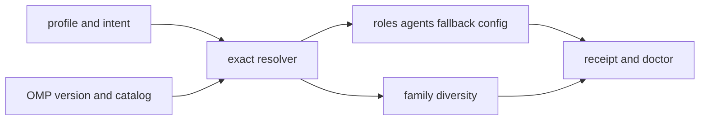

# SPEC-OMP-003 리서치
## 기존 코드 분석

- `pkg/config/schema.go::QualityConf`, `quality_provider.go::NormalizeQualityProvider`, `schema_model_selection.go`는 claude/codex provider quality와 legacy 3-tier 계약을 소유한다.
- `pkg/config/codex_profile.go::ResolveCodexProfile`은 bounded catalog와 exact reason을 쓰는 재사용 가능한 prior art다.
- `pkg/config/migrate.go::PlatformToProvider`는 OMP에 빈 문자열을 반환한다.
- OMP의 `prepareAgentMappings`는 config 없이 source model을 그대로 변환하고 `renderConfigDocument`는 skills만 관리하며 `Validate`는 구조만 검사한다.
- OMP writer의 config mode/Clean preservation은 SPEC-OMP-002 완료 증거를 선행 확인해야 한다.
## Plan Intent Ledger

| Field | Status | Source | Confidence | Decision / Assumption | If Wrong | Plan Handoff |
|-------|--------|--------|------------|-----------------------|----------|--------------|
| goal | answered | user + code analysis | 9 | 역할/위험/품질을 OMP 멀티프로바이더 모델로 결정적 컴파일 | 실제 목표가 추천 문서뿐이면 runtime 범위 과다 | REQ-001~016, Must oracles |
| scope_boundary | answered | user | 10 | OMP는 platform/runtime이며 orchestra provider가 아님 | provider 등록 시 신뢰 경계 붕괴 | REQ-008, REQ-017 non-goal |
| constraints | answered | user + official docs | 9 | strict/default/built-in/automatic은 fail-close; explicit stored `operator-attested`만 metadata gap의 exact intersection 허용 | 일반 fallback이면 wrong-model·허위 provenance | REQ-005~006 보존, REQ-019, S20~S24 |
| done_evidence | answered | user | 9 | doctor/receipt, fake C1/C2, changed-file 85%+, baseline no-regression, optional 1-call canary | 구조-only 테스트가 기능을 오판 | S1~S24 |
| brownfield_impact | answered | repository | 8 | config/OMP/content/doctor를 변경하고 legacy tier를 보존 | 기존 플랫폼 및 SPEC-OMP-002 회귀 | T1/T10 regression focus |
## Question Audit

- `question_transport`: none; `question_count`: 0; `unresolved_fields`: none
## Outcome Lock

- **User-visible outcome**: opt-in OMP profile이 agent 역할을 실제 auth-enabled provider/model/thinking과 fallback으로 해석하고 doctor/receipt가 선택 이유와 family diversity를 증명한다.
- **Mandatory requirements**: semantic policy, strict exact catalog resolution, explicit stored `operator-attested`의 bounded exception, OMP projection, 설정 소유권, safety opt-in, secret-free provenance evidence, legacy compatibility, platform boundary다.
- **Explicit non-goals**: OMP provider gateway/worker/pane, quorum 대체, credential 관리, context integrity다.
- **Completion evidence**: S1~S18과 S20~S24 hermetic oracle, routing-owned changed-file 85%+, T1 package baseline no-regression, full Go gates, receipt ignore hygiene; live는 승인된 S19만 해당한다.
## Visual Planning Brief

## OMP upstream와 설치 evidence

| Evidence | Contract | Scope |
|----------|----------|-------|
| [OMP settings main](https://github.com/can1357/oh-my-pi/blob/main/docs/settings.md) | project config, overlay precedence, object deep-merge, array replacement, 10 model roles, fallbackChains | current main, checked 2026-08-02 |
| [OMP models main](https://github.com/can1357/oh-my-pi/blob/main/docs/models.md) | role alias, exact/provider selectors, thinking/model metadata | current main, checked 2026-08-02 |
| [OMP providers main](https://github.com/can1357/oh-my-pi/blob/main/docs/providers.md) | available = not disabled AND keyless/auth-resolved; credential precedence | current main, checked 2026-08-02 |
| [OMP development main](https://github.com/can1357/oh-my-pi/blob/main/packages/coding-agent/DEVELOPMENT.md) | runtime implementation reference | current main, checked 2026-08-02 |
| local CLI probe | `omp/17.1.8`, role/config/model flags와 `omp models --json` surface | installed snapshot, checked 2026-08-02 |

Current main의 key나 syntax는 설치 17.1.8 지원 증거가 아니다. compiler는 실제 version/settings/model probe 결과만 소비한다. 로컬에서 관측한 approval=`yolo`, isolation=`none`, memory=`off`는 사용자 effective state이며 모든 OMP 설치의 universal default로 단정하지 않는다.
## Prompt Layer Classification

| Layer | Inputs | Cache/invalidation |
|-------|--------|--------------------|
| stable | agent-role→semantic capability vocabulary, platform/provider boundary, receipt schema | SPEC/schema version이 바뀔 때 invalidation |
| snapshot | selected profile, installed OMP version, normalized catalog fingerprint, effective owned config | profile/version/catalog/config hash 변경 시 invalidation |
| ephemeral | auth availability boolean, fallback/degraded event, canary consent/usage | 매 probe/run마다 재평가; raw credential/prompt/response 저장 금지 |

기존 `pkg/promptlayer`와 완료된 context-engineering SPEC이 canonical prompt classification/build/verification authority를 유지한다. SPEC-OMP-004는 이를 소비하는 OMP lifecycle bridge만 소유하며, 이 routing receipt는 required context를 대체·요약하거나 prompt cache 정책을 변경하지 않는다.
## 설계 결정

1. `quality.providers.omp` 대신 provider-neutral `RoleModelPolicyConf`를 추가한다. OMP 내부 provider와 Autopus orchestra provider namespace를 분리한다.
2. concrete model은 profile/catalog가 소유한다. 6개 capability의 canonical role과 현재 source agent 16개의 exact role map을 versioned policy가 소유하며 미매핑 agent는 fail closed한다.
3. explicit overlay가 기본이며 모든 managed invocation이 exact overlay를 전달하고 effective config를 readback해야 한다. project-managed key는 complete ownership과 prior fingerprint가 있을 때만 쓰며 raw marker 확대만으로 중복 YAML top-level key를 만들지 않는다.
4. availability fallback과 family diversity를 별도 계산하며 C1 다중-family/C2 same-family catalog로 두 경로를 검증한다.
5. runtime probe는 allowlisted metadata만 남기고 S1~S18은 fake runner다. actual readback/call은 승인형 S19만 수행한다.
6. runtime receipt는 exact ignore rule과 index 비추적을 요구하고 coverage는 T1 baseline no-regression + changed routing file 85%다.
7. empty `catalog_trust`는 strict다. explicit stored `operator-attested`만 exact metadata-insufficient 결과에서 bounded raw selector와 선언 selector의 교집합을 만들며 synthetic metadata는 `operator_attested=true`, `auth_enabled=false`, `keyless=false`로 남긴다; operator family는 independent-provider/quorum 증거가 아니다.
## Minimality Decision Matrix

| Ladder step | Evidence | Decision | Receipt item |
|-------------|----------|----------|--------------|
| actual need | OMP agent model passthrough와 empty modelRoles/fallbackChains | proceed | role→effective tuple |
| existing code/helper/pattern | strict OMP probe/normalizer, `NormalizeOMPAvailableCatalog`, raw display normalizer, receipt/doctor | reuse | strict-first branch와 단일 raw normalization seam |
| stdlib/native | context timeout, sha256, canonical sort, OMP `--config`/models JSON | use | probe/fingerprint |
| existing dependency | `gopkg.in/yaml.v3` already imported | reuse | YAML validation |
| new dependency or abstraction | 새 dependency 없음; profile trust enum과 attested projection/existing evidence fields만 기존 catalog boundary에 추가 | accepted | 별도 resolver나 sibling 없이 최소 예외 |
| minimum sufficient verification | 기존 S1~S18 + S20~S24 trust/failure/evidence oracle; approved S19 optional | required checks | strict regression과 exception audit |
## Semantic Invariant Inventory

| ID | source clause | invariant type | affected outputs | acceptance IDs |
|----|---------------|----------------|------------------|----------------|
| INV-001 | opt-in OMP profile만 새 routing을 적용 | ownership/state | generated files, provider map | S1, S16, S19 |
| INV-002 | 같은 policy/catalog는 같은 결과 | deterministic transform | modelRoles, agents, receipt | S2, S17, S18 |
| INV-003 | capability canonical role과 16개 agent role은 exact versioned mapping | paired matching / set equality | role matrix, agent selector | S2, S3 |
| INV-004 | exact candidate와 fallback은 선언 순서 | ordering/matching | effective selector, attempts | S4, S5, S6, S7 |
| INV-005 | capability-compatible reviewer/security family를 executor와 비교 | cross-entity comparison | diversity receipt | S8, S9 |
| INV-006 | baseline managed config 밖 bytes/mode/env는 overlay에서 보존 | byte identity | config/overlay | S10, S12 |
| INV-007 | OMP arrays는 replace이며 full ownership 필요 | replacement semantics | enabled/disabled arrays | S11 |
| INV-008 | receipt/doctor는 exact fields, secret 없음, receipt는 ignored/untracked | parser/report schema / hygiene | JSON/text/git evidence | S12, S14, S15 |
| INV-009 | legacy tier는 semantic capability로 호환 | backward mapping | compiled policy | S3 |
| INV-010 | fallback은 quorum/provider가 아님 | authority boundary | orchestra evidence | S1, S6, S16 |
| INV-011 | main docs보다 installed capability가 권위 | version-gated state | probe/status | S4, S5, S15, S18 |
| INV-012 | approval/isolation은 명시 소유 시만 변경 | ownership/state | effective safety | S13 |
| INV-013 | empty trust는 strict이고 operator-attested는 explicit stored profile만 가능 | default/eligibility invariant | profile selection, init/apply | S21 |
| INV-014 | metadata-insufficient raw selectors ∩ declared exact selectors만 투영 | set intersection / exact matching | normalized catalog, routes | S20 |
| INV-015 | identity/settings/invalid/empty/timeout/oversized는 attestation 우회 금지 | failure partition | probe status/reason, writes | S22 |
| INV-016 | family/capability/thinking은 operator declaration이고 synthetic `operator_attested=true`와 false auth/keyless가 unobserved 상태를 표시하며 reviewer independence 증거가 아님 | provenance / authority boundary | resolution, diversity rows | S20, S23 |
| INV-017 | receipt와 doctor는 top-level trust, role evidence/family, fingerprint가 일치해야 함 | cross-artifact binding | receipt JSON, doctor text/JSON | S24 |
## Feature Coverage Map

| Outcome slice | Covered by | Status |
|---------------|------------|--------|
| role/capability policy와 legacy | REQ-002~004, T2, S2~S3 | covered |
| runtime catalog/exact fallback | REQ-005~007,019, T3~T4,T13~T14, S4~S7,S20~S23 | covered |
| independent review diversity | REQ-008~009, T4, S8~S9 | covered |
| OMP projection과 config ownership | REQ-010~014, T5~T7, S10~S13 | covered |
| receipt/doctor | REQ-015~016,019, T8,T15, S14~S15,S20,S24 | covered |
| boundaries, receipt hygiene, verification | REQ-015,017~018, T8,T10~T12, S14,S16~S19 | covered |
## Implementation Evidence

| Evidence slice | Current observation | Lifecycle interpretation |
|---|---|---|
| T1 predecessor | SPEC-OMP-002 technical gates are green | lifecycle commit/status promotion remains deferred |
| T2~T11 implementation | `pkg/config/role_model_policy*.go`, `pkg/adapter/omp/omp_model_*.go`, OMP agent projection, CLI doctor, receipt writer와 integration lifecycle가 존재 | implemented |
| Actual installed catalog | strict raw gap은 fail-closed; explicit stored `operator-attested` exact intersection은 synthetic auth/keyless=false와 operator evidence를 사용 | implemented |
| T13~T15 operator-attested | strict/operator tests green; actual OMP 18.0.10 apply/explain ready, trust bound, receipt verified, explicit/strict 각 16/16 agents | implemented |
| T12 integrated convergence | `go test ./... -p 1 -count=1 -timeout=600s` 106 packages(4 no tests), vet/build/strict green; parallel timing/provider 2건 isolated green; changed-file 85%/T1 baseline과 git hygiene 미완료 | partial, not completed |
| S19 paid live | `not-run: explicit approval required` | S1~S18과 S20~S24 non-blocking |
## Completion Debt

| Item | Blocks | Required resolution |
|------|--------|---------------------|
| Exact integrated commit/HEAD와 SPEC-OMP-002 lifecycle status promotion이 기록되지 않음 | release/sync completion | Parent integrated candidate의 exact SHA를 고정하고 green technical evidence와 함께 SPEC-OMP-002 lifecycle sync를 수행 |
## Current Pending Gates

- T13~T15는 implemented다. T12 serial full test, vet/build/strict는 green이며 changed-file 85%/T1 baseline과 git/tracked-ignore release hygiene만 pending이다.
- S19는 `not-run: explicit approval required`이며 S1~S18과 S20~S24의 blocker가 아니다.
## Evolution Ideas

These are optional improvements and do not block sync completion.

| Idea | Why not required now | Promotion trigger |
|------|----------------------|-------------------|
| cost/latency 기반 profile 추천 | 결정적 routing Outcome Lock 밖 | 사용자가 자동 추천을 명시 요청 |
| model benchmark 자동 갱신 | 외부 비용·변동성 증가 | 운영 SLA와 budget 승인 |
| OMP gateway ProviderAdapter | 별도 trust boundary | subprocess provider 요구 승인 |
## Sibling SPEC Decision

| Decision | Reason | Sibling SPEC IDs |
|----------|--------|------------------|
| none | 하나의 Primary가 routing outcome을 닫고 25개 초과 task/40개 초과 source 조건이 아님 | None |
## Reference Discipline

| Reference | Type | Verification |
|-----------|------|--------------|
| `pkg/config/schema.go::QualityConf` | existing | Read로 providers/presets 확인 |
| `pkg/config/quality_provider.go::NormalizeQualityProvider` | existing | claude/codex canonical key 확인 |
| `pkg/config/schema_model_selection.go` | existing | legacy tier validator 확인 |
| `pkg/config/codex_profile.go::ResolveCodexProfile` | existing prior art | bounded catalog/reason contract 확인 |
| `pkg/config/migrate.go::PlatformToProvider` | existing | default empty OMP mapping 확인 |
| `pkg/adapter/omp/omp_agents.go::prepareAgentMappings` | existing | cfg 미수신 확인 |
| `pkg/content/agent_transformer_omp.go::TransformAgentForOMP` | existing | raw model passthrough 확인 |
| `pkg/adapter/omp/omp_config.go::renderConfigDocument` | existing | skills-only marker 확인 |
| `pkg/adapter/omp/omp_lifecycle.go::Validate` | existing | structural validation 확인 |
| `pkg/config/role_model_policy*.go` | existing implementation | provider-neutral schema, exact role matrix와 validation 확인 |
| `pkg/adapter/omp/omp_model_*.go` | existing implementation | bounded probe, actual-available enrichment, routing/projection/activation/receipt/doctor 확인 |
| `.autopus/omp-model-resolution-v1.json` | generated runtime artifact | atomic writer, exact ignore와 index 비추적 oracle 확인 |
| `scripts/verify-changed-go-coverage.sh` | existing verifier | base SHA/package baseline과 coverprofile fail-closed 비교 확인 |
| `pkg/config/role_model_policy.go::RoleModelProfileConf`, `role_model_policy_validate.go::validateRoleModelProfile` | existing modification seams | empty=strict field eligibility와 declaration conflict validation |
| `pkg/adapter/omp/omp_model_catalog_enrich.go::NormalizeOMPAvailableCatalog`, `omp_model_integration_probe.go::probeIntegratedModelCatalog` | existing modification seams | exact metadata-insufficient gate와 declaration intersection ownership |
| `internal/cli/platform_omp_models_raw.go::normalizeOMPRawDisplayCatalog` | existing reuse seam | bounded secret-rejecting raw selector parser를 adapter-owned normalization으로 단일화 |
| `pkg/adapter/omp/omp_model_receipt.go`, `omp_model_doctor.go`, `internal/cli/doctor_omp_model_routing_probe.go` | existing modification seams | top-level trust와 role evidence/family digest 및 independent reprobe binding |
| `internal/cli/platform_omp_profile_plan.go::buildOMPProfileProposal`, `platform_omp_profile_apply.go::applyOMPProfile` | existing strict-init seams | automatic proposal/apply가 operator-attested를 생성하지 않음 |
| `pkg/adapter/omp/omp_model_catalog_test.go`, `omp_model_integration_builtin_test.go`, `omp_model_receipt_test.go`, `omp_model_doctor_test.go`, `internal/cli/platform_omp_profile_test.go` | existing test seams | [NEW] S20~S24 focused cases를 기존 fixture/test files에 추가 |
## Reviewer Brief

- **Intended scope**: strict routing을 권위로 유지하면서 explicit stored `operator-attested`의 exact metadata-gap intersection과 trust-bound receipt/doctor까지 Outcome Lock을 닫는지만 검토한다.
- **Explicit non-goals**: automatic/built-in attestation, non-metadata failure bypass, auth/keyless observed 주장, operator family의 independent-provider/quorum 승격, OMP gateway/provider/worker/pane, credential plumbing, SPEC-OMP-004 context integrity는 finding 범위가 아니다.
- **Self-verified**: REQ-001~019 ↔ T1~T15 ↔ S1~S24 ↔ INV-001~017, strict unchanged clauses, exact failure partition, existing/[NEW] test seam discipline을 대조했다.
- **Reviewer focus**: REQ-005/006 strict regression, explicit stored eligibility, exact selector intersection, non-metadata fail-close, declaration validation, synthetic auth/keyless unobserved 표시, receipt/doctor trust·evidence binding, family evidence 비승격만 우선 확인한다.
## Self-Verify Summary

- Q-CORR-01 | status: PASS | attempt: 1 | files: spec.md, research.md | reason: existing path/symbol을 현재 HEAD에서 확인했다.
- Q-CORR-02 | status: PASS | attempt: 2 | files: spec.md, plan.md, research.md | reason: 구현된 planned reference를 existing/generated evidence로 재분류했다.
- Q-CORR-03 | status: PASS | attempt: 1 | files: spec.md, acceptance.md | reason: 지원 EARS와 bare Given/When/Then 형식을 사용했다.
- Q-CORR-04 | status: PASS | attempt: 1 | files: research.md | reason: existing, planned, generated artifact를 분리했다.
- Q-COMP-01 | status: PASS | attempt: 1 | files: prd.md, spec.md, plan.md, acceptance.md, research.md | reason: outcome, contract, task, oracle, evidence 역할이 완결된다.
- Q-COMP-02 | status: PASS | attempt: 2 | files: spec.md, plan.md, acceptance.md | reason: REQ-019를 T13~T15와 S20~S24에 연결하고 strict REQ-005/006 회귀를 유지했다.
- Q-COMP-03 | status: PASS | attempt: 1 | files: spec.md | reason: trigger, expected result, receipt/doctor 관측 지점을 명시했다.
- Q-COMP-04 | status: PASS | attempt: 1 | files: spec.md, research.md | reason: Primary가 routing Outcome Lock 전체를 닫는다.
- Q-COMP-05 | status: PASS | attempt: 2 | files: spec.md, plan.md, acceptance.md, research.md | reason: INV-001~017이 requirement/task와 concrete S1~S24 oracle에 추적된다.
- Q-COMP-06 | status: PASS | attempt: 2 | files: spec.md, research.md | reason: Traceability Matrix와 Reviewer Brief가 operator-attested exception으로 리뷰를 제한한다.
- Q-COMP-07 | status: PASS | attempt: 1 | files: plan.md, research.md | reason: predecessor debt와 optional evolution을 분리했다.
- Q-FEAS-01 | status: PASS | attempt: 1 | files: spec.md, plan.md | reason: config policy와 OMP projection의 owning layer를 분리했다.
- Q-FEAS-02 | status: PASS | attempt: 1 | files: plan.md, research.md | reason: source repo와 generated artifact 경계를 지켰다.
- Q-FEAS-03 | status: PASS | attempt: 1 | files: plan.md, acceptance.md | reason: hermetic 명령과 승인형 live canary를 분리했다.
- Q-STYLE-01 | status: PASS | attempt: 1 | files: spec.md | reason: 요구사항에서 모호어를 제거했다.
- Q-STYLE-02 | status: PASS | attempt: 1 | files: spec.md | reason: EARS type과 Must priority를 분리했다.
- Q-STYLE-03 | status: PASS | attempt: 2 | files: acceptance.md | reason: canonical heading 아래 bare Gherkin과 예상 값 oracle을 검증했다.
- Q-SEC-01 | status: PASS | attempt: 2 | files: spec.md, acceptance.md, research.md | reason: raw catalog와 operator declaration은 bounded exact-intersection 입력이며 non-metadata failure를 우회하지 않는다.
- Q-SEC-02 | status: PASS | attempt: 1 | files: spec.md, acceptance.md | reason: credential을 읽거나 receipt에 기록하지 않는 oracle이 있다.
- Q-SEC-03 | status: PASS | attempt: 2 | files: spec.md, acceptance.md | reason: receipt/doctor top-level trust·role evidence/family·fingerprint binding과 secret-free oracle을 정의했다.
- Q-COH-01 | status: PASS | attempt: 1 | files: all | reason: 하나의 역할 기반 OMP routing change story다.
- Q-COH-02 | status: PASS | attempt: 2 | files: plan.md, research.md | reason: exact integrated HEAD/lifecycle sync debt, parent pending gate와 optional S19를 분리했다.
- Q-COH-03 | status: PASS | attempt: 1 | files: research.md | reason: sibling 없이 Primary 하나로 닫는다.
