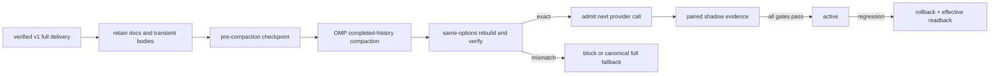

# SPEC-OMP-004 리서치

## Plan Intent Ledger

| Field | Status | Source | Confidence | Decision / Assumption | If Wrong | Plan Handoff |
|---|---|---|---:|---|---|---|
| goal | answered | user + code | 9 | full document/ephemeral integrity를 보존하며 completed tool/transcript history 토큰을 줄인다. | Outcome Lock이 잘못된다. | delivered/history oracle와 paired metric으로 전환 |
| scope_boundary | answered | user | 9 | 새 canonical storage, transcript mutation, model routing, tracked memory는 제외한다. | scope와 trust boundary가 팽창한다. | explicit non-goals로 고정 |
| constraints | answered | code + official OMP docs | 9 | existing v1/v2 hash 계약을 재사용하고 OMP 기능은 capability-probed opt-in이다. | version drift가 data loss를 만든다. | capability/fallback requirement와 S8 |
| done_evidence | answered | user | 9 | exact pre/post hashes, stale/security oracles, AB/BA quality equivalence, token target, rollback readback이다. | structural green이 false positive가 된다. | S1-S13 Must로 고정 |
| brownfield_impact | answered | repo analysis | 8 | promptlayer authority, OMP projection, config/CLI/doctor가 영향받고 worker GPT-name gate는 소유자가 아니다. | 잘못된 layer를 수정한다. | Reference Discipline과 reviewer focus |

## Question Audit

- `question_transport`: none; `question_count`: 0; `unresolved_fields`: none

## Outcome Lock

- **User-visible outcome**: OMP 장시간 세션이 phase compaction 뒤 다음 call 전에 full delivered docs와 Autopus task/SPEC/acceptance/ownership/finding body를 canonical source에서 재구성하고 token credit은 completed history에만 귀속한다.
- **Mandatory requirements**: full canonical re-admission, eligible-history credit, capability probe, transient checkpoint/rehydration, managed runtime artifact cleanup, memory shadow safety, provider-neutral binding, 20+ paired promotion, rollback readback.
- **Explicit non-goals**: advisor/model routing, workflow parity 구현, orchestra registration, Autopus의 provider transcript 직접 mutation, 새 canonical storage, active document JIT, delivered-body reduction, active memory injection, user OMP memory/compaction default 변경, tracked OMP memory.
- **Completion evidence**: S1-S13, four owning directories의 SPEC diff-owned non-test Go file 85%+, T1 package baseline no-regression, race/vet/full regression, strict SPEC, hermetic/installed lifecycle canary, cleanup hygiene.

## Existing Code Analysis

1. `pkg/promptlayer/context_profile.go::ResolveCommandContextProfile` defines core/architecture/test/canary required profiles and signature/learning conditional profiles.
2. `pkg/promptlayer/context_delivery.go::BuildContextDelivery` and option normalization merge required, conditional learning/signature, SPEC, and additional refs into one complete `RequiredDocuments` set; no required/delivered subset exists.
3. `pkg/promptlayer/context_delivery_verify.go::VerifyContextDeliveryForOptions` rebuilds from supervisor-held options and rejects stale, replayed, incomplete, tampered, or profile-weakened receipts.
4. `pkg/promptlayer/layer.go` implements `KindStable`, `KindSnapshot`, `KindEphemeral` with deterministic ordering, manifest hashes, token estimates, cache eligibility, and invalidation reasons.
5. `pkg/memindex/context_plan.go::BuildContextPlan` returns either verified pinned/selected refs or `status=unavailable`, empty refs, and a reason; both remain body-free shadow-only evidence.
6. `pkg/worker/context_delivery.go::workerUsesGPTContextDelivery` only gates worker backends named codex/openai/gpt. It is not an OMP platform/session contract.
7. `pkg/adapter/omp` currently generates rules, agents, skills, commands, config, and manifest. `Adapter.SupportsHooks()` is false for the generic ADK hook interface; that does not prove OMP native extension/compaction event availability.
8. Local read-only probe on 2026-08-02 reports `omp/17.1.8`, compaction enabled with `snapcompact`, and `memory.backend=off`. These values are environment evidence, not portable defaults.
9. The production boundary is Go-owned: promptlayer/CLI computes hashes, rebuilds, reinjects, verifies, admits, cleans managed runtime roots, and rolls back. A TypeScript extension only translates proved events.
10. `auto lore context pkg/promptlayer` preserves the high-confidence constraint that required GPT/Codex documents and high/critical full review stay complete; required-document summarization or unverified compaction was previously rejected.
11. `auto arch enforce` reports no architecture rule violation before authoring; planned authority/policy/projection/evidence layers keep that dependency direction.

## Stable / Snapshot / Ephemeral Classification

| Kind | Current evidence | OMP policy | Invalidation |
|---|---|---|---|
| stable | AGENTS/workspace/architecture policy | full pinned; never optimize | source hash or policy set change |
| snapshot delivered | relevant SPEC/plan/acceptance/research와 v1이 선택한 conditional/task refs | full pinned; never optimize | source/prompt/snapshot/manifest mismatch |
| ephemeral required | original task, decision delta, frozen findings, ownership/forbidden paths, worker schema | supervisor transient bundle + body-hash rehydrate | task/phase/binding/body change |
| document candidate | `context_plan.v2` pinned/selected refs | shadow-only; active authority 없음 | source hash, selection change |
| native history | superseded reads, resolved tool results, transcript history | token credit eligible; native selective pinning is not assumed | new tool result, unresolved/error state |

Cache invalidation never authorizes omission of a required layer. It causes rebuild, provider-call block, or canonical full fallback.

## Visual Planning Brief

## Official OMP Evidence and Version Discipline

- OMP `main` settings documents global/project/CLI/runtime precedence, object deep merge, and whole-array replacement: <https://github.com/can1357/oh-my-pi/blob/main/docs/settings.md>.
- OMP `main` compaction documents pre/post lifecycle, pruning, persistence/reload, and failure paths; persistence makes isolated/no-session mode, permission, path, cleanup proof mandatory: <https://github.com/can1357/oh-my-pi/blob/main/docs/compaction.md>.
- OMP `main` memory documents a default-off optional backend whose injected guidance is heuristic and subordinate to current repo evidence: <https://github.com/can1357/oh-my-pi/blob/main/docs/memory.md>.
- These current-main contracts are not assumed for every installed binary. Implemented capability probing verifies the effective schema/event/readback behavior, and unsupported or ambiguous active admission remains shadow/off. Installed `omp/17.1.8` API review shows that `session_before_compact` throw/timeout is swallowed to `undefined` and `pi.sendMessage()` is void. A hash-only notification therefore cannot prove a long-lived supervisor ACK. The generated bridge pre-notifies and returns explicit `{cancel:true}` until CanonicalSource verification and a real `Supervisor.Run` dispatch ACK are wired.

## Semantic Invariant Inventory

| ID | source clause | invariant type | affected outputs | acceptance IDs |
|---|---|---|---|---|
| INV-001 | full delivered documents와 ephemeral body integrity를 보존한다. | paired exact-set/body-hash equality | delivery, checkpoint, rehydration | S1, S2, S4, S5 |
| INV-002 | full docs는 canonical re-admission하고 token credit은 completed history에만 둔다. | set partition/ordering | classifier, omission receipt | S1, S3 |
| INV-003 | provider-neutral binding과 transient body carrier를 함께 검증한다. | cross-entity binding/body hash | session/phase receipt | S2, S4, S5, S9 |
| INV-004 | current runtime capability만 사용한다. | parser/version negotiation | capability/admission receipt | S8 |
| INV-005 | compaction은 checkpointed phase boundary다. | state transition/ordering | pre/post phase sequence | S2, S4, S5 |
| INV-006 | OMP memory는 active injection 권한이 없는 shadow evidence다. | matching/TTL/namespace/authority | memory admission/omission | S6, S7, S8 |
| INV-007 | 동일 task를 full/optimized AB/BA로 비교한다. | paired formula | canary rows/metrics | S10, S11, S13 |
| INV-008 | secret와 prompt injection은 authority가 없다. | security/redaction | cache, receipt, prompt | S5, S7, S13 |
| INV-009 | promotion과 rollback은 effective readback으로 수렴한다. | state convergence | rollout receipt/config hash | S11, S12 |
| INV-010 | managed native artifacts는 no-session 또는 isolated root에서 종료 시 제거된다. | ownership/lifecycle/cleanup | session root, cleanup receipt | S5, S13 |

## Minimality Decision Matrix

| Ladder step | Evidence | Decision | Receipt item |
|---|---|---|---|
| actual need | required integrity와 OMP token reduction을 함께 증명해야 한다. | proceed | Outcome Lock/S1-S13 |
| existing code/helper/pattern | promptlayer v1 verify, context plan v2, layer kinds, OMP adapter/config/manifest | reuse | existing symbol refs |
| stdlib/native | Go hash/JSON/path/time + OMP native capability/event/overlay | use | no new storage/runtime |
| existing dependency | current Go YAML/config, Cobra, test stack | reuse | existing manifest/import evidence |
| new dependency or abstraction | provider-neutral OMP binding/checkpoint receipt와 thin native bridge만 필요 | accepted; new external dependency rejected | `[NEW]` receipt/bridge schemas |
| minimum sufficient verification | exact hashes/sets, artifact cleanup, fake runtime, AB/BA, rollback, changed-file 85% + baseline | required checks | S1-S13 + regression gates |

## Feature Coverage Map

| Outcome slice | Covered by | Status |
|---|---|---|
| full delivery/transient integrity | REQ-CTX/CLASS, T1/T3/T4, S1-S5 | covered |
| eligible-history credit/canonical re-admission | REQ-CAP/OPTIONAL, T2/T5, S3/S8 | covered |
| checkpoint/rehydration/fallback | REQ-CHECKPOINT/REHYDRATE/FAILCLOSED, T4/T5, S2/S4/S5 | covered |
| memory shadow security | REQ-MEMORY/MEMORY-SEC, T6, S6/S8 | covered |
| 20+ paired promotion/rollback | REQ-CANARY/ROLLOUT, T7/T8, S10-S12 | covered |
| privacy/runtime cleanup/verification | REQ-PRIVACY/RUNTIME-ARTIFACT/LIVE, T2/T5/T8/T9, S5/S7/S13 | completion-debt: generated bridge active ACK wiring |
| executable OMP workflow boundary | `SPEC-OMP-002` | dependency |
| model/advisor routing | `SPEC-OMP-003` | independent optional integration |

## Implementation Evidence

| Scope | Current evidence | Lifecycle assessment |
|---|---|---|
| T1-T4 | provider-neutral classification, capability negotiation, checkpoint, rehydration, and fail-closed paths are implemented | implemented |
| T6-T8 | memory shadow security, paired canary promotion, rollback, and effective readback are implemented | implemented |
| Generated native bridge | ambient `.omp/extensions/*.ts` discovery and exact pre/post hash-only notifications are verified with `provider_requests=0` | event forwarding proved; active admission not proved |
| Installed lifecycle canary | `omp/17.1.8`, threshold `7000`, loopback turns/requests `2/2`, external requests `0`, native non-skipped start/end `1/1`, early admission `0`, optimized dispatch `1`, cleanup `0`, `sandbox=true` | installed native events plus injected Go driver evidence |
| Native API boundary | `session_before_compact` throw/timeout is swallowed to `undefined`; `pi.sendMessage()` is void | no provable supervisor ACK from the generated bridge |
| T9 integrated gates | changed-file coverage, full suite, vet, build, strict validation, and git hygiene | current parent gate pending |

## Completion Debt

| Item | Blocks | Required resolution |
|---|---|---|
| Generated bridge cannot prove active admission ACK | Outcome Lock and lifecycle completion | Wire the generated bridge to the long-lived `Supervisor.Run`, bind CanonicalSource verification, require a real dispatch ACK, and keep explicit `{cancel:true}` until that ACK is proven. |

## Current Pending Gates

- T9 integrated coverage, full suite, vet, build, strict validation, and git hygiene remain unchecked until the parent runs them on the integrated candidate; the installed canary proves installed native events plus an injected Go driver, not generated bridge-to-supervisor end-to-end active admission.

## Evolution Ideas

These are optional improvements and do not block sync completion.

| Idea | Why not required now | Promotion trigger |
|---|---|---|
| provider별 optimal compaction strategy 자동 선택 | model routing은 다른 책임이다. | user requests model-aware integration |
| 장기 organization-level cost dashboard | local receipt와 canary가 Outcome Lock을 닫는다. | operator requests cross-project reporting |
| additional memory backend benchmark | canonical authority와 무관한 확장이다. | supported backend demand and threat review |

## Sibling SPEC Decision

| Decision | Reason | Sibling SPEC IDs |
|---|---|---|
| none | 이 Primary SPEC 하나가 OMP context integrity·optimization·promotion outcome을 닫는다. OMP-002는 선행 dependency이고 OMP-003은 독립 integration이지 sibling이 아니다. | None |

## Reference Discipline

| Reference | Type | Verification |
|---|---|---|
| `pkg/promptlayer/context_profile.go::ResolveCommandContextProfile` | existing | `rg`/Read로 command profile과 conditional docs 확인 |
| `pkg/promptlayer/context_delivery.go::BuildContextDelivery` | existing | full load, hashes, body-free receipt 확인 |
| `pkg/promptlayer/context_delivery_verify.go::VerifyContextDeliveryForOptions` | existing | supervisor-held same-options rebuild 확인 |
| `pkg/promptlayer/layer.go::{KindStable,KindSnapshot,KindEphemeral}` | existing | declarations와 manifest behavior 확인 |
| `pkg/memindex/context_plan.go::BuildContextPlan` | existing | `autopus.context_plan.v2`와 metrics 확인 |
| `internal/cli/workflow_context_plan.go` | existing | CLI wiring과 default pins 확인 |
| `pkg/worker/context_delivery.go::workerUsesGPTContextDelivery` | existing, explicitly not reused | codex/openai/gpt name-only switch 확인 |
| `pkg/adapter/omp::{Adapter,prepareConfigMapping}` | existing | generation/config marker surface 확인 |
| `SPEC-OMP-002` | concurrent dependency | integrated implementation 전에 actual status/path 재검증 필요 |
| `SPEC-OMP-003` | concurrent optional integration | integrated implementation 전에 actual status/path 재검증 필요 |
| `pkg/promptlayer/omp_context_*.go` | existing | provider-neutral classifier/checkpoint 구현을 `rg`/Read로 확인 |
| `pkg/adapter/omp/omp_context_*.go` | existing | capability probe/native projection 구현을 `rg`/Read로 확인 |
| `autopus.omp_context_receipt.v1` fields and managed artifact lifecycle | existing schema | body-free classification/status/cleanup evidence를 tests에서 확인 |
| `pkg/adapter/omp/omp_context_bridge.go` | existing source | generated bridge source와 fail-closed projection을 `rg`/Read로 확인 |
| `internal/cli/workflow_context_runtime*.go` | existing | canary/rollback/receipt 구현과 exact installed metrics를 확인 |
| generated `.omp/extensions/autopus-context.ts` | generated evidence | ambient discovery와 hash-only notify는 확인; long-lived supervisor ACK/CanonicalSource/real dispatch wiring은 미완성 |

## Reviewer Brief

- **Intended scope**: OMP consumer에만 completed-history optimization을 적용하고 v1 full authority, transient body rehydration, memory shadow safety, paired promotion/rollback을 증명한다.
- **Explicit non-goals**: 새로운 제품 scope, model/advisor routing, workflow parity 재설계, orchestra provider, Autopus transcript mutation, canonical memory storage, delivered-document shrink/active JIT/memory injection.
- **Self-verified evidence**: all REQ→T→S→INV trace, exact hash/set oracles, AB/BA formula, version capability gate, existing/generated reference separation.
- **Reviewer focus**: required data loss, provider-call fail-closed semantics, event capability drift, memory injection/secret retention, config readback convergence, deterministic canary pairing, and the missing generated bridge-to-long-lived-supervisor ACK boundary.

## Self-Verify Summary

- Q-CORR-01 | status: PASS | attempt: 1 | files: spec.md, plan.md, research.md | reason: existing paths and symbols were verified with rg/read.
- Q-CORR-02 | status: PASS | attempt: 2 | files: spec.md, plan.md, research.md | reason: implemented references are marked existing/generated and the missing active ACK wiring is recorded as Completion Debt.
- Q-CORR-03 | status: PASS | attempt: 1 | files: spec.md, acceptance.md | reason: EARS requirements and bare Given/When/Then scenarios match repository conventions.
- Q-CORR-04 | status: PASS | attempt: 1 | files: research.md | reason: existing, concurrent dependency, NEW, and generated references are separated.
- Q-COMP-01 | status: PASS | attempt: 1 | files: prd.md, spec.md, plan.md, acceptance.md, research.md | reason: five documents form one complete package.
- Q-COMP-02 | status: PASS | attempt: 1 | files: spec.md, plan.md, acceptance.md | reason: every REQ maps to tasks, scenarios, and invariants.
- Q-COMP-03 | status: PASS | attempt: 1 | files: spec.md | reason: every requirement has type, trigger or state, and observability.
- Q-COMP-04 | status: PASS | attempt: 1 | files: all | reason: Primary SPEC covers integrity, optimization, security, promotion, and rollback.
- Q-COMP-05 | status: PASS | attempt: 2 | files: spec.md, plan.md, acceptance.md, research.md | reason: all ten invariants have concrete Must oracles.
- Q-COMP-06 | status: PASS | attempt: 1 | files: spec.md, research.md | reason: traceability matrix and reviewer brief constrain scope.
- Q-COMP-07 | status: PASS | attempt: 3 | files: plan.md, acceptance.md, research.md | reason: installed canary evidence is separated from the generated bridge active-ACK Completion Debt while optional Evolution Ideas remain advisory.
- Q-FEAS-01 | status: PASS | attempt: 1 | files: plan.md, research.md | reason: authority, policy, OMP projection, evidence layers match current ownership.
- Q-FEAS-02 | status: PASS | attempt: 1 | files: plan.md, research.md | reason: source of truth and generated/runtime surfaces are distinguished.
- Q-FEAS-03 | status: PASS | attempt: 1 | files: plan.md, acceptance.md | reason: hermetic commands and focused/full gates are runnable in the Go repo.
- Q-STYLE-01 | status: PASS | attempt: 1 | files: spec.md | reason: requirement text is unambiguous and mandatory.
- Q-STYLE-02 | status: PASS | attempt: 1 | files: spec.md | reason: EARS type and Must/Should priority are separate.
- Q-STYLE-03 | status: PASS | attempt: 1 | files: spec.md, acceptance.md | reason: sentences and bare Gherkin steps are parseable.
- Q-SEC-01 | status: PASS | attempt: 1 | files: spec.md, acceptance.md, research.md | reason: memory/tool/provider output is untrusted and injection-tested.
- Q-SEC-02 | status: PASS | attempt: 1 | files: spec.md, acceptance.md | reason: secret and privileged path redaction has explicit zero-leak oracle.
- Q-SEC-03 | status: PASS | attempt: 1 | files: spec.md, acceptance.md, research.md | reason: receipts are body-free and runtime memory remains untracked.
- Q-COH-01 | status: PASS | attempt: 1 | files: all | reason: one OMP context optimization outcome drives all tasks.
- Q-COH-02 | status: PASS | attempt: 1 | files: plan.md, research.md | reason: all mandatory runtime work is in T1-T9.
- Q-COH-03 | status: PASS | attempt: 1 | files: research.md | reason: no sibling SPEC is created.
