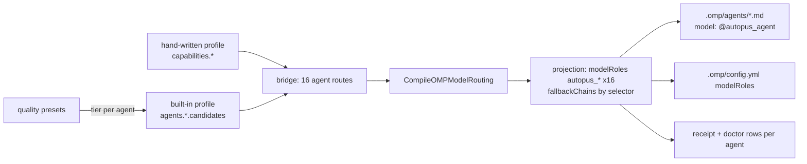

# SPEC-OMP-005 구현 계획

## Implementation Strategy

capability 레이어와 routing resolver(`CompileOMPModelRouting`)는 그대로 두고, 그 앞뒤의 키를 capability에서 agent로 바꾼다. 프로필 스키마는 `agents.<name>.candidates` 하나만 더한다(하위호환). native role 상수와 `capabilityByNativeRole`은 clean cutover로 제거한다. 구현은 pkg/config(행렬·프로필·built-in)와 pkg/adapter/omp + internal/cli(브리지·투영·receipt·doctor) 두 슬라이스로 나누고, 계약 API 이름을 먼저 고정해 병렬로 진행한다.

## Visual Planning Brief

## Tasks

- [x] **T1: 행렬과 프로필 스키마를 에이전트 역할로 바꾼다.** `pkg/config/role_model_policy_matrix.go`에 `OMPAgentRoleName`, `OMPAgentCapability`, `OMPRoleCapability`, `OMPRoleAgent`, `OMPAgentCapabilityMapping`을 추가하고 native role 상수·`capabilityByNativeRole`·`OMPNativeRoleCapability`를 제거한다. `RoleAgentOverrideConf`에 `candidates`를 더하고 `role`/`capability`를 선택 필드로 바꾼다. `RoleModelProfileConf.AgentCandidates`를 추가하고 validate가 오버라이드 후보도 검사한다.
- [x] **T2: built-in 파생에서 max-wins를 걷어낸다.** `role_model_policy_builtin.go`가 에이전트마다 자기 티어의 사다리 후보를 `Agents[agent].Candidates`에 채우고, capability 라우트는 기본값으로만 남기며, `family_diversity.roles`를 reviewer/security-auditor 역할로 채운다.
- [x] **T3: 브리지와 투영을 에이전트 키로 바꾼다.** `bridgeOMPIntegrationRoutes`가 16개 라우트를 agent 키로 만들고, `projectOMPIntegrationCapabilities`를 `projectOMPIntegrationAgents`로 바꾸며, `CompileOMPModelProjection` 입력을 agent 단위로, `ompProjectionRoleSpecs`를 canonical agent 순서에서 파생한다. operator-attested 선언 수집이 오버라이드 후보를 포함한다.
- [x] **T4: receipt·doctor·agent catalog의 역할 값을 교체한다.** receipt role row는 agent 키로 resolution을 찾고, doctor routing은 `AgentCandidates`를 쓰며, `platform_omp_agent_catalog`는 `OMPAgentCapability`를 쓴다.
- [x] **T5: 워크스페이스에 적용하고 native 키 교체를 실측한다.** 바이너리 재빌드 후 autopus-workspace `auto update`를 실행해 `.omp/config.yml`의 native 키가 사라지고 `autopus_*` 16개만 남는지, RPC readback이 통과하는지, `omp --model @autopus_executor`가 프리셋 티어를 반환하는지 확인한다.
- [x] **T6: SPEC-OMP-003 Policy Contract 절에 supersede 노트를 남기고 CHANGELOG를 갱신한다.**

## Ownership

| Slice | Paths |
|---|---|
| config | `pkg/config/role_model_policy*.go`, `pkg/config/role_model_policy*_test.go` |
| omp | `pkg/adapter/omp/omp_model_integration_bridge.go`, `omp_model_projection*.go`, `omp_agents.go`, `omp_model_integration_receipt.go`, `omp_model_catalog_attested.go`, `omp_model_doctor*.go`, 관련 테스트; `internal/cli/doctor_omp_model_routing*.go`, `platform_omp_agent_catalog*.go`, `platform_omp_profile_plan*.go` |
| integration | 빌드·전체 테스트·`auto update` 실측·SPEC/CHANGELOG |

## Risks

- RPC readback이 역할 10개에서 16개로 늘어 `auto update`가 수 초 느려진다. 역할당 1 프로세스이므로 선형이며 허용한다.
- 기존 hand-written 프로필이 `agents.<name>.role: task` 같은 native 값을 가지면 `role_capability_mismatch`로 fail closed한다. 의도된 동작이며 오류 메시지가 기대 역할 이름을 포함한다.
- 프로젝트 `.omp/config.yml`에 native 키가 남아 있으면 사용자 전역값 대신 그 값이 계속 적용된다. T5 실측으로 교체를 확인한다.
