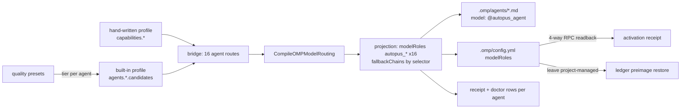

# SPEC-OMP-005 구현 계획

## Implementation Strategy

capability 레이어와 routing resolver(`CompileOMPModelRouting`)는 그대로 두고, 그 앞뒤의 키를 capability에서 agent로 바꾼다. 프로필 스키마는 `agents.<name>.candidates` 하나만 더한다(하위호환). native role 상수와 `capabilityByNativeRole`은 clean cutover로 제거한다. 구현은 pkg/config(행렬·프로필·built-in)와 pkg/adapter/omp + internal/cli(브리지·투영·receipt·doctor) 두 슬라이스로 나누고, 계약 API 이름을 먼저 고정해 병렬로 진행한다. 실측에서 드러난 두 결함(직렬 readback 데드라인 초과, 모드 전환 시 preimage 미복원)은 같은 iteration에서 닫는다.

## Visual Planning Brief

## Feature Completion Scope

| Outcome slice | Included | Evidence |
|---|---|---|
| 에이전트별 역할 투영(16 `autopus_*`, native 키 0) | Yes | S1, S6, S8 |
| 프로필 `agents.<name>.candidates` 오버라이드 | Yes | S3, S5, S10 실측 |
| built-in 파생의 max-wins 제거 | Yes | S5 |
| receipt·doctor·agent catalog 역할 값 교체 | Yes | S7 |
| 역할 readback 병렬화 + 신뢰 경계 유지 | Yes | S11, doctor `supported/fresh` |
| project-managed 이탈 시 preimage 복원 | Yes | S10 |
| `modelTags` 역할 메타데이터, thinking 단독 오버라이드 | No (Evolution Ideas) | - |

## Tasks

- [x] **T1: 행렬과 프로필 스키마를 에이전트 역할로 바꾼다.** `pkg/config/role_model_policy_matrix.go`에 `OMPAgentRoleName`, `OMPAgentCapability`, `OMPRoleCapability`, `OMPRoleAgent`, `OMPAgentCapabilityMapping`을 추가하고 native role 상수·`capabilityByNativeRole`·`OMPNativeRoleCapability`를 제거한다. `RoleAgentOverrideConf`에 `candidates`를 더하고 `role`/`capability`를 선택 필드로 바꾼다. `RoleModelProfileConf.AgentCandidates`/`AgentRoute`를 추가하고 validate가 오버라이드 후보도 검사한다.
- [x] **T2: built-in 파생에서 max-wins를 걷어낸다.** `role_model_policy_builtin.go`가 에이전트마다 자기 티어의 사다리 후보를 `Agents[agent].Candidates`에 채우고, capability 라우트는 기본값으로만 남기며, `family_diversity.roles`를 reviewer/security-auditor 역할로 채운다.
- [x] **T3: 브리지와 투영을 에이전트 키로 바꾼다.** `bridgeOMPIntegrationRoutes`가 16개 라우트를 agent 키로 만들고, `projectOMPIntegrationCapabilities`를 `projectOMPIntegrationAgents`로 바꾸며, `CompileOMPModelProjection` 입력을 agent 단위로, `ompProjectionRoleSpecs`를 canonical agent 순서에서 파생한다. operator-attested 선언 수집이 오버라이드 후보를 포함한다.
- [x] **T4: receipt·doctor·agent catalog의 역할 값을 교체한다.** receipt role row는 agent 키로 resolution을 찾고, doctor routing은 `AgentRoute`를 쓰며, `platform_omp_agent_catalog`는 `OMPAgentCapability`를 쓴다.
- [x] **T5: 워크스페이스에 적용하고 native 키 교체를 실측한다.** 바이너리 재빌드 후 autopus-workspace `auto update`를 실행해 `.omp/config.yml`의 native 키가 사라지고 `autopus_*` 16개만 남는지, RPC readback이 통과하는지, `omp --model @autopus_executor`가 프리셋 티어를 반환하는지 확인한다.
- [x] **T6: SPEC-OMP-003 Policy Contract 절에 supersede 노트를 남기고 CHANGELOG를 갱신한다.**
- [x] **T7: 역할 readback을 4-way 병렬로 바꾼다.** `readOMPModelRolesViaRPC`가 역할당 프로세스를 최대 4개까지 동시에 띄우고 첫 실패에서 취소한다. argv allowlist(`SafeOMPModelRoleRPCArgs`)·출력 상한·`--config`+`PI_CONFIG_FILES` 전달은 그대로다. 실측: `auto update` 22s→12s, doctor `projection_mismatch` 해소.
- [x] **T8: project-managed 모드를 떠날 때 preimage를 복원한다.** `Update`가 `Clean`과 같은 `prepareOMPProjectCleanStateAt`로 ledger를 검증하고 `.omp/config.yml`을 preimage로 되돌린다(`releaseOMPProjectManagedConfigAt`). 실측: overlay→project-managed 왕복 후 byte-identical.

## Ownership

| Slice | Paths |
|---|---|
| config | `pkg/config/role_model_policy*.go`, `pkg/config/role_model_policy*_test.go` |
| omp | `pkg/adapter/omp/omp_model_integration_bridge.go`, `omp_model_projection*.go`, `omp_agents.go`, `omp_model_integration_receipt.go`, `omp_model_catalog_attested.go`, `omp_model_doctor*.go`, `omp_model_activation_rpc.go`, `omp_rooted_lifecycle_config.go`, 관련 테스트; `internal/cli/doctor_omp_model_routing*.go`, `platform_omp_agent_catalog*.go`, `platform_omp_profile_plan*.go` |
| integration | 빌드·전체 테스트·`auto update` 실측·SPEC/CHANGELOG |

## Risks

| Risk | Status |
|---|---|
| RPC readback이 역할 10개→16개로 늘어 doctor의 공유 20s 데드라인을 넘긴다 | 해소(T7): 4-way 병렬, `auto update` 12s |
| 기존 hand-written 프로필이 `agents.<name>.role: task` 같은 native 값을 가지면 `role_capability_mismatch`로 fail closed한다 | 의도된 동작. 오류 메시지가 에이전트 이름을 포함한다 |
| 프로젝트 `.omp/config.yml`에 native 키가 남아 사용자 전역값 대신 계속 적용된다 | 해소(T5 실측): ledger 소유 `modelRoles`가 통째로 교체된다 |
| 모드 전환 시 관리 키만 남고 ledger가 사라져 되돌아올 수 없다 | 해소(T8): preimage 복원, 왕복 실측 |
