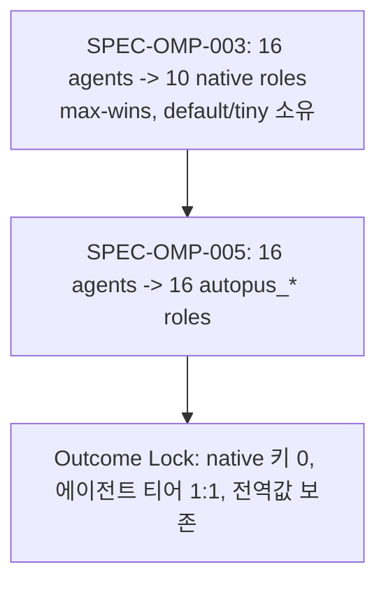

# SPEC-OMP-005 리서치

## Outcome Lock

- User-visible outcome: `.omp/config.yml`과 `.omp/agents/*.md`가 에이전트별 `autopus_<agent>` 역할만으로 모델을 결정하고, OMP native role은 사용자 소유로 남는다.
- Mandatory requirements: REQ-ROLE-001~004, REQ-READBACK-001, REQ-BUILTIN-001, REQ-PROJ-001, REQ-OWN-001, REQ-OWN-002.
- Explicit non-goals: native role 의미 변경, 사용자 전역 `modelRoles` 편집, capability 어휘 변경, 다른 플랫폼 투영, `modelTags` 메타데이터.
- Completion evidence: S1-S11 통과, 워크스페이스 실측(S8, S10), doctor `supported/fresh`.

## Visual Planning Brief

## 실측 근거

- `omp/18.1.10`, `omp --config custom-roles.yml --model @autopus_executor --mode rpc --no-tools --no-skills --no-extensions` + `get_state` → `{"model":"claude-opus-5","thinkingLevel":"xhigh"}`. `@autopus_planner` → `claude-fable-5-1`/`max`. 커스텀 역할은 modelRoles 키만 있으면 해석된다.
- OMP docs(`task-agent-discovery.md` Role-backed custom agents): frontmatter `model: "@review"`가 `modelRoles.review`로 해석된다. `settings.md`: `modelTags`로 추가 역할을 정의할 수 있고 `/model` Roles 뷰가 커스텀 역할을 보인다.
- SPEC-OMP-003 적용 결과(2026-09-05, autopus-workspace): `task: anthropic/claude-fable-5-1:max`(executor 승격), `tiny: anthropic/claude-opus-5:xhigh`(백그라운드 작업 비용 상승), `default: anthropic/claude-fable-5-1:max`(전역 `xhigh` 덮음). 이 세 관측이 본 SPEC의 동기다.
- 실측에서 드러난 결함 두 가지는 같은 iteration에서 닫았다: 역할 16개 직렬 readback이 doctor의 공유 20s 데드라인(`ompDoctorTotalTimeout`)을 넘겨 `projection_mismatch`가 났고(T7), hand-written overlay 프로필로 전환하자 `.omp/config.yml`의 관리 키는 남고 ledger만 prune돼 되돌아올 때 `managed_key_conflict`가 났다(T8).

## 현재 코드 경로

| 단계 | 파일 | 키(변경 후) |
|---|---|---|
| 프로필 → 라우트 | `omp_model_integration_bridge.go` `bridgeOMPIntegrationRoutes` | agent |
| 라우트 → resolution | `omp_model_routing_compile.go` | agent |
| resolution → 투영 입력 | `omp_model_integration_bridge.go` `projectOMPIntegrationAgents` | agent |
| 투영 | `omp_model_projection.go`, `omp_model_projection_policy.go` `ompProjectionRoleSpecs` | `autopus_<agent>` |
| agent 렌더 | `omp_agents.go` → `content.TransformAgentForOMPWithModel` | `@autopus_<agent>` |
| receipt | `omp_model_integration_receipt.go` | agent |
| doctor | `internal/cli/doctor_omp_model_routing_probe.go` `compileOMPModelDoctorRouting` | agent |
| agent catalog | `internal/cli/platform_omp_agent_catalog.go` | `OMPAgentCapability(name)` |
| readback | `omp_model_activation_rpc.go` `readOMPModelRolesViaRPC` | 역할당 프로세스, 4-way |
| 모드 이탈 | `omp_rooted_lifecycle_config.go` `releaseOMPProjectManagedConfigAt` | ledger preimage |

## Semantic Invariant Inventory

| ID | source clause | invariant type | affected outputs | acceptance IDs |
|----|---------------|----------------|------------------|----------------|
| INV-001 | REQ-ROLE-001: 에이전트 16개 ↔ 역할 16개 1:1, 이름은 `autopus_`+`-`→`_` | naming / ordering | `modelRoles` 키, agent frontmatter `model`, receipt `roles[].role` | S1, S6, S7 |
| INV-002 | REQ-ROLE-001, REQ-OWN-001: native role 키 10개는 어떤 Autopus 산출물에도 없다 | state | `.omp/config.yml`, overlay, receipt, doctor row | S1, S6, S8 |
| INV-003 | REQ-ROLE-002, REQ-ROLE-004: agent→capability 행렬과 대표 역할은 Policy Contract와 정확히 같고 그 밖은 fail closed | parser / state | validate 오류 코드, route `capability`, `prefer_distinct_executor_family` | S2, S4 |
| INV-004 | REQ-ROLE-003, REQ-BUILTIN-001: 후보 우선순위는 `agents.<name>.candidates` > `capabilities.<cap>.candidates` | ordering | route candidates, projected selector | S3, S5, S10 |
| INV-005 | REQ-BUILTIN-001: built-in 사다리는 fable→max, opus→xhigh, sonnet→medium, haiku→low이며 한 단계 아래를 fallback으로 붙인다 | formula | `modelRoles` selector 접미사, `retry.fallbackChains` | S5, S6 |
| INV-006 | REQ-PROJ-001: fallback chain은 selector 키이며 같은 selector에 다른 chain은 `fallback_chain_conflict` | parser | `retry.fallbackChains` | S6 |
| INV-007 | REQ-OWN-001, REQ-OWN-002: ledger가 소유한 `modelRoles`만 통째로 교체하고, 소유하지 않으면 바이트 불변 실패, 모드 이탈 시 preimage 복원 | state transition | `.omp/config.yml` 바이트, ownership ledger 존재 | S8, S9, S10 |
| INV-008 | REQ-READBACK-001: readback argv는 allowlist 형태만, 출력은 `maxOutput` 상한, 동시 프로세스 ≤4, 하나라도 불일치면 전체 실패 | state / bound | RPC 호출 횟수, 오류 코드, `PI_CONFIG_FILES` 전달 | S11 |

## Feature Coverage Map

| Outcome slice | Covered by | Status |
|---------------|------------|--------|
| 에이전트별 역할 투영과 native 키 제거 | SPEC-OMP-005 T1-T5 | covered |
| 프로필 오버라이드·built-in 파생 | SPEC-OMP-005 T1-T2 | covered |
| receipt·doctor·catalog 역할 값 | SPEC-OMP-005 T4 | covered |
| readback 병렬화·신뢰 경계 | SPEC-OMP-005 T7 | covered |
| 모드 이탈 preimage 복원 | SPEC-OMP-005 T8 | covered |
| `modelTags` 메타데이터, thinking 단독 오버라이드 | 없음 | evolution idea |

## 대안 검토

- **frontmatter에 exact selector 기록**(SPEC-OMP-003 본문이 허용): modelRoles가 필요 없어지지만 `/model` Roles 뷰에서 재지정할 수 없고 fallback chain·modelFallback 설정은 여전히 config에 있어야 한다. 역할 간접화를 잃으므로 기각.
- **native role 행렬만 조정**(debugger/deep-worker → `slow`): task 승격은 줄지만 default/tiny/smol/commit 소유 문제는 남는다. 기각.
- **doctor 타임아웃 상향**: 근본 원인(역할 수에 비례하는 직렬 readback)을 숨긴다. 기각.
- **에이전트별 커스텀 역할**(채택): 두 부작용을 구조적으로 제거하고 OMP 역할 간접화를 유지한다.

## Completion Debt

| Item | Blocks | Required resolution |
|------|--------|---------------------|
| None | - | T7(병렬 readback)과 T8(preimage 복원)은 이 iteration에서 해소됐다 |

## Evolution Ideas

These are optional improvements and do not block sync completion.

| Idea | Why not required now | Promotion trigger |
|------|----------------------|-------------------|
| `modelTags`로 역할에 설명 메타데이터를 붙여 `/model` Roles 뷰에서 에이전트 용도를 보이게 한다 | 라우팅 정확성과 무관한 UX | 사용자가 Roles 뷰 가독성을 요청 |
| 프로필 `agents.<name>.thinking` 단독 오버라이드(후보 전체가 아닌 thinking만) | `candidates` 오버라이드로 표현 가능 | 반복 요청 |
| readback 프로세스 수를 CPU 수에 맞춰 조정 | 4-way로 doctor 데드라인 내 완료 | 역할 수가 다시 늘어남 |

## Sibling SPEC Decision

| Decision | Reason | Sibling SPEC IDs |
|----------|--------|------------------|
| none | Primary SPEC closes Outcome Lock | None |

## Reference Discipline

| Reference | Type | Verification |
|-----------|------|--------------|
| `pkg/config/role_model_policy_matrix.go` `OMPAgentRoleName`, `OMPAgentCapability`, `OMPRoleCapability`, `OMPRoleAgent`, `OMPAgentCapabilityMapping` | [NEW] planned addition (구현됨) | 구현 후 `go vet`·테스트로 확인 |
| `pkg/config/role_model_policy.go` `RoleAgentOverrideConf.Candidates`, `AgentCandidates`, `AgentRoute` | [NEW] planned addition (구현됨) | 동일 |
| `pkg/adapter/omp/omp_model_integration_bridge.go` `bridgeOMPIntegrationRoutes`, `projectOMPIntegrationAgents` | existing / [NEW] rename | `rg` 확인 |
| `pkg/adapter/omp/omp_model_activation_rpc.go` `readOMPModelRolesViaRPC`, `SafeOMPModelRoleRPCArgs` | existing | `rg`·read 확인 |
| `pkg/adapter/omp/omp_model_probe_process.go` `OMPModelProbeProcess` (`maxOutput`, `PI_CONFIG_FILES`) | existing | read 확인 |
| `pkg/adapter/omp/omp_rooted_lifecycle_config.go` `releaseOMPProjectManagedConfigAt` | [NEW] planned addition (구현됨) | 회귀 테스트 |
| `pkg/adapter/omp/omp_model_integration_clean.go` `prepareOMPProjectCleanStateAt` | existing | read 확인 |
| `internal/cli/doctor_omp_readiness.go` `ompDoctorTotalTimeout` (20s) | existing | read 확인 |
| OMP docs `task-agent-discovery.md`, `settings.md` (`omp://`) | existing | read 확인 |
| `omp` 18.1.10 `--model @role --mode rpc get_state` | existing | 실측 |

## Reviewer Brief

- Intended scope: OMP 모델 라우팅의 역할 키를 native 10개에서 에이전트별 16개로 바꾸고, 그 과정에서 드러난 readback 데드라인·모드 전환 결함을 닫는다.
- Explicit non-goals: native role 의미 변경, 사용자 전역 `modelRoles` 편집, capability 어휘·다른 플랫폼 투영 변경, `modelTags` 메타데이터.
- Self-verified: Traceability Matrix, Semantic Invariant Inventory, oracle acceptance(S1-S11), existing/[NEW] reference discipline.
- Reviewer should focus on: correctness(역할 1:1·native 키 부재), convergence safety(ledger 소유 전환·모드 왕복), regression risk(readback 신뢰 경계·병렬화), Completion Debt only.

## Self-Verify Summary

- Q-CORR-04 | status: PASS | attempt: 2 | files: research.md | reason: Reference Discipline 표에 existing/[NEW] 구분과 검증 방법 기록
- Q-COMP-02 | status: PASS | attempt: 2 | files: spec.md, plan.md, acceptance.md | reason: REQ-OWN-001 conflict 절은 S9, 병렬 readback은 REQ-READBACK-001/T7/S11, preimage 복원은 REQ-OWN-002/T8/S10으로 연결
- Q-COMP-05 | status: PASS | attempt: 2 | files: research.md, spec.md | reason: INV-001~008을 inventory에 목록화하고 Traceability Matrix가 모두 참조
- Q-COMP-06 | status: PASS | attempt: 2 | files: spec.md, research.md | reason: `## Traceability Matrix`(Semantic Invariant 열 포함)와 `## Reviewer Brief` 존재
- Q-COMP-07 | status: PASS | attempt: 2 | files: research.md | reason: 해소된 T7/T8을 Completion Debt에서 제거, Evolution Ideas 분리
- Q-STYLE-03 | status: PASS | attempt: 2 | files: acceptance.md | reason: S1-S11이 `## Test Scenarios` 아래, 상태 보고는 `## Current Acceptance State`로 분리
- Q-SEC-01 | status: PASS | attempt: 2 | files: spec.md, acceptance.md, research.md | reason: REQ-READBACK-001/INV-008/S11이 argv allowlist·출력 상한·config 경로·동시성 상한을 기술
- Q-COH-02 | status: PASS | attempt: 2 | files: plan.md, research.md | reason: Risks 표와 Completion Debt가 실제 상태(T7/T8 해소)와 일치
