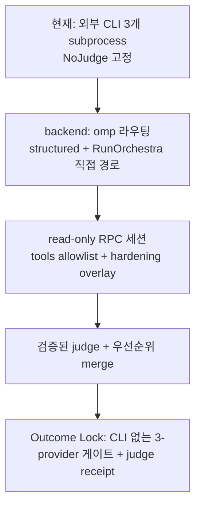

# SPEC-OMP-006 리서치

## Outcome Lock

- User-visible outcome: `backend: omp` provider가 외부 CLI 없이 OMP RPC read-only 세션에서 리뷰를 수행하고(structured·직접 경로 모두), SPEC 리뷰가 검증된 typed judge 판정을 수행해 receipt에 남긴다.
- Mandatory requirements: REQ-BACKEND-001/002, REQ-SESSION-001/002/003/004, REQ-JUDGE-001/002/003/004, REQ-OBS-001.
- Explicit non-goals: pane 변경, orchestra 전략 변경, OMP provider 자동 등록, 리뷰어 쓰기·MCP·LSP 도구, 읽기 경로 sandbox, Agent Hub 패널.
- Completion evidence: S1-S15, autopus-adk dogfood receipt(providers 3×`executed_backend=omp`, judge ok, 판정 PASS).

## Visual Planning Brief

## 실측 근거

- 2026-09-05 SPEC-OMP-005 게이트: codex CLI `You've hit your usage limit`(4s exit 1), `agy` rev 1 `empty_output`("a tool required the command permission that headless mode cannot prompt for"), gemini 25분 타임아웃 2회. claude 단독으로만 PASS.
- OMP 18.1.10 CLI: `--tools=<csv>`, `--no-tools`, `--no-lsp`, `--approval-mode=always-ask|write|yolo`, `--max-time`, `--no-skills`, `--no-extensions`, `--no-session`, `--session-dir`, `--config <overlay>`, `--mode rpc`. RPC: `set_model{provider, modelId}`, `set_thinking_level{level}`, `get_state`, `prompt`, `get_last_assistant_text`.
- OMP 18.1.10 `prompt` 응답은 `{"id":…, "type":"response","command":"prompt","success":true}`(data 없음)이고 이어서 `agent_start`, `agent_end{messages:[…]}`(`isTerminal` 없음)가 온다. omp 17.x는 `data.agentInvoked=true`와 `prompt_result`를 낸다. 1차 dogfood에서 세 provider가 `prompt result is malformed`로 5초 만에 실패한 원인이었고 프로토콜을 두 형태 모두 수락하도록 고쳤다.
- OMP settings(실측 `omp config list`): `lsp.enabled`, `mcp.enableProjectConfig`, `web_search.enabled`, `secrets.enabled`(기본 false), `memory.backend`, `tools.approvalMode`, `tools.approval.<name>: deny`(yolo에서도 절대 거부). 읽기 경로를 제한하는 설정은 없다(`read.*`는 요약·미리보기 옵션뿐).
- OMP docs(`custom-tools.md`, `sdk.md`): CLI `--tools`는 built-in 이름만 검증하고 MCP/custom/extension 도구는 discovery로 등록된다; SDK의 `restrictToolNames`만 이를 차단한다. 따라서 argv만으로는 read-only를 증명할 수 없어 `get_state.dumpTools`(rpc.md)를 런타임 oracle로 채택했다. 실측: hardening argv 세션 `dumpTools == ["glob","grep","read"]`, 기본 세션 11개.
- 1차 dogfood(T1-T5 후): `SPEC 리뷰 백엔드: subprocess+omp`, 세 세션 `OMP 리뷰 세션: provider=… model=… tools=glob,grep,read`, Provider Health 3/3 success(codex는 OMP `openai-codex` 경로로 성공 — CLI 한도와 별개), 자식 프로세스 `omp-verified`만, judge claude ok(accepted 16, merged 1), 판정 REVISE. 리뷰어들이 `orchestra.go:237`, `applySpecReviewJudge`, `pkg/spec/parser.go:14-17` 등 실제 코드를 읽고 finding을 냈다 — 도구 접근 리뷰어의 목적이 그대로 확인됐다.
- `config.MigrateOrchestraConfig`는 `Args`가 빈 provider를 CLI 기본값으로 복원했다(`shouldRestoreProviderDefaults`). 1차 dogfood 첫 시도에서 `backend: omp` 엔트리가 `claude --print --model opus --effort high`로 덮여 외부 claude가 떴고, backend 엔트리를 복원·codex 분류에서 제외하도록 고쳤다.

## 현재 코드 경로

| 단계 | 파일 | 상태 |
|---|---|---|
| structured backend 선택 | `internal/cli/spec_review_runtime.go` `specReviewBackendFactory` → `selectRoutedBackend` | 구현됨(T3) |
| 직접 실행 경로 | `pkg/orchestra/runner.go`(`runParallel`, `runFastest`), `debate.go`, `debate_judge.go`, `relay.go`, `sequential_pipeline.go`, `recheck.go` | 구현됨(T7): `runConfiguredProvider` + `ProviderBackends` |
| SPEC 리뷰 러너·judge | `internal/cli/spec_review_structured.go`, `spec_review_judge.go` | 구현됨(T4), T9에서 검증 강화 |
| 루프 merge | `internal/cli/spec_review_loop.go`, `spec_review_loop_merge.go` | 구현됨(T5), T9에서 verify 모드 ID 보존 |
| judge 설정 해석 | `internal/cli/spec_review.go` → `specReviewLoopParams.judgeConfig` | 구현됨(T9) |
| RPC 클라이언트 | `internal/cli/pipeline_backend_omp_process.go`(`startPipelineOMPProcessWithOptions`), `_protocol.go`(`setThinkingLevel`, bare ack) | 구현됨(T2) |
| OMP 리뷰 backend | `internal/cli/omp_review_backend.go`, `omp_review_backend_process.go` | 구현됨(T2, T8 hardening overlay) |
| provider 설정 | `pkg/config/schema.go`, `schema_provider_backend.go`, `migrate.go`, `codex_provider.go` | 구현됨(T1) |
| family | `pkg/orchestra/model_family.go`, `internal/cli/orchestra_brainstorm_judge.go` | 구현됨 |
| receipt | `internal/cli/spec_review_receipt.go`, `spec_review_runtime.go`; `pkg/spec/judge.go`, `types.go`, `review_persist.go`, `provider_health.go` | 구현됨(T5, T9: `executed_backend`/`accepted_ids`/`rationale`) |

## Security Boundary

| 위협 | 통제 | 잔여 |
|---|---|---|
| 리뷰어가 파일을 쓰거나 셸을 실행 | `--tools` allowlist ⊆ {read, grep, glob}(built-in 한정), `--no-lsp`, `--no-extensions`, `--no-skills`, overlay `mcp.enableProjectConfig: false`·`lsp.enabled: false`, 그리고 **세션 시작 후 `get_state.dumpTools` 검증** — allowlist 밖 도구(사용자 레벨 MCP `mcp__*`, custom tool, extension tool 등 discovery 경로)가 하나라도 보고되면 프롬프트를 보내지 않고 fail-closed | 없음(실측: hardening 세션 dumpTools == [glob, grep, read]) |
| 저장소 파일에 심긴 지시로 외부 자원 접근 | overlay `web_search.enabled: false`; 세션은 `--no-session`이라 기록 없음 | OMP `read`의 URL 읽기는 도구 자체 기능이라 남는다 |
| 홈 디렉터리·자격증명 읽기 | overlay `secrets.enabled: true`(알려진 토큰 패턴 난독화), `--no-extensions`(OMP 확장 미로드), canonical env(작업 env 미상속) | 프로세스 사용자가 읽을 수 있는 경로는 읽힐 수 있음 — non-goal(파일시스템 sandbox), Residual Risk로 명시 |
| 리뷰어 본문의 지시문이 judge를 조종 | 템플릿이 리뷰어 본문을 비신뢰 데이터로 다루도록 지시, REQ-JUDGE-003 형식·의미 검증, alias 외 sources 거부 | judge 판단 편향 가능성은 남는다; receipt에 accepted_ids·rationale 기록으로 감사 가능 |
| 리뷰어 원문의 영구 보존 | `secrets.enabled: true`로 난독화된 텍스트만 나온다 | review.md redaction 정책 추가는 Evolution Idea |
| 헤드리스 `yolo` 승인 | 승인 대상 도구가 read/grep/glob뿐 | 없음 |

## Semantic Invariant Inventory

| ID | source clause | invariant type | affected outputs | acceptance IDs |
|----|---------------|----------------|------------------|----------------|
| INV-001 | REQ-BACKEND-001/002: `Backend=="omp"`인 요청은 structured·judge·`RunOrchestra` 전략 6종 어디서든 OMP backend로 가고 `Binary`를 실행하지 않는다 | routing / state | `ExecutedBackend`, 스폰된 프로세스 | S1, S2, S9, S12 |
| INV-002 | REQ-SESSION-001/003/004: 세션 argv는 고정 순서이며 `--tools`는 정렬·중복 제거된 allowlist 부분집합, `--no-lsp`·hardening overlay 필수, 그리고 세션이 보고한 활성 도구 집합 ⊆ allowlist(아니면 프롬프트 전송 전 실패) | state / bound | RPC 프로세스 argv, overlay, `get_state.dumpTools` | S3, S13, S14 |
| INV-003 | REQ-SESSION-002: `ModelFamily`는 selector provider 토큰에서 결정적으로 도출 | formula | `ProviderResponse.ModelFamily` | S4 |
| INV-004 | REQ-JUDGE-001/003/004, REQ-OBS-001: judge는 리뷰어 ≥1 성공일 때만 실행되고 검증 통과 출력만 supermajority를 대체하며 실패·무효는 fallback + receipt 기록 | state transition | `ReviewResult.Judge`, receipt `judge`, verdict | S6, S7, S8, S9, S11 |
| INV-005 | REQ-JUDGE-002: judge PASS는 active(open/regressed) accepted critical/major일 때만 REVISE; verify 모드에서 prior ID/FirstSeenRev 보존·출처 union·resolved→regressed 전이·미채택 prior resolved·새 ID는 prior 최대+1이며 scope lock이 새 finding을 out_of_scope로 분류; merge는 `merge_into`가 가리키는 accepted finding에 출처만 결합; checklist FAIL은 REVISE 유지에만 작용 | ordering / precedence | merged verdict, finding ID/status/Provider | S7, S10 |
| INV-006 | REQ-SESSION-001/002: 호출마다 새 프로세스·private runtime, 완료 후 삭제, deadline은 `TimedOut`, 17.x·18.1.x prompt ack 모두 수락 | state | 런타임 디렉터리, `TimedOut`, `Output` | S3, S4, S5 |
| INV-007 | REQ-BACKEND-001/SESSION-003: backend/model/tools 검증은 fail-closed이며 오류가 provider 이름을 포함; migration이 backend 엔트리를 보존 | parser | `config.Validate`, `MigrateOrchestraConfig` | S1 |
| INV-008 | REQ-JUDGE-003: 유효 judge 출력은 findings 배열 필수, enum 값, 알려진 alias, 모든 decision에 걸친 고유 id, merge⇒accepted id를 가리키는 merge_into, REVISE/REJECT⇒accept≥1 | parser | `Judge.Status`/`Reason` | S11 |
| INV-009 | REQ-SESSION-004: overlay는 정확히 6개 키를 담고 0600이며 세션과 함께 사라진다 | state | overlay 파일 | S13 |
| INV-010 | REQ-SESSION-002: 응답으로 보고되는 provider/model은 pinned selector와 같고, 재시도는 같은 pin의 새 프로세스로만 일어나며 부모 취소·큐잉 outcome의 `executed_backend`는 그 provider가 도달할 backend 이름이다 | state / transition | `agent_end.messages`, `set_model` 인자, `FailedProvider.ExecutedBackend` | S15, S8 |

## Feature Coverage Map

| Outcome slice | Covered by | Status |
|---------------|------------|--------|
| provider 스키마·migration 보존 | T1 | covered |
| structured 라우팅 | T3 | covered |
| 직접 경로 라우팅(전략 6종) | T7 | covered |
| read-only RPC 세션 + hardening | T2, T8 | covered |
| judge 단계·검증·우선순위·verify 보존·merge 출처·receipt | T4, T5, T9 | covered |
| dogfood | T6 | 1·2차 완료(REVISE), 3차로 completion evidence |
| 읽기 경로 sandbox, review.md redaction, judge family 강제 분리, Agent Hub 패널 | 없음 | residual risk / evolution idea |

## 대안 검토

- **OMP task 에이전트 패널(세션 내 fan-out)**: 리뷰어당 품질은 같은 수준이지만 리비전 루프를 세션 LLM이 지휘해야 하고 CLI·다른 플랫폼에서 못 쓴다. 기각. `auto-review` 코드리뷰용 패널은 Evolution Idea.
- **외부 CLI 유지 + 타임아웃 상향**: agy headless 권한 거부와 codex CLI quirk는 그대로. 기각.
- **judge를 orchestra `JudgeOutput`로 재사용**: consensus/ideas 형식이라 finding 채택/기각을 표현할 수 없다. 전용 `review_judge` 스키마 신설.
- **doctor/게이트 타임아웃만 상향**: 근본 원인(CLI 의존)을 숨긴다. 기각.

## Completion Debt

| Item | Blocks | Required resolution |
|------|--------|---------------------|
| (none) | — | 6차 dogfood receipt가 `providers[].executed_backend=omp`×3, judge ok, 판정 PASS를 기록해 Completion evidence를 충족했다 |

## Evolution Ideas

These are optional improvements and do not block sync completion.

| Idea | Why not required now | Promotion trigger |
|------|----------------------|-------------------|
| judge family를 리뷰어 다수 family와 다르게 강제 | 사용자가 `judge`를 직접 고르고 receipt에 family가 남음 | 동일 family 편향이 실측됨 |
| review.md 저장 전 secret redaction 패스 | `secrets.enabled: true`가 세션 출력에서 난독화 | 난독화를 벗어난 노출이 관측됨 |
| `auto-review` 코드리뷰용 Agent Hub task 패널 | SPEC 게이트와 달리 결정성 요구가 낮음 | 사용자 요청 |
| 읽기 경로 sandbox(OMP 측 설정 또는 chroot) | OMP에 해당 설정이 없음 | OMP가 read scope 설정을 제공 |

## Sibling SPEC Decision

| Decision | Reason | Sibling SPEC IDs |
|----------|--------|------------------|
| none | Primary SPEC closes Outcome Lock | None |

## Reference Discipline

| Reference | Type | Verification |
|-----------|------|--------------|
| `pkg/orchestra/backend.go` `ExecutionBackend`, `ProviderRequest`, `SelectBackend` | existing | read 확인 |
| `pkg/orchestra/types.go` `ProviderConfig`, `ProviderResponse`, `OrchestraConfig` | existing | read 확인 |
| `pkg/orchestra/{runner.go,provider_runner.go,debate.go,debate_judge.go,execution_evidence.go}` `runParallel`, `runProvider`, `runProviderWithProgress`, `applyProviderRequestEvidence` | existing | read 확인 |
| `pkg/config/schema.go` `ProviderEntry`; `pkg/config/{migrate.go,codex_provider.go}` `MigrateOrchestraConfig`, `shouldRestoreProviderDefaults` | existing | read 확인 |
| `internal/cli/spec_review_structured*.go`, `spec_review_loop*.go`, `spec_review_runtime.go`, `spec_review.go`, `spec_review_providers.go`, `orchestra_helpers.go` `providerConfigFromEntry`, `orchestra.go`, `orchestra_run_runtime.go` | existing | read 확인 |
| `internal/cli/pipeline_backend_omp_process.go`, `_protocol.go` | existing | read 확인 |
| `pkg/spec/{types.go,review_persist.go}`, `pkg/spec/parser.go:14-17` EARS 분류 | existing | read 확인 |
| `[NEW] pkg/config/schema_provider_backend.go`, `[NEW] pkg/orchestra/{backend_routed.go,model_family.go,review_judge_prompt.go}`, `[NEW] templates/shared/spec-review-judge.md.tmpl` | [NEW] planned addition (T1, 구현됨) | 테스트 |
| `[NEW] internal/cli/{omp_review_backend.go,omp_review_backend_process.go,spec_review_judge.go}` | [NEW] planned addition (T2/T4, 구현됨) | 테스트 |
| `[NEW] pkg/spec/judge.go` | [NEW] planned addition (T5, 구현됨) | 테스트 |
| `pkg/orchestra/{relay.go,sequential_pipeline.go,recheck.go}` `runRelay`, `runPipeline`, `recheckTransport`; `pkg/spec/provider_health.go` `BuildProviderStatuses` | existing | read 확인 |
| `[NEW] pkg/orchestra/provider_backend_route.go`, `[NEW] provider_backend_route_strategies_test.go` | [NEW] planned addition (T7, 구현됨) | 테스트 |
| OMP docs `rpc.md`, `settings.md`; `omp --help`; `omp config list` | existing | read/실측 |

## Reviewer Brief

- Intended scope: provider 단위 OMP RPC read-only backend(structured·직접 경로)와 SPEC 리뷰 judge 단계(검증·우선순위·receipt).
- Explicit non-goals: pane 변경, orchestra 전략 변경, OMP 자동 등록, 쓰기·MCP·LSP 도구, 읽기 경로 sandbox, Agent Hub 패널.
- Self-verified: Traceability Matrix, Semantic Invariant Inventory, oracle acceptance(S1-S15), existing/[NEW] reference discipline, Security Boundary 표.
- Reviewer should focus on: correctness(라우팅·argv·판정 우선순위·verify 보존), convergence safety(judge fallback·invalid 규칙), regression risk(기존 pane/subprocess/CLI 경로 불변, migration), Completion Debt only.

## Self-Verify Summary

- Q-CORR-01 | status: PASS | attempt: 3 | files: plan.md, research.md | reason: Ownership과 Reference Discipline이 실제 경로만 나열(provider_status.go → provider_health.go 정정)하고 신규 파일은 [NEW]
- Q-CORR-02 | status: PASS | attempt: 2 | files: plan.md | reason: 신규 파일에 [NEW] 마커
- Q-CORR-03 | status: PASS | attempt: 2 | files: spec.md | reason: REQ-JUDGE-001/002는 `WHEN … THEN`, REQ-JUDGE-004/OBS-001은 `IF … THEN`, 단일 줄에 WHEN과 IF를 섞지 않음
- Q-CORR-04 | status: PASS | attempt: 2 | files: spec.md, acceptance.md | reason: S3 argv 정확 순서·정렬, S9 oracle이 실제 로그 문자열과 receipt 필드 사용
- Q-COMP-01 | status: PASS | attempt: 2 | files: spec.md | reason: REQ-JUDGE-001 judge 설정 해석, REQ-JUDGE-003 유효성 정의
- Q-COMP-02 | status: PASS | attempt: 2 | files: spec.md, plan.md, acceptance.md | reason: F-003~F-008에 REQ/T7-T9/S10-S13 연결
- Q-COMP-03 | status: PASS | attempt: 2 | files: spec.md | reason: REQ-SESSION-003은 config-time만, decision enum·merge 의미·Family/Merged/AcceptedIDs 정의
- Q-COMP-04 | status: PASS | attempt: 5 | files: spec.md, research.md, plan.md | reason: 전략 6종 라우팅·hardening·judge 검증·receipt 관측면(부모 취소 경로 포함)이 T7-T10으로 구현·테스트됐고 plan에서 [x]; Completion Debt 표는 T6 최종 dogfood 한 행뿐이며 T7-T10은 Debt가 아니다
- Q-COMP-05 | status: PASS | attempt: 6 | files: research.md, spec.md | reason: INV-001~010이 S1-S15에 매핑되고 Traceability Matrix가 모두 참조
- Q-COMP-06 | status: PASS | attempt: 2 | files: spec.md, acceptance.md | reason: 익명화 범위(헤더 alias, 본문 원문)와 판정 우선순위 명시
- Q-COMP-07 | status: PASS | attempt: 5 | files: research.md | reason: Completion Debt 표는 미완 항목 하나(T6 최종 dogfood receipt)만 담고, 완료된 T7-T10은 plan 태스크 상태로만 추적하며, 선택 항목은 Evolution Ideas
- Q-FEAS-01 | status: PASS | attempt: 5 | files: spec.md, plan.md | reason: T7이 `RunOrchestra` 전략 6종(consensus, debate rebuttal/judge, fastest, pipeline, relay, recheck) 전부를 `runConfiguredProvider`로 라우팅하고 `provider_backend_route_strategies_test.go`로 고정
- Q-FEAS-02 | status: PASS | attempt: 2 | files: plan.md, research.md | reason: 1차 dogfood로 OMP 18.1.10에서 세 selector·thinking 해석 실증
- Q-FEAS-03 | status: PASS | attempt: 2 | files: acceptance.md | reason: S9가 receipt 필드와 자식 프로세스 관측으로 판정
- Q-SEC-01 | status: PASS | attempt: 4 | files: research.md, spec.md | reason: read-only 경계를 argv 주장이 아니라 세션 `dumpTools` 런타임 검증으로 강제(S14), prompt injection 경계는 Residual Risk에 기술
- Q-SEC-02 | status: PASS | attempt: 4 | files: research.md | reason: discovery 경로(MCP/custom/extension) 도구 누출 시 fail-closed; 홈 경로·URL·secret 접근 정책과 잔여 위험 명시
- Q-SEC-03 | status: PASS | attempt: 2 | files: research.md | reason: 리뷰어 원문 보존·난독화 정책과 redaction Evolution Idea
- Q-COH-02 | status: PASS | attempt: 5 | files: research.md, plan.md, acceptance.md | reason: 필수 계약(S1-S15)은 전부 구현·테스트됐고 plan T1-T5, T7-T10이 [x]; 유일한 미완 항목 T6(최종 dogfood receipt PASS)만 Completion Debt에 남아 sync completion을 막음
- Q-STYLE-01 | status: PASS | attempt: 3 | files: spec.md | reason: REQ ID·Type·Priority·Observability 형식 일관
- Q-STYLE-02 | status: PASS | attempt: 3 | files: spec.md, plan.md, acceptance.md, research.md | reason: 한국어 본문·영어 코드 식별자 규칙 준수
- Q-STYLE-03 | status: PASS | attempt: 3 | files: acceptance.md | reason: 시나리오는 `## Test Scenarios` 아래, 상태는 별도 섹션
- Q-COH-01 | status: PASS | attempt: 3 | files: spec.md, plan.md | reason: Outcome Lock의 "모든 경로"가 T7(전략 6종)·S12와 일치
- Q-COH-03 | status: PASS | attempt: 3 | files: research.md | reason: Residual Risk와 non-goal(읽기 경로 sandbox)이 Security Boundary 표와 일치
