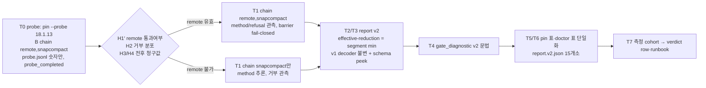

# SPEC-OMP-007 구현 계획

## Implementation Strategy

순서가 내용이다. (0) 오라클 코드를 건드리기 전에 계측 전용 probe 모드를 넣고 omp/18.1.13에서 cohort 한 번을 돌려 H1′–H4를 판정한다. probe는 서명 evidence를 만들지 않고 숫자만 남긴다. (1) B 세션과 product overlay에 같은 chain을 주고 방법·거부를 관측 사실로 만든다. (2)–(3) observe-session이 v2 report를 만들고 promptlayer가 v2 struct·누적 aggregate·schema dispatch로 검증하되 v1 함수는 한 줄도 바꾸지 않는다. (4)–(6) diagnostic·pin 표·doctor·release lane 파일명을 같은 metric 이름으로 정렬한다. (7) 선택된 핀에서 측정 cohort를 돌려 verdict table과 runbook에 숫자를 기록한다. 기존 `sessionStats` delta, `manualCompact`, `validatePipelineOMPActiveTranscript`, verdict table, `gate_diagnostic` 경로를 그대로 재사용한다.

## Visual Planning Brief

## Feature Completion Scope

| Outcome slice | Included | Evidence |
|---|---|---|
| probe 인스트루먼트와 1회 실행(H1′–H4 판정) | Yes | AC-010 |
| chain·방법·거부 관측·barrier fail-closed·product 동등성 | Yes | AC-004, AC-005, AC-011 |
| v2 report·누적 gate·floor 하드 상수 | Yes | AC-001, AC-002, AC-003 |
| v1 byte-identical·schema dispatch | Yes | AC-006, AC-007 |
| body-free diagnostic | Yes | AC-008 |
| verdict table·doctor 정렬 | Yes | AC-009 |
| release lane 파일명 `.v2.json` | Yes | AC-006, AC-012 |
| 측정 cohort·runbook·CHANGELOG | Yes | AC-012 |
| floor 완화, cohort 형태, attestation envelope, upstream 수정 | No | non-goal |

승인된 sibling 의존성 없음. Completion Debt는 research.md 참조(결정 확정, probe 실행, 측정 cohort).

## Risk-First Integration Probe

| assumption_id | class | risk | boundary | input | oracle | isolation | status | reason | evidence |
|---------------|-------|------|----------|-------|--------|-----------|--------|---------|----------|
| A1 | implementation_assumption | high | release gateway(provider-bound endpoint, credential locator) ↔ omp/18.1.13 manual `compact` with `methodOrder: [remote, snapcompact]` (`responses_compaction_v2`) | 같은 20-pair workload, `advance-omp-pin.sh 18.1.13 --probe`, `OMP_CONTEXT_PROBE_DIR` set, `release-prep.sh --apply` | `probe.jsonl`에 `method=remote`로 완료된 compaction ≥1건이고 그 직후 B call의 `stats_after.input−stats_before.input`이 직전 B call보다 작다; barrier 안에 `agent_start/turn_start/turn_end/agent_end/prompt_result` 0건; 마지막 frame `error_code=probe_completed`, tag·evidence store·report 미생성 | release canary isolated-UID sandbox, 서명·태그 전 종료, 숫자만 기록 | not-run | probe는 provider 비용(≈40 call + compaction 요청)이 들어 사용자 승인 후 T0에서 실행; 정적으로는 gateway가 remote compaction 요청을 통과시키는지 알 수 없음 | - |
| A2 | implementation_assumption | high | post-compaction `get_messages_page` transcript under remote method ↔ `validatePipelineOMPActiveTranscript` | A1과 같은 run | 모든 message가 text / validated image / `compactionSummary{method,tokensBefore,tokensAfter}` 중 하나로 분류되고 미분류 kind 0건; refusal text는 알려진 3종만; `too_small`/`would_not_reduce` 건수가 기록됨 | A1과 동일 | not-run | A1과 같은 run에서 같이 판정; 18.1.13 remote 결과 item의 shape는 정적으로 확인 불가 | - |
| A3 | verified_fact | medium | 측정원 `get_session_stats` delta와 `compactionSummary.method` 필드가 18.1.13 frame에 존재하고 17.2.7과 같은 청구 단위를 쓴다 | 두 바이너리 정적 읽기 | `getSessionStats()`가 두 버전에서 assistant `usage.input/cacheRead/cacheWrite`를 합산; `Hm()`이 `role: compactionSummary, method, tokensBefore, tokensAfter`를 만들고 `get_messages_page`가 `e.messages`를 페이징; Responses usage 변환 동일 | read-only 바이너리 조사, provider 호출 없음 | PASS | 실행한 명령의 출력에서 직접 확인 | `sed -n` omp-v17.2.7 line 1123806-1123850, 652010-652050; omp-v18.1.13 line 1313859-1313945, 918934-918975, 984877-984893, 1442308-1442318; research.md "바이너리 정적 증거" 표 |

모든 plan 진술의 분류: REQ-* 본문 = requirement_invariant; T0–T7의 "…한다"는 implementation_assumption; research.md 바이너리 표·A28 trajectory·upstream 노트는 verified_fact(명령과 출처 명시). 각 phase gate의 `required | reusable | not_applicable | blocked`는 `auto spec gates`가 쓰는 `gate-applicability.json`에서만 나온다.

## Tasks

- [ ] **T0: probe 인스트루먼트 + cohort 1회 (오라클 변경 전).** `[NEW] internal/cli/workflow_context_runtime_observe_session_probe.go`(`probe.jsonl` writer: call record = sequence, variant, session_sequence, `stats_before/after` {input,output,total}, `turn_usages[]` {input,output,cacheRead,cacheWrite}, `branch_usage_delta`, elapsed_ms; compaction record = sequence, outcome, method, refusal, tokensBefore, tokensAfter, maintenance in/out; forbidden 문자열 스캔, 0600), `workflow_context_runtime_observe_session_command.go`(`--probe-dir`), `workflow_context_runtime_observe_session_run.go`(capture hook, 종료 시 `error_code=probe_completed`, report/store 미생성), `workflow_context_runtime_observe_session_types.go`(error code), `pipeline_omp_context_active_rpc_execute.go`(`turn_end.message.usage` 수집 — `pipelineOMPRPCFrame.Message` 이미 존재), `pipeline_omp_context_active_lifecycle.go`(거부 text → class, method 무관 수락은 probe 모드 한정), `workflow_context_runtime_product_overlay.go`(probe용 manual overlay `methodOrder: [remote, snapcompact]`), `scripts/companion-release/prepare-release-runtime-lib.sh`(`OMP_CONTEXT_PROBE_DIR` 전달, `probe_completed` receipt에 요약 숫자 출력), `scripts/release-tools/advance-omp-pin.sh`(`--probe`: refused row도 이동 허용, verdict table 불변 안내). 실행: `advance-omp-pin.sh 18.1.13 --probe` → `release-prep.sh --apply` 1회 → 숫자를 research.md 실측 표에 추가 → Decision Needed 확정 → 핀 복원.
- [ ] **T1: chain·방법·거부 관측·product 동등성.** `workflow_context_runtime_product_overlay.go`(+`_test.go`, `methodOrder: [remote, snapcompact]` 또는 probe 결과에 따른 `[snapcompact]`), `workflow_context_runtime_managed_rpc_preflight.go`(readback wants), `workflow_context_runtime_live_fixture_test.go`, `workflow_context_runtime_managed_rpc_{run,boundary,completion,product}.go`(`action ∈ {remote, snapcompact}`), `pipeline_omp_context_active_lifecycle.go`(`validPipelineOMPActiveNativeEnd`, 거부 class), `[NEW] pipeline_omp_context_active_compaction_method.go`(`get_messages_page`의 `compactionSummary.method/tokensBefore/tokensAfter` 판독, 단일 methodOrder 추론, 미지 값 fail-closed), `pipeline_omp_context_active_transcript.go`(`compactionSummary` 분류, 미분류 content kind fail-closed), `pipeline_omp_context_active_rpc.go`(receipt `Method`, `Refusal`, maintenance tokens), `pipeline_omp_context_active_process.go`(policy identity `compaction-method-chain=…;compaction-oracle=effective-reduction-v2;omp-pin=omp-v<pin>`), `internal/companionmanifest/omp_pin_agreement_test.go`(pattern), `advance-omp-pin.sh`(label sed site), fixture `pipeline_omp_context_active_rpc_process_fixture_test.go`.
- [ ] **T2: observe-session v2 evidence 생산.** `workflow_context_runtime_observe_session_run.go`(methods/refusals/maintenance 누적, cardinality), `_types.go`(response·usage 필드), `_evidence.go`(v2 report build, `gate_diagnostic` v2), `_evidence_test.go`, `_evidence_fixture_test.go`.
- [ ] **T3: promptlayer v2 + v1 불변.** `[NEW] pkg/promptlayer/omp_context_promotion_report_v2.go`(`OMPContextPromotionReportV2`, `OMPContextPromotionObservationV2`, policy `min_effective_reduction_basis_points`/`compaction_method_order`, `decodeOMPContextPromotionReportV2`, `validateOMPContextPromotionCohortV2`, `expectedOMPContextPromotionGatesV2`), `[NEW] omp_context_canary_reduce_v2.go`(`ReduceOMPContextCanarySegmentsV2`: segment ΣA/ΣB/ΣB_maint, min bp, median 진단값), `[NEW] omp_context_promotion_report_dispatch.go`(`schema_version` peek → v1/v2, 기타 거부), `omp_context_promotion_report_build.go`(v2 build), `omp_context_promotion_attestation_verify_v2.go`·`omp_context_promotion_attestation_v2.go`(dispatch 사용, `VerifiedOMPContextPromotion.SchemaVersion()`/`EffectiveReductionBasisPoints()`), `omp_context_canary_promotion.go`(v2 rows의 runtime gate), `omp_context_evidence_store.go`, `internal/cli/pipeline_omp_context_active_evidence.go`, `pipeline_omp_context_cohort.go`(receipt 필드), `scripts/companion-release/ompcontextverify/main.go`(dispatch). 테스트: `[NEW] omp_context_promotion_report_v2_test.go`(AC-001/002/003/007 fixture), `[NEW] omp_context_promotion_historical_tags_test.go`(23 tag byte-identical, tag 부재 시 skip).
- [ ] **T4: body-free diagnostic v2.** `workflow_context_runtime_observe_session_evidence.go`(`workflowContextObserveSessionGateDiagnostic` 문법), `_evidence_test.go`, `scripts/companion-release/tests/release-runtime-hardening-test.sh`(v2 문자열 fixture; regex·400 바이트 불변).
- [ ] **T5: verdict table·doctor 단일화.** `[NEW] internal/cli/doctor_omp_context_reduction_table.go`(version→{state, oracle, numbers}), `doctor_omp_context_reduction.go`(표 사용), `doctor_omp_context_reduction_test.go`, `[NEW] doctor_omp_context_reduction_table_test.go`(`advance-omp-pin.sh` case arm과 집합 동일), `scripts/release-tools/advance-omp-pin.sh`(oracle-keyed rows, `effective_reduction_bp` 문구, oracle version당 `--measure` 1회), `[NEW] scripts/release-tools/tests/advance-omp-pin-verdict-test.sh`.
- [ ] **T6: release lane 파일명 `omp-context-promotion-report.v2.json`.** `scripts/companion-release/{prepare-release-local-lib.sh, prepare-release-runtime-lib.sh, publish-release-coordinates.sh, verify-current-release.sh, verify-omp-context-evidence-tag.sh, verify-release-prep-lock.sh}`, `tests/{release-hardening-test.sh, release-omp-context-evidence-hardening-test.sh, release-prep-hardening-test.sh}`, `.github/workflows/release.yaml`, `internal/companionmanifest/{release_contract_test.go, release_current_evidence_fixture_test.go, release_current_evidence_test.go, release_goreleaser_test.go, release_homebrew_formula_recovery_test.go, release_omp_context_evidence_test.go}`, `internal/cli/companion_omp_context_promotion_attestation_test.go`. 과거 tag의 `.v1.json`은 historical 경로에서 그대로 읽는다.
- [ ] **T7: 측정 cohort·문서.** `advance-omp-pin.sh <선택 버전> --measure` → `release-prep.sh --apply`; 결과를 `advance-omp-pin.sh` verdict row, doctor 표, `docs/runbooks/omp-pin-advance.md`("Oracle v2: effective reduction" 절), `CHANGELOG.md`에 기록. 통과하면 핀이 올라가고, 실패하면 refused row(oracle=v2)로 남기고 핀은 17.2.7 유지.

## Ownership

| Slice | Paths |
|---|---|
| Probe (T0) | `internal/cli/workflow_context_runtime_observe_session_*.go`, `pipeline_omp_context_active_{rpc_execute,lifecycle}.go`, `workflow_context_runtime_product_overlay.go`, `scripts/companion-release/prepare-release-runtime-lib.sh`, `scripts/release-tools/advance-omp-pin.sh` |
| Chain/Method (T1) | `internal/cli/pipeline_omp_context_active_*.go`, `workflow_context_runtime_managed_rpc_*.go`, `workflow_context_runtime_product_overlay*.go`, `internal/companionmanifest/omp_pin_agreement_test.go` |
| Evidence v2 (T2, T3, T4) | `pkg/promptlayer/omp_context_*`, `internal/cli/workflow_context_runtime_observe_session_evidence*.go`, `pipeline_omp_context_{cohort,active_evidence}.go`, `scripts/companion-release/ompcontextverify/` |
| Pin/Doctor (T5) | `internal/cli/doctor_omp_context_reduction*.go`, `scripts/release-tools/advance-omp-pin.sh`, `scripts/release-tools/tests/` |
| Release lane (T6, T7) | `scripts/companion-release/*`, `.github/workflows/release.yaml`, `internal/companionmanifest/release_*_test.go`, `docs/runbooks/omp-pin-advance.md`, `CHANGELOG.md` |

## Risks

| Risk | Mitigation |
|---|---|
| remote compaction이 gateway를 못 통과 | T0가 먼저 판정; 불가면 T1은 `[snapcompact]` 유지 + 거부 관측만, C는 누적 metric으로 축소 |
| remote 결과 opaque item이 validator를 통과 못 함 | REQ-METHOD-002 fail-closed; T0가 content kind 숫자를 남기고 T1이 허용 규칙을 고정 |
| v1 함수를 손대어 과거 evidence가 깨짐 | T3 historical tags 테스트가 23 tag를 변경 전후 결과로 비교 |
| 파일명 이동 누락 | `release_contract_test.go`·hardening 테스트가 이름을 고정; T6은 한 커밋 |
| probe가 실수로 서명 evidence 생성 | `probe_completed`로 lane fail-closed, report/store 미기록(AC-010) |
| 누적 metric이 완화로 읽힘 | floor 수치·의미 불변, median 진단값 유지, 0 bp·below-floor fixture(AC-002) |
