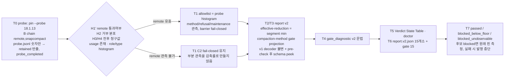

# SPEC-OMP-007 구현 계획

## Implementation Strategy

오라클 변경보다 T0 관측이 먼저다. C2는 모든 provider 시도의 유지비를 관측한 경우에만 성립한다. remote 최종 usage가 있어도 내부 재시도 비용을 확인하지 못하면 승격은 `blocked_unobservable`이다. T0는 숫자와 손실 없는 metadata identifier만 수집하고, canary UID 종료 확인 후 descriptor 기반 exporter가 검증된 레코드만 retained 경로에 발행한다. T1–T6는 기존 RPC·transcript walk를 재사용해 chain/비용·v2 report·누적 metric·historical v1 검증·진단·상태표를 정렬한다. T7은 `passed`, `blocked_below_floor`, `blocked_unobservable` 중 실제 결과를 기록하며, 후보가 막히면 원래 핀에서도 한 번 측정하고 그 결과 역시 보장하지 않는다.

## Visual Planning Brief

## Feature Completion Scope

| Outcome slice | Included | Evidence |
|---|---|---|
| probe 인스트러먼트·retained 반출·1회 실행(H1′–H4 판정) | Yes | AC-005, AC-010 |
| effective chain 유도·방법·거부·유지비 관측·barrier/transcript fail-closed·product 동등성 | Yes | AC-004, AC-005, AC-011 |
| v2 report·누적 gate·`compaction-method` gate projection·floor 하드 상수 | Yes | AC-001, AC-002, AC-003 |
| v1 byte-identical·schema dispatch(pre-check 순서 포함) | Yes | AC-006, AC-007 |
| body-free diagnostic | Yes | AC-008 |
| Verdict State Table·doctor 정렬 | Yes | AC-009 |
| release lane 파일명 `.v2.json`·gate 수 15·runtime 파일명 | Yes | AC-006, AC-012 |
| 측정 cohort의 세 outcome과 핀 복원 후 측정·runbook·CHANGELOG | Yes | AC-012 |
| floor 완화, cohort 형태, attestation envelope, upstream 수정, `Already compacted` no-op 승격 | No | non-goal |

승인된 sibling 의존성 없음. Completion Debt는 research.md 참조(probe 실행, allowlist 확정, 측정 cohort).

## Risk-First Integration Probe

| assumption_id | class | risk | boundary | input | oracle | isolation | status | reason | evidence |
|---------------|-------|------|----------|-------|--------|-----------|--------|---------|----------|
| A1 | implementation_assumption | high | gateway ↔ OMP 18.1.13 `[remote, snapcompact]` manual compaction | T0 isolated-UID probe, source a36b8d47 | full 40-call/18-attempt records; method and complete maintenance-attempt coverage observed separately; no publication | isolated UID, body-free retained file | FAIL | Five primary calls completed; sequence 6 stopped at checkpoint ordering before primary prompt. Remote completion and C2 are unconfirmed. Diagnostic-only revision distinguishes pre/post ordering and measures elapsed time without relaxing ACK checks. | retained probe-00b0f30b2c4114520557e9a5eb579b51.jsonl; research T0 attempt 1 |
| A2 | implementation_assumption | high | remote post-compaction transcript ↔ structural walk and novelty checks | A1 run | exact metadata identifiers retained and semantically reviewed before allowlisting | same isolation | not-run | A1 stopped before a successful remote compaction; no post-compaction evidence to classify. | research T0 attempt 1 |
| A3 | verified_fact | medium | 측정원의 **정적 존재**: `get_session_stats` delta, `compactionSummary.method`, manual `compact` 응답의 `preserveData.openaiRemoteCompaction.usage`가 18.1.13 바이너리에 있고 17.2.7과 같은 청구 단위를 쓰며, snapcompact 분기는 provider 요청 없이 로컬 렌더한다(런타임 존재·빈도는 미확인 — A1/T0가 판정) | 두 바이너리 정적 읽기 | `getSessionStats()`가 두 버전에서 assistant `usage.input/cacheRead/cacheWrite`를 합산하고 18.x는 `model_usage` 항목만 더하며 compaction usage는 더하지 않음; `Hm()`이 `role: compactionSummary, method, tokensBefore, tokensAfter, providerPayload`를 만들고 `get_messages_page`가 `e.messages`를 페이징; RPC `compact`가 `{summary, …, preserveData: oB(v)}`를 반환하고 V2 remote의 `preserveData.openaiRemoteCompaction`에 `usage.inputTokens/outputTokens`가 있음; Responses usage 변환에서 `input+cacheRead+cacheWrite = input_tokens`; 18.1.13 `#F()`는 `{kind: needsLlm}`만 돌려주고 snapcompact 분기는 `uYe()` 로컬 렌더로 요약을 만들며, 실패 시 notice를 emit하고 다음 chain 방법으로 재귀한다(RPC 모드의 notice는 UI host가 `extension_ui_request{method: notify}`로 내보내고 응답 body에는 남지 않는다); 17.2.7은 snapcompact 불가 시 provider LLM 요약(`el6()`)으로 내려간다 | read-only 바이너리 조사, provider 호출 없음 | PASS | 실행한 명령의 출력에서 직접 확인 | `sed -n` omp-v17.2.7 line 1121697-1121760, 1121762, 1121795-1121838, 1123806-1123850, 652010-652050; omp-v18.1.13 line 1311127-1311400(1311185-1311193 chain 소진·remote 미사용, 1311223 `#F`, 1311265-1311300 로컬 렌더·거부, 1311387-1311388 실패 후 재귀), 1312161-1312193, 1313829-1313945, 1441896-1441902(UI host notify), 1308337, 1155422-1155440, 985563-985845, 985980-985990, 982799-982804, 986583-986690, 916993-917006, 984877-984893, 1452055-1452068, 1452200-1452240, 1442247-1442250; research.md "바이너리 정적 증거" 표 |

모든 plan 진술의 분류: REQ-* 본문 = requirement_invariant; T0–T7의 "…한다"는 implementation_assumption; research.md 바이너리 표·A28 trajectory·upstream 노트는 verified_fact(명령과 출처 명시). 각 phase gate의 `required | reusable | not_applicable | blocked`는 `auto spec gates`가 쓰는 `gate-applicability.json`에서만 나온다.

## Tasks

- [ ] **T0: probe 인스트러먼트 + 승인 후 cohort 1회.** `[NEW] internal/cli/workflow_context_runtime_observe_session_probe.go`와 command/run/types, `pipeline_omp_context_active_{rpc_execute,lifecycle}.go`, product overlay에 REQ-PROBE-001 레코드를 추가한다. role/type/usage key는 `^[A-Za-z_][A-Za-z0-9_]{0,63}$`를 대소문자 그대로 보존한다. `usage_identity_delta`는 통과 조건이 아닌 진단값이다. remote 최종 usage·internal attempt coverage를 따로 기록하고, coverage가 없으면 순감축 계산을 하지 않는다. `[NEW] scripts/companion-release/probeexport/`는 trusted dirfd에서 no-follow traversal/open/fstat 후 동일 descriptor로만 읽고 검증·재직렬화한 레코드만 새 runner 소유 0600 파일로 발행한다. `prepare-release-runtime-lib.sh`의 실패 분기는 먼저 `cleanup_live_canary_uid`로 process-free를 확인하고 exporter를 실행한 뒤 receipt·isolation cleanup을 수행한다. raw 파일 `sudo install`·경로 재열기·기존 목적지 덮어쓰기는 금지한다. source/ancestor symlink·hardlink·교체·oversize 및 잔존 프로세스 fixture는 반출 실패로 검증한다. `[NEW] --probe`와 `OMP_CONTEXT_PROBE_DIR`는 무서명 관측 전용이다. full probe만 `probe_completed`, partial probe는 abort reason과 partial count로 기록한다. retained 위치는 `.autopus/runtime/omp-context/probe-<nonce>.jsonl`이며 태그·report·verdict 수치는 생성하지 않는다.
- [ ] **T1: effective chain·방법·거부·유지비 관측·product 동등성.** `workflow_context_runtime_product_overlay.go`(+`_test.go`, `methodOrder: [remote, snapcompact]`; 버전 무관 동일 body), `workflow_context_runtime_managed_rpc_preflight.go`(readback wants `[]any{"remote","snapcompact"}`), `workflow_context_runtime_live_fixture_test.go`, `workflow_context_runtime_managed_rpc_{run,boundary,completion,product}.go`(`action ∈ effective_method_order`; 검증되지 않은 major는 fail-closed), `pipeline_omp_context_active_lifecycle.go`(line 70 `auto_compaction_start` 검사와 `validPipelineOMPActiveNativeEnd`(line 259-264)를 `action ∈ effective_method_order`로 확장하고 존재 시 유도된 method와 일치 요구; barrier 목록(line 136)에 `turn_start` 추가; 거부 class 매핑; `validatePipelineOMPActiveTranscript`가 이미 돌려주는 새 이미지 digest 수(line 140-150)로 `local_render` 판정; `validatePipelineOMPActiveBridgeFrame`(line 266-272)의 `confirm` 외 거부는 그대로 두어 OMP notice가 fail-closed로 남는다), `[NEW] pipeline_omp_context_active_compaction_method.go`(`[NEW] pipelineOMPActiveEffectiveChains` verified-major 표: `17` → `[snapcompact]`, `18` → `[remote, snapcompact]`, 그 외 major → `managed active OMP effective compaction chain is unverified: <version>`; `get_messages_page`의 `compactionSummary.method/tokensBefore/tokensAfter` 판독; 단일 chain 유도; 두 항목 chain에서 method 부재 → unobservable; `compact` 응답 `preserveData.openaiRemoteCompaction.usage` → maintenance; `maintenance_observability` 분류 `{observed_remote, local_render, unobserved}`(chain 첫 방법 + 이미지 ≥1 = `local_render`, 뒤 방법 완료·이미지 0건 = `unobserved`)와 `unobserved` → `managed active OMP compaction maintenance cost is unobservable`), `pipeline_omp_context_active_transcript.go`(walk 중 `role`/`type` 토큰 수집, pre→post novelty 규칙, `[NEW] pipelineOMPActiveCompactionContentTypes` allowlist(probe 후 고정), body-free 오류), `pipeline_omp_context_active_rpc.go`(receipt `Method`, `Refusal`, `MaintenanceInputTokens`, `MaintenanceOutputTokens`, `MaintenanceObservability`, `CompactionImages`), `pipeline_omp_context_active_process.go`(policy identity `compaction-method-chain=remote,snapcompact;compaction-oracle=effective-reduction-v2;omp-pin=omp-v<pin>`), `internal/companionmanifest/omp_pin_agreement_test.go`(pattern), `advance-omp-pin.sh`(label sed site), fixture `pipeline_omp_context_active_rpc_process_fixture_test.go`(17.x/18.x summary shape, remote usage, legacy start/end action, novelty case, `extension_ui_request{method: notify}`, 이미지 0/1건, `--version omp/19.0.0`).
  T1의 `observed_remote`는 최종 응답 usage만으로 성립하지 않는다. 동일 request/attempt 경계에서 단일 시도를 증명하거나 실패·재시도를 포함한 전 시도 usage 합을 관측해야 한다. 현 18.1.13의 final-attempt-only RPC로는 이것이 증명되지 않으므로 `unobserved`가 기본이며, transport/provider 관측원이 없으면 구현은 blocked 결과를 정확히 반환해야 한다. 재시도 없는 상관관계 fixture, 실패 후 성공 재시도 fixture, 완전한 두 시도 usage fixture를 구분한다. chain 위치·이미지 digest는 local_render에 필요한 조건일 뿐 모든 시도의 비용 증명을 대신하지 않는다.
- [ ] **T2: observe-session v2 evidence 생산.** `workflow_context_runtime_observe_session_run.go`(methods/refusals/maintenance·observability 누적, cardinality), `_types.go`(response·usage 필드), `_evidence.go`(v2 report build: `effective_method_order` from `pipelineOMPActiveEffectiveChains[setup.ompVersion major]`, `gate_diagnostic` v2 문법 with `maint_input_tokens`), `_evidence_test.go`, `_evidence_fixture_test.go`, `pipeline_omp_context_observation.go`(runtime shadow 검사 line 115: v2 report는 `min_effective_reduction_basis_points == 2000`).
- [ ] **T3: promptlayer v2 + v1 불변.** `[NEW] pkg/promptlayer/omp_context_promotion_report_v2.go`(`OMPContextPromotionReportV2`, `OMPContextPromotionObservationV2`(+`maintenance_observability`), policy `min_effective_reduction_basis_points`/`compaction_method_order`/`effective_method_order`, `decodeOMPContextPromotionReportV2`, `validateOMPContextPromotionCohortV2`(gate 실패 문자열은 `neg<digits>` 렌더와 `maint_input_tokens` 포함), `expectedOMPContextPromotionGatesV2`(15 rows, `compaction-method` required `chain=…`, pass 조건에 `maintenance_observability ∈ {observed_remote, local_render}` 포함), `computeOMPContextPromotionEvidenceIDV2`, v2 authority digests, verified-major chain 표와 policy 일치 검사), `[NEW] omp_context_canary_reduce_v2.go`(`ReduceOMPContextCanarySegmentsV2`: segment ΣA/ΣB/ΣB_maint, 부호 유지 min bp, median 진단값, method/refusal/observability counts), `[NEW] omp_context_promotion_report_dispatch.go`(size→UTF-8→duplicate-key 순서 유지 후 `schema_version` peek → v1/v2, 기타 거부), `omp_context_promotion_report_build.go`(v2 build), `omp_context_promotion_attestation_verify_v2.go`·`omp_context_promotion_attestation_v2.go`(dispatch 사용, `VerifiedOMPContextPromotion.SchemaVersion()`/`EffectiveReductionBasisPoints()`), `omp_context_promotion_static_policy.go`(`BuildOMPContextPromotionStaticPolicyV3`가 v1/v2 verified report를 받음), `omp_context_promotion_runtime_v3.go`(`matchesOMPContextPromotionStaticPolicyV3` v2 경로), `omp_context_promotion_evidence_id.go`·`omp_context_promotion_report_authority.go`(v1 함수 불변, v2 별도), `omp_context_promotion_artifact_loader_v2.go`(runtime 파일명 `promotion-report-v2.json`), `omp_context_canary_promotion.go`(v2 rows의 runtime gate), `omp_context_evidence_store.go`, `internal/cli/pipeline_omp_context_active_evidence.go`, `pipeline_omp_context_cohort.go`(receipt 필드), `internal/cli/companion_omp_context_static_policy.go`(dispatch 사용), `scripts/companion-release/ompcontextverify/main.go`(dispatch). 테스트: `[NEW] omp_context_promotion_report_v2_test.go`(AC-001/002/003/007 fixture, 두 chain, 음수 fixture, 미검증 major), `[NEW] omp_context_promotion_historical_tags_test.go`(23 tag byte-identical, tag 부재 시 skip).
- [ ] **T4: body-free diagnostic v2.** `workflow_context_runtime_observe_session_evidence.go`(`workflowContextObserveSessionGateDiagnostic` 문법: `maint_input_tokens=`, `chain=`, `no_messages/`, 음수는 `neg<digits>`), `_evidence_test.go`, `scripts/companion-release/tests/release-runtime-hardening-test.sh`(v2 문자열 fixture 두 종(210·220바이트, 음수 포함); regex·400 바이트 불변).
  `maint_input_tokens`는 두 segment의 cohort 전체 합으로 고정한다. 같은 20000씩이면 40000이며, 10000/30000인 비대칭 fixture도 합 40000과 segment min -197을 확인한다.
- [ ] **T5: Verdict State Table·doctor 단일화.** `[NEW] internal/cli/doctor_omp_context_reduction_table.go`(version→{state, oracle, metric, value, compactions, cohort digest}; `in_use`/`refused`/`unmeasured` → reason 매핑(`measured_reduction_verified`/`measured_reduction_below_floor`/`reduction_unmeasured`), prefix 규칙 제거), `doctor_omp_context_reduction.go`(표 사용, detail에 oracle·metric·측정값, `measured_zero_reduction` 제거), `doctor_omp_context_projection.go`(reason allowlist line 122-124에서 `measured_zero_reduction` → `measured_reduction_below_floor`), `doctor_omp_context_reduction_test.go`, `[NEW] doctor_omp_context_reduction_table_test.go`(`advance-omp-pin.sh` case arm과 집합 동일, state→reason 매핑), `docs/runbooks/omp-pin-advance.md`(reason 표 3행 갱신), `scripts/release-tools/advance-omp-pin.sh`(state-keyed rows, v1 이력 줄, `effective_reduction_bp` 문구, oracle version당 `--measure` 1회, `refused@v2`는 `--measure` 거부, 검증된 chain row가 없는 major는 `--measure`/`--probe` 거부), `[NEW] scripts/release-tools/tests/advance-omp-pin-verdict-test.sh`.
  state 우선순위는 현재 oracle의 완전한 실패(`refused`) → 현재 oracle 관측 불가 중단(`unmeasured`) → 실패/중단 없는 핀의 서명 성공(`in_use`)이다. 핀 여부·historical v1 성공은 별도 필드로 보존하고 failed v2 값을 verified 값에 덮어쓰지 않는다.
- [ ] **T6: release lane 파일명 `omp-context-promotion-report.v2.json`·runtime 파일명·gate 수.** `scripts/companion-release/{prepare-release.sh(line 240), prepare-release-local-lib.sh, prepare-release-runtime-lib.sh(line 236 runtime 파일명, line 245 `(.gates | length) == 15`), publish-release-coordinates.sh, verify-current-release.sh, verify-omp-context-evidence-tag.sh, verify-release-prep-lock.sh}`, `tests/{release-hardening-test.sh, release-omp-context-evidence-hardening-test.sh, release-prep-hardening-test.sh}`, `.github/workflows/release.yaml`, `internal/companionmanifest/{release_contract_test.go, release_current_evidence_fixture_test.go, release_current_evidence_test.go, release_goreleaser_test.go, release_homebrew_formula_recovery_test.go, release_omp_context_evidence_test.go}`, `internal/cli/companion_omp_context_promotion_attestation_test.go`, `workflow_context_runtime_observe_session_command.go`(line 21 help text `promotion-report-v2.json`), `workflow_context_runtime_observe_session_evidence_test.go`(line 139). 과거 tag의 `.v1.json`은 historical 경로에서 그대로 읽는다.
- [ ] **T7: 측정 결과·핀 복원·문서.** candidate cohort가 완전하고 floor를 통과한 경우에만 `passed`로 서명·발행하고 chain은 그 runtime의 `effective_method_order`에서 유도한다. 완전하지만 floor 미만이면 `blocked_below_floor`와 `refused@v2` 숫자·cohort digest를 남긴다. 관측 불가/안전 오류로 일찍 종료하면 `blocked_unobservable`과 `unmeasured`, `last_attempt_reason`, partial count만 남기고 숫자를 만들지 않는다. 두 blocked 경로 모두 실제 release pin을 복원하고 해당 핀에서 같은 분기를 한 번 실행한다(17.2.7은 chain=snapcompact). 그것도 blocked면 기존 v1 서명값만 보존하고 v2 발행은 중단한다. 각 결과를 script/Go 표·doctor·runbook·CHANGELOG에 동일하게 반영한다. 역사적 성공이 현재 실패를 덮지 않으며 floor·C2·C4를 바꾸지 않는다.

## Ownership

| Slice | Paths |
|---|---|
| Probe (T0) | `internal/cli/workflow_context_runtime_observe_session_*.go`, `pipeline_omp_context_active_{rpc_execute,lifecycle}.go`, `workflow_context_runtime_product_overlay.go`, `scripts/companion-release/prepare-release-runtime-lib.sh`, `[NEW] scripts/companion-release/probeexport/`, `scripts/release-tools/advance-omp-pin.sh` |
| Chain/Method (T1) | `internal/cli/pipeline_omp_context_active_*.go`, `workflow_context_runtime_managed_rpc_*.go`, `workflow_context_runtime_product_overlay*.go`, `internal/companionmanifest/omp_pin_agreement_test.go` |
| Evidence v2 (T2, T3, T4) | `pkg/promptlayer/omp_context_*`, `internal/cli/workflow_context_runtime_observe_session_evidence*.go`, `pipeline_omp_context_{cohort,active_evidence,observation}.go`, `internal/cli/companion_omp_context_static_policy.go`, `scripts/companion-release/ompcontextverify/` |
| Pin/Doctor (T5) | `internal/cli/doctor_omp_context_reduction*.go`, `internal/cli/doctor_omp_context_projection.go`, `scripts/release-tools/advance-omp-pin.sh`, `scripts/release-tools/tests/`, `docs/runbooks/omp-pin-advance.md` |
| Release lane (T6, T7) | `scripts/companion-release/*`, `.github/workflows/release.yaml`, `internal/companionmanifest/release_*_test.go`, `internal/cli/workflow_context_runtime_observe_session_command.go`, `docs/runbooks/omp-pin-advance.md`, `CHANGELOG.md` |

## Risks

| Risk | Mitigation |
|---|---|
| remote compaction이 gateway를 못 통과 | T0가 먼저 판정; 뒤 방법이 성공해도 모든 시도 비용을 증명하지 못하면 `blocked_unobservable` |
| 17.2.7이 v2 evidence를 못 만듦 | effective chain 유도(T1)로 method `snapcompact` 확정; AC-004 17.x 케이스가 고정 |
| remote 유지비가 V1 fallback으로 관측 불가 | remote인데 usage 부재 → fail-closed; T0가 `maintenance_usage_present` 빈도를 남김 |
| remote 결과 item이 transcript 규칙을 통과 못 함 | novelty 규칙은 probe 모드에서 기록만; T1이 histogram으로 allowlist 고정 |
| v1 함수를 손대어 과거 evidence가 깨짐 | T3 historical tags 테스트가 23 tag를 변경 전후 결과로 비교 |
| 파일명·gate 수 이동 누락 | `release_contract_test.go`·hardening 테스트·`validate_canary`가 이름과 수를 고정; T6은 한 커밋 |
| probe 반출 경쟁 또는 cleanup으로 손실 | process-free 확인 후 no-follow descriptor 기반 검증·재직렬화, 새 retained 파일만 생성(AC-010) |
| probe가 실수로 서명 evidence 생성 | `probe_completed`로 lane fail-closed, report/store 미기록(AC-005) |
| 누적 metric이 완화로 읽힘 | floor 수치·의미 불변, median 진단값 유지, 0 bp·below-floor fixture(AC-002) |
| 검증되지 않은 major로 핀을 옮김 | `pipelineOMPActiveEffectiveChains`에 없는 major는 런타임·verifier·pin script가 모두 거부(T1/T3/T5); 행 추가는 바이너리 읽기 후 |
| remote 내부 재시도 비용이 final usage에서 누락 | final usage만으로 observed_remote 금지; 전 시도 coverage 부재면 blocked, 숫자 없음 |
| 측정 또는 관측 불가 중단을 성공으로 기록 | T7의 세 outcome과 현재 oracle 실패 우선순위로 판단; 원래 핀도 실제 실행해 결과 기록 |
