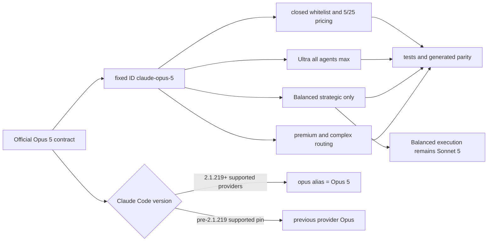

# SPEC-OPUS5-001 Plan: Claude Opus 5 기본 경로 승격

## Implementation Strategy

Opus 4.8 도입과 Fable 5 지원에서 사용한 closed whitelist, pricing table, quality resolver, source-first template generation 패턴을 재사용한다. 새 dependency나 model catalog abstraction은 추가하지 않는다. 테스트를 먼저 추가한 뒤 fixed-ID tables, defaults, source docs, generated surfaces 순으로 닫는다.

## File Impact Analysis

| 경로 | 작업 |
|------|------|
| `pkg/workflow/schema_validate.go`와 tests | Opus 5 허용, Opus 4.8·injection 회귀 |
| `pkg/cost/pricing.go`와 tests | 5/25 가격, Ultra/Balanced fixed-ID mapping |
| `internal/cli/effort_resolve.go`, workflow binding/render tests | Opus 5 Ultra `max`, phase output |
| `pkg/config/defaults.go`, `autopus.yaml`, `configs/autopus.yaml` | premium/default fixed ID |
| `pkg/worker/routing/config.go`와 tests | complex Claude model 승격 |
| `pkg/workflow/doctor.go`와 CLI tests | route_a v2.1.154 보존, route_team Opus 5 v2.1.219 fail-closed gate |
| `content/workflows/route_team.schema.json`와 workflow tests | canonical planning fixed ID |
| `content/skills/adaptive-quality.md`, `content/skills/using-autopus.md` | official model·migration·version guidance |
| `templates/claude/**`, `templates/codex/**`, `templates/gemini/**` | source-generated parity |
| `CHANGELOG.md` | 사용자 가시 변경과 compatibility gate |
| `.autopus/project/structure.md` | workflow doctor 최소 버전 설명 동기화 |
| `.autopus/specs/SPEC-OPUS5-001/**` | lifecycle와 verification receipt |

## Architecture Considerations

- Runtime 선택은 dynamic `opus` alias가 아닌 `claude-opus-5`로 결정성을 확보한다.
- `opus` alias는 provider와 Claude Code 버전에 따라 달라지므로 pricing key나 persisted canonical model로 사용하지 않는다.
- `claude-opus-4-8`은 whitelist·pricing에서 제거하지 않고 runtime safety fallback과 명시 선택을 보존한다.
- Fable 5와 Sonnet 5 정책은 별도 capability/default tier이므로 변경하지 않는다.
- Doctor는 실행 route를 명시적으로 받아 model-free `route_a`의 v2.1.154 호환성을 보존하고, Opus 5 고정 ID를 쓰는 `route_team`만 Claude Code v2.1.219 미만에서 시작하지 않도록 한다.
- Generated templates는 직접 편집 대상이 아니라 source 변경 후 generator 결과로 관리한다.
- ADK는 thinking disabled를 설정하지 않으므로 Opus 5의 disabled-thinking + `xhigh|max` 400 조합을 새로 만들지 않는다.

## Visual Planning Brief

## Feature Completion Scope

이 Primary SPEC 하나가 Opus 5 catalog, premium defaults, routing, workflow, docs, generated parity와 deterministic verification을 닫는다. sibling dependency는 없다. v2.1.219 미만 로컬 live smoke는 명시적 `N/A`이며 Completion Debt가 아니다.

## Tasks

- [x] T1 (REQ-CATALOG-001): Opus 5 fixed ID whitelist RED 테스트를 작성하고 Opus 4.8·injection fail-closed 회귀와 함께 구현한다.
- [x] T2 (REQ-PRICE-001, REQ-EFFORT-001): 5/25 pricing과 Ultra `max` resolver oracle을 추가하고 dynamic alias를 가격 table에서 제외한다.
- [x] T3 (REQ-DEFAULT-001): Ultra 전체와 Balanced strategic quality mapping을 Opus 5로 바꾸고 Balanced execution Sonnet 5·Fable opt-in 불변 테스트를 추가한다.
- [x] T4 (REQ-ROUTE-001, REQ-VERSION-001): default premium tier, complex router, canonical route-team planning output을 fixed ID로 동기화하고 workflow doctor를 route-aware하게 분리(route_a v2.1.154, route_team v2.1.219)한 뒤 값 기반 tests를 보강한다.
- [x] T5 (REQ-DOC-001, REQ-SYNC-001, REQ-MIGRATION-001): official contract, alias/version/provider matrix, migration caveat, fallback을 source docs와 CHANGELOG에 기록한다.
- [x] T6 (REQ-COMPAT-001, REQ-MIGRATION-001): Opus 4.8 selectable/fallback을 보존하고 historical telemetry·pinned argv fixture·completed SPEC가 diff에 포함되지 않는지 확인한다.
- [x] T7 (REQ-SYNC-001, REQ-VERIFY-001): template generator를 실행하고 source/generated semantic parity와 두 번째 generation no-diff를 검증한다.
- [x] T8 (REQ-VERIFY-001): focused tests, race, vet, build, strict SPEC, architecture, diff hygiene, review gate를 실행하고 local v2.1.218 live smoke를 `N/A`로 기록한다.
- [x] T9 (all): sync 단계에서 task, acceptance evidence, status, Completion Debt를 실제 결과와 일치시킨다.

## Task Ordering and Ownership

| Order | Owner | Scope | Depends on |
|-------|-------|-------|------------|
| 1 | Runtime builder | T1-T4 code and focused tests | approved SPEC |
| 2 | Docs builder | T5 source docs | stable runtime values |
| 3 | Lead | T6-T7 integration and generation | T1-T5 |
| 4 | Guardian | T8 discovery then open-finding verification | integrated diff |
| 5 | Lead | T9 sync | Guardian closure |

동일 파일을 수정하는 작업은 순차 실행하고 template generator는 단일 소유자가 수행한다.

## Risks & Mitigations

| Risk | Mitigation |
|------|------------|
| `opus` alias가 provider/version별로 다른 모델을 선택 | persisted/default surface는 fixed ID만 사용하고 matrix를 문서화 |
| Opus 4.8 blanket replacement가 historical evidence를 오염 | explicit current-default allowlist만 변경하고 historical paths diff 제외 |
| Fable 또는 Balanced policy 회귀 | exact model-map oracle로 opt-in/Sonnet 값을 고정 |
| generated surface drift | source-first generation 후 두 번째 no-diff |
| local 2.1.218 live failure | route_team doctor를 fail-closed하고 live call을 시도하지 않은 채 explicit `N/A` 적용; route_a는 기존 호환 유지 |
| thinking-disabled + xhigh/max 400 | disabled-thinking flag를 추가하지 않고 static regression 검사 |

## Dependencies

- 새 외부 dependency 없음.
- 기존 Go toolchain, `DefaultPricingTable`, `QualityModeToModels`, `resolveUltraMode`, `DefaultFullConfig`, `routing.DefaultConfig`, workflow template generator를 재사용한다.

## Rollback

현재 기본 매핑의 Opus 5 fixed-ID entry만 이전 Opus 4.8 값으로 되돌릴 수 있다. Opus 4.8 catalog·pricing과 historical evidence를 보존하므로 data migration rollback은 필요 없다.

## Exit Criteria

- [x] S1-S13의 concrete oracle이 모두 충족됨
- [x] Opus 4.8 selectable/fallback, Fable opt-in, Balanced Sonnet 5가 유지됨
- [x] local Claude 2.1.218 live smoke가 실패가 아닌 `N/A`로 기록됨
- [x] focused tests/race, `go vet`, `go build`, template determinism 통과
- [x] strict SPEC, architecture, diff hygiene, Guardian review 통과
- [x] Completion Debt `none`
