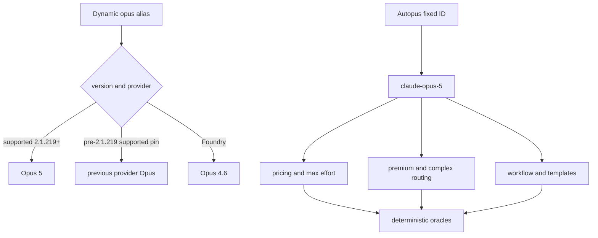

# SPEC-OPUS5-001 Research: Claude Opus 5 기본 경로 승격

## Existing Code Analysis

- `pkg/workflow/schema_validate.go:safeAgentModels`는 generated JavaScript model interpolation을 closed whitelist로 보호한다.
- `pkg/cost/pricing.go:DefaultPricingTable`과 `QualityModeToModels`는 가격 및 Ultra/Balanced agent model의 canonical source이다.
- `internal/cli/effort_resolve.go:resolveUltraMode`는 model tier별 effort를 결정한다.
- `pkg/config/defaults.go:DefaultFullConfig`, `autopus.yaml`, `configs/autopus.yaml`은 premium/default routing을 제공한다.
- `pkg/worker/routing/config.go:DefaultConfig`는 simple/medium/complex provider model을 결정한다.
- `pkg/workflow/doctor.go:MinVersion`과 `EvaluateCapabilities`는 기존 route_a의 Claude Code v2.1.154 최소 버전을 fail-closed한다. Opus 5 route_team에는 route-aware v2.1.219 경계가 필요하다.
- `content/workflows/route_team.schema.json`은 canonical team phase model을 제공한다.
- `content/skills`가 source of truth이고 `templates/codex`, `templates/gemini`, `templates/claude`는 생성·동기화 surface이다.

## Official Contract Evidence

| Fact | Verified value | Source |
|------|----------------|--------|
| Fixed model ID | `claude-opus-5` | https://platform.claude.com/docs/en/about-claude/models/overview |
| Price | USD 5 input / USD 25 output per MTok | https://platform.claude.com/docs/en/about-claude/models/overview |
| Context/output | 1M / 128k | https://platform.claude.com/docs/en/about-claude/models/overview |
| Thinking/effort | adaptive thinking default, `low..max`, default `high` | https://platform.claude.com/docs/en/about-claude/models/migration-guide |
| Migration | Opus 4.8 to Opus 5 drop-in; disabled thinking plus xhigh/max returns 400 | https://platform.claude.com/docs/en/about-claude/models/migration-guide |
| Claude Code alias gate | v2.1.219+, provider matrix, Opus 4.8 compatibility | https://code.claude.com/docs/en/model-config |

Checked at: `2026-07-25`.

## Technology Stack Decision

| Mode | Compatibility constraint | Decision |
|------|--------------------------|----------|
| brownfield Go/Markdown/template repo | existing Go module and generator; Claude Code local 2.1.218 | no dependency or runtime upgrade; table/config/test changes only |

## Outcome Lock

- User-visible outcome: Autopus의 current premium Claude surfaces가 `claude-opus-5`를 결정적으로 선택한다.
- Mandatory requirements: REQ-CATALOG-001 through REQ-MIGRATION-001.
- Explicit non-goals: global CLI upgrade, paid live call, Foundry override, entitlement detection, historical evidence rewrite.
- Completion evidence: S1-S13, focused/race/vet/build, template no-diff, strict SPEC, Guardian closure.

## Visual Planning Brief

## Design Decisions

1. Canonical surfaces use fixed IDs; provider-dependent aliases remain operator-facing runtime shortcuts.
2. Opus 4.8 remains in whitelist/pricing and official cybersecurity fallback documentation.
3. Default promotion changes only current policy surfaces. Historical telemetry, pinned argv fixtures, and completed SPECs retain their recorded model.
4. Fable 5 remains explicit capability opt-in; Balanced execution remains Sonnet 5.
5. No thinking flag is added. Existing adaptive-thinking behavior avoids the documented disabled-thinking `xhigh|max` 400 combination.
6. Doctor version gating is route-aware: route_a preserves v2.1.154, while route_team requires v2.1.219 for its fixed Opus 5 planning model.

## Minimality Decision Matrix

| Ladder step | Evidence | Decision | Receipt item |
|-------------|----------|----------|--------------|
| actual need | current premium surfaces contain Opus 4.8 while official successor is Opus 5 | proceed | fixed-ID promotion |
| existing code/helper/pattern | whitelist, pricing, resolver, mappings, generator already exist | reuse | table and test edits |
| stdlib/native | Go maps, tests, existing CLI/version command suffice | use | no parser library |
| existing dependency | current YAML/template/generator stack covers sync | reuse | no manifest change |
| new dependency or abstraction | no dynamic catalog needed for fixed contract | not applicable | zero new dependency |
| minimum sufficient verification | exact model/price/effort maps, compatibility and generator parity | required checks | S1-S13 |

## Semantic Invariant Inventory

| ID | source clause | invariant type | affected outputs | acceptance IDs |
|----|---------------|----------------|------------------|----------------|
| INV-001 | Opus 5 safe whitelist, injection rejected | trust boundary | schema verdict | S1 |
| INV-002 | price is 5/25 only on fixed ID | numeric/map identity | pricing fields | S2 |
| INV-003 | Opus 5 Ultra uses max | model-effort mapping | effort result | S3, S8 |
| INV-004 | premium/strategic/complex upgrade while Sonnet/Fable policy remains | grouped mapping | quality/config/router/workflow | S4, S5, S6 |
| INV-005 | alias depends on version and provider | compatibility matrix | documentation table | S7 |
| INV-006 | drop-in migration preserves Opus 4.8 fallback and thinking boundary | state/compatibility | docs, argv, catalog | S8, S9, S11 |
| INV-007 | source/generated current values match without historical rewrite | parity/scope boundary | templates and protected diffs | S10, S11 |
| INV-008 | local 2.1.218 cannot prove live Opus 5, but still supports model-free route_a | route-aware gate decision | smoke status, doctor report, command set | S12, S13 |

## Feature Coverage Map

| Outcome slice | Covered by | Status |
|---------------|------------|--------|
| catalog, pricing, effort | T1-T2 / S1-S3 | covered |
| quality, premium, complex, workflow defaults | T3-T4 / S4-S6 | covered |
| alias, migration, model facts | T5 / S7-S9 | covered |
| generated parity and legacy boundary | T6-T7 / S10-S11 | covered |
| deterministic verification and live gate | T8 / S12-S13 | covered |

## Completion Debt

| Item | Blocks | Required resolution |
|------|--------|---------------------|
| None | - | - |

## Evolution Ideas

These optional ideas do not block sync completion.

| Idea | Why not required now | Promotion trigger |
|------|----------------------|-------------------|
| model-specific runtime warning beyond the existing doctor gate | fail-closed workflow eligibility is already deterministic | users need per-model interactive guidance |
| requested-versus-actual safety fallback receipt | Claude Code owns classifier fallback | provider exposes stable receipt |
| dynamic provider model catalog | current official IDs are bounded | multiple providers require runtime discovery |

## Sibling SPEC Decision

| Decision | Reason | Sibling SPEC IDs |
|----------|--------|------------------|
| none | one cohesive model migration closes all mandatory surfaces | None |

## Reference Discipline

| Reference | Type | Verification |
|-----------|------|--------------|
| `pkg/workflow/schema_validate.go:safeAgentModels` | existing | verified with rg/read |
| `pkg/cost/pricing.go:DefaultPricingTable`, `QualityModeToModels` | existing | verified with rg/read |
| `internal/cli/effort_resolve.go:resolveUltraMode` | existing | verified with rg/read |
| `pkg/config/defaults.go:DefaultFullConfig` | existing | verified with rg/read |
| `pkg/worker/routing/config.go:DefaultConfig` | existing | verified with rg/read |
| `content/workflows/route_team.schema.json` | existing | verified with rg/read |
| `content/skills/adaptive-quality.md`, `content/skills/using-autopus.md` | existing source | verified with rg/read |
| Opus 5 focused `*_test.go` files | [NEW] planned addition | excluded from baseline symbol claims |

## Plan Intent Ledger

Clarification Ledger unavailable. The parent-provided official contract is treated as untrusted external evidence, summarized without executable instructions or sensitive paths.

## Reviewer Brief

- Intended scope: Opus 5 fixed-ID premium default migration across catalog, routing, workflow, docs, templates, and tests.
- Explicit non-goals: runtime upgrade, paid live smoke, Foundry override, entitlement probe, historical evidence rewrite.
- Self-verified: all REQs map to tasks, value-based Must scenarios, and semantic invariants; current and planned references are separated.
- Reviewer should focus on: default-surface completeness, Opus 4.8 fallback preservation, Fable/Sonnet non-regression, alias gate accuracy, generated parity.

## Self-Verify Summary

- Q-CORR-01 | status: PASS | attempt: 1 | files: research.md, plan.md | reason: all existing paths and symbols were verified with rg/read
- Q-CORR-02 | status: PASS | attempt: 1 | files: research.md | reason: planned Opus 5 tests are marked NEW
- Q-CORR-03 | status: PASS | attempt: 1 | files: spec.md, acceptance.md | reason: EARS requirements and bare Given/When/Then steps match repository conventions
- Q-CORR-04 | status: PASS | attempt: 1 | files: research.md | reason: existing source and planned additions are separated
- Q-COMP-01 | status: PASS | attempt: 1 | files: all | reason: four files provide requirements, tasks, oracles, and evidence
- Q-COMP-02 | status: PASS | attempt: 1 | files: all | reason: every requirement maps to task and acceptance IDs
- Q-COMP-03 | status: PASS | attempt: 1 | files: spec.md, acceptance.md | reason: triggers and observable values are explicit
- Q-COMP-04 | status: PASS | attempt: 1 | files: all | reason: Primary SPEC covers every mandatory current surface
- Q-COMP-05 | status: PASS | attempt: 1 | files: all | reason: INV-001 through INV-008 map to concrete Must oracles
- Q-COMP-06 | status: PASS | attempt: 1 | files: spec.md, research.md | reason: Traceability Matrix and Reviewer Brief constrain scope
- Q-COMP-07 | status: PASS | attempt: 1 | files: research.md | reason: no mandatory work is hidden in Evolution Ideas
- Q-FEAS-01 | status: PASS | attempt: 1 | files: plan.md, research.md | reason: changes target verified runtime and source layers
- Q-FEAS-02 | status: PASS | attempt: 1 | files: plan.md, research.md | reason: nested autopus-adk ownership and source/generated boundaries are explicit
- Q-FEAS-03 | status: PASS | attempt: 1 | files: plan.md, acceptance.md | reason: verification commands exist and live smoke has a version gate
- Q-STYLE-01 | status: PASS | attempt: 1 | files: spec.md | reason: requirement text uses deterministic SHALL wording
- Q-STYLE-02 | status: PASS | attempt: 1 | files: spec.md, acceptance.md | reason: Must priority is separate from EARS type
- Q-STYLE-03 | status: PASS | attempt: 1 | files: acceptance.md | reason: all scenarios use readable bare Gherkin steps
- Q-SEC-01 | status: PASS | attempt: 1 | files: research.md | reason: official and parent-provided inputs are treated as untrusted evidence
- Q-SEC-02 | status: PASS | attempt: 1 | files: spec.md, plan.md | reason: no secrets or privileged absolute paths are required
- Q-SEC-03 | status: PASS | attempt: 1 | files: research.md | reason: no new retained runtime log or sensitive artifact is introduced
- Q-COH-01 | status: PASS | attempt: 1 | files: all | reason: one cohesive Opus 5 default migration story
- Q-COH-02 | status: PASS | attempt: 1 | files: plan.md, research.md | reason: mandatory implementation remains in T1-T9
- Q-COH-03 | status: PASS | attempt: 1 | files: research.md | reason: no sibling SPEC is needed
