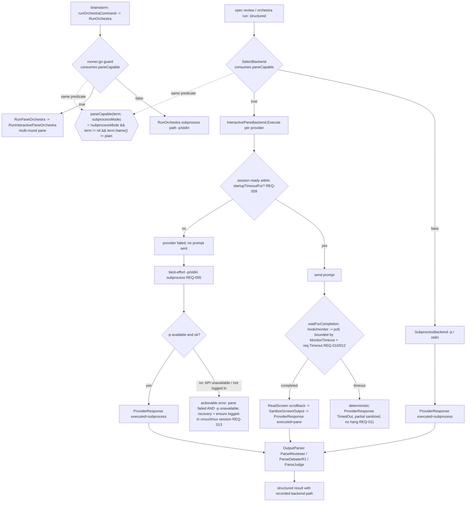

# SPEC-ORCH-021 구현 계획

## 태스크 목록

- [ ] T1: brainstorm `--subprocess` 기본값을 `true`에서 `false`로 역전한다 (`internal/cli/orchestra_brainstorm.go:60`). 플래그 도움말 문구를 "default: pane on capable terminals; --subprocess=true forces headless `-p`"로 갱신. `runOrchestraCommand`는 이미 `term := terminal.DetectTerminal()`로 `interactive`를 판정하므로(`orchestra.go:162-164`), 기본값만 역전하면 `runner.go:25`의 `!cfg.SubprocessMode && cfg.Terminal != nil && Name != "plain"` 가드가 진짜 pane 경로(`RunPaneOrchestra`→`RunInteractivePaneOrchestra`)로 분기한다.
- [ ] T2: `SelectBackend`를 공유 술어 기반으로 수정한다(F-001/F-002). `pkg/orchestra/backend.go:49-54 SelectBackend(cfg)`의 현재 조건은 `if cfg.SubprocessMode || cfg.Terminal == nil { subprocess } else { pane }`로, non-nil `"plain"` 터미널을 검사하지 않아 plain에서 가짜 pane(`NewPaneBackend`→child-process `runProvider`)을 반환한다(F-001 — REQ-002/REQ-003의 "plain→subprocess"와 acceptance R3/S3에 반함). 수정: `SelectBackend`가 `[NEW] paneCapable(cfg.Terminal, cfg.SubprocessMode)` 술어(T2b)를 호출하여 (a) 술어 true면 `[NEW] NewInteractivePaneBackend()`, (b) 술어 false(`SubprocessMode` || `Terminal == nil` || `Terminal.Name() == "plain"`)면 `NewSubprocessBackendImpl()`를 반환하게 한다. structured 두 진입점(spec review, orchestra run)이 이 `SelectBackend`를 거친다.
- [ ] T2b: 공유 pane-capability 술어를 추가한다(F-002/F-006 구조적 단일화). `[NEW] func paneCapable(term terminal.Terminal, subprocessMode bool) bool`를 `pkg/orchestra`에 추가한다(반환식: `!subprocessMode && term != nil && term.Name() != "plain"`, F-001의 plain 처리 포함). 그리고 legacy 가드 `runner.go:25`의 인라인 조건 `!cfg.SubprocessMode && cfg.Terminal != nil && cfg.Terminal.Name() != "plain"`를 `paneCapable(cfg.Terminal, cfg.SubprocessMode)` 호출로 치환한다. 이로써 brainstorm(RunOrchestra 경로)과 structured(SelectBackend 경로)가 **동일 술어**를 소비한다 — 실행 backend 객체는 다르지만(brainstorm=`RunPaneOrchestra` 멀티라운드, structured=per-provider pane `ExecutionBackend`) pane/subprocess 모드 선택 입력은 구조적으로 단일이 된다(REQ-007). 술어를 별도 파일 `[NEW] pkg/orchestra/pane_capable.go`로 둘지 `backend.go` 내부에 둘지는 300줄 한계를 보며 결정.
- [ ] T3: spec review structured 경로에 terminal을 주입한다. `internal/cli/spec_review.go`/`spec_review_loop.go:53`의 `OrchestraConfig`에 `Terminal: terminal.DetectTerminal()`를 채우고, `spec_review_structured.go:36`의 `backend := specReviewBackendFactory()`를 `backend := orchestra.SelectBackend(cfg)` 경유로 교체한다(`spec_review_runtime.go:14`의 hardcode 제거 또는 선택 함수로 대체). `runStructuredSpecReviewOrchestra`는 per-provider로 `backend.Execute(ctx, req)`를 호출하므로(`spec_review_structured.go:57`), `ExecutionBackend` 계약을 그대로 만족하는 pane backend가 drop-in으로 동작한다.
- [ ] T4: orchestra run structured 경로를 수정한다. `internal/cli/orchestra_run.go:130-135`에서 `cfg.Terminal = terminal.DetectTerminal()`를 채우고, 폐기된 `_ = orchestra.SelectBackend(cfg)`를 실제로 사용하여 `SubprocessPipelineConfig.Backend`에 주입한다(`orchestra_run.go:138`의 `orchestraRunBackendFactory()` hardcode 대체, `orchestra_run_runtime.go:8`). `SubprocessPipelineConfig.Backend`는 이미 `ExecutionBackend`(`pipeline.go:18`)이므로 시그니처 변경 불필요.
- [ ] T5: `[NEW] pkg/orchestra/pane_backend.go`에 인터랙티브 pane `ExecutionBackend`를 구현한다. `Execute(ctx, req ProviderRequest)`가 단일 provider pane을 split/surface 생성→세션 launch→**세션 ready 감지 후** prompt 전송→완료 감지→`ReadScreen(Scrollback)`→`SanitizeScreenOutput`/`CleanScreenForCrossPollination`→`ProviderResponse{Output, ...}` 반환. 신뢰성 세부(세션 ready 게이팅 T8a, 완료 감지 계층/timeout T8b, fallback/에러 T9)는 아래 전용 태스크로 분리하되 모두 이 `Execute` 내부에 배선된다. 기존 `interactive_collect.go`/`interactive.go`/`surface_manager.go`의 헬퍼(`waitForCompletion`, `cleanScreenOutput`, `splitProviderPanes`, `waitForSessionReady`/`pollUntilSessionReady` 패턴)를 **재사용**하되(새 메커니즘 작성 금지), merged `*OrchestraResult`가 아니라 per-provider `*ProviderResponse`를 반환한다. 300줄 초과가 예상되면 수집부를 `[NEW] pkg/orchestra/pane_backend_collect.go`로 분할.
- [ ] T6: 실행 경로 기록 + 술어 합의 검증을 마무리한다. pane/subprocess 중 실제 실행된 backend 식별자를 `ProviderResponse`(또는 기존 `FailedProvider.CollectionMode`/Receipt) 경유로 노출하여 oracle이 단언할 수 있게 한다(REQ-005). 단일 규칙 검증은 "동일 backend 이름 사후 비교"가 아니라 **공유 술어 합의**로 한다: oracle 테스트가 동일 (terminal, SubprocessMode) 입력에 대해 `paneCapable(...)` 결과와, 그 결과를 소비하는 legacy 가드(`runner.go`)·`SelectBackend`가 같은 모드(pane/subprocess)로 합의함을 단언한다(S9). 이는 사후 동치가 아니라 입력 술어의 구조적 단일성을 검증한다.
- [ ] T7: skill prose 정렬 노트를 적용한다. source of truth는 `content/skills/idea.md`(설치본 `.claude/`, `.codex/`, `.gemini/`, `.opencode/`는 generated). `content/skills/idea.md:188`의 `auto orchestra brainstorm ... --no-detach`는 binary 기본값이 pane으로 바뀌면 추가 플래그 없이도 pane 경로를 타므로 invocation 라인은 그대로 둔다. 단, "기본 backend" 설명이 prose 어딘가에 subprocess로 남아 있으면 pane-first로 갱신한다(바이너리 기본값 수정이 우선, skill 패치는 부차적).
- [ ] T8a: 세션 ready 게이팅(REQ-009). `Execute`가 launch 후 `pollUntilSessionReady(ctx, term, paneID, SessionReadyPatterns(), startupTimeoutFor(provider))`(`interactive.go:191`, `interactive_session_ready.go:21/33/49`)로 ready를 확인한 **뒤에만** prompt를 전송하도록 배선한다. ready가 `startupTimeoutFor`(claude 15s, gemini 10s, default 30s) 내에 안 잡히면 prompt 미전송 + 해당 provider를 failed로 기록. 단일 provider 단위라 `waitForSessionReady`(`interactive.go:147`)의 per-pane 로직을 그대로 차용한다.
- [ ] T8b: 완료 감지 계층 + bounded timeout + degrade(REQ-010/REQ-011/REQ-012). `Execute`가 `waitForCompletion(ctx, cfg, pi, patterns, baseline, hookSession, round)`(`cc21_monitor.go:70`)를 호출한다 — 이는 (1) `MonitorEnabled` 시 event-driven detector, `MonitorTimeout` 초과 시 `:85` `ScreenPollDetector`로 fallback(REQ-010), (2) hook 미설치 시 `resolveCompletionDetector`(`cc21_monitor.go:16`)가 `cfg.HookMode==false`이면 `FileIPCDetector`를 쓰지 않고 monitor/`ScreenPollDetector`로 degrade(REQ-012)를 이미 제공한다. `Execute`는 전체 per-provider timeout(`req.Timeout`)으로 `ctx`를 bound하고, `waitForCompletion`이 false 반환 시 결정적으로 `ProviderResponse{TimedOut:true, Output: 부분 sanitized}`를 반환하여 무한 hang을 금지한다(REQ-011). 새 감지기 작성 금지 — 기존 경로 재사용.
- [ ] T9: best-effort fallback + actionable 에러(REQ-005/REQ-013). `[NEW] pkg/orchestra/pane_fallback.go`(또는 backend 파일 내 함수)에 pane 실패 시 `runProvider`(`provider_runner.go:23`, stdin/`-p`) best-effort 시도를 배선하고, 실제 실행 backend 식별자를 `ProviderResponse`(또는 `FailedProvider.CollectionMode`/Receipt)로 기록한다. pane AND `-p` 둘 다 실패/미가용이면(예: `detect.IsInstalled` 통과해도 API 미인증으로 `-p` 실패) actionable 에러 메시지를 구성한다 — 양 실패 원인 + 복구 지시("ensure a logged-in cmux/tmux CLI session")를 담고 raw API 에러로 끝나지 않게 한다. 구독-only 현실을 메시지에 명시.
- [ ] T11: gemini(agy) 호출 정합성 정정(REQ-014/REQ-015). **근본 원인(라이브 재현)**: `printf 'x' | agy --print` → `flag needs an argument: -print`(exit 2) — `agy`의 `--print`/`-p`는 프롬프트를 **값**으로 받는 string 플래그인데 현재 `orchestra_helpers.go:147` `Args:["--print"], PromptViaArgs:false`는 stdin으로 보내고 argv는 `agy --print`(무값)만 만든다. 정정: (a) subprocess — 프롬프트를 `--print` 값으로 가도록 `Args:["--print",""], PromptViaArgs:true`(placeholder; `subprocess_runner.go:112-128 buildSubprocessArgs/injectPromptArg`가 빈 슬롯을 프롬프트로 치환) 또는 동등 형태. **주의**: legacy `provider_runner.go:27-28`은 `PromptViaArgs:true`면 `-p <prompt>`를 append하므로 `Args`에 `--print`를 남기면 `agy --print -p <prompt>`(─ `--print`가 `-p`를 값으로 먹음)가 된다 → structured/pane 경로가 primary이고 legacy append 경로와의 divergence를 테스트로 고정한다. (b) pane — `PaneArgs`에서 `--print` 제거(대화형 `agy` 또는 `-i`/`--prompt-interactive`). `autopus.yaml`/`configs/autopus.yaml` gemini 블록과 fallback registry 모두 정정.
- [ ] T12: codex 호출 정합성 검증·정정(REQ-014/REQ-015). **라이브 검증 결과**: `codex exec`의 유효 플래그 = `--output-schema <FILE>`, `-o/--output-last-message <FILE>`, `-m/--model`, `-s/--sandbox <read-only|workspace-write|danger-full-access>`. `--full-auto`는 **deprecated이나 수용**(`codex exec --full-auto` → `warning: --full-auto is deprecated; use --sandbox workspace-write`, 실행은 됨). 따라서 `autopus.yaml:77` codex `args: [exec, --full-auto, ...]`를 `[exec, --sandbox, workspace-write, -m, gpt-5.5, -c, model_reasoning_effort="xhigh"]`로 표준화(경고 제거). fallback `orchestra_helpers.go:146`은 이미 `exec --sandbox workspace-write`라 올바름 — `-c model_reasoning_effort` 일관성만 맞춘다. pane `PaneArgs`는 `exec` 없이 대화형 TUI 유지(검증: `-m ...` 만, `exec` 미포함). codex last-message 캡처(`subprocess_codex.go:10 attachCodexLastMessageCapture` + `codex_last_message.go:9 applyCodexLastMessageOutput`)는 그대로 둔다.
- [ ] T13: provider 참여 정합성(REQ-016). `autopus.yaml:34 review_gate.providers: [claude, gemini]`에 codex를 추가하여 `[claude, codex, gemini]`로 만든다(orchestra 커맨드 집합과 일치). `resolveSpecReviewProviderNames`(`spec_review.go`)가 이를 읽으므로 codex가 구조화 리뷰에 참여하고, codex의 `SchemaFlag:"--output-schema"`로 structured JSON 응답을 낸다. `configs/autopus.yaml`도 동기화. (의도적 subset이 아니므로 추가; 만약 비용 등으로 subset을 유지한다면 그 사유를 research에 문서화 — 본 SPEC은 추가를 채택.)
- [ ] T_argv_test: provider argv 정합성 oracle 단위 테스트(`[NEW] pkg/orchestra/provider_argv_test.go` 또는 `internal/cli/orchestra_helpers_test.go` 확장). 검증: gemini subprocess argv가 프롬프트를 `--print`/`-p` 값으로 포함 + 무값 `--print` 미생성(S15), gemini pane argv `--print` 미포함(S17), codex subprocess argv `exec` 시작 + `--output-schema` 포함(S16/S18), codex pane argv `exec` 미시작(S19), review provider 집합에 codex 포함(S20). `buildSubprocessArgs`/`buildProviderConfigs`/`resolveSpecReviewProviderNames`를 직접 호출해 argv/집합을 assert(환경 비의존).
- [ ] T10: 회귀 검증 + 운영 스모크. `go build ./...`, `go test ./pkg/orchestra/... ./internal/cli/...` 실행. truth table oracle(S1~S9) + 신뢰성(S10~S14) + provider 정합성(S15~S20) 신규 테스트가 모두 통과하고, plan/review/secure 기존 pane 동작이 깨지지 않는지(legacy `RunOrchestra` 경로 미변경) 확인. 신뢰성 테스트는 기존 mock terminal(`pane_mock_test.go`/`interactive_*_test.go`의 ReadScreen 제어 패턴)을 재사용한다. argv 단위 테스트가 1차 oracle, `auto doctor`의 `runProviderTransportSmoke`(`doctor_provider_smoke.go:83`, `providerSmokePrompt:112`, `classifyProviderSmokeResult:116`)가 실 provider 응답 통합 검증(환경 의존, gemini/codex가 실제로 마커를 반환하는지 운영 확인)이다.

## 구현 전략

- **접근법(REQ-004 핵심 결정)**: structured pane 실행을 위해 **새 pane `ExecutionBackend` 구현**을 추가한다(대안인 "structured 수집을 `RunPaneOrchestra`+`OutputParser`로 라우팅"은 채택하지 않음).
  - 근거: structured 경로(`runStructuredSpecReviewOrchestra`, `RunSubprocessPipeline`)는 per-provider `ExecutionBackend.Execute(ctx, req)` 계약 위에서 자체 병렬/판정/스키마 로직을 돌린다. `RunPaneOrchestra`는 merged `*OrchestraResult`를 반환하고 자체 strategy/merge를 수행하므로 per-provider `Execute` 계약과 임피던스 불일치가 크다. 새 backend는 기존 인터페이스(`backend.go:10`)에 정확히 맞고 `SubprocessPipelineConfig.Backend`(`pipeline.go:18`)에 drop-in되며, 두 structured 진입점이 코드 변경 없이 동일하게 혜택을 본다.
  - feasibility 확인: `OutputParser.unmarshal`은 `extractJSON`으로 주변 prose를 허용하므로(`output_parser.go:96-100`), sanitize된 screen scrollback에 JSON이 포함되면 `ParseReviewer`/`ParseDebaterR1`/`ParseJudge`가 파싱 가능하다. oracle은 validating parser 진입점이 있는 role(reviewer/debater_r1/judge)만 단언하며, `debater_r2`는 동일 sanitize+extractJSON 경로를 공유하되 role 고유 검증이 없어 별도 oracle을 만들지 않는다(F-002 부속).
- **기존 코드 활용**: pane launch/완료감지/수집은 `interactive.go`(`launchInteractiveSessions`, `waitForSessionReady`, `sendPrompts`), `interactive_collect.go`(`waitAndCollectResults`, `cleanScreenOutput`), `cc21_monitor.go`(`waitForCompletion`의 monitor-우선/poll-fallback), `screen_sanitizer.go`를 재사용한다. 새로 작성하는 것은 "단일 provider 단위로 이들을 묶어 `*ProviderResponse`를 돌려주는 backend 래퍼"뿐이다.
- **변경 범위**: legacy `RunOrchestra`/`RunPaneOrchestra` 경로(plan/review/secure)는 건드리지 않는다. `SelectBackend`의 pane 분기만 진짜 pane backend로 바꾸고, 세 structured 진입점에 terminal 주입 + 선택 규칙 배선을 추가한다.
- **fallback 설계**: `Execute` 내부 fallback(pane launch 실패→subprocess)을 1차로 두어 단일 provider 실패가 전체를 막지 않게 한다. 터미널 자체가 plain/nil이면 `SelectBackend`가 애초에 subprocess backend를 고른다(상위 fallback). 두 계층 모두 실행 경로를 기록한다(REQ-005).
- **파일 크기**: `orchestra_run.go`(257), `spec_review_structured.go`(248)는 300 한계에 근접 → terminal 주입/선택 배선은 `[NEW] internal/cli/orchestra_terminal.go`로 분리. pane backend는 자체 파일, 초과 시 collect 분할.

## Visual Planning Brief

구독 세션(로그인된 인터랙티브 CLI)은 pane이 유일 경로이고, `-p`는 API 보유자에 한정된 best-effort fallback이다. 공유 술어가 두 실행 모델(brainstorm=RunOrchestra, structured=ExecutionBackend)의 선택 입력을 단일화한다. pane 경로 내부는 세션 ready 게이트 → bounded 완료 감지 → 실패 시 best-effort `-p` → 둘 다 실패 시 actionable 에러로 흐른다:

술어 합의: `G`(legacy 가드)와 `SB`(SelectBackend)가 동일 (terminal, subprocessMode) 입력에서 동일 `paneCapable` 결과에 합의한다(S9). 두 경로의 false 분기는 모두 subprocess(`-p`/stdin)로 수렴한다. 구독-only 유저(`-p` 미가용)는 `BEOK -> no -> ERR`로 가서 raw API 에러가 아니라 복구 가능한 메시지를 받는다.

## Feature Completion Scope

- Primary SPEC SPEC-ORCH-021이 Outcome Lock을 단독으로 닫는다: 세 structured 진입점의 기본값을 pane-first로 역전 + 진짜 pane `ExecutionBackend` + **pane 신뢰성 경화(세션 ready 게이팅·bounded 완료 감지·timeout 시 결정적 실패·hook 미설치 degrade)** + best-effort `-p` fallback + 둘 다 실패 시 actionable 에러 + 실행 경로 기록 + **provider 호출 정합성(gemini argv 정정·codex `--full-auto`→`--sandbox` 표준화·codex review 참여)**. 신뢰성과 호출 정합성 모두 기존 메커니즘/설정 정정으로 닫고 재발명 없음.
- 승인된 sibling 의존성: 없음.
- 남은 Completion Debt: 없음(완전 기능). provider-API 백엔드는 Outcome Lock 밖의 전략적 개선으로 `research.md`의 `## Evolution Ideas`에만 둔다 — sync completion을 막지 않는다.
