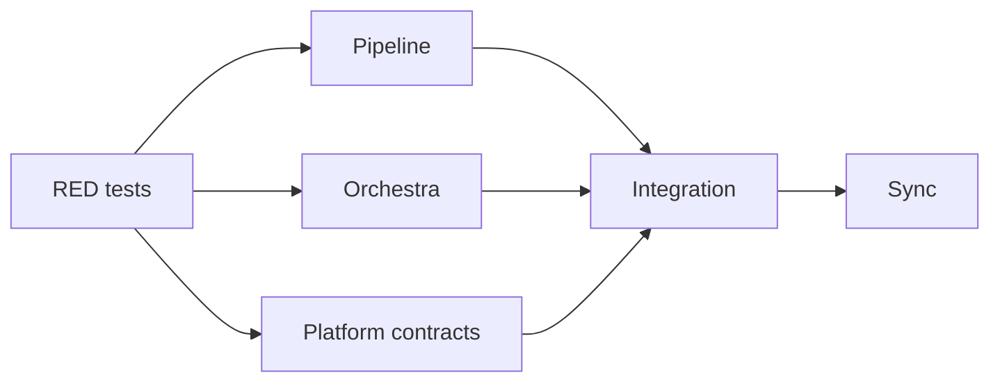
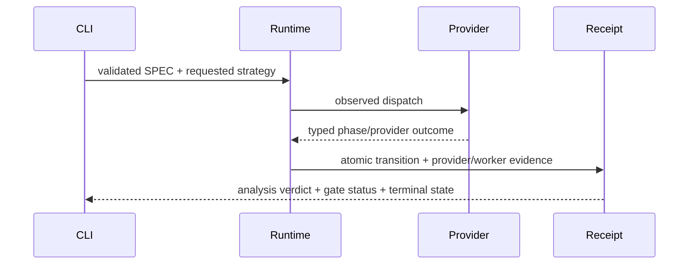

# SPEC-ORCH-024 구현 계획

## Tasks

- [x] T1 — RED contract scaffold
  - Add focused tests for pipeline authenticity/verdict/checkpoint, orchestra strategy/fallback/judge/provider
    sets/consensus, and Codex/Claude semantic parity.
  - Tests are read-only specifications for executor lanes.

- [x] T2 — Pipeline runtime contract
  - Ownership: `pkg/pipeline/**`, `internal/cli/pipeline*.go`, pipeline-related `pkg/worker/**` only.
  - Remove implicit no-op success; add explicit dry-run behavior and real CLI backend seam.
  - Resolve SPEC before dispatch, consume phase gates/retries, stop on failure, save canonical checkpoint.
  - Add versioned pipeline receipt/event fields and make dashboard read the per-SPEC checkpoint.
  - Parse exact typed verdicts and fail closed on unknown/conflicting output.

- [x] T3 — Orchestra runtime contract
  - Ownership: `pkg/orchestra/**`, `internal/cli/orchestra*.go`, `internal/cli/spec_review*.go`,
    `internal/cli/review_risk_tier*.go`.
  - Validate capability and execute requested strategy rather than relabeling debate.
  - Consume fallback policy, expose judge outcome, finalize a single terminal/degraded state.
  - Preserve all provider sets and use policy quorum denominator.
  - Add structured finding identity/metrics and dissent-preserving Critical veto.
  - Enforce structured output at phase boundaries.

- [x] T4 — Canonical platform semantic contracts
  - Ownership: `content/skills/**`, relevant `templates/{shared,codex,claude,gemini}/**`,
    `pkg/content/**`, `pkg/adapter/{claude,codex,gemini,opencode}/**`.
  - Define `orchestration-contract.v1` semantic manifest/blocks for review, idea, team, convergence.
  - Make Codex and Claude surfaces bind the same contract to their native tools.
  - Route code review through risk-tiered `auto orchestra review`, forward strategy/providers.
  - Make SPEC review routes consume CLI receipt without recomputing promotion.
  - Remove manual idea pane/judge reimplementation in favor of orchestra engine contract.
  - Prevent unsupported platforms from receiving foreign team primitives.

- [x] T5 — Integration and convergence
  - Run focused package tests, race tests where concurrency changed, build, vet, strict SPEC validation,
    generated template/adapter parity, source-file line limit, and diff hygiene.
  - Discovery review by reviewer/security auditor; freeze findings; focused fixes; diff-only verify.

- [x] T5.1 — Frozen review finding closure
  - Pipeline: bind verified frozen prompt context, strict resume identity/dependency closure, persistence-error terminal parity, complete common receipts, and corrupt-dashboard failure.
  - Orchestra: bind selected-backend fallback policy, retain attempt-complete dispatch evidence and partial results, count recovered providers, retain per-provider Critical evidence, and validate typed/different-family judges.
  - Platform: make typed receipts consumable, emit authoritative promotion receipts, remove prompt-side promotion, forward providers, repair Claude worker handles/contracts, and remove unsupported Gemini/OpenCode team primitives.
  - Add S19~S28 behavioral oracles before closing each frozen finding.

- [x] T6 — Sync
  - Mark tasks and acceptance complete, set SPEC `implemented` after go and `completed` after sync.
  - Update CHANGELOG and decision evidence without editing generated root surfaces.

## Dependency Order



T2, T3, T4 use disjoint ownership and may run in parallel. Shared test files from T1 are read-only.

## Implementation Strategy

- TDD: add contract tests first, verify RED for each lane, then implement the smallest existing-helper extension that turns it green.
- Parallel writes are allowed only for the non-overlapping T2/T3/T4 ownership lanes; integration and shared docs remain supervisor-owned.
- Additive receipt fields preserve public callers; deprecated bool/error projections are calculated from the canonical terminal state.
- Unknown strategy, gate, fallback, receipt version, or malformed provider output is fail-closed.

## Visual Planning Brief



## Risk and Mitigation

- Public behavior hardening: preserve dry-run/compatibility projections and test exact errors.
- Backend duplication: reuse existing subprocess/provider runners and introduce only narrow adapters/finalizers.
- State drift: one route version and one checkpoint/receipt projection.
- Generated drift: edit source templates/adapters, regenerate only in temp verification, never commit runtime surface.
- Source size: extract new receipt/contract/finalizer files before any existing source exceeds 300 lines.

## Minimum Sufficient Verification

```text
go test ./pkg/pipeline ./pkg/orchestra ./internal/cli ./templates
go test ./pkg/content ./pkg/adapter/claude ./pkg/adapter/codex ./pkg/adapter/gemini ./pkg/adapter/opencode
go test -race ./pkg/pipeline ./pkg/orchestra
go vet ./...
go build ./...
auto spec validate .autopus/specs/SPEC-ORCH-024 --strict
auto arch enforce
```

## Feature Completion Scope

- Primary SPEC owns REQ-001~013 and S1~S28; no sibling SPEC is approved.
- T2/T3/T4 may finish independently but T5 cannot pass unless all three receipts/parity boundaries integrate.
- Completion Debt is all unchecked tasks and scenarios; Evolution Ideas do not block completion.
