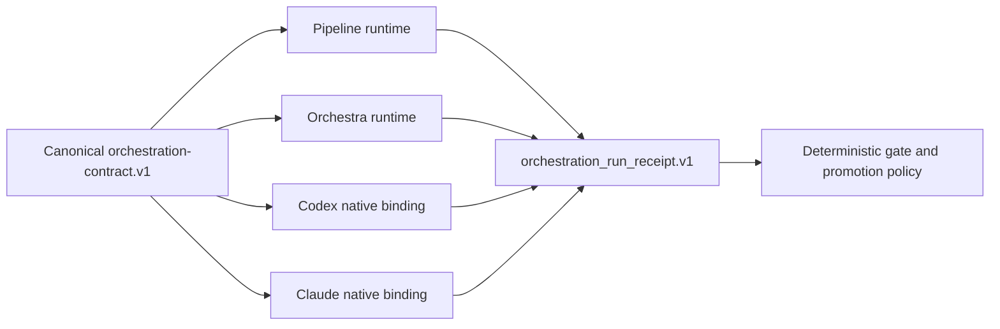

# SPEC-ORCH-024 Research

## Outcome Lock

공개 pipeline과 orchestra의 실제 실행 증거, provider integrity, gate authority, Codex/Claude semantic
surface를 하나의 versioned orchestration contract로 수렴시킨다.

## Plan Intent Ledger

| Field | Status | Source | Confidence | Decision / Assumption | If Wrong | Plan Handoff |
|---|---|---|---:|---|---|---|
| goal | answered | user | 10 | 감사 권고 전체 구현 | 일부만 원함 | REQ-001~010 |
| scope_boundary | answered | user+workspace | 9 | source change는 autopus-adk | 다른 repo 필요 | explicit non-goal |
| constraints | answered | AGENTS/Lore | 9 | Codex·Claude 모두, full docs/high-risk review 유지 | surface capability 상이 | adapter contract |
| done_evidence | answered | audit | 9 | runtime oracle+semantic parity+build/vet | live provider required | fake backend deterministic tests |
| brownfield_impact | answered | code audit | 8 | additive public types, fail-open 제거 | hidden caller dependency | compatibility projections |

## Question Audit

- question_transport: none; user explicitly authorized full scope.
- question_count: 0.
- unresolved_fields: none blocking Outcome Lock.

## Semantic Invariant Inventory

| ID | Source clause | Invariant | Affected outputs | Acceptance |
|---|---|---|---|---|
| INV-001 | completion requires real work | non-dry success has observed dispatch | CLI, receipt | S1, S2, S3 |
| INV-002 | one execution state | checkpoint/dashboard/receipt parity | YAML, dashboard | S4, S5 |
| INV-003 | gates fail closed | exactly one typed pass verdict | verdict | S6, S7 |
| INV-004 | requested strategy is real | requested=effective or preflight error | result, receipt | S8, S9 |
| INV-005 | fallback/judge observable | one explicit transition/outcome | receipt | S10, S11 |
| INV-006 | provider denominator preserved | configured absence cannot disappear | receipt, status | S12, S13 |
| INV-007 | dissent is evidence | no claim deletion; Critical veto | merged result | S14, S15 |
| INV-008 | machine authority separated | analysis verdict != gate/exit policy | receipt | S3,S12 |
| INV-009 | semantic cross-platform parity | same contract, native bindings | generated surface | S16, S17, S18 |
| INV-010 | no foreign primitives | unsupported tool token count zero | generated surface | S17 |
| INV-011 | frozen context and strict resume | verified documents; no stale state laundering | prompt, checkpoint | S19,S20,S21 |
| INV-012 | every attempt remains evidence | receipt count and attempt metadata match dispatch | provider receipt | S22,S23,S24,S25 |
| INV-013 | machine authority is consumable | generated workflows await and gate on current typed receipt | CLI, generated surface | S26,S27,S28 |

## Feature Coverage Map

| Concern | Happy path | Error/recovery | Integration | Verification |
|---|---|---|---|---|
| pipeline | five observed phases + frozen context | nil backend, gate fail, resume corruption | checkpoint/dashboard/common receipt | S1-S7, S19-S21 |
| orchestra | effective strategy + attempt evidence | fallback/judge/partial fail/recovery | provider quorum | S8-S13, S22-S25 |
| consensus | structured cluster | dissent/Critical veto with remediation | review gate | S14, S15, S25 |
| platform | native Codex/Claude + typed receipt consumption | foreign primitive/prompt mutation blocked | generator/adapters | S16-S18, S26-S28 |

## Minimality Decision Matrix

| Ladder | Evidence | Decision | Receipt item |
|---|---|---|---|
| actual need | P0 false completion and platform drift reproduced | mandatory | live-path tests |
| existing code/helper/pattern | PhaseBackend, OrchestraResult, FailedProvider, semanticContractSurface | extend | no parallel framework |
| stdlib/native | encoding/json, crypto/hash, slices/maps | use | stable fingerprint |
| existing dependency | testify, cobra, yaml already present | reuse | no manifest change |
| new dependency/abstraction | common receipt/contract needed | narrow versioned types only | justified by 3+ consumers |
| minimum sufficient verification | focused tests+race+build+vet+strict/parity | selected | no live provider required |

## Reference Discipline

- Existing references: `pkg/pipeline`, `pkg/orchestra`, `internal/cli`, `content/skills`, `templates`, adapters.
- `[NEW]` planned: versioned receipt/finalizer and semantic contract source/tests.
- Source of truth: `autopus-adk` content/templates/adapters; generated root/workspace surfaces are evidence only.

## Reviewer Brief

- Intended scope: close the previously verified P0/P1 orchestration and guidance gaps.
- Non-goals: new provider, new terminal backend, semantic LLM dependency, generated root edits.
- Self-verified evidence: public CLI false-success reproduction, strategy/fallback search, cross-platform surface audit.
- Focus: fail-closed boundaries, public compatibility, provider denominator, dissent retention, capability parity.

## Existing Strengths to Preserve

- Deterministic gates remain authoritative over provider fan-out.
- Review discovery and verification remain separate with frozen findings.
- SPEC coverage/quorum and audited degraded override remain fail-closed.
- Shared R2/judge sentinel prompt boundary and provider cancellation isolation remain intact.

## Visual Planning Brief

## Self-Verify Summary

- Q-CORR-04: PASS — each semantic invariant maps to an EARS requirement, plan task, and concrete S1-S28 oracle.
- Q-COMP-05: PASS — existing helpers and stdlib precede any new abstraction; only versioned receipt/contract types are justified by multiple consumers.
- Q-COMP-06: PASS — no new external dependency, provider, backend, or generated-root source of truth is introduced.
- Q-COMP-07: PASS — source/runtime/generated boundaries and non-overlapping implementation ownership are explicit.
- Reference check: every existing path is marked as existing; receipt/contract files are implemented and covered by concrete runtime and generated-surface oracles.

## Sibling SPEC Decision

No sibling SPEC. Runtime and platform changes are separate implementation lanes but one user-visible Outcome Lock and
one compatibility rollout; task count and affected files do not require a second product outcome.

## Completion Debt

- None. REQ-001~013, S1~S28, and all 19 frozen findings are complete.

## Evolution Ideas

- Optional future live-provider conformance suite and remote receipt ingestion. Not scheduled and not completion blocking.
