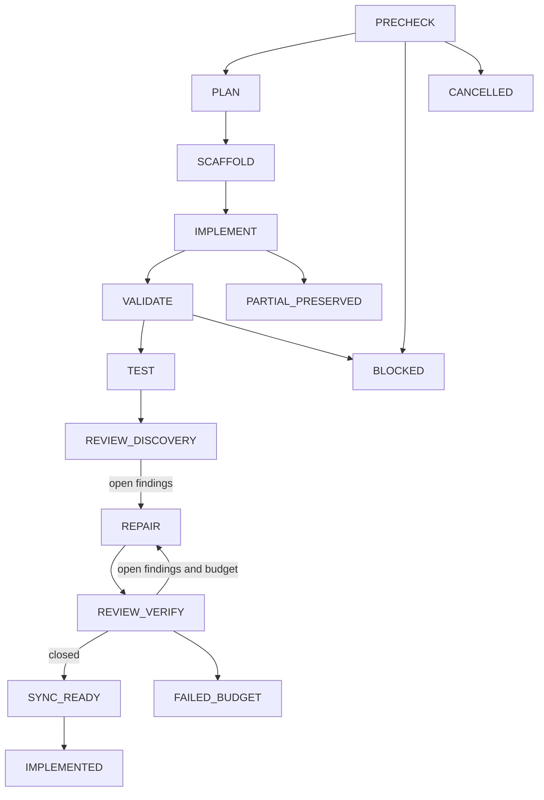

# SPEC-ORCH-024: Multi-provider Orchestration Contract Convergence

**Status**: completed
**Created**: 2026-07-20
**Domain**: ORCH
**Priority**: critical

## 목적

멀티프로바이더 및 agent pipeline의 지침·CLI·runtime이 동일한 versioned contract로
완료, gate, strategy, quorum, degraded, dissent를 판정하도록 수렴한다.

## Outcome Boundary

- Outcome Lock: 공개 entrypoint는 실제 dispatch와 typed receipt 없이 성공을 선언하지 않으며,
  Codex와 Claude가 동일한 semantic workflow를 각 플랫폼의 실제 도구로 실행한다.
- Mandatory requirements: REQ-001~REQ-013.
- Explicit non-goals: 신규 provider/backend, provider vote의 deterministic gate 대체, 외부 dependency.
- Completion evidence: acceptance.md S1~S28의 concrete oracle, build/vet, strict SPEC, generated parity.

## Requirements

### Unwanted / Must — REQ-001 Pipeline authenticity

IF a non-dry-run pipeline has no executable backend, no resolvable SPEC, or observes zero backend dispatches THEN THE SYSTEM SHALL fail before printing completion and persist a blocked receipt instead of substituting a no-op backend.

### Event-Driven / Must — REQ-002 Versioned state and checkpoint

WHEN a phase starts, passes, fails, skips, or is cancelled THEN THE SYSTEM SHALL atomically record a versioned transition and expose the same phase IDs/status through resume, checkpoint, receipt, and dashboard while blocking stale snapshot or route-version resume without explicit override.

### Unwanted / Must — REQ-003 Exact gate verdict

IF a gate response is malformed, unknown, negated, or contains conflicting pass/fail verdicts THEN THE SYSTEM SHALL return fail and accept only one exact typed pass verdict.

### Ubiquitous / Must — REQ-004 Strategy capability

THE SYSTEM SHALL preserve requested and effective strategy in every run receipt and reject an unsupported strategy before dispatch unless the entrypoint executes that strategy's documented state machine.

### Event-Driven / Must — REQ-005 Fallback and judge outcomes

WHEN pane provisioning, collection, or judge execution fails THEN THE SYSTEM SHALL apply the configured subprocess, skip, or abort transition exactly once and record backend, role, attempt, failure class, judge status, degraded reason, and a non-completed terminal state for required-judge failure.

### Ubiquitous / Must — REQ-006 Provider integrity and quorum

THE SYSTEM SHALL separately retain requested, configured, resolved, attempted, usable, and failed provider sets, use the declared policy denominator for quorum, and prevent degraded PASS promotion without an audited override.

### Event-Driven / Must — REQ-007 Structured finding consensus

WHEN provider findings are merged THEN THE SYSTEM SHALL align structured findings by stable identity, preserve every dissenting claim and evidence including legacy text dissent, and mark an unresolved Critical security or correctness finding as a veto.

### Ubiquitous / Must — REQ-008 Common receipts

THE SYSTEM SHALL emit `orchestration_run_receipt.v1` with run and route identity, state transition, requested and effective strategy, provider and worker receipts, dispatch count, separate analysis verdict and gate status, degraded reasons, artifacts, attempts, and exactly one terminal state.

### Ubiquitous / Must — REQ-009 Codex/Claude semantic contract

THE SYSTEM SHALL define one canonical `orchestration-contract.v1` for provider review, idea orchestration, team mode, and review convergence so Codex and Claude share semantic fields, differ only in native tool bindings, and use risk-tiered `auto orchestra review` for code review.

### Unwanted / Must — REQ-010 Platform safety and promotion parity

IF a generated surface targets Codex or Claude THEN THE SYSTEM SHALL emit no foreign platform primitives and preserve degraded SPEC PASS protection, provider and strategy forwarding, worker ownership receipts, teardown, and dispatch evidence.

### Ubiquitous / Must — REQ-011 Frozen pipeline context and resume integrity

THE SYSTEM SHALL build every public pipeline phase prompt from one verified frozen SPEC snapshot, sanitize prior phase output before reinjection, reject checkpoints with missing or mismatched identity or a non-dependency-closed done set, and preserve the original canonical checkpoint when resume validation fails.

### Event-Driven / Must — REQ-012 Attempt-complete execution evidence

WHEN any participant, retry, fallback, or judge dispatch is attempted THEN THE SYSTEM SHALL preserve its actual role, attempt, backend, outcome, artifact, and recovery state in a non-nil receipt, including post-dispatch failure and a later successful recovery.

### Unwanted / Must — REQ-013 Consumable platform authority

IF a generated workflow makes a gate, promotion, or teardown decision THEN THE SYSTEM SHALL consume the current typed CLI receipt, validate required judge model-family separation, forward explicit providers, and prohibit prompt-side status mutation or unsupported platform primitives.

## Acceptance Criteria

- [x] A recording pipeline backend is called exactly 5 times on success, exactly 0 times for nil backend or missing SPEC, and never calls review after validate fails.
- [x] Configured provider count 3 with usable count 1 produces required quorum 2, `quorum_met=false`, status unchanged, and an explicit `provider_quorum` degraded reason.
- [x] Consensus retains both majority and 1/3 minority claims, while one unresolved Critical security finding sets `veto=true` and `gate_status=blocked`.
- [x] Codex and Claude semantic contract fields are equal and each generated platform reports exactly 0 foreign primitive tokens.
- [x] Every public pipeline prompt contains the verified frozen SPEC documents and sanitized prior output; malformed resume state cannot overwrite or bypass a downstream gate.
- [x] Every observed orchestra dispatch has a matching provider receipt with actual role, attempt, backend and terminal evidence, including partial failure and recovery.
- [x] Generated review/idea/go/team workflows consume typed receipts for promotion and gate authority and execute no unsupported team primitive.
- [x] Focused tests, race tests, build, vet, strict SPEC validation, and architecture enforcement pass.

## Canonical State Model

Skip은 누락이 아니라 `SKIPPED_<STATE>`와 이유로 기록한다. Runtime terminal은
`completed|blocked|failed_budget|cancelled|partial_preserved|dry_run` 중 정확히 하나다.

## Traceability Matrix

| Requirement | Plan Task | Acceptance | Invariant |
|---|---|---|---|
| REQ-001 | T2 | S1, S2, S3 | INV-001 |
| REQ-002 | T2 | S4, S5 | INV-002 |
| REQ-003 | T2 | S6, S7 | INV-003 |
| REQ-004 | T3 | S8, S9 | INV-004 |
| REQ-005 | T3 | S10, S11 | INV-005 |
| REQ-006 | T3 | S12, S13 | INV-006 |
| REQ-007 | T3 | S14, S15 | INV-007 |
| REQ-008 | T2,T3 | S3, S12 | INV-008 |
| REQ-009 | T4 | S16, S17 | INV-009 |
| REQ-010 | T4 | S17, S18 | INV-010 |
| REQ-011 | T2 | S19, S20, S21 | INV-011 |
| REQ-012 | T3 | S22, S23, S24, S25 | INV-012 |
| REQ-013 | T4 | S26, S27, S28 | INV-013 |

## Completion Verdict

- Outcome Lock: achieved.
- Mandatory requirements: 13/13 implemented and verified.
- Must acceptance: 28/28 green.
- Frozen review findings: 19/19 closed, 0 open.
- Completion Debt: none.
- Evolution Ideas: none promoted automatically.
- Known unrelated gate: `TestEvalRegressionAutopusGateFetchSelectionReviewOracle` remains red because its unchanged sibling workflow lacks `actions/checkout@v4`; the affected CLI suite and the full repository suite pass when this pre-existing oracle is excluded.
