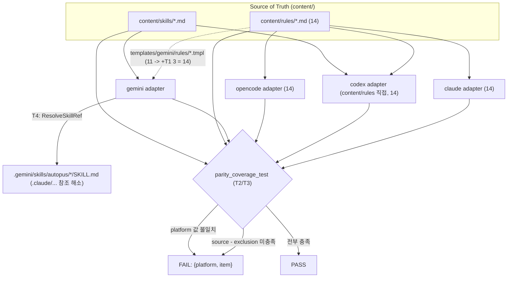

# SPEC-PARITY-002 구현 계획

## Tasks

- [ ] T1 (REQ-001, REQ-005): Gemini 규칙 템플릿 3종 추가.
  `templates/gemini/rules/autopus/`에 `deferred-tools.md.tmpl`, `project-identity.md.tmpl`,
  `spec-quality.md.tmpl`를 추가한다. 각 템플릿은 기존 템플릿 패턴(`subagent-delegation.md.tmpl`)을
  따라 `---\nname: <rule>\ndescription: <요약>\ncategory: <범주>\nplatform: antigravity-cli\n---`
  frontmatter + `# <Heading>` + `@import content/rules/<rule>.md` 본문으로 구성한다.
  `prepareRuleMappings`는 `rulesTemplateDir`의 `.tmpl`을 자동 순회하므로 코드 변경 없이 14종이
  생성되고 `expandContentImports`가 `@import`를 전개한다. Claude·Codex·OpenCode 생성 로직은 불변.
  검증: 임시 디렉터리 `gemini.Generate` → `.gemini/rules/autopus/` 14개 파일(S1, S2).

- [ ] T2 (REQ-002): 패리티 커버리지 게이트 테스트 추가.
  `[NEW] pkg/adapter/parity_coverage_test.go` 작성. 플랫폼 {claude, codex, gemini, opencode}
  각각에 대해 (a) `content/rules/*.md` basename 집합과 (b) 플랫폼 호환 가능한 `content/skills/*.md`
  이름 집합을 source-of-truth로 계산하고, 생성된 규칙·스킬 집합이 `source − exclusion`을 포함하는지
  검증한다. 누락 시 `{platform, item}` finding을 모아 `t.Errorf`로 실패(S3). `platformRuleExclusions`·
  `platformSkillExclusions` 맵을 테스트 상단에 선언(의도된 갭 문서화); T1 이후 규칙 exclusion은 공집합.

- [ ] T3 (REQ-002, REQ-003): platform-frontmatter 값 검증을 게이트에 추가.
  생성된 규칙 본문의 frontmatter를 파싱하여 `platform:` 필드가 존재하면 그 값이 어댑터
  식별자(gemini→`antigravity-cli`, codex→`codex`)와 같은지 단언하고 불일치 시 finding을 추가한다(S5).
  소비자가 없음을 research.md에 기록하고, Claude·OpenCode에 필드를 신규 추가하지 않는다(비목표).

- [ ] T4 (REQ-004): Gemini extended skill 정규 참조 해소.
  `pkg/adapter/gemini/gemini_extended_skills.go`의 `renderExtendedSkills`를
  `TransformForPlatform("gemini")` → `TransformForPlatformWithOptions("gemini", opts)`로 교체하고,
  Codex와 동일하게 `ResolveSkillRef: func(name) string { return
  pkgcontent.ResolveCatalogSkillRefPath(catalog, name, "gemini", cfg) }`를 주입한다.
  이를 위해 `renderExtendedSkills`에 `cfg`와 catalog 로딩을 추가한다(Codex `codex_extended_skills.go:16-24`와 동형).
  시그니처를 `renderExtendedSkills(cfg *config.HarnessConfig)`로 바꾸므로 **모든 호출부 3곳을 함께 수정**한다(grep 전수 실측):
  (a) generate 경로 `gemini_skills.go:34` `extFiles, err := a.renderExtendedSkills()` → `a.renderExtendedSkills(cfg)` (`renderSkillTemplates`가 이미 `cfg`를 보유),
  (b) update 경로 `gemini_update.go:121` `extSkillMappings, err := a.renderExtendedSkills()` → `a.renderExtendedSkills(cfg)` (`prepareFiles(cfg)`가 이미 `cfg`를 보유),
  (c) 테스트 `gemini_coverage_test.go:22` `NewWithRoot(t.TempDir()).renderExtendedSkills()` → `...renderExtendedSkills(config.DefaultFullConfig("test"))`.
  세 곳 모두 `cfg`가 이미 in-scope이거나 `config.DefaultFullConfig`로 공급 가능하므로 컴파일·Update 경로가 깨지지 않는다.
  파일 300줄 이하 유지(현재 50줄). 검증(S4).

- [ ] T5 (REQ-005): 후방호환 회귀 검증.
  변경 전후 Codex·Claude·OpenCode 규칙 집합·카운트가 동일함을 게이트와 기존 테스트로 확인한다.
  Codex `platform: codex`는 8종 frontmatter 규칙에 유지(S6). 의도치 않은 골든 변화가 있으면
  research.md에 사유 기록.

- [ ] T6 (REQ-003): Gemini platform 값 정규화.
  `templates/gemini/rules/autopus/shell-portability.md.tmpl`의 `platform: gemini`를 `platform: antigravity-cli`로
  수정한다(전수 실측 결과 어긋난 템플릿은 이 1건뿐이며 나머지 9종은 이미 `antigravity-cli`, `branding.md.tmpl`은 frontmatter 없음).
  T1에서 추가하는 3종 신규 템플릿도 `platform: antigravity-cli`로 작성한다. 이로써 모든 Gemini 규칙 frontmatter의
  `platform:` 값이 어댑터 식별자(`antigravity-cli`)와 일치하여 REQ-003 게이트(S5)가 불일치 0건으로 PASS한다.
  이는 Gemini 단독 변경이며 Claude·Codex·OpenCode 출력에 영향이 없다.

## Implementation Strategy

- **접근 방법**: Gemini 규칙은 코드 변경 없이 템플릿 추가만으로 닫는다(최소 침습, 기존
  `@import` 메커니즘 재사용). 스킬 참조 해소는 Codex의 검증된 옵션 주입 패턴을 그대로 이식한다.
  패리티 게이트는 기존 `parity_test.go`를 수정하지 않고 새 파일로 독립 추가하여 회귀 위험을 격리한다.
- **기존 코드 활용**: `expandContentImports`(gemini_rules.go:107), `ResolveCatalogSkillRefPath`
  (skill_catalog_distribution.go:35), `TransformForPlatformWithOptions`(skill_transformer.go:102),
  `IsCompatible`(skill_transformer.go:135)를 그대로 사용한다.
- **변경 범위**: Gemini 어댑터 1개 파일 수정 + 템플릿 3개 추가 + 테스트 1개 추가. Claude·Codex·
  OpenCode 생성 로직은 불변이며 각 태스크는 독립 실행 가능하다.
- **검증**: `go test ./pkg/adapter/... ./pkg/content/...` + 신규 게이트 PASS + 신규/수정 소스 ≤300줄.

## Visual Planning Brief

데이터 흐름: 단일 source-of-truth(`content/`)에서 각 어댑터가 생성하고, 게이트가 생성물을
소스와 대조한다.

## Feature Completion Scope

- Primary SPEC가 Outcome Lock을 단독으로 닫는다: REQ-001(규칙 갭)·REQ-004(스킬 참조 중립성)·
  REQ-002(패리티 강제)·REQ-005(후방호환)가 "플랫폼 중립 규칙·extended skills + 테스트 강제"를 완결한다.
- 승인된 sibling 의존성: 없음.
- 남은 Completion Debt: 없음(research.md `## Completion Debt` 참조).
