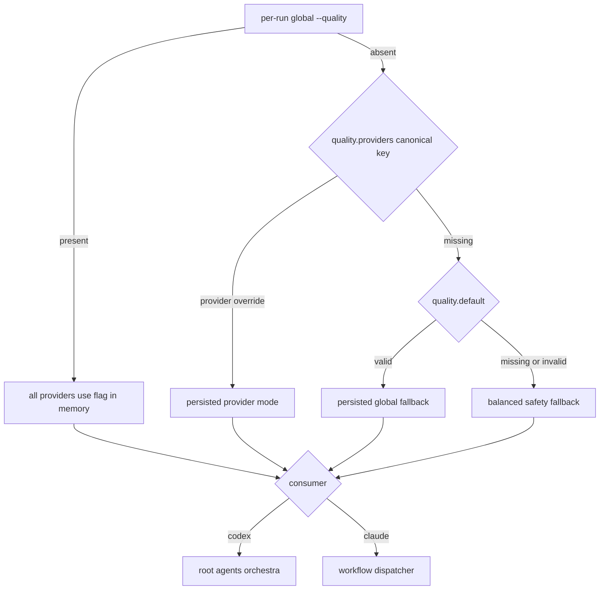

# SPEC-PROVIDER-QUALITY-001 Plan: Provider별 Quality Mode

## Implementation Strategy

기존 `QualityConf`, Codex profile resolver, workflow quality binding, raw-preserving quality scalar writer와 `applyQualityHarness`를 확장한다. `EffectiveMode`를 유일한 persisted selector로 두고 `ForProvider`가 기존 consumer에 전달할 provider-bound copy를 만든다. Per-run global `--quality`는 effective in-memory config에서 provider overrides를 우회해 최우선 순위를 보장한다.

## File Impact Analysis

| 경로 | 작업 |
|------|------|
| `pkg/config/schema.go`, validation tests | `Providers map[string]string`, canonical key/preset validation |
| `[NEW] pkg/config/quality_provider.go`와 tests | `EffectiveMode`, `ForProvider`, alias normalization helper |
| `pkg/config/codex_profile.go`, template helpers와 tests | Codex effective mode를 root/agents/orchestra에 적용 |
| `internal/cli/orchestra_run_runtime.go`, global quality tests | per-run global precedence와 non-persistence |
| `internal/cli/quality.go`, `quality_config.go`와 tests | provider subcommand, set/delete, show output |
| `internal/cli/quality_apply.go`와 tests | one-provider apply와 기존 all-platform apply |
| `internal/cli/workflow_binding.go`, `workflow_render.go`와 tests | Claude effective mode dispatch |
| `content/skills/adaptive-quality.md`, `using-autopus.md`, README, CHANGELOG | source operator contract |
| `templates/codex/**`, `templates/gemini/**`, `templates/claude/**` | generated parity |
| `autopus.yaml`, `configs/autopus.yaml` | optional documented provider override example without changing default |
| `.autopus/specs/SPEC-PROVIDER-QUALITY-001/**` | lifecycle and evidence |

## Architecture Considerations

- `QualityConf.EffectiveMode(provider)`는 persisted state만 해석한다: valid provider override → valid default → `balanced`.
- `QualityConf.ForProvider(provider)`는 원본을 변경하지 않고 resolved mode를 `Default`에 고정한 copy를 반환해 기존 profile helper를 재사용한다.
- CLI `claude-code` alias는 persistence 전에 `claude`로 바꾸며 YAML에는 alias key를 쓰지 않는다.
- Global runtime flag는 cloned effective config에서 provider overrides를 우회한다. 디스크 config에는 손대지 않는다.
- Provider apply target은 `claude`/`claude-code` → `claude-code`, `codex` → `codex`이다.
- Raw editor는 `yaml.Node`를 위치 탐색에만 사용하고 원문 line splice로 comment, placeholder, future field를 보존한다.
- Temp file은 대상과 같은 디렉터리에 만들고 chmod, write, sync, close, rename 순으로 교체한다.

## Visual Planning Brief

## Feature Completion Scope

이 Primary SPEC은 schema, resolution, CLI, apply, two-provider consumers, persistence safety, docs/generated parity와 regressions를 함께 닫는다. sibling dependency와 planning-time Completion Debt는 없다.

## Tasks

- [x] T1 (REQ-SCHEMA-001, REQ-RESOLVE-001, REQ-COMPAT-001, REQ-VALIDATE-001): provider map schema, canonical validation, `EffectiveMode`/`ForProvider`를 TDD로 구현한다.
- [x] T2 (REQ-OVERRIDE-001): explicit global `--quality`가 cloned runtime config의 provider overrides보다 우선하고 disk bytes를 바꾸지 않는 oracle을 구현한다.
- [x] T3 (REQ-CLI-001, REQ-WRITE-001, REQ-VALIDATE-001): `quality provider` set/inherit와 `claude-code` normalization을 raw-preserving writer로 구현한다.
- [x] T4 (REQ-APPLY-001): provider `--apply`는 mapped platform 한 곳만, global `--apply`는 configured platforms 전체를 호출하도록 분리한다.
- [x] T5 (REQ-CODEX-001, REQ-MAPPING-001): Codex supervisor/root, agent templates, orchestra가 Codex-bound quality copy를 사용하게 하고 기존 profile 값 회귀를 고정한다.
- [x] T6 (REQ-CLAUDE-001, REQ-MAPPING-001): workflow binding/render dispatcher가 명시적 global flag가 없을 때 Claude effective mode를 사용하게 한다.
- [x] T7 (REQ-WRITE-001, REQ-ATOMIC-001): comment, env placeholder, future field, file mode 보존과 write/sync/rename failure 원본 보존 tests를 추가한다.
- [x] T8 (REQ-DOC-001): source docs, command reference, example config를 갱신하고 platform templates를 재생성한다.
- [x] T9 (REQ-COMPAT-001, REQ-MAPPING-001): legacy config와 기존 global quality/apply/model/effort suites를 실행하고 generator 결정성을 검증한다.
- [x] T10 (all): focused race, vet, build, strict SPEC, architecture, diff hygiene, Guardian review 후 lifecycle evidence를 sync한다.

## Task Ordering and Ownership

| Order | Owner | Scope | Depends on |
|-------|-------|-------|------------|
| 1 | Config builder | T1-T3 schema/resolver/raw persistence | approved SPEC |
| 2 | Runtime builder | T2, T4-T6 apply and consumers | T1 API |
| 3 | Safety builder | T7 focused failure-path tests | T3 writer |
| 4 | Docs builder | T8 source and generated surfaces | stable CLI/API |
| 5 | Lead/Guardian | T9-T10 integration, discovery, verification | all changes |

동일 `internal/cli/quality*` 파일을 건드리는 task는 순차 통합하고 template generator는 한 명만 실행한다.

## Risks & Mitigations

| Risk | Mitigation |
|------|------------|
| Provider override가 explicit global flag를 이김 | runtime copy에서 flag 우선 oracle |
| `claude-code`가 별도 persisted key로 남음 | CLI normalize + config canonical validation |
| inherit가 다른 provider entry를 삭제 | target-key exact deletion test |
| provider apply가 전체 platform을 재생성 | updater call list/count oracle |
| Codex 일부 consumer만 default를 계속 사용 | root/agent/orchestra tuple test |
| YAML marshal이 placeholder/comment를 materialize | Node location + raw splice, byte oracle |
| atomic rename 실패로 config 손상 | same-dir temp and original-byte failure test |

## Dependencies

- 새 외부 dependency 없음.
- 기존 `gopkg.in/yaml.v3`, Cobra, config/profile helpers, platform updater와 template generator를 재사용한다.

## Rollback

`quality.providers`는 `omitempty` additive field다. 새 map과 provider CLI/consumer selection을 제거하면 legacy `quality.default` 경로로 즉시 복귀하며 data migration은 필요 없다.

## Exit Criteria

- [x] S1-S14 concrete oracle 통과
- [x] legacy `quality.default` 및 global apply 회귀 없음
- [x] Codex/Claude effective mode가 서로 독립적으로 반영됨
- [x] raw YAML/atomic failure tests 통과
- [x] source/generated 두 번째 generation diff `0`
- [x] focused/race, vet, build, strict SPEC, Guardian blocking finding `0`
