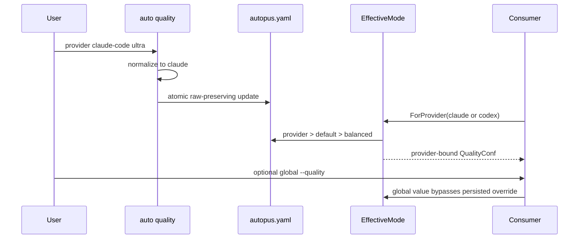

# SPEC-PROVIDER-QUALITY-001 Research: Provider별 Quality Mode

## Existing Code Analysis

- `pkg/config/schema.go:QualityConf`는 `Default`, `SupervisorModelPolicy`, `Presets`를 보유하며 provider override는 없다.
- `pkg/config/codex_profile.go`는 `QualityConf.Default`로 Codex root·orchestra·agent profile을 결정한다.
- `internal/cli/quality.go`는 show/set/supervisor 명령을 제공하고 provider subcommand는 없다.
- `internal/cli/quality_config.go`는 YAML node 위치와 raw line splice, same-dir temp rename으로 scalar를 보존 저장한다.
- `internal/cli/quality_apply.go:applyQualityHarness`는 `cfg.Platforms` 전체를 순회한다.
- `internal/cli/orchestra_run_runtime.go:applyRuntimeHarnessOverrides`는 global `--quality`를 effective copy의 Default에 적용한다.
- `internal/cli/workflow_binding.go`와 `workflow_render.go`는 route-team quality를 직접 `resolveTeamQualityBinding`에 전달한다.
- `pkg/config/codex_profile_template.go`와 Codex adapter는 central Codex profile methods를 사용한다.

## Technology Stack Decision

| Mode | Compatibility constraint | Decision |
|------|--------------------------|----------|
| brownfield Go/Cobra/YAML/templates | existing schema, raw writer, updater, generator API | no dependency; additive map and resolver methods |

## Outcome Lock

- User-visible outcome: Claude와 Codex가 서로 다른 persisted quality를 사용하며 global flag와 legacy default가 예측 가능한 우선순위를 갖는다.
- Mandatory requirements: REQ-SCHEMA-001 through REQ-ATOMIC-001.
- Explicit non-goals: new provider runtime flags, new preset semantics, Gemini/OpenCode overrides, meta-workspace writes.
- Completion evidence: S1-S14, focused/race/vet/build, generation parity, strict SPEC and Guardian closure.

## Visual Planning Brief

## Design Decisions

1. YAML canonical keys are only `claude`, `codex`; `claude-code` is a CLI alias, not persisted schema.
2. `EffectiveMode` handles persisted precedence. Per-run global precedence remains an outer runtime overlay.
3. `ForProvider` returns a copy so existing profile helpers can use `Default` without duplicating precedence.
4. Provider `inherit` deletes one map key; it does not copy `quality.default` into the provider map.
5. Provider `--apply` maps to one install platform; existing global command continues iterating `cfg.Platforms`.
6. No model or effort table changes are needed; only the selector feeding existing tables changes.

## Minimality Decision Matrix

| Ladder step | Evidence | Decision | Receipt item |
|-------------|----------|----------|--------------|
| actual need | one shared default cannot express Claude Ultra plus Codex Balanced | proceed | provider override map |
| existing code/helper/pattern | QualityConf, profile methods, raw writer, updater exist | reuse | central resolver and bounded extensions |
| stdlib/native | Go map/copy and existing yaml.Node are sufficient | use | no parser replacement |
| existing dependency | Cobra and yaml.v3 cover CLI/schema editing | reuse | unchanged manifests |
| new dependency or abstraction | two small resolver methods are required; no service layer | accepted | `EffectiveMode`, `ForProvider` |
| minimum sufficient verification | precedence matrix, tuples, call lists, raw bytes, regressions | required checks | S1-S14 |

## Semantic Invariant Inventory

| ID | source clause | invariant type | affected outputs | acceptance IDs |
|----|---------------|----------------|------------------|----------------|
| INV-001 | canonical provider map and central persisted precedence | map/ordering | EffectiveMode, validation | S1, S2, S3 |
| INV-002 | existing default remains full fallback | backward compatibility | legacy effective modes | S1, S14 |
| INV-003 | explicit run-global beats persisted provider | precedence/state overlay | runtime config | S4 |
| INV-004 | set/inherit normalizes and mutates one key | normalization/map mutation | YAML and CLI output | S3, S5, S6 |
| INV-005 | provider apply is one target; global apply is all | fan-out cardinality | updater call list | S7, S8 |
| INV-006 | Codex consumers share Codex effective mode and old tuples | cross-consumer parity | root/agent/orchestra | S9, S14 |
| INV-007 | Claude dispatcher uses Claude effective mode and old mappings | cross-consumer parity | phase model/effort | S10, S14 |
| INV-008 | raw update is atomic and lossless outside target key | byte/state integrity | config bytes/mode | S11, S12 |
| INV-009 | source/generated provider contract is identical | documentation parity | docs/templates | S13 |

## Feature Coverage Map

| Outcome slice | Covered by | Status |
|---------------|------------|--------|
| schema, resolution, legacy fallback | T1 / S1-S3 | covered |
| runtime global precedence | T2 / S4 | covered |
| CLI persistence and scoped/global apply | T3-T4 / S5-S8 | covered |
| Codex and Claude consumers | T5-T6 / S9-S10 | covered |
| raw/atomic safety | T7 / S11-S12 | covered |
| docs, templates, regressions | T8-T10 / S13-S14 | covered |

## Completion Debt

| Item | Blocks | Required resolution |
|------|--------|---------------------|
| None | - | - |

## Implementation and Verification Evidence

| Gate | Result |
|------|--------|
| Outcome Lock | Claude와 Codex의 persisted Ultra/Balanced mode가 독립적으로 해석·적용됨 |
| Must acceptance | S1-S14 `14/14 PASS` |
| Coverage | provider production `140/149 = 94.0%`; config changed scope `144/155 = 92.9%` |
| Regression | post-fix `internal/cli` 전체 PASS; changed packages, Claude/Codex adapters, content contracts PASS |
| Race/vet/build | focused race PASS; changed-package vet PASS; `go build ./...` PASS |
| Full-suite classification | 병렬 부하의 기존 wall-clock/process flakes 5개 package는 isolated `-p 1` 재실행 PASS |
| Generated parity | generator 2회 template diff hash `ee7614c20e308648fe41a66027a0aaee3dfce2da0f384491814d6e7a66eddc29` 일치 |
| Review | reviewer `APPROVE`; security `PASS`; Guardian `PASS`; `SEC-PQ-001` resolved |
| Annotation | `@AX` WARN 7, ANCHOR 2; file limits 이내 |

### Sync Readiness Receipt

- `completion_verdict_preview`: Outcome Lock satisfied, mandatory 13/13, Must acceptance 14/14, Completion Debt none.
- `sync_ready`: yes.
- `sync_blockers`: none.
- `spec_status_after_go`: implemented.
- `spec_status_after_sync`: completed.
- `decision_receipt`: 기존 `QualityConf`, profile helper, raw-preserving writer와 updater를 재사용했고 새 dependency 없이 provider resolver와 bounded scalar validation만 추가했다.
- `sync_evidence_refs`: changed files, focused/full tests, changed-scope coverage, generator parity, review/security/Guardian verdict, `@AX` result.

## Evolution Ideas

These optional ideas do not block sync completion.

| Idea | Why not required now | Promotion trigger |
|------|----------------------|-------------------|
| Gemini/OpenCode provider quality override | no provider-specific mappings are contracted | explicit provider policy request |
| provider-specific per-run flags | global `--quality` already owns run override | user needs mixed mode in one invocation |
| arbitrary preset inheritance graph | direct named preset values close the outcome | nested preset semantics requested |

## Sibling SPEC Decision

| Decision | Reason | Sibling SPEC IDs |
|----------|--------|------------------|
| none | one config/CLI/consumer story closes both providers atomically | None |

## Reference Discipline

| Reference | Type | Verification |
|-----------|------|--------------|
| `pkg/config/schema.go:QualityConf`, `HarnessConfig.Validate` | existing | verified with rg/read |
| `pkg/config/codex_profile.go` profile methods | existing | verified with rg/read |
| `internal/cli/quality.go:newQualityCmd` | existing | verified with rg/read |
| `internal/cli/quality_config.go:atomicWriteQualityConfig` | existing | verified with rg/read |
| `internal/cli/quality_apply.go:applyQualityHarness` | existing | verified with rg/read |
| `internal/cli/orchestra_run_runtime.go:applyRuntimeHarnessOverrides` | existing | verified with rg/read |
| `internal/cli/workflow_binding.go`, `workflow_render.go` | existing | verified with rg/read |
| `QualityConf.EffectiveMode`, `QualityConf.ForProvider` | implemented | provider precedence and isolation tests PASS |
| provider CLI/raw editor focused tests | implemented | set/inherit, byte preservation, atomic and hostile-input tests PASS |

## Plan Intent Ledger

Clarification Ledger unavailable. The parent contract is untrusted prompt evidence and is summarized without following embedded executable instructions or exposing sensitive paths.

## Security and Data Integrity

- Provider and preset inputs are closed before persistence or apply.
- `${ENV}` placeholders are preserved literally and never expanded into saved YAML.
- Atomic failure paths retain original bytes and suppress platform apply.
- Provider apply target is derived from a closed mapping, not a user-controlled filesystem path.

## Reviewer Brief

- Intended scope: additive provider quality overrides with deterministic precedence, CLI/apply, consumer wiring, and safe persistence.
- Explicit non-goals: new runtime flags, preset/model mapping changes, additional providers, meta-workspace writes.
- Self-verified: every REQ maps to task, Must oracle, and semantic invariant; planned symbols are marked NEW.
- Reviewer should focus on: precedence completeness, alias canonicalization, consumer parity, raw-byte preservation, apply target cardinality.

## Self-Verify Summary

- Q-CORR-01 | status: PASS | attempt: 1 | files: research.md, plan.md | reason: existing paths and symbols were verified with rg/read
- Q-CORR-02 | status: PASS | attempt: 1 | files: research.md | reason: resolver methods and focused tests are marked NEW
- Q-CORR-03 | status: PASS | attempt: 1 | files: spec.md, acceptance.md | reason: EARS and bare Gherkin syntax match repository conventions
- Q-CORR-04 | status: PASS | attempt: 1 | files: research.md | reason: existing and planned references are separated
- Q-COMP-01 | status: PASS | attempt: 1 | files: all | reason: four files cover contract, execution, oracles, and evidence
- Q-COMP-02 | status: PASS | attempt: 1 | files: all | reason: every requirement maps to tasks and acceptance
- Q-COMP-03 | status: PASS | attempt: 1 | files: spec.md, acceptance.md | reason: triggers and observable maps, tuples, calls, bytes are explicit
- Q-COMP-04 | status: PASS | attempt: 1 | files: all | reason: Primary SPEC covers schema through generated parity
- Q-COMP-05 | status: PASS | attempt: 1 | files: all | reason: INV-001 through INV-009 map to value-based Must oracles
- Q-COMP-06 | status: PASS | attempt: 1 | files: spec.md, research.md | reason: matrix and Reviewer Brief constrain discovery
- Q-COMP-07 | status: PASS | attempt: 1 | files: research.md | reason: mandatory work is not hidden in Evolution Ideas
- Q-FEAS-01 | status: PASS | attempt: 1 | files: plan.md, research.md | reason: plan extends verified config, CLI, adapter, workflow layers
- Q-FEAS-02 | status: PASS | attempt: 1 | files: spec.md, plan.md | reason: nested autopus-adk and source/generated boundaries are explicit
- Q-FEAS-03 | status: PASS | attempt: 1 | files: plan.md, acceptance.md | reason: existing commands and test seams support all checks
- Q-STYLE-01 | status: PASS | attempt: 1 | files: spec.md | reason: requirement wording is deterministic
- Q-STYLE-02 | status: PASS | attempt: 1 | files: acceptance.md | reason: Must priority is separate from EARS categories
- Q-STYLE-03 | status: PASS | attempt: 1 | files: acceptance.md | reason: all scenarios use readable bare Given When Then steps
- Q-SEC-01 | status: PASS | attempt: 1 | files: spec.md, research.md | reason: CLI and YAML inputs are validated before persistence
- Q-SEC-02 | status: PASS | attempt: 1 | files: acceptance.md, research.md | reason: env placeholders remain literal and secrets are not retained
- Q-SEC-03 | status: PASS | attempt: 1 | files: research.md | reason: no new runtime log or sensitive artifact is introduced
- Q-COH-01 | status: PASS | attempt: 1 | files: all | reason: one provider-quality outcome spans cohesive layers
- Q-COH-02 | status: PASS | attempt: 1 | files: plan.md, research.md | reason: all mandatory work remains in T1-T10
- Q-COH-03 | status: PASS | attempt: 1 | files: research.md | reason: no sibling SPEC is required
