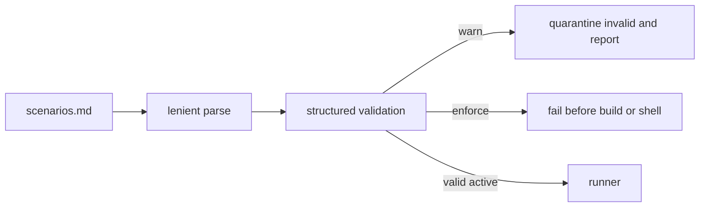

# SPEC-SCENARIO-PARSER-MIGRATION-001 Plan

## Implementation Strategy

Keep deserialization lenient for setup/sync, but add a structured executable
admission report. `warn` and `enforce` share the same validator; only exit
behavior differs. Both quarantine invalid entries before execution.

## Visual Planning Brief



## Feature Completion Scope

This sibling SPEC closes warn/enforce admission, header/reference safety, and
real verification evaluation. Editing scenario inventories and promoting
enforce to the default are intentionally excluded.

## Tasks

- [x] T1: Add RED tests for alphanumeric refs, duplicate/unknown fields,
  missing active fields, supported primitives, unsupported failure, and
  structured issue codes.
- [x] T2: Add `Scenario.Ref` and `DisplayRef()`, migrate
  `RenderScenarios`, sync numbering, and CLI labels, and implement
  `[NEW] pkg/e2e/scenario_validation.go` without changing the lenient parser's
  compatibility role.
- [x] T3: Replace `evaluatePrimitive` default-PASS dispatch in
  `pkg/e2e/runner.go` with the exact supported grammar, including a non-zero
  `exit_code(2)` oracle, then add CLI RED tests for warn/enforce diagnostics.
- [x] T4: Wire `--scenario-validation=warn|enforce`, expose the exact
  `summary.invalid` and `diagnostics[]` JSON fields, ensure filtering occurs
  before runner/build construction, and add the failure-derived example.
- [x] T5: Run review/security/AX and focused/full verification; sync evidence
  without commit or push absent authorization.

## Verification

```bash
go test ./pkg/e2e ./internal/cli -count=1
go test -race ./pkg/e2e
go vet ./...
go build ./...
go run ./cmd/auto spec validate .autopus/specs/SPEC-SCENARIO-PARSER-MIGRATION-001 --strict
go run ./cmd/auto arch enforce .
git diff --check
```

## Exit Criteria

- [x] S1-S6 and Edge Case 1-3 PASS
- [x] invalid entries execute no build/shell command in either mode
- [x] warn/enforce share identical diagnostics
- [x] valid round trip and deprecated/skip behavior unchanged
- [x] strict-default promotion remains explicit Completion Debt
