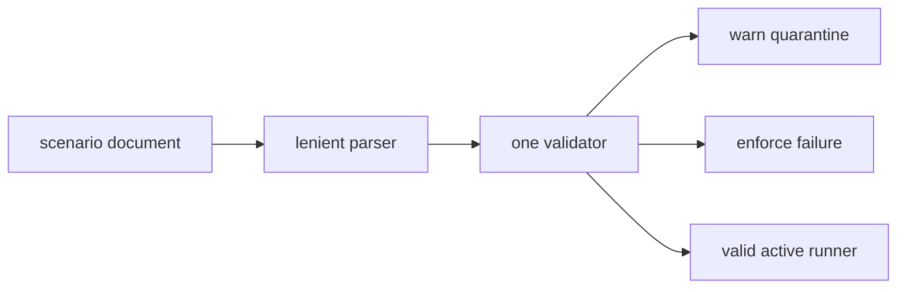

# SPEC-SCENARIO-PARSER-MIGRATION-001 Research

## Reviewer Brief

- Scope: executable scenario admission and warn-to-enforce migration.
- Non-goals: scenario data editing and strict-default promotion.
- Focus: shell/build preflight ordering, header bleed, stable diagnostics,
  supported primitive parsing, and no fabricated PASS.

## Outcome Lock

Invalid scenarios are diagnosed and quarantined in warn mode and rejected in
enforce mode before build or shell execution, while lenient round-trip parsing
remains available.

## Visual Planning Brief

## Evidence

- `ParseScenarios` currently has no effective error path and ignores unknown,
  duplicate, and missing fields.
- Numeric-only header recognition can attach fields below `S15A` or
  `S-CANARY-1` to a previous numeric scenario.
- `runAutoTest` skips only `deprecated|skip`; missing and unrelated statuses
  reach execution.
- the runner can succeed on an empty command and an empty verification list;
  unknown primitives currently default to PASS.
- existing root scenario catalogs contain many sparse index entries, so
  immediate strict-default activation is unsafe.
- The migration adds exact `Scenario.Ref string` storage. Numeric refs populate
  both `Ref="S1"` and `Number=1`; alphanumeric refs preserve `Ref` with
  `Number=0`. `DisplayRef()` is the single render/sync/CLI identity helper.
- Diagnostics are sorted structured values with exact `code`, `scenario_ref`,
  `field`, and `line` fields. CLI JSON also adds `summary.invalid`; invalid
  entries never affect run/passed/skipped/failed totals.
- Supported verification grammar is exactly `exit_code(integer)`,
  `stdout_contains(JSON string)`, `stderr_empty()`,
  `file_exists(JSON string)`, and
  `file_contains(JSON string, JSON string)`.

## Semantic Invariant Inventory

| ID | Invariant |
|---|---|
| INV-001 | lenient parse remains available for round-trip consumers |
| INV-002 | warn and enforce use one diagnostic engine |
| INV-003 | invalid entries never reach build/shell |
| INV-004 | only explicit valid active entries run |
| INV-005 | unknown verification never passes by default |
| INV-006 | default promotion is a separate decision |

## Sibling SPEC Decision

This is the only sibling of
`SPEC-CONTEXT-ENGINEERING-EVOLUTION-001`. Scenario admission is separated
because it owns an executable shell boundary and an independent warn-to-enforce
migration sequence. The Primary owns shadow planning, worker receipts, and
platform compiler/tool parity; this sibling alone owns scenario refs,
diagnostics, primitive evaluation, quarantine, and default-promotion debt.

## Feature Coverage Map

| Outcome | Coverage | Status |
|---|---|---|
| ref/header safety | S1, Edge 1 | implemented |
| structured validation | S2, Edge 2 | implemented |
| warn/enforce admission | S3-S4, Edge 3 | implemented |
| primitive evaluation | S5 | implemented |
| compatibility round trip | S6 | implemented |

## Alternatives Rejected

| Alternative | Reason |
|---|---|
| immediate strict default | existing sparse indexes would break abruptly |
| keep executing invalid entries in warn | preserves false-green behavior |
| infer scenario bodies | unsafe and unverifiable |
| accept arbitrary primitive names | runner cannot prove their semantics |
| edit root inventory here | wrong ownership and unrelated human-managed data |

## Failure-Derived Example

`Status: active` without `Verify` is quarantined in warn mode and rejected in
enforce mode before any build or command. An empty verification set is never a
PASS oracle.

## Promotion Gate

Make `enforce` the default only after managed inventories report zero invalid
active entries, migration is documented, and rollback is available.

## Evolution Ideas

- promote enforce after invalid inventory reaches zero;
- add new verification primitives only with parser and evaluator tests;
- publish a read-only migration report for multi-repository inventories.

## Reference Discipline

| Reference | Type | Verification |
|---|---|---|
| `pkg/e2e/scenario.go` | existing | parse/render tests |
| `pkg/e2e/runner.go` | existing | runner tests |
| `internal/cli/test.go` | existing | CLI execution tests |
| `pkg/e2e/scenario_validation.go` | implemented | structured issue tests |

## Self-Verify Summary

| Check | Result | Evidence |
|---|---|---|
| Q-CORR-04 reference discipline | PASS | existing/planned refs separated |
| Q-COMP-05 semantic invariants | PASS | INV-001 through INV-006 |
| Q-COMP-06 reviewer brief | PASS | migration focus explicit |
| Q-COMP-07 completion/evolution separation | PASS | default promotion excluded |

## Completion Debt

Strict-default promotion is intentionally external to this SPEC.
