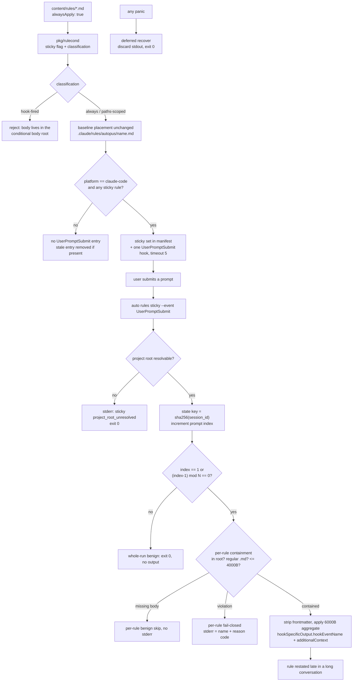

# SPEC-STICKYRULE-001 Implementation Plan

This plan starts only after `SPEC-CONDRULE-001` lands, because every task below builds on the `pkg/rulecond` package, the frontmatter parser, the manifest format, the containment helper, and the `auto rules` CLI namespace that the approved primary SPEC creates. No primary requirement is reopened.

## Tasks

- [ ] T1: Read `alwaysApply` as an orthogonal sticky flag in `pkg/rulecond`. Keep the three-value classification from `SPEC-CONDRULE-001` intact and add a boolean alongside it. Reject the one combination this SPEC cannot serve: a rule that is `hook-fired` and declares `alwaysApply: true` has its body relocated to the conditional body root by the primary SPEC, so it has no body inside the sticky body root. Fail validation naming the rule and both attributes rather than letting `auto update` hard-fail later inside the compile-time containment check.
- [ ] T2: Extend the compiler to emit the sticky rule set into the compiled manifest and to return one `UserPromptSubmit` `adapter.HookConfig` with `Timeout: 5`, matching the lightweight `TaskCreated` entry rather than the 30 and 60 second command hooks in `pkg/content/hooks.go`. Guard the entry on `platform == "claude" || platform == "claude-code"`, mirroring `generateCC21Hooks` at `pkg/content/hooks.go:91`, because `generateCLIHooks` is shared by all four adapters whose `SupportsHooks()` returns true. Then add `UserPromptSubmit` to the managed-event set in `pkg/adapter/claude/claude_settings.go::prepareSettingsMapping`, which today builds `managedEvents` only from the hooks being installed plus `TaskCreated`, so a settings file that already holds a sticky entry keeps it as an apparent user key once no rule is sticky.
- [ ] T3: Add the sticky runtime in `[NEW] pkg/rulecond/sticky.go` and `[NEW] internal/cli/rules_sticky.go`. Implement `auto rules sticky --event UserPromptSubmit`: resolve the project root by walking up to the nearest ancestor holding `.claude`, read the hook stdin payload, increment the per-session counter, and at an injecting index write structured output carrying `hookSpecificOutput.hookEventName` equal to `UserPromptSubmit` alongside `additionalContext`. Strip frontmatter before injecting, so only the injectable body enters context and the byte accounting counts instructional text only. Enforce the per-body 4000-byte cap first and then the 6000-byte aggregate cap with reverse rule-name dropping, appending a single-line truncation notice that counts toward the aggregate. Install a top-level deferred recover that discards partial stdout and exits zero, because an unrecovered Go panic exits with status 2 and that erases the user's prompt.
- [ ] T4: Implement bounded state under `.autopus/runtime/sticky-rules/`, already gitignored at `autopus-adk/.gitignore` line 29. Derive the filename as the lowercase hex SHA-256 digest of the raw `session_id` using `crypto/sha256`, so a hostile identifier can never reach a path component. Prune entries older than 7 days and cap the directory at 200 entries, oldest removed first.
- [ ] T5: Add `alwaysApply: true` to `content/rules/language-policy.md` and `content/rules/objective-reasoning.md`, then regenerate `templates/gemini/rules/autopus/` so the new key reaches the gemini surface. Add the cadence field to `HooksConf` in `pkg/config/schema.go` and resolve it as the configured integer when positive and as 8 when absent, zero, or negative. A non-integer scalar is a config load error from the typed `yaml.Unmarshal` at `pkg/config/loader.go:65`, not a fallback case, so do not add tolerant re-parsing for it.
- [ ] T6: Assert cross-platform behavior as it actually is. The installed `.gemini/rules/autopus/language-policy.md` carries the source `name`, `description`, and `category` keys plus `platform: antigravity-cli`, so gemini rule emission is frontmatter pass-through and `alwaysApply` must appear there after regeneration. Assert the same for opencode and for the codex mapping whose target path ends in `language-policy.md`, without hardcoding which of the two shapes `ruleFilePath` selects. Confirm `pkg/adapter/parity_test.go` still reports the post-relocation counts at 100%.
- [ ] T7: Extend `auto rules list` with a sticky column and the effective cadence.
- [x] T8: Write the oracle tests and capture live evidence. Cover the cadence table, the explicit two-session interleaving, hostile `session_id`, the whole-run benign set, redaction, the cap and truncation-notice contract, containment, the four-case totality table including an injected panic, cadence resolution, and hook lifecycle across all four platforms. Then run `auto update`, drive a Claude Code session past the cadence boundary, and record the observed re-injection.
- [ ] T9: Apply the `SPEC-CONDRULE-001` containment contract to the sticky body root, reusing the helper that SPEC delivers in `[NEW] pkg/rulecond/contain.go` rather than writing a second implementation. If that helper lands with its root hardcoded, this SPEC owns adding a root parameter as a non-breaking change that leaves the primary's call-site behavior byte-identical; the primary's requirements are not reopened. At compile time refuse to record a sticky entry whose body is not a regular `.md` file inside the root, whose injectable body exceeds 4000 bytes, or whose set exceeds the 6000-byte aggregate. At runtime reject absolute values and `..` components before touching the filesystem, resolve symlinks, confirm the resolved path keeps the root as a prefix, and emit only rule name and reason code to stderr.

## Implementation Strategy

The re-attach mechanism is the same injection channel the primary SPEC already proved, moved to a different event. Three things are genuinely new: per-session state, a hook lifecycle that must retract as well as create, and a process that must never exit non-zero.

Hashing the `session_id` rather than validating it is the deciding choice for the state path. A SHA-256 digest is total over every possible input and produces a fixed-shape filename by construction, so path traversal is unrepresentable rather than merely rejected, and the raw identifier never reaches disk.

The exit barrier is enforced, not asserted. Every prior revision claimed exit code 2 was unreachable while leaving ordinary defect classes, a nil map write or a slice index during truncation, landing on exactly that status. A top-level deferred recover converts the whole class into a silent no-op.

Containment reuses the primary helper rather than a second copy, so the two runtimes cannot drift on what counts as an escape. Caps are set from measurement: the two shipped bodies are 1189 and 3303 bytes with frontmatter, so a 4000-byte aggregate would have truncated `objective-reasoning` on every injection, and the accounting now runs over frontmatter-stripped injectable bodies.

Sticky is a flag rather than a fourth classification, so the primary SPEC's partition stays total. The one combination the flag cannot express, hook-fired plus `alwaysApply`, is refused at validation instead of being resolved by consulting two body roots, which would double the containment surface for a case no shipped rule needs.

## Visual Planning Brief



Cadence with the default `N = 8`:

```
prompt index : 1  2  3  4  5  6  7  8  9 10 ... 17
inject       : Y  .  .  .  .  .  .  .  Y  . ...  Y
rule         : index == 1, or (index - 1) mod 8 == 0
```

## Feature Completion Scope

This SPEC closes only the sticky re-attach slice. T1, T2, and T5 make `alwaysApply` mean something and confine it to the one platform that implements the event, T3 and T4 deliver the runtime, its state, and its exit barrier, T9 keeps the injection path from becoming a file-read primitive, and T8 supplies the live evidence that separates a wired feature from a scaffold.

The dependency runs one way. This SPEC needs `SPEC-CONDRULE-001`; the primary Outcome Lock does not wait on anything here. No Completion Debt is carried; `research.md` `## Evolution Ideas` holds only optional items.

## Verification

| Step | Command | Gate |
|------|---------|------|
| Unit | `go test ./pkg/rulecond/...` | cadence, session isolation, state path, pruning, containment, four-case totality, panic barrier |
| Wiring | `go test ./pkg/content/... ./pkg/adapter/claude/... ./pkg/config/...` | hook create and remove, platform guard, cadence config |
| Cross-platform | `go test ./pkg/adapter/...` | frontmatter propagation on codex, opencode, gemini |
| Parity | `go test ./pkg/adapter -run TestParity` | claude 14, codex 14, gemini 14, Codex rules parity 100% |
| Surface | `go build ./... && go vet ./...` | build and vet clean |
| Live | `auto init` into a throwaway project, then the installed `auto rules sticky --event UserPromptSubmit` hook contract driven past the cadence boundary | observed re-injection trace — PASS 2026-08-01, recorded in `research.md` `## Live Re-Injection Evidence (2026-08-01)`: injection at prompt indexes 1 and 9 at the default cadence, at 1 and 3 at cadence 2, exit 0 and empty stderr on every invocation |
| SPEC | `auto spec validate autopus-adk/.autopus/specs/SPEC-STICKYRULE-001 --strict` | zero error findings |
