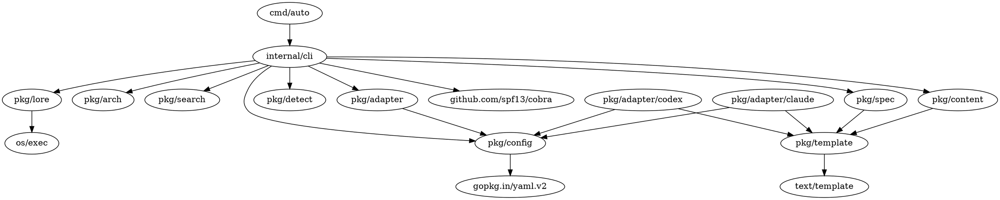

# Autopus-ADK 의존성 그래프

## 모듈 간 의존성

```
cmd/auto/main.go
    └── internal/cli (Execute)
        ├── pkg/adapter (어댑터 생성, 실행)
        ├── pkg/config (설정 로드)
        ├── pkg/version (버전 정보)
        ├── pkg/arch (아키텍처 분석)
        ├── pkg/spec (SPEC 파싱)
        ├── pkg/lore (의사결정 추적)
        ├── pkg/lsp (LSP 통합)
        ├── pkg/search (지식 검색)
        ├── pkg/detect (플랫폼 감지)
        ├── pkg/content (콘텐츠 생성)
        └── pkg/plugin (플러그인 관리)

pkg/adapter/adapter.go (PlatformAdapter 인터페이스)
    └── pkg/config (HarnessConfig 사용)

pkg/adapter/registry.go (Registry 구현)
    ├── sync (동시성)
    └── (PlatformAdapter 저장)

pkg/adapter/claude/adapter.go
    ├── pkg/config (HarnessConfig 사용)
    ├── pkg/template (템플릿 렌더링)
    └── os/exec (파일 쓰기)

pkg/adapter/codex/adapter.go
    ├── pkg/config
    ├── pkg/template
    └── os/exec

pkg/adapter/gemini/adapter.go
    ├── pkg/config
    ├── pkg/template
    └── os/exec

pkg/adapter/opencode/adapter.go
    ├── pkg/config
    ├── pkg/template
    └── os/exec

pkg/adapter/cursor/adapter.go
    ├── pkg/config
    ├── pkg/template
    └── os/exec

pkg/config/schema.go
    └── yaml (YAML 파싱)

pkg/config/loader.go
    ├── pkg/config/schema.go
    └── io/ioutil (파일 I/O)

pkg/config/defaults.go
    └── pkg/config/schema.go

pkg/content/
    ├── pkg/template (템플릿 렌더링)
    ├── os (파일 생성)
    └── (에이전트, 스킬, 훅 콘텐츠 생성)

pkg/arch/
    ├── os/filepath (디렉토리 조회)
    └── (아키텍처 분석)

pkg/spec/
    ├── pkg/template (템플릿 렌더링)
    └── text/scanner (EARS 파싱)

pkg/lore/
    └── os/exec (Git 커밋 로그 조회)

pkg/lsp/
    └── (LSP 클라이언트/서버 구현)

pkg/search/
    ├── net/http (HTTP 요청)
    └── (Context7, Exa 검색)

pkg/detect/
    └── os/exec (PATH 환경 변수 스캔)

pkg/template/
    └── text/template (Go 템플릿 엔진)

pkg/version/
    └── (빌드 메타데이터)

pkg/plugin/
    └── (플러그인 관리)
```

## 외부 의존성 (go.mod)

### 코어 의존성

```
github.com/spf13/cobra
  └── CLI 프레임워크 (커맨드 정의, 플래그 파싱)
      └── internal/cli 에서 사용

gopkg.in/yaml.v2 (또는 v3)
  └── YAML 파싱 및 직렬화
      └── pkg/config 에서 사용

github.com/anthropics/autopus-adk
  └── 내부 패키지들의 기본 경로
```

### 선택적 의존성

```
github.com/google/go-cmp
  └── 값 비교 및 테스트
      └── 테스트 파일에서 사용

gotest.tools/v3
  └── 테스트 유틸리티
      └── 테스트 파일에서 사용
```

## 의존성 깊이 분석

### 계층 1: 초저수준 (No Internal Dependencies)
- `pkg/version`: 빌드 메타데이터만 제공
- `pkg/detect`: 플랫폼 감지만 수행
- `pkg/template`: text/template 래퍼

### 계층 2: 기본 의존성
- `pkg/config`: schema 정의, YAML 파싱
- `pkg/lore`: Git 명령 실행
- `pkg/search`: HTTP 요청

### 계층 3: 중간 의존성
- `pkg/adapter`: PlatformAdapter 인터페이스 정의
  - pkg/config에만 의존
- `pkg/arch`: 아키텍처 분석
- `pkg/spec`: SPEC 파싱, 템플릿 렌더링
  - pkg/template에 의존

### 계층 4: 플랫폼 어댑터
- `pkg/adapter/claude`, `codex`, `gemini`, `opencode`, `cursor`
  - 모두 pkg/config, pkg/template에 의존
  - 외부: os/exec, os/filepath

### 계층 5: 콘텐츠 생성
- `pkg/content`: 다양한 콘텐츠 생성
  - pkg/template에 의존

### 계층 6: CLI 계층 (최고수준)
- `internal/cli`: 모든 패키지 조율
  - 모든 pkg/* 에 의존
  - github.com/spf13/cobra에 의존

### 계층 7: 진입점
- `cmd/auto`: 진입점
  - internal/cli에만 의존

## 의존성 역전 분석

### 명시적 의존성 (Explicit Dependencies)

```
내부 -> 외부

internal/cli
  -> pkg/adapter (PlatformAdapter)
  -> pkg/config (HarnessConfig)
  -> pkg/arch
  -> pkg/spec
  -> pkg/lore
  -> pkg/lsp
  -> pkg/search
  -> pkg/detect
  -> pkg/content
  -> pkg/plugin
  -> github.com/spf13/cobra

pkg/adapter/*
  -> pkg/config
  -> pkg/template
  -> os/*
  -> io/*
```

### 순환 의존성 (Circular Dependencies)

**확인됨**: 없음
- 모든 의존성이 단방향
- 계층 구조가 명확함

## 외부 패키지 분석

### 표준 라이브러리 (stdlib)

```
context
  └── 컨텍스트 관리
      └── PlatformAdapter 메서드 서명에서 사용

sync
  └── 동시성 제어 (RWMutex)
      └── pkg/adapter/registry.go에서 사용

os, os/exec
  └── 파일 I/O, 프로세스 실행
      └── 플랫폼 어댑터, 파일 생성에서 사용

os/filepath
  └── 경로 조작
      └── pkg/arch, pkg/detect에서 사용

io, io/ioutil
  └── 입출력 작업
      └── 파일 읽기/쓰기에서 사용

text/template
  └── 템플릿 렌더링
      └── pkg/template에서 사용

encoding/json, encoding/yaml
  └── 직렬화
      └── pkg/config에서 사용

fmt, log
  └── 로깅, 포맷팅
      └── 전반적으로 사용

path, filepath
  └── 경로 조작
      └── 파일 시스템 작업에서 사용

regexp
  └── 정규표현식
      └── 패턴 매칭에서 사용

strings, strconv
  └── 문자열 조작, 타입 변환
      └── 전반적으로 사용

time
  └── 시간 관련 작업
      └── 버전 정보, 타임스탬프에서 사용
```

### 외부 라이브러리 (Third-party)

```
github.com/spf13/cobra
  버전: latest (일반적으로 v1.x)
  사용처: internal/cli 커맨드 정의
  책임: CLI 프레임워크, 플래그 파싱
  특징:
    - 강력한 커맨드 정의
    - 자동 도움말 생성
    - 플래그 검증
    - 서브커맨드 지원

gopkg.in/yaml.v2 (또는 v3)
  버전: v2 또는 v3
  사용처: pkg/config YAML 파싱
  책임: YAML 직렬화/역직렬화
  특징:
    - Go 구조체와 YAML 간 변환
    - 태그 기반 매핑
    - 유연한 파싱

github.com/google/go-cmp (선택적)
  버전: latest (일반적으로 v0.x)
  사용처: 테스트 파일
  책임: 구조체 비교, 차이점 표시
  특징:
    - 깊은 값 비교
    - 포맷된 출력

gotest.tools/v3 (선택적)
  버전: v3
  사용처: 테스트 유틸리티
  책임: 테스트 헬퍼 함수 제공
  특징:
    - assert 함수
    - 파일 시스템 테스트 유틸리티
```

## 의존성 관리 전략

### 최소화 원칙
- 필수 의존성만 포함 (Cobra, YAML)
- 테스트 의존성은 선택적
- 표준 라이브러리 최대 활용

### 버전 정책
- Cobra: 안정적인 v1.x 사용
- YAML: v2 또는 v3 (호환성 확인)
- Go 버전: 1.25+ 지원

### 업데이트 전략
- 정기적인 의존성 업데이트 (`go get -u`)
- 주요 버전 변경 시 호환성 검증
- 보안 패치 우선 적용

## 의존성 그래프 (Dot 형식)



## 의존성 최적화 기회

### 1. 지연 로딩 (Lazy Loading)
- Cobra 명령 객체는 필요할 때만 생성
- 어댑터는 요청될 때만 로드

### 2. 인터페이스 기반 설계
- PlatformAdapter 인터페이스로 플랫폼 독립성 확보
- 모킹과 테스팅 용이

### 3. 의존성 주입 (DI)
- 테스트에서 Mock 객체 주입 가능
- 느슨한 결합

### 4. 단일 책임 원칙 (SRP)
- 각 모듈이 명확한 책임을 가짐
- 의존성 최소화

## 의존성 문제 해결

### 순환 의존성 감지
```bash
go mod graph | grep -E 'pkg/.*pkg/.*pkg/'
```

### 미사용 의존성 확인
```bash
go mod tidy
```

### 의존성 버전 확인
```bash
go list -m all
```

### 보안 취약점 확인
```bash
go list -json -m all | nancy sleuth
```
