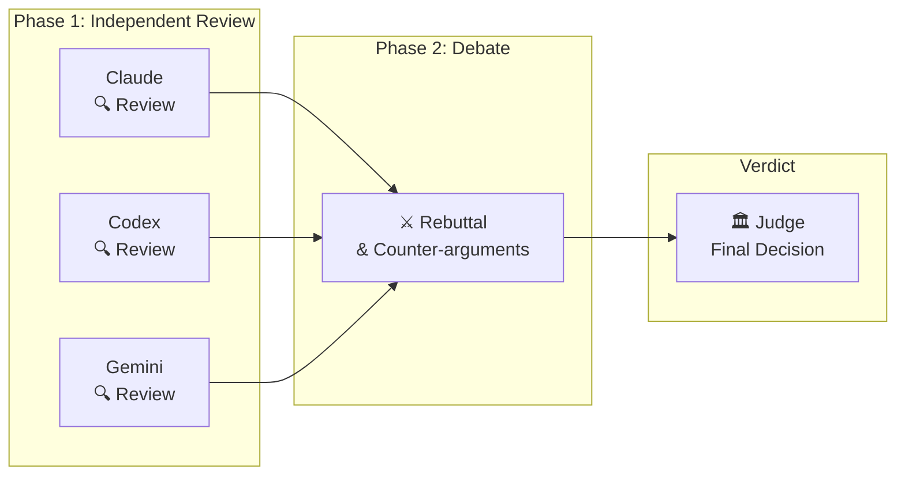
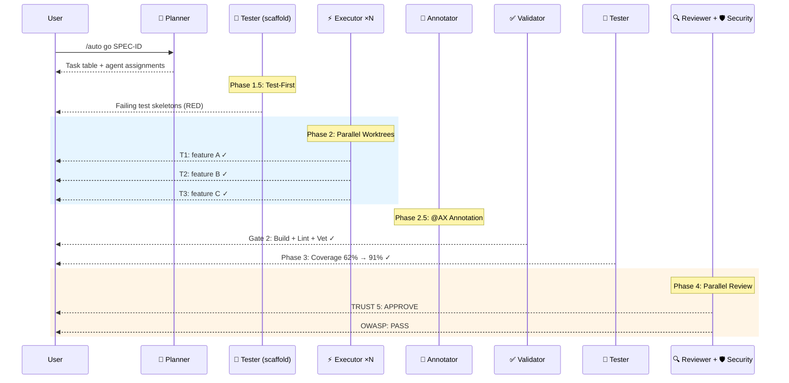

<p align="center">
  
  
  
  
  
  
</p>

<h1 align="center">🐙 Autopus-ADK</h1>
<h3 align="center">The Operating System for AI-Powered Development</h3>

<p align="center">
  <strong>One command. 15 AI agents. Every platform.</strong><br>
  Your AI coding assistants don't just autocomplete — they plan, debate, implement, test, review, and ship.<br>
  Across Claude Code, Codex, Gemini CLI, Cursor, and OpenCode.
</p>

<p align="center">
  <a href="#-3-minute-demo">Demo</a> •
  <a href="#-why-autopus">Why Autopus</a> •
  <a href="#-quick-start">Quick Start</a> •
  <a href="#-the-pipeline">Pipeline</a> •
  <a href="#-platforms">Platforms</a> •
  <a href="#-configuration">Configuration</a>
</p>

<p align="center">
  <a href="docs/README.ko.md">🇰🇷 한국어</a>
</p>

---

## 🎬 3-Minute Demo

```bash
# You describe what you want. Autopus does the rest.
/auto plan "Add OAuth2 with Google and GitHub providers"

# 15 specialized agents execute a 7-phase pipeline:
# Planner decomposes → Tester scaffolds failing tests → Executors implement in parallel
# → Validator checks → Annotator documents → Tester raises coverage → Reviewer approves
/auto go SPEC-AUTH-001 --auto --loop

# Result: production-ready code with 85%+ coverage, security audit, and full documentation.
```

```
🐙 Pipeline ─────────────────────────
  ✓ Phase 1:   Planning         (planner decomposed 5 tasks)
  ✓ Phase 1.5: Test Scaffold    (12 failing tests created)
  ✓ Phase 2:   Implementation   (3 executors in parallel worktrees)
  ✓ Phase 2.5: Annotation       (@AX tags applied to 8 files)
  ✓ Phase 3:   Testing          (coverage: 62% → 91%)
  ✓ Phase 4:   Review           (TRUST 5: APPROVE | Security: PASS)
  ────────────────────────────────────
  Tasks: 5/5 | Coverage: 91% | Time: 4m 32s
```

---

## 💡 Why Autopus?

### The Problem

AI coding tools are powerful — but they're **isolated, inconsistent, and reactive.**

- Switch from Claude to Codex? Rewrite all your rules and prompts.
- Ask an AI to "add auth"? It writes code, but skips tests, ignores security, and forgets docs.
- Multi-file refactoring? One agent, one context, praying it doesn't break something.

### The Autopus Answer

Autopus-ADK doesn't replace your AI coding tool — it **gives it structure, memory, and a team.**

| Without Autopus | With Autopus |
|----------------|-------------|
| "Add this feature" → hope for the best | SPEC-driven requirements → deterministic pipeline |
| One AI, one shot | 15 specialized agents with defined roles |
| Manual copy-paste between tools | One `autopus.yaml`, every platform |
| "Why did we do this?" → git blame | Lore commits: Why, Decision, Alternatives |
| Tests? Maybe later | TDD enforced — tests written *before* code |
| Review? You, at 2am | Automated TRUST 5 review + OWASP security audit |

---

## 🔥 Killer Features

### 1. AI Agents That Argue With Each Other

Not one model — **multiple models debating your code.**

```bash
auto orchestra review --strategy debate
```

Claude, Codex, and Gemini independently review your code, then **debate each other's findings** in a structured 2-phase argument. A judge model renders the final verdict.



4 orchestration strategies: **Consensus** (agreement-based merge), **Debate** (adversarial review), **Pipeline** (sequential refinement), **Fastest** (first response wins).

### 2. Self-Healing Pipeline with RALF Loop

Quality gates that **fix themselves.**

```bash
/auto go SPEC-AUTH-001 --auto --loop
```

When a gate fails, Autopus doesn't just report it — it spawns the right agent to fix the issue and re-validates. Up to 5 iterations with a built-in circuit breaker.

```
🐙 RALF [Gate 2] ──────────────────
  Iteration: 2/5 | Issues: 3 → 1
  Progress: golangci-lint warnings resolved
  Status: RETRY
```

**RALF = RED → GREEN → REFACTOR → LOOP** — TDD principles applied to the pipeline itself.

### 3. Parallel Agents in Isolated Worktrees

Multiple executors work simultaneously in **separate git worktrees**, then merge cleanly.

```
Phase 2: Implementation
  ├── Executor 1 (worktree/T1) → pkg/auth/provider.go
  ├── Executor 2 (worktree/T2) → pkg/auth/handler.go
  └── Executor 3 (worktree/T3) → pkg/auth/middleware.go

Phase 2.1: Worktree Merge
  ✓ T1: merged → working branch
  ✓ T2: merged → working branch
  ✓ T3: merged → working branch
```

File ownership prevents conflicts. GC suppression prevents corruption. Up to 5 concurrent worktrees.

### 4. Lore: Your Codebase Never Forgets

Every commit captures the *why*, not just the *what*.

```
feat(auth): add OAuth2 provider abstraction

Why: Need Google + GitHub support, extensible for future providers
Decision: Interface-based abstraction over direct SDK usage
Alternatives: Direct SDK calls (rejected: too coupled)
Ref: SPEC-AUTH-001

🐙 Autopus <noreply@autopus.co>
```

9 structured trailers. Queryable with `auto lore query "why interface?"`. Stale decisions auto-detected after 90 days.

### 5. One Config, Five Platforms

```bash
auto init  # auto-detects Claude Code, Codex, Gemini CLI, Cursor, OpenCode
```

One `autopus.yaml` generates platform-native configuration for all detected tools. Same agents, same skills, same rules — everywhere.

| Platform | Binary | What Gets Generated |
|----------|--------|-------------------|
| Claude Code | `claude` | `.claude/rules/`, `.claude/skills/`, `.claude/agents/`, `CLAUDE.md` |
| Codex | `codex` | `.codex/`, `AGENTS.md` |
| Gemini CLI | `gemini` | `.gemini/`, `GEMINI.md` |
| Cursor | `cursor` | `.cursor/rules/`, `.cursorrules` |
| OpenCode | `opencode` | `.opencode/`, `agents.json` |

---

## 🚀 Quick Start

### Installation

```bash
# From source
git clone https://github.com/insajin/autopus-adk.git
cd autopus-adk && make build && make install

# Verify
auto --version
```

### Initialize a Project

```bash
auto init       # Detect platforms and generate harness files
auto setup      # Generate project context documents
```

### Your First Pipeline

```bash
# Inside your AI coding CLI (e.g., Claude Code):

# Step 1: Plan — AI writes a SPEC with EARS requirements
/auto plan "Add rate limiting to the API gateway"

# Step 2: Go — 15 agents execute a 7-phase pipeline
/auto go SPEC-RATE-001 --auto

# Step 3: Sync — update docs, architecture, changelog
/auto sync SPEC-RATE-001
```

---

## 🤖 The Pipeline

### 7-Phase Multi-Agent Pipeline

```
/auto go SPEC-ID
```



### 15 Specialized Agents

| Agent | Role | Phase |
|-------|------|-------|
| **Planner** | SPEC decomposition, task assignment, complexity assessment | 1 |
| **Spec Writer** | SPEC document generation (spec.md, plan.md, acceptance.md, research.md) | plan |
| **Tester** | Test scaffold (RED), coverage boost (GREEN) | 1.5, 3 |
| **Executor** | TDD implementation, parallel worktree execution | 2 |
| **Annotator** | @AX tag lifecycle management | 2.5 |
| **Validator** | Build, vet, lint, file size checks | Gate 2 |
| **Reviewer** | TRUST 5 code review (Tested, Readable, Unified, Secured, Trackable) | 4 |
| **Security Auditor** | OWASP Top 10 vulnerability scan | 4 |
| **Architect** | System design, architecture decisions, long-term scalability | on-demand |
| **Debugger** | Reproduction-first bug fixing | on-demand |
| **DevOps** | CI/CD pipelines, Docker, infrastructure configuration | on-demand |
| **Frontend Specialist** | Playwright E2E + VLM visual regression | 3.5 |
| **UX Validator** | Frontend component visual validation | 3.5 |
| **Performance Engineer** | Benchmark, pprof profiling, regression detection | on-demand |
| **Explorer** | Codebase structure analysis | on-demand |

### Quality Modes

```bash
/auto go SPEC-ID --quality ultra      # All agents run on Opus — max quality
/auto go SPEC-ID --quality balanced   # Adaptive: Opus for planning, Sonnet for code, Haiku for validation
```

| Mode | Planner | Executor | Validator | Cost |
|------|---------|----------|-----------|------|
| **Ultra** | Opus | Opus | Opus | $$$ |
| **Balanced** | Opus | Adaptive* | Haiku | $ |

*Adaptive Quality: HIGH complexity tasks → Opus, MEDIUM → Sonnet, LOW → Haiku

### Execution Modes

```bash
/auto go SPEC-ID                   # Subagent pipeline (default)
/auto go SPEC-ID --team            # Agent Teams (Lead/Builder/Guardian roles)
/auto go SPEC-ID --solo            # Single session, no subagents
/auto go SPEC-ID --auto --loop     # Fully autonomous with RALF self-healing
/auto go SPEC-ID --multi           # Multi-provider review (debate/consensus)
```

---

## 📐 SPEC-Driven Development

Every feature starts with a **SPEC** — structured requirements in EARS format.

```bash
/auto plan "Add webhook delivery system with retry and dead letter queue"
```

This generates 4 files:

| File | Content |
|------|---------|
| `spec.md` | EARS requirements: WHEN trigger, THE SYSTEM SHALL action |
| `plan.md` | Task breakdown with agent assignments and file ownership |
| `acceptance.md` | Given-When-Then acceptance criteria |
| `research.md` | Technical research, alternatives, risks |

### PRD → SPEC → Code Pipeline

```
PRD (10 or 5 sections)
  └─→ SPEC (EARS requirements + MoSCoW priority)
        └─→ Multi-Provider Review Gate (debate/consensus)
              └─→ TDD Implementation Pipeline
                    └─→ Documentation Sync
```

---

## 🎯 Code Review: TRUST 5

Every review scores across 5 dimensions:

| | Dimension | What It Checks |
|---|-----------|----------------|
| **T** | Tested | 85%+ coverage, edge cases, race condition tests |
| **R** | Readable | Clear naming, single responsibility, ≤300 LOC |
| **U** | Unified | gofmt, goimports, golangci-lint, consistent patterns |
| **S** | Secured | OWASP Top 10, no injection, no hardcoded secrets |
| **T** | Trackable | Meaningful logs, error context, SPEC references |

---

## 📊 Multi-Model Orchestration

```bash
auto orchestra review --strategy debate     # Models argue, judge decides
auto orchestra review --strategy consensus  # Independent reviews, merged by agreement
auto orchestra review --strategy pipeline   # Sequential refinement chain
auto orchestra review --strategy fastest    # First response wins
```

| Strategy | How It Works | Best For |
|----------|-------------|----------|
| **Debate** | 2-phase adversarial review with rebuttal + judge | Critical decisions, security review |
| **Consensus** | Independent answers merged by key agreement | Planning, code review |
| **Pipeline** | Provider N's output → Provider N+1's input | Iterative refinement |
| **Fastest** | First completed response | Quick queries |

Supported providers: **Claude**, **Codex**, **Gemini** — with graceful degradation if a provider is unavailable.

---

## 🔌 Platforms

| Platform | Binary | Status |
|----------|--------|--------|
| Claude Code | `claude` | ✅ Full support |
| Codex | `codex` | ✅ Full support |
| Gemini CLI | `gemini` | ✅ Full support |
| OpenCode | `opencode` | ✅ Full support |
| Cursor | `cursor` | ✅ Full support |

### Adding a New Platform

1. Create `pkg/adapter/<name>/<name>.go` implementing `PlatformAdapter`
2. Add templates in `templates/<name>/`
3. Register in `pkg/adapter/registry.go`

---

## 📖 All Commands

### CLI Commands

| Command | Description |
|---------|-------------|
| `auto init` | Initialize harness — detect platforms, generate files |
| `auto update` | Update harness (preserves user edits via markers) |
| `auto doctor` | Health diagnostics |
| `auto platform` | List detected platforms |
| `auto arch generate` | Generate `ARCHITECTURE.md` |
| `auto arch lint` | Validate architecture rules |
| `auto spec new` | Create SPEC with EARS requirements |
| `auto spec review` | Multi-provider SPEC review gate |
| `auto lore query` | Query decision history |
| `auto orchestra review` | Multi-model orchestration review |
| `auto setup` | Generate project context documents |
| `auto status` | SPEC dashboard (done/in-progress/draft) |
| `auto telemetry` | Pipeline execution telemetry and cost tracking |
| `auto skill list` | List available skills |
| `auto search` | Knowledge search (Exa) |
| `auto docs` | Library documentation lookup (Context7) |
| `auto lsp` | LSP integration (diagnostics, refs, rename, symbols) |
| `auto verify` | Harness state and rule verification |
| `auto check` | Harness rule checks (anti-pattern scanning) |

### Slash Commands (inside AI Coding CLI)

| Command | Description |
|---------|-------------|
| `/auto plan "description"` | Create a SPEC for a new feature |
| `/auto go SPEC-ID` | Implement a SPEC with full pipeline |
| `/auto go SPEC-ID --auto --loop` | Fully autonomous with self-healing |
| `/auto go SPEC-ID --team` | Agent Teams (Lead/Builder/Guardian) |
| `/auto go SPEC-ID --multi` | Multi-provider orchestration |
| `/auto fix "bug"` | Reproduction-first bug fix |
| `/auto review` | TRUST 5 code review |
| `/auto secure` | OWASP Top 10 security audit |
| `/auto map` | Codebase structure analysis |
| `/auto sync SPEC-ID` | Sync docs after implementation |
| `/auto dev "description"` | One-shot: plan → go → sync |
| `/auto setup` | Generate/update project context docs |
| `/auto stale` | Detect stale decisions and outdated patterns |
| `/auto why "question"` | Query decision rationale from Lore history |

---

## ⚙️ Configuration

### `autopus.yaml`

```yaml
mode: full                    # full or lite
project_name: my-project
platforms:
  - claude-code

# Architecture analysis
architecture:
  auto_generate: true
  enforce: true
  layers: [cmd, internal, pkg, domain, infrastructure]

# Decision tracking
lore:
  enabled: true
  auto_inject: true
  required_trailers: [Why, Decision]
  stale_threshold_days: 90

# SPEC engine
spec:
  id_format: "SPEC-{NAME}-{NUMBER}"
  review_gate:
    enabled: true
    strategy: debate
    providers: [claude, gemini]
    judge: claude

# TDD enforcement
methodology:
  mode: tdd
  enforce: true
  review_gate: true

# Multi-model orchestration
orchestra:
  enabled: true
  default_strategy: consensus
  timeout_seconds: 120
  providers:
    claude:
      binary: claude
      args: ["-p"]
    codex:
      binary: codex
      args: ["-q"]
    gemini:
      binary: gemini
      prompt_via_args: true
```

---

## 🏗 Architecture

### Layer Architecture

```
autopus-adk/
├── cmd/auto/           # Entry point
├── internal/cli/       # 19 Cobra commands (52 with subcommands)
├── pkg/
│   ├── adapter/        # 5 platform adapters (Claude, Codex, Gemini, Cursor, OpenCode)
│   ├── config/         # YAML config schema
│   ├── content/        # Agent/skill/hook generation + skill activator
│   ├── arch/           # Architecture analysis + rule enforcement
│   ├── spec/           # SPEC engine (EARS format)
│   ├── lore/           # Decision tracking (9-trailer protocol)
│   ├── orchestra/      # Multi-model orchestration (4 strategies)
│   ├── sigmap/         # go/ast-based API signature extraction
│   ├── constraint/     # Anti-pattern registry + violation scanning
│   ├── telemetry/      # Pipeline execution recording + cost estimation
│   ├── cost/           # Token-based cost estimator
│   ├── setup/          # Project documentation generation
│   ├── lsp/            # LSP integration
│   ├── search/         # Knowledge search (Context7/Exa)
│   ├── template/       # Go template engine
│   ├── detect/         # Platform detection
│   └── version/        # Build metadata
├── templates/          # Platform-specific templates
├── content/            # Embedded content (15 agents, 36 skills)
└── configs/            # Default configuration
```

### Architecture Rules

- `internal/cli` depends on `pkg/*` only (never reverse)
- `pkg/*` packages do not depend on each other (except `pkg/template`)
- `cmd/` contains only the entry point
- No source file exceeds 300 lines (hard limit, enforced by pipeline)

---

## 🛠 Development

```bash
make build      # Build binary to bin/auto
make test       # Run tests with race detection
make lint       # Run go vet
make coverage   # Generate coverage report
make install    # Install to $GOPATH/bin
```

---

## 🤝 Contributing

Autopus-ADK is open source under the MIT license.

1. Fork the repository
2. Create a feature branch
3. Run `make test` to ensure all tests pass
4. Submit a pull request

---

<p align="center">
  <b>🐙 Autopus</b> — Your AI agents deserve a team, not a chatbox.
</p>
